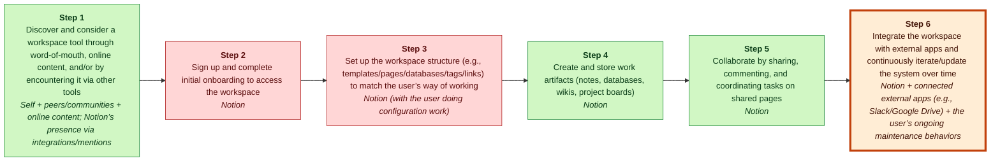

# Decoupling Analyst

> 🔗 Streamlit showcase: https://<your-app>.streamlit.app/ — deploy `streamlit_app.py` on Streamlit Community Cloud and replace this placeholder with the published URL.

> 🔗 Live showcase: https://<user>.github.io/<repo>/ — enable GitHub Pages from `main` / `docs`, then replace this placeholder with the published URL.

*A local-first workflow for Teixeira-style customer value chain analysis, grounded research, and decoupling strategy.*

Decoupling Analyst turns a company name, URL, ticker, PDF, or notes into a
structured strategic analysis using Thales Teixeira's customer value chain
framework.
It combines Tavily-grounded web retrieval, a pinned GPT Researcher fork, and
local RAG over the Teixeira course corpus, then runs the evidence through 14
typed modules before writing English and Chinese reports.
Its credibility comes from a grounding gate that refuses empty retrieval,
run-level provenance files, and calibration against three Teixeira-taught cases.
The practical headline: $0.30/run for a 14-module strategic analysis.

## 60-second example

Notion's customer value chain rebuilt from grounded sources; weak link highlighted in orange (Step 6: integration & maintenance).



> [!important] Final Judgment
> **study_more**: Notion’s next disruptive wedge should be decoupling the value-eroding “integration + ongoing maintenance” activity—an AI-assisted Integration & Maintenance Copilot that sets up, monitors, and fixes connections to external tools while users keep the rest of their workflow unchanged (E12, E13, E6; Teixeira framing: books/unlocking-the-customer-value-chain-chapter-1.md, cited via E3).

## Calibration

We validated the system against Teixeira's own classroom analyses for 3 cases
he taught in MGT470.

| Company | Exact | Partial | Misses | Fabrications | Confidence |
|---|---:|---:|---:|---:|---|
| Birchbox | 5/7 | 2/7 | 0/7 | 0 | HIGH |
| Trov | 3/7 | 1/7 | 3/7 | 1 | HIGH |
| OLX Brazil | 4/7 | 2/7 | 1/7 | 1 | MEDIUM |
| **Total** | **12/21** | **5/21** | **4/21** | **2** | - |

Across 21 scored fields, the system hit 57% exact match and 81% exact-or-partial match.
It produced 2 fabrications across the 3 calibration cases, both visible in the reports rather than hidden by the scoring.
It handles Birchbox best because Birchbox is canonical decoupling; it diverges on Trov by missing Teixeira's value-charging wedge and on OLX by missing the coupling-after-beachhead lens.

Full per-case reports live in [cases/calibration/](cases/calibration/).

## How it works

```text
raw input (company name + optional ticker/URL/PDF)
  ↓
Tavily web search (grounded retrieval)  +  RAG over Teixeira corpus (methodology context)
  ↓
grounding gate (refuse to ship if visited_urls == 0)
  ↓
14 Pydantic-typed modules (company profile → lens fit → CVC → value type → weak link → decoupling → business model → competitive response → final judgment → critic)
  ↓
final_report.md  +  final_report_zh.md  +  evidence_store.json  +  cost_summary.json  +  research_provenance.json
```

- Tavily is the default grounded search path for live research; DuckDuckGo-style
  ungrounded research is an explicit escape hatch behind
  `MGT470_ALLOW_UNGROUNDED_RESEARCH=1`.
- The grounding gate fails loud with `RetrievalEmptyError` when retrieval
  returns no visited URLs, so a live run cannot quietly become a source-free
  memo.
- Every run writes `research_provenance.json` and `evidence_store.json` so
  reviewers can inspect retrieved URLs, report-only URLs, and evidence IDs.
- Every run writes `cost_summary.json`, which made the grounded case archive
  measurable at roughly $0.30/run.
- The renderer emits both `final_report.md` and `final_report_zh.md`, with
  Chinese output upgraded to 1:1 parity in Phase 3.5.2.

Model routing defaults come from [src/mgt470_analyst/llm/config.py](src/mgt470_analyst/llm/config.py):

| Role | Default model | Reasoning effort | Used by |
|---|---|---|---|
| `fast` | `gpt-5-mini` | `low` | extraction, company profile, lens fit, value types |
| `smart` | `gpt-5.2` | `medium` | CVC, weak link, decoupling, business model, final judgment |
| `research` | `gpt-5.2` | `medium` | research synthesis adapter |

Environment overrides are intentionally narrow:

- `MGT470_MODEL_FAST`, `MGT470_MODEL_SMART`, and `MGT470_MODEL_RESEARCH` change
  model routing.
- `MGT470_EFFORT_FAST`, `MGT470_EFFORT_SMART`, and `MGT470_EFFORT_RESEARCH`
  change reasoning effort.
- `MGT470_OFFLINE=1` forces deterministic offline fixtures for tests and dry
  runs; those fixtures are not real analysis.
- `MGT470_RESEARCH_BACKEND=stub` forces the pre-Phase-2 knowledge-only adapter.

See [SYSTEM_DESIGN.md](SYSTEM_DESIGN.md) for the full architecture.

## Quick start

```bash
# 1. install
pip install -e .
pip install "gpt-researcher @ git+https://github.com/Austin-Li7/gpt-researcher.git@92bfc0388c5f7a03b6cb34eaf6ae14298a4b458e"

# 2. configure (required)
cp .env.example .env
# Edit .env: set OPENAI_API_KEY and TAVILY_API_KEY

# 3. run
mgt470 analyze --company "Notion" --url https://notion.so
```

Outputs land in `runs/<slug>-<timestamp>/`; `final_report.md` is the primary deliverable.

A normal grounded run leaves an audit trail like this:

```text
runs/notion-20260509-.../
  run.json
  research_brief.json
  research_provenance.json
  evidence_store.json
  company_profile.json
  lens_fit.json
  cvc.json
  value_type_diagnosis.json
  weak_link_analysis.json
  decoupling_strategy.json
  business_model_analysis.json
  competitive_response.json
  final_judgment.json
  final_report.md
  final_report_zh.md
  cost_summary.json
```

The repository was renamed to Decoupling Analyst, but the install package is
still `mgt470-analyst` and the CLI entry point is still `mgt470 analyze`.

## Project phases

- `phase-1-passed` — RAG over MGT470 course notes.
- `phase-1.5-passed` — Teixeira primary corpus added and validated on OLX Brazil.
- `phase-2-passed` — GPT Researcher integration validated on Notion.
- `phase-3-url-liveness-passed` — URL liveness gate added and replayed on Notion.
- `phase-3-cases-baseline-passed` — Baseline case archive for Notion, Liquid Death, and Nubank.
- `phase-3-grounded-research-passed` — Tavily grounded research, grounding gate, and cost summary.
- `phase-3-grounded-cases-passed` — Grounded baseline cases archived at about $0.30/run.
- `phase-3.5-readable-renderer-passed` — Readable pyramid renderer and Chinese digest.
- `phase-3.5.2-zh-full-parity-passed` — Chinese reports upgraded to 1:1 parity with English.
- `phase-3.6-calibration-passed` — Teixeira calibration: 57% exact, 81% exact-or-partial.

These tags are the roadmap evidence; scroll the tags on GitHub to see the
project move from RAG notes to grounded research, readable reports, bilingual
output, and calibration.

## Limitations (honest)

- Calibration miss rate is about 19% on canonical cases. The system reproduces
  Teixeira's framework well on canonical decoupling cases (Birchbox was 100%
  exact-or-partial) but diverges where the lesson is value-charging decoupling
  (Trov) or coupling after a beachhead (OLX). The encoded framework is still
  missing a first-class coupling lens.
- Case-era awareness is weak. Dated cases such as Trov and OLX can pick up 2026
  web content and produce time-mismatched narratives unless the run is
  constrained by supplied case material.
- Live runs cost real money. The grounded case archive averaged about $0.30/run
  on real LLMs; free local mode exists, but it produces deterministic fakes,
  not real analysis.
- Report-level citation drift still exists. `research_provenance.json` exposes
  it, but final Markdown citations can still contain report-only URLs that were
  not part of the retrieved source set.
- This is a personal tool, not a product. There is no multi-user state, no auth,
  no hosted version, and no production support contract.

## Repository layout

[src/mgt470_analyst/](src/mgt470_analyst/) contains the pipeline modules,
adapters, orchestrator, typed artifacts, and Markdown renderers.

[cases/_archive/](cases/_archive/) contains grounded baseline case studies for
the Path C deliverable, including run artifacts, reviews, provenance, and cost
files where available.

[cases/calibration/](cases/calibration/) contains Teixeira-calibrated comparison
reports; [data/teixeira_corpus/](data/teixeira_corpus/) contains the methodology
RAG source.

## Testing

Tests run in offline mode automatically (no API key required):

```bash
pytest -q
```

To run the (currently empty) live smoke tests against a real API key:

```bash
MGT470_RUN_LIVE=1 pytest -m live
```

## License

Personal project — no license yet.
