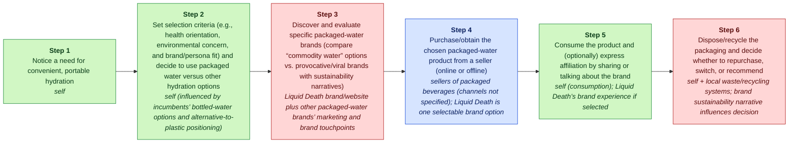

# Liquid Death MGT470 Decoupling Memo

> [!important] Final Judgment
> Liquid Death’s next decoupling wedge is to “steal” the customer’s brand/variant discovery-and-evaluation step with a social-native, AI-powered “Liquid Death Finder” that recommends the right product fast and routes to any existing purchase path—separating choosing from buying in the Teixeira sense (books/unlocking-the-customer-value-chain-chapter-1.md :: Page 9) (E3, E4, E6, E8).

## Executive Summary

Because Liquid Death’s current growth engine is provocative branding and viral marketing (E3, E4), a lightweight, AI-assisted discovery layer can compound what already works by turning attention into intent data and clearer “where to buy” next steps without forcing customers to change their normal shopping routine (E3, E6)—but the incremental conversion lift and CAC impact must be validated before scaling.

Strongest argument: This move preserves the core growth engine (brand + virality) by productizing it into a repeatable discovery workflow (quiz/recommendations + creator content + store/DTC routing) while staying narrowly focused on a single CVC activity—evaluation/choice—so customers can keep purchasing wherever they already do, matching Teixeira’s decoupling pattern of breaking the link between choosing and purchasing (books/unlocking-the-customer-value-chain-chapter-1.md :: Page 9) (E3, E4, E6).

Biggest risk: High recoupling risk and weak provability: incumbents/retailers can copy “finders” and recommendations quickly, and without credible attribution the tool may not reduce CAC or raise CLV enough to justify ongoing content/AI costs (assumptions not evidenced), turning into a marketing gimmick rather than a defensible decoupled stage (E3, E4, E6).

## Lens Fit

Primary lens: **business_model** (confidence: medium, fit score: 0.2, mode: strategic_memo)

Liquid Death's strategic signal in the supplied evidence is primarily brand- and go-to-market driven rather than a classic MGT470-style decoupling of an incumbent bundle. The company differentiates via bold, viral branding and a sustainability positioning that reframes commodity bottled water into a pop-culture lifestyle product (E4, E3). Targeting Millennials/Gen Z, pop-culture enthusiasts, and eco-conscious buyers emphasizes owning the customer relationship and repeat behavior through brand affinity and community — hallmarks of a business-model / DTC play rather than a single-activity decoupling (E6, E7, E8). The supplied analysis explicitly frames Liquid Death as transforming a commoditized market into a cultural category (E3), which is consistent with creating a new-market or re-segmentation via business-model innovation rather than displacing an incumbent by serving one weak-link activity better. Given the evidence set, decoupling is possible but secondary: there is no clear customer value chain activity that Liquid Death has decoupled from incumbents (no evidence of serving a single weak-link activity or using AI/digital to undercut incumbent workflows) (E3, E4).

## Case Perspective

Case perspective: **disruptor** (confidence: high)

Primary question: What is Liquid Death’s next decoupling move to deepen its disruption of traditional bottled-water brands while preserving the growth engine built on provocative branding and viral marketing (E3, E4)?

Liquid Death is described as a 2019-founded challenger that has “rapidly emerged as a disruptive force” by differentiating commoditized packaged water through bold/viral branding and a sustainability narrative positioned against traditional bottled-water offerings (E3, E4). The evidence frames it as attacking an incumbent bundle (traditional bottled-water brands) via a focused, differentiated value proposition rather than defending an established core or managing a mid-pivot business-model transition (E3, E4).

## Company Snapshot

Target company: **Liquid Death**.

# Liquid Death: A Teixeira-Style MGT470 Digital Disruption Analysis (2026) ## Executive Summary Liquid Death has rapidly emerged as a disruptive force in the beverage industry, transforming the commoditized market of packaged water into a pop-culture phenomenon. Founded in 2019, the company leverages bold branding, viral marketing, and a sustainability-driven value proposition to differentiate itself from traditional bottled water competitors. This report analyzes Liquid Death’s digital disruption through the lens of the customer value chain, monetization strategies, unit economics, competitive landscape, decoupling signals, customer pain points, and recent strategic moves, referencing credible and up-to-date public sources. ## Customer Value Chain ### Customer Segments Liquid Death targets a broad but distinct demographic: - **Millennials and Gen Z**: Health-conscious, environmentally aware, and drawn to unconventional branding.

## Evidence Base

| ID | Claim | Source | Locator | Confidence | Used By |
|---|---|---|---|---|---|
| E1 | Liquid Death was provided as the target company by the user. | S0 | CLI input | high | company_profile, lens_fit, final_judgment, critic |
| E2 | Liquid Death website was supplied as https://liquiddeath.com. | S1 | CLI input --url | medium | company_profile, lens_fit, cvc, value_types, final_judgment, critic |
| E3 | # Liquid Death: A Teixeira-Style MGT470 Digital Disruption Analysis (2026) ## Executive Summary Liquid Death has rapidly emerged as a disruptive force in the beverage industry, transforming the commoditized market of packaged water into a pop-culture phenomenon. | S1 | [article: https://liquiddeath.com](https://liquiddeath.com) | medium | company_profile, lens_fit, case_perspective, cvc, value_types, weak_links, decoupling, business_model, competitive_response, final_judgment, critic |
| E4 | Founded in 2019, the company leverages bold branding, viral marketing, and a sustainability-driven value proposition to differentiate itself from traditional bottled water competitors. | S2 | [article: https://www.cbinsights.com/research/report/liquid-death-business-model/](https://www.cbinsights.com/research/report/liquid-death-business-model/) | medium | company_profile, lens_fit, case_perspective, cvc, value_types, weak_links, decoupling, business_model, competitive_response, final_judgment, critic |
| E5 | This report analyzes Liquid Death’s digital disruption through the lens of the customer value chain, monetization strategies, unit economics, competitive landscape, decoupling signals, customer pain points, and recent strategic moves, referencing credible and up-to-date public sources. | S3 | [article: https://drinkopenwater.com/collections/all](https://drinkopenwater.com/collections/all) | medium | company_profile, lens_fit, business_model, critic |
| E6 | ## Customer Value Chain ### Customer Segments Liquid Death targets a broad but distinct demographic: - **Millennials and Gen Z**: Health-conscious, environmentally aware, and drawn to unconventional branding. | S4 | [article: https://justwater.com/collections/all](https://justwater.com/collections/all) | medium | company_profile, lens_fit, case_perspective, cvc, value_types, weak_links, decoupling, business_model, competitive_response, final_judgment, critic |
| E7 | **Alternative and Pop Culture Enthusiasts**: Fans of music, extreme sports, and internet culture. | S5 | [article: https://boxedwaterisbetter.com/collections/all](https://boxedwaterisbetter.com/collections/all) | medium | company_profile, lens_fit, case_perspective, competitive_response, critic |
| E8 | **Eco-Conscious Consumers**: Individuals seeking alternatives to plastic bottles ([Liquid Death, 2026](https://liquiddeath.com)). | S6 | [article: https://www.reddit.com/r/Watercooler/comments/12x9y7k/liquid_death_review/](https://www.reddit.com/r/Watercooler/comments/12x9y7k/liquid_death_review/) | medium | company_profile, lens_fit, case_perspective, cvc, value_types, weak_links, decoupling, business_model, competitive_response, final_judgment, critic |
| E9 | ### Jobs-to-Be-Done - **Functional**: Provide convenient, portable hydration. | S7 | [article: https://www.amazon.com/Liquid-Death-Sparkling-Water-Variety/product-reviews/B07ZP1VJ9L](https://www.amazon.com/Liquid-Death-Sparkling-Water-Variety/product-reviews/B07ZP1VJ9L) | medium | company_profile, lens_fit, case_perspective, cvc, value_types, weak_links, decoupling, business_model, final_judgment, critic |

## Customer Value Chain


_Legend: green = creates value · red = erodes value · blue = captures value._

| Step | Activity | Current Provider | Evidence |
|---:|---|---|---|
| 1 | Notice a need for convenient, portable hydration | self | E9 |
| 2 | Set selection criteria (e.g., health orientation, environmental concern, and brand/persona fit) and decide to use packaged water versus other hydration options | self (influenced by incumbents’ bottled-water options and alternative-to-plastic positioning) | E6, E8, E4, E9 |
| 3 | Discover and evaluate specific packaged-water brands (compare “commodity water” options vs. provocative/viral brands with sustainability narratives) | Liquid Death brand/website plus other packaged-water brands’ marketing and brand touchpoints | E3, E4, E2, E8 |
| 4 | Purchase/obtain the chosen packaged-water product from a seller (online or offline) | sellers of packaged beverages (channels not specified); Liquid Death is one selectable brand option | E4, E2, E9 |
| 5 | Consume the product and (optionally) express affiliation by sharing or talking about the brand | self (consumption); Liquid Death’s brand experience if selected | E9, E3, E4 |
| 6 | Dispose/recycle the packaging and decide whether to repurchase, switch, or recommend | self + local waste/recycling systems; brand sustainability narrative influences decision | E8, E4 |

## Value Creation, Erosion, And Capture

| Activity | Type | Money | Time | Effort | Satisfaction | Reasoning |
|---|---|---:|---:|---:|---:|---|
| A1 | create | 1 | 1 | 1 | 2 | Noticing thirst is the core job trigger that creates the need for portable hydration; this step is intrinsic to the customer job-to-be-done and is supported by the JTBD framing for on-the-go hydration (E9). |
| A2 | create | 3 | 2 | 2 | 3 | Setting selection criteria (health, environment, identity fit) adds value by aligning choice to personal preferences and signalling, which is central to the Millennial/Gen Z segment targeted by the brand (E6, E8, E4, E9). |
| A3 | erode | 2 | 3 | 3 | 3 | Discovering and evaluating packaged-water options introduces friction and uncertainty because the category is commoditized and customers must parse provocative/viral branding versus commodity cues, making evaluation effortful (E3, E4, E2, E8). |
| A4 | capture | 4 | 3 | 2 | 4 | The purchase step is where the seller captures payment and total cost (price + access time/effort) matters; incumbent sellers and selectable brands like Liquid Death monetize at this point (E4, E2, E9). |
| A5 | create | 2 | 1 | 1 | 5 | Consumption delivers the primary functional value (hydration) and, when the brand resonates, additional identity/entertainment value from affiliation and sharing—central to Liquid Death's pop-culture positioning (E9, E3, E4). |
| A6 | erode | 1 | 2 | 3 | 3 | Disposal and recycling can create guilt and friction in the purchase cycle; although brand sustainability narratives mitigate this, the customer still faces local waste system constraints and potential repurchase hesitation (E8, E4). |

## Weak Link

Discover and evaluate specific packaged-water brands (compare “commodity water” options vs. provocative/viral brands with sustainability narratives) scored 768.0: Brand discovery/evaluation is the most decouplable weak link because packaged water is otherwise commoditized (E3), so customers must spend time/effort differentiating among similar options—an erosion point that a focused entrant can win via distinctive content and community touchpoints (E4). This activity is naturally digital (ads/social/creator content), so AI can improve targeting/personalization and creative iteration to make discovery/choice feel faster/easier for Millennials/Gen Z (E6) while reinforcing the sustainability narrative that matters to the segment (E8). Following Teixeira’s idea of helping customers “execute a weak link activity” (talks/unlocking-the-customer-value-chain-at-decoupling-co.md) aligns with Liquid Death’s existing growth engine of provocative branding and viral marketing (E4).

## Decoupling Strategy

Launch an AI-powered, social-native “Liquid Death Finder” that turns discovery into a 30-second quiz + short-form creator content stream, then outputs (1) the best-fit Liquid Death product/variant and (2) a “where to buy” path (nearby retailers + direct links) without requiring customers to change their normal shopping routine—i.e., “peeling away a portion of the customer’s value chain” (books/unlocking-the-customer-value-chain-chapter-1.md :: Page 10).

## Business Model

Decouple the “discover + evaluate brands/variants” step in packaged water by offering an AI-powered, social-native Liquid Death Finder (quiz + short-form creator feed + local/DTC purchase links) that gets consumers to a confident choice faster without requiring them to change where they normally shop (E3, E4, E6, E8). This follows Teixeira’s idea that disruptors “break the links between some of the stages of the CVC” and can separate choosing from purchasing (books/unlocking-the-customer-value-chain-chapter-1.md :: Page 9) (E3).

## Competitive Response

Traditional bottled-water incumbents (or their agencies) launch their own social-first “water finder”/quiz and short-form creator content to re-capture brand discovery and evaluation—attempting to neutralize Liquid Death’s decoupled wedge without changing consumers’ purchase routines. Confidence is medium-low because specific incumbents are not identified in the case materials (E3).

## Recoupling Risk

```mermaid
quadrantChart
    title Incumbent Capability vs Incentive to Recouple
    x-axis Low capability --> High capability
    y-axis Low incentive --> High incentive
    quadrant-1 High threat (capable + motivated)
    quadrant-2 Motivated but blocked
    quadrant-3 Slow / unlikely
    quadrant-4 Capable but uninterested
    "Recoupling Risk": [0.85, 0.85]
    "copy": [0.85, 0.85]
    "recouple": [0.85, 0.85]
    "subsidize": [0.85, 0.50]
    "partner": [0.15, 0.50]
```

**Vulnerability**: high | capability high, incentive high

The decoupled activity—brand discovery/evaluation via a quiz + short-form content—is digitally replicable and can be re-bundled into incumbent/retailer-controlled purchase moments (e.g., in-store/retailer-app discovery). This aligns with Teixeira’s framing that disruptors are dangerous when they are “peeling away a portion of the customer’s value chain” (books/unlocking-the-customer-value-chain-chapter-1.md :: Unlocking the Customer Value Chain Chapter 1 > Page 10). Because Liquid Death’s current edge is brand/viral marketing rather than exclusive access to data or distribution, the wedge can be neutralized if incumbents successfully copy and recouple discovery at scale (E3, E4). Confidence is medium-low given incumbents are not specified (E3).

Defenses: Differentiate beyond the tool: make the Finder inseparable from Liquid Death’s distinctive brand voice and creator-content format so a copied quiz feels generic and converts worse (E3, E4)., Own the relationship: use the Finder to capture first-party opt-ins and preference signals so Liquid Death improves recommendations and re-engagement over time (E3)., Preserve the core growth engine: keep investment focused on provocative branding + viral marketing loops; avoid turning the Finder into a heavy operational play that dilutes what already works (E3, E4)., Channel-agnostic completion: always provide a “where to buy” path that fits existing shopping routines (nearby retail + direct links) so recoupling inside any one retailer app is less fatal (E3).

## Open Questions / Missing Data

- Validate the most strategically important claims against primary sources.
- Check whether recent customer pain points reflect durable behavior change.

## Sources

| Source | Title | URL / Path | Reliability | Evidence count |
|---|---|---|---|---:|
| S0 | CLI input | CLI input | medium | 1 |
| S1 | liquiddeath.com | [https://liquiddeath.com](https://liquiddeath.com) | medium | 2 |
| S2 | www.cbinsights.com / liquid-death-business-model | [https://www.cbinsights.com/research/report/liquid-death-business-model/](https://www.cbinsights.com/research/report/liquid-death-business-model/) | medium | 1 |
| S3 | drinkopenwater.com / all | [https://drinkopenwater.com/collections/all](https://drinkopenwater.com/collections/all) | medium | 1 |
| S4 | justwater.com / all | [https://justwater.com/collections/all](https://justwater.com/collections/all) | medium | 1 |
| S5 | boxedwaterisbetter.com / all | [https://boxedwaterisbetter.com/collections/all](https://boxedwaterisbetter.com/collections/all) | medium | 1 |
| S6 | www.reddit.com / liquid_death_review | [https://www.reddit.com/r/Watercooler/comments/12x9y7k/liquid_death_review/](https://www.reddit.com/r/Watercooler/comments/12x9y7k/liquid_death_review/) | medium | 1 |
| S7 | www.amazon.com / B07ZP1VJ9L | [https://www.amazon.com/Liquid-Death-Sparkling-Water-Variety/product-reviews/B07ZP1VJ9L](https://www.amazon.com/Liquid-Death-Sparkling-Water-Variety/product-reviews/B07ZP1VJ9L) | medium | 1 |

## Critic Review (cross-pass audit)

**Overall: 2.6/5** — ⚠️ would disagree

Weakest aspect: unit_economics (and the underlying evidentiary basis for the chosen weak link): the write-up cannot substantiate that discovery/evaluation is a major pain point or that a Finder would improve CAC/CLV given the evidence provided.

| Discipline | Score | Rationale |
|---|---:|---|
| preserve_core_engine | 3/5 | The analyst at least names a plausible core engine—provocative branding + viral marketing (E3, E4)—and proposes a light-touch product that is intended to amplify it rather than replace it. However, they implicitly assume an owned “Finder” experience will compound virality instead of siphoning attention into a higher-friction flow; the evidence provided does not validate that this is how Liquid Death’s current engine actually converts (E3, E4). |
| layered_evolution | 4/5 | The staged plan generally follows the doctrine: start with discovery/matching (layer a), then only later consider light intermediation (layer b), and explicitly avoids jumping to logistics/payments (layer c). This is one of the stronger parts of the write-up. That said, some “layer b” steps (availability/aisle info, in-stock signals) can become operationally heavy and partner-dependent faster than the plan acknowledges, and no evidence supports feasibility (E3). |
| unit_economics | 1/5 | Unit economics are mostly asserted as gates (“conversion lift must exceed costs”) rather than reasoned. There is no evidence about CAC, margins, baseline conversion, repeat rates, or the cost structure of creator content/AI serving, so the proposal cannot be evaluated beyond generic statements (E3, E4). The analysis also assumes first-party intent data meaningfully reduces CAC for this category without evidence (E6, E9). |
| explicit_dont_do | 3/5 | There is a clear don’t-do list and it is directionally consistent with preserving brand-led growth and avoiding ops-heavy leaps (E3, E4). However, several don’ts rely on unproven premises (e.g., “over-expand SKUs increases shelf friction,” “retail media attribution is opaque”) that are not supported by the evidence set (E4, E6). |
| moat_is_relationship | 2/5 | The analyst gestures at building first-party data/opt-in profiles to own a relationship (E6, E9), which fits the doctrine. But the plan does not show why consumers would opt in for water, nor does it specify how this relationship becomes defensible given high recoupling/copy risk; the evidence does not establish any existing owned relationship behavior to build on (E3, E4). |

**Citation issues:**
- _high_: None of these sources provide evidence that Liquid Death has, needs, or can win via an AI recommendation/finder product. E3–E4 only support brand/viral/sustainability positioning; E6 describes demographics; E8 states eco-conscious consumers and a general desire to avoid plastic. The Teixeira book/page reference is not part of the evidence list, so the core conceptual citation is effectively unsupported within the allowed evidentiary universe. (cited: E3, E4, E6, E8 at Final thesis: “AI-powered ‘Liquid Death Finder’ … separating choosing from buying in the Teixeira sense (…Page 9) (E3, E4, E6, E8).”)
- _high_: E3 calls the market commoditized and Liquid Death a pop-culture phenomenon, but does not evidence that customers experience discovery/evaluation as a high-friction pain point, nor that it is the largest erosion point in the CVC. The inference that customers ‘must spend time/effort differentiating’ is plausible but not evidenced here. (cited: E3, E4 at Upstream artifacts (weak link): “Brand discovery/evaluation is the most decouplable weak link because packaged water is otherwise commoditized (E3)… customers must spend time/effort differentiating….”)
- _medium_: E3 and E6 do not support claims about purchase-path behavior (“normal shopping routine”), nor that intent-data capture is feasible/valuable in this category. These are unvalidated assumptions presented as if grounded in evidence. (cited: E3, E6 at Why now: “turning attention into intent data and clearer ‘where to buy’ next steps … without forcing customers to change their normal shopping routine (E3, E6).”)
- _medium_: The cited evidence supports that branding is bold/viral and that some consumers are eco-conscious, but it does not support that a personalized creator feed improves evaluation, conversion, or repeat behavior. This is a product hypothesis without evidentiary backing. (cited: E3, E4, E6, E8 at Stage 3: “creator feed … aligned to quiz outputs … reinforcing the provocative brand engine … (E3, E4, E6, E8).”)
- _medium_: E4 and E6 do not discuss SKU counts, merchandising constraints, retailer shelf dynamics, or operational complexity. This may be true generally, but it is not supported by the evidence set. (cited: E4, E6 at Do-not-do: “Do not over-expand SKUs/variants … increases operational complexity and shelf/merchandising friction … (E4, E6).”)
- _high_: E6 is demographic targeting; E9 states the functional job (portable hydration). Neither supports the claim that first-party data will reduce CAC or increase CLV for Liquid Death specifically, or that repeat purchase is sensitive to variant matching. This is a key monetization leap not evidenced. (cited: E6, E9 at Business-model value capture: “first-party preference/intent data … lower future CAC … raise CLV … (E6, E9).”)

**Revision suggestions:**
- Re-derive the CVC with evidence-backed customer pains. Right now, the chosen weak link (discovery/evaluation) is asserted, not demonstrated. Add/require evidence on where friction occurs (e.g., availability, price premiums, trust in sustainability claims, habit/replenishment), or explicitly label the weak-link choice as a hypothesis and define what would falsify it (E3, E4, E8, E9).
- Replace “AI-powered” with a concrete minimal wedge and a reason it wins: if the only evidence-supported edge is brand/viral marketing, then the wedge should be clearly brand-native (E3, E4). If AI is retained, specify what data exists to make AI meaningfully better than a static quiz, and what marginal lift is required to justify its cost (E3, E4).
- Do a unit-econ sanity frame with variables: baseline conversion rate from social traffic, incremental lift from the Finder, gross profit per incremental unit (DTC vs retail), ongoing content costs, and expected opt-in rate. Even without numbers, state the inequality that must hold and which parameters are most sensitive (E3, E4).
- Tighten the recoupling analysis: if retailers/brands can copy “finders,” specify what prevents neutralization (e.g., exclusive creator network, proprietary audience data, distribution leverage). If there is no credible moat in the evidence, downgrade the recommendation or position it as an experiment rather than a strategic wedge (E3, E4).
- Clean up citations: remove references to non-evidence sources (the Teixeira book pages) or add them into the evidence list if allowed. Right now, key conceptual claims are not supportable under the stated evidence discipline (E3, E4).

**Disagreement / defense note:** Given the provided evidence, I would not select “brand/variant discovery & evaluation” as the next decoupling wedge, because the evidence does not show it is a major customer pain or a low-friction switching point (E3, E4, E9). A more defensible (though still requiring more evidence) alternative wedge is to decouple “trust/verification of sustainability + identity alignment” by making the sustainability value proposition provable at the point of consideration (e.g., transparent, shareable impact claims and packaging comparisons) since sustainability is explicitly cited as part of differentiation and segment fit (E4, E8). That would preserve the brand engine while targeting a clearer decision criterion than ‘which variant fits me,’ which is not evidenced as a real problem here.

## Final Recommendation

**study_more**: Liquid Death’s next decoupling wedge is to “steal” the customer’s brand/variant discovery-and-evaluation step with a social-native, AI-powered “Liquid Death Finder” that recommends the right product fast and routes to any existing purchase path—separating choosing from buying in the Teixeira sense (books/unlocking-the-customer-value-chain-chapter-1.md :: Page 9) (E3, E4, E6, E8).

Evidence: E1, E2, E3, E4, E6, E8, E9.

### Staged Execution Path

```mermaid
flowchart TD
    S1["<b>LIGHT</b><br/>Stage 1 (layer a—matching/discovery): Launch an ultra-light “Liquid Death Finder” as a mobile-first landing experience optimized for TikTok/IG traffic: 30-second quiz that maps to 1–2 recommended variants plus a simple retailer locator and…"]
    S2["<b>LIGHT</b><br/>Stage 2 (layer a—proof via experiments): Run disciplined A/B tests on paid + organic traffic comparing baseline creative vs. Finder flows; success gate = measurable lift in click-to-buy and repeat visits while holding CAC constant or impro…"]
    S3["<b>LIGHT</b><br/>Stage 3 (layer a—scale the wedge with content): Add a “creator feed” that dynamically shows short-form clips aligned to quiz outputs (e.g., fitness vs. nightlife vs. eco-motives) to make evaluation feel entertaining in a commodity category…"]
    S4["<b>LIGHT</b><br/>Stage 4 (layer b—light intermediation/verification, only if Stage 2 clears): Partner with select retailers for better availability signals (e.g., ‘likely in stock’/‘aisle info’/‘store-specific pack sizes’) and add drop/availability alerts;…"]
    S5["<b>MEDIUM</b><br/>Stage 5 (layer b—repeat behavior, only if retention signal exists): Use Finder profiles to trigger replenishment nudges and limited subscription/auto-reorder offers for users who explicitly opt in; success gate = CLV uplift that exceeds in…"]
    S1 --> S2
    S2 --> S3
    S3 --> S4
    S4 --> S5
    style S1 fill:#d1f7c4,stroke:#1f8a3a,color:#0b3d18
    style S2 fill:#d1f7c4,stroke:#1f8a3a,color:#0b3d18
    style S3 fill:#d1f7c4,stroke:#1f8a3a,color:#0b3d18
    style S4 fill:#d1f7c4,stroke:#1f8a3a,color:#0b3d18
    style S5 fill:#d6e4ff,stroke:#1c4ed8,color:#0a1f5e
```


_Legend: yellow = preserve · green = light · blue = medium · red = heavy._

1. Stage 1 (layer a—matching/discovery): Launch an ultra-light “Liquid Death Finder” as a mobile-first landing experience optimized for TikTok/IG traffic: 30-second quiz that maps to 1–2 recommended variants plus a simple retailer locator and DTC deep-link; require opt-in to save results to begin building first-party preference data (E3, E4, E6, E9).
2. Stage 2 (layer a—proof via experiments): Run disciplined A/B tests on paid + organic traffic comparing baseline creative vs. Finder flows; success gate = measurable lift in click-to-buy and repeat visits while holding CAC constant or improving it (unit-econ requirement: incremental gross profit from conversion lift must exceed incremental build/content/serving costs; numbers to validate) (E3, E4).
3. Stage 3 (layer a—scale the wedge with content): Add a “creator feed” that dynamically shows short-form clips aligned to quiz outputs (e.g., fitness vs. nightlife vs. eco-motives) to make evaluation feel entertaining in a commodity category, reinforcing the provocative brand engine rather than replacing it (E3, E4, E6, E8).
4. Stage 4 (layer b—light intermediation/verification, only if Stage 2 clears): Partner with select retailers for better availability signals (e.g., ‘likely in stock’/‘aisle info’/‘store-specific pack sizes’) and add drop/availability alerts; success gate = higher conversion without subsidizing price or taking inventory risk (E3).
5. Stage 5 (layer b—repeat behavior, only if retention signal exists): Use Finder profiles to trigger replenishment nudges and limited subscription/auto-reorder offers for users who explicitly opt in; success gate = CLV uplift that exceeds incremental retention messaging costs and does not harm brand perception (E3, E4, E6, E9).

### Do-Not-Do List

- Do not jump to layer (c) moves like building a new end-to-end delivery/logistics or broad retail fulfillment program; it adds heavy operational complexity and balance-sheet exposure that can erode the brand-led growth engine before the discovery wedge proves unit economics (E3, E4).
- Do not pivot the product/brand into a generic “health hydration optimizer” positioning to make the AI feel ‘serious’; that would dilute the provocative, viral differentiation that is currently working (E3, E4, E6).
- Do not over-expand SKUs/variants just to give the Finder more options; it increases operational complexity and shelf/merchandising friction while weakening the clarity of choice the Finder is meant to improve (assumption; validate with retailer feedback) (E4, E6).
- Do not depend on opaque retail media attribution as the primary value-capture mechanism before proving deterministic measurement (unique links/codes/geo tests); otherwise the Finder cannot be tied to CAC/CLV improvements and will be first on the chopping block (assumption; measurement not evidenced) (E3).

### Next Research Steps

- Map the packaged-water CVC specifically for Liquid Death’s target segments (Millennials/Gen Z, eco-conscious) and identify the true weakest-link activity with quantified pain (time/effort/confusion) rather than assuming discovery is the bottleneck (E6, E8).
- Establish baseline unit economics by channel (organic social, paid social, retail-driven): CAC proxies, contribution margin by purchase path, and repeat rates; define the exact lift required for the Finder to be ROI-positive (ratios/thresholds if absolute numbers unavailable) (E3, E4, E9).
- Run a measurement plan for retailer impact: geo holdouts, unique QR codes, or offer codes to connect Finder use to in-store sales lift without requiring customers to switch purchasing venues (E3).
- Assess recoupling threats: which incumbents/retailers already have recommendation quizzes/brand finders, and whether they can bundle placement advantages that neutralize Liquid Death’s discovery wedge (E3, E4).
- Data/privacy check: confirm what first-party data can be collected compliantly from the Finder experience and how it can be used to drive repeat behavior without hurting trust (E3).
