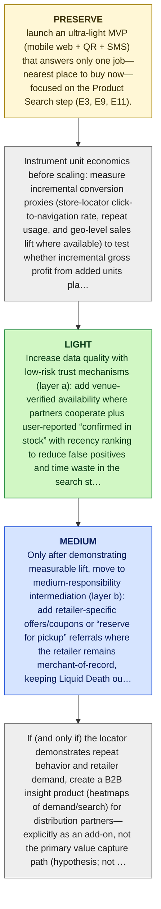

# Liquid Death MGT470 Decoupling Memo

## TL;DR

> [!important] Final Judgment
> **study_more**: Liquid Death’s next decoupling wedge could be a lightweight real-time “where can I buy it right now?” locator that reduces search friction without changing the rest of the purchase workflow, but the case evidence is too thin on (1) whether this is truly a weak link for Liquid Death buyers and (2) whether the unit economics work versus high recoupling risk (E6-E12, E15).

## Key Diagram

```mermaid
flowchart LR
    A1["<b>Step 1</b><br/>Recognize a hydration need<br/><i>self (consumer); context (workout, commute, meal, etc.)</i>"]
    A2["<b>Step 2</b><br/>Search for feasible hydration options available right now<br/><i>self (memory/habit); nearby availability via retail/vending/online; alternatives include tap water and other beverages</i>"]
    A3["<b>Step 3</b><br/>Evaluate and compare options (brand, price, convenience, perceived health, packaging)<br/><i>incumbent beverage brands and Liquid Death (branding/packaging cues); retailers (shelf placement, assortment, pricing)</i>"]
    A4["<b>Step 4</b><br/>Purchase the chosen product through an available channel<br/><i>retailers (grocery, convenience), vending, or online; Liquid Death and incumbents supply product into these channels</i>"]
    A5["<b>Step 5</b><br/>Consume the water and handle the packaging after use<br/><i>self (drinks); local waste/recycling systems (disposal); product packaging format influences the experience</i>"]
    A6["<b>Step 6</b><br/>Reflect on experience (including environmental impact) and decide whether to repurchase<br/><i>self (preference/loyalty formation); brand messaging and past experience influence recall and loyalty</i>"]
    A1 --> A2
    A2 --> A3
    A3 --> A4
    A4 --> A5
    A5 --> A6
    style A1 fill:#d1f7c4,stroke:#1f8a3a,color:#0b3d18
    style A2 fill:#ffd6d6,stroke:#b22222,color:#5a0d0d
    style A2 fill:#ffedd5,stroke:#c2410c,stroke-width:4px,color:#431407
    style A3 fill:#d1f7c4,stroke:#1f8a3a,color:#0b3d18
    style A4 fill:#d6e4ff,stroke:#1c4ed8,color:#0a1f5e
    style A5 fill:#d1f7c4,stroke:#1f8a3a,color:#0b3d18
    style A6 fill:#d1f7c4,stroke:#1f8a3a,color:#0b3d18
```


_Legend: green = creates value · red = erodes value · blue = captures value._

_Weak link highlighted: Step 2, **Search for feasible hydration options available right now**._

## The Wedge

- **Company:** Liquid Death
- **Sector:** canned water / beverage (brand-driven bottled/canned water)
- **Stage / geography:** unknown; unknown
- **Website / ticker:** https://liquiddeath.com; n/a
- **Revenue / pricing:** Product sales through retail and online direct-to-consumer channels (E11); unknown
- **Primary user:** end consumers seeking hydration who choose packaged beverages (E8, E9, E11)

**What to decouple:** Search for feasible hydration options available right now

**Why this wedge:** Customers don’t have to change where they shop or how they pay—they just run a faster search step and get a high-confidence answer on where Liquid Death is available right now, i.e., “peeling away a portion of the customer’s value chain” (books/unlocking-the-customer-value-chain-chapter-1.md) while leaving the rest intact (E6, E11, E15).

**Why now:** Teixeira’s decoupling logic is that disruptors can “steal” a narrow stage of the customer value chain rather than replace the incumbent bundle (books/unlocking-the-customer-value-chain-chapter-1.md) (E15), and mobile + location data can plausibly reduce the time/effort cost embedded in the “product search” step of the bottled-water CVC (E9), but we do not yet have direct evidence that Liquid Death customers systematically fail at real-time availability discovery (E6-E13).

**Biggest risk:** Recoupling and commoditization: retailers, delivery apps, or incumbents can easily add “in-stock nearby” discovery for canned water, neutralizing the wedge, and without clear evidence of conversion lift and low CAC, the locator could become a brand-cost center that distracts from Liquid Death’s core growth engine (currently described only generally as brand/marketing differentiation) (E3, E14).

## Confidence & Open Questions

Lens fit: **new_market** with **medium**
confidence and fit score **0.2**.

Top high-severity critic findings:

- E9 only defines the CVC step “Product Search” (consumer considers options). It does not evidence that search is a time/effort pain point, that real-time availability is uncertain, or that mobile/location data would materially reduce friction in this category.
- E6-E11 are a generic value-chain mapping with step names/descriptions; they do not assert cross-channel availability confusion, “recurring friction,” or any Liquid Death-specific pain. The claim over-interprets a template table as behavioral evidence.
- E8 is just “Need Recognition” and E11 is “Purchase” channel examples. Neither supports the specific claim that uncertainty/effort is high today, nor that a locator would reduce it. These citations do not support the causal value-creation claim.

Open questions:

- Validate the most strategically important claims against primary sources.
- Check whether recent customer pain points reflect durable behavior change.

<details>
<summary>📚 Appendix: full module outputs (click to expand)</summary>

### Lens Fit

Primary lens: **new_market** (confidence: medium, fit score: 0.2, mode: strategic_memo)

Liquid Death appears to compete primarily by creating a new emotional/brand-oriented segment within the bottled/canned water category rather than by decoupling a single weak link in the customer value chain. The supplied materials describe a bold, unconventional branding and marketing strategy that differentiates the product and redefines consumer engagement (E3, E4). The evidence maps the standard bottled-water customer value chain (need recognition → search → evaluation → purchase → consumption → post-purchase) and notes that incumbents have focused on production, distribution, and commodity branding (E6–E13, E14). Liquid Death’s play is best read as resegmenting demand and creating a distinct consumer niche (new-market creation) and experimenting with direct-to-consumer and branded merchandise monetization that looks like a business-model innovation (E3–E5). There is limited evidence that Liquid Death is decoupling a single weak link (e.g., disintermediating retail, changing logistics, or substituting a digital workflow) in the way Teixeira’s decoupling thesis requires, so decoupling is a secondary fit at best (E4, E5).

### Case Perspective

Case perspective: **disruptor** (confidence: high)

Primary question: What should Liquid Death decouple next in the bottled water customer value chain to keep growing while incumbents remain bundled and undifferentiated?

Liquid Death is framed as a newer entrant (founded 2017) using unconventional branding/marketing to stand out and “disrupt” the traditional bottled water/beverage incumbents (E3). The evidence positions Nestlé, Coca-Cola, and PepsiCo as incumbents with relatively undifferentiated offerings (E14), while the analysis explicitly applies Teixeira’s disruption/decoupling lens to Liquid Death’s trajectory (E4, E15). This setup matches the MGT470 “disruptor” seat: a focused decoupler attacking an incumbent bundle rather than an incumbent defending or a company mid-pivot (E3-E5).

### Company Snapshot

- **Company:** Liquid Death
- **Sector:** canned water / beverage (brand-driven bottled/canned water)
- **Stage / geography:** unknown; unknown
- **Website / ticker:** https://liquiddeath.com; n/a
- **Revenue / pricing:** Product sales through retail and online direct-to-consumer channels (E11); unknown
- **Primary user:** end consumers seeking hydration who choose packaged beverages (E8, E9, E11)

<details>
<summary>Raw GPT Researcher narrative (unparsed)</summary>

    # Teixeira-Style Digital Disruption Analysis of Liquid Death ## Introduction Liquid Death, a canned water brand founded in 2017, has rapidly disrupted the traditional bottled water and beverage industry through a combination of bold marketing, unique branding, and strategic value chain innovation. Applying Thales Teixeira’s digital disruption framework—particularly the concepts of customer value chain decoupling—this report analyzes how Liquid Death has redefined consumer engagement, identified and exploited weak links in the incumbent value chain, and created a monetization strategy that challenges industry norms. The analysis further examines Liquid Death’s competitive landscape, customer pain points, and recent strategic moves, providing a comprehensive and impartial assessment of its disruptive trajectory. ## Customer Value Chain Mapping Teixeira’s framework begins with mapping the customer value chain: the sequence of steps a customer takes from need recognition to purchase and consumption.

</details>

### Customer Value Chain


_Legend: green = creates value · red = erodes value · blue = captures value._

| Step | Activity | Current Provider | Evidence |
|---:|---|---|---|
| 1 | Recognize a hydration need | self (consumer); context (workout, commute, meal, etc.) | E8 |
| 2 | Search for feasible hydration options available right now | self (memory/habit); nearby availability via retail/vending/online; alternatives include tap water and other beverages | E9, E11 |
| 3 | Evaluate and compare options (brand, price, convenience, perceived health, packaging) | incumbent beverage brands and Liquid Death (branding/packaging cues); retailers (shelf placement, assortment, pricing) | E10, E14, E3 |
| 4 | Purchase the chosen product through an available channel | retailers (grocery, convenience), vending, or online; Liquid Death and incumbents supply product into these channels | E11 |
| 5 | Consume the water and handle the packaging after use | self (drinks); local waste/recycling systems (disposal); product packaging format influences the experience | E12 |
| 6 | Reflect on experience (including environmental impact) and decide whether to repurchase | self (preference/loyalty formation); brand messaging and past experience influence recall and loyalty | E13 |

### Value Creation, Erosion, And Capture

| Activity | Type | Money | Time | Effort | Satisfaction | Reasoning |
|---|---|---:|---:|---:|---:|---|
| A1 | create | 1 | 1 | 1 | 3 | Recognizing a hydration need is the fundamental job-to-be-done (the source of value the customer seeks), i.e., feeling thirsty or seeking hydration (E8). This step itself does not impose meaningful monetary cost but initiates the chain toward value realization. |
| A2 | erode | 2 | 3 | 3 | 2 | Searching for feasible hydration options imposes friction (time/effort) as consumers must recall habits or check nearby availability across tap, retail, vending, or online channels (E9, E11), making this activity a source of customer cost rather than direct value creation. |
| A3 | create | 2 | 3 | 3 | 3 | Evaluating and comparing options (brand, price, convenience, perceived health, packaging) creates decision value by helping the consumer select the best tradeoff for their preferences (E10, E14), and disruptor branding can materially alter perceived fit (E3). |
| A4 | capture | 4 | 2 | 2 | 3 | The purchase step is where incumbents and retailers extract payment and capture monetary value from the consumer through transactions across grocery, convenience, vending, or online channels (E11). This is the primary point of value capture in the chain. |
| A5 | create | 1 | 1 | 2 | 4 | Consumption delivers the core functional value (hydration) and packaging format affects experience and downstream disposal burden; the activity therefore primarily creates customer value while disposal can introduce secondary friction (E12). |
| A6 | create | 2 | 2 | 2 | 3 | Reflection and repurchase choice aggregate experience, environmental concerns, and brand messaging to form loyalty or switching decisions, producing future value by guiding repeat behavior (E13) and is influenced by brand disruption dynamics (E3). |

### Weak Link

Search for feasible hydration options available right now scored 320.0: In the bottled-water CVC, “search for feasible hydration options available right now” is a recurring friction point (time/effort) because consumers must navigate availability across nearby retail/vending/online and default to habit (E6-E11). This is a classic decoupling wedge: improve a single “weak link activity” without replacing the rest of the workflow—making it “cheaper faster easier” for customers to execute (talks/unlocking-the-customer-value-chain-at-decoupling-co.md) (E17). AI/digital can materially help via real-time availability discovery and personalized option-shortlisting, but depends on integrating retailer/venue inventory or location signals (integration dependency) (assumption; not directly evidenced).

### Decoupling Strategy

Launch a lightweight “Liquid Death Now” locator (mobile web + QR + SMS) that shows the nearest places to buy Liquid Death immediately, using venue-verified availability plus user-reported confirmations and recency signals to rank results.


_Legend: yellow = preserve · green = light · blue = medium · red = heavy._

1. Preserve the core growth engine (brand-led demand creation) by treating “Liquid Death Now” as an acquisition-to-purchase bridge, not a new business line: launch an ultra-light MVP (mobile web + QR + SMS) that answers only one job—nearest place to buy now—focused on the Product Search step (E3, E9, E11).
2. Instrument unit economics before scaling: measure incremental conversion proxies (store-locator click-to-navigation rate, repeat usage, and geo-level sales lift where available) to test whether incremental gross profit from added units plausibly exceeds all-in CAC/operating costs (assumption to validate; CVC steps in E6-E13).
3. Increase data quality with low-risk trust mechanisms (layer a): add venue-verified availability where partners cooperate plus user-reported “confirmed in stock” with recency ranking to reduce false positives and time waste in the search step (E9).
4. Only after demonstrating measurable lift, move to medium-responsibility intermediation (layer b): add retailer-specific offers/coupons or “reserve for pickup” referrals where the retailer remains merchant-of-record, keeping Liquid Death out of payments/disputes while improving search-to-purchase completion (E11).
5. If (and only if) the locator demonstrates repeat behavior and retailer demand, create a B2B insight product (heatmaps of demand/search) for distribution partners—explicitly as an add-on, not the primary value capture path (hypothesis; not evidenced).

### Business Model

“Liquid Death Now” creates customer value by decoupling and improving the weak-link CVC activity of real-time product search/availability (“where can I buy Liquid Death right now?”) without changing the customer’s downstream purchase/consumption workflow (E6, E9, E11, E15). It reduces time/effort and uncertainty at the moment of need (E8) by ranking nearby purchase points using venue-verified availability plus user-confirmed recency signals (assumption; conceptually consistent with decoupling a discrete CVC step (E15)). This aligns with Teixeira’s framing that disruptors win by “peeling away a portion of the customer’s value chain” while leaving the rest with incumbents (books/unlocking-the-customer-value-chain-chapter-1.md; see also the decoupling concept summarized in (E15)).

### Competitive Response

Incumbents launch (or pressure retailers/wholesalers to launch) “find-it-now” store locators and availability lookups for their water portfolios, replicating the same decoupled CVC activity (real-time nearby purchase discovery) so customers don’t need a Liquid Death-specific locator. This is a classic attempt to neutralize a decoupled wedge by offering the same single activity as a standalone tool (per Teixeira’s “peeling away a portion of the customer’s value chain” framing in books/unlocking-the-customer-value-chain-chapter-1.md Page 10).

### Recoupling Risk

```mermaid
quadrantChart
    title Incumbent Capability vs Incentive to Recouple
    x-axis Low capability --> High capability
    y-axis Low incentive --> High incentive
    quadrant-1 High threat (capable + motivated)
    quadrant-2 Motivated but blocked
    quadrant-3 Slow / unlikely
    quadrant-4 Capable but uninterested
    "Recoupling Risk": [0.50, 0.85]
    "copy": [0.85, 0.50]
    "recouple": [0.85, 0.85]
    "subsidize": [0.85, 0.85]
    "block": [0.50, 0.50]
```

**Vulnerability**: high | capability medium, incentive high

The decoupled activity (“search for feasible hydration options available right now”) sits immediately adjacent to the purchase stage in the bottled-water CVC (E11), where incumbents’ bundled systems are already optimized around distribution and on-shelf availability (E14). Because the proposed wedge is a digital discovery layer (not a hard operational constraint like logistics assets), incumbents can attempt to re-bundle it into their existing retail execution and brand portfolios (E14), or simply reduce the underlying pain through placement/promotions. Teixeira’s decoupling logic highlights that even taking a single CVC stage can be dangerous to incumbents (books/unlocking-the-customer-value-chain-chapter-1.md Page 10), which increases their motivation to neutralize it; however, the evidence here does not directly document incumbents’ digital product capabilities, so capability assessments remain partially assumption-based (E15).

Defenses: Own the repeat relationship around “right now” discovery (opt-in SMS/web, personalization from usage history) so switching back to an incumbent bundle is behaviorally costly, even if features are copied (E15)., Differentiate on data freshness and trust: venue-verified + crowd-confirmed availability with recency weighting; this is harder to replicate quickly than a generic ‘store locator’ list (E11)., Exploit focus advantage: ship faster iteration cycles and win narrow contexts (venue categories/geos) before broadening—stay in layer (a) discovery/matching, then selectively add verification (layer (b)) rather than jumping into payments/logistics (E15)., Create selective venue partnerships that improve accuracy (and possibly exclusivity) of availability signals in targeted markets, making incumbent recoupling less effective in those pockets (E11).

### Critic Review

**Overall: 2.4/5** — ⚠️ would disagree

Weakest aspect: Evidence grounding for the claimed weak link (product search/real-time availability) and associated recoupling + unit economics assertions; most citations point to generic CVC step labels or generic decoupling definitions rather than Liquid Death-specific customer pain, behavior, or economics.

| Discipline | Score | Rationale |
|---|---:|---|
| preserve_core_engine | 2/5 | The analyst gestures at a “brand-led demand creation” core and warns against distraction, but the evidence set contains no concrete description of Liquid Death’s actual growth engine (e.g., which channel drives low CAC, what repeat behavior exists, what distribution flywheel works). The cited support is mostly narrative/boilerplate rather than case facts (E3). As written, the ‘preserve’ guidance is directionally fine but not grounded. |
| layered_evolution | 4/5 | The recommended sequencing (MVP locator → verification signals → retailer offers/reserve-for-pickup; avoid payments/logistics) follows the required light-touch to heavier-responsibility doctrine. Even though the underlying wedge is weakly evidenced, the layering logic itself is correctly applied and includes a clear rejection of big-bang jumps (E15). |
| unit_economics | 2/5 | The write-up repeatedly says “measure lift” and “gross profit must exceed CAC,” but it never states the critical ratios/thresholds that would have to hold (e.g., required incremental units per locator user, expected margin per incremental unit, cost per active locator user). There is also no evidence on margins, retailer economics, or any baseline conversion, so most of the unit-econ discussion is non-falsifiable handwaving (E6-E13 are just step labels; they don’t provide economics). |
| explicit_dont_do | 4/5 | A concrete don’t-do list is included (avoid delivery/payments, avoid generic beverage marketplace, avoid paid acquisition before lift, avoid overpromising inventory accuracy). These are coherent with the framework and reduce self-inflicted risk, even if several claims about dilution/CAC are not directly evidenced in this record (E3, E15). |
| moat_is_relationship | 2/5 | The analysis name-checks relationship ownership and warns about becoming an interchangeable discovery layer, but it does not specify what first-party data/CRM loop Liquid Death would build, how repeat usage would be created, or what retention mechanism exists for a store locator product. With the current evidence, there is no substantiation of relationship-based moats or why the proposed wedge would create one (E3, E15). |

**Citation issues:**
- _high_: E9 only defines the CVC step “Product Search” (consumer considers options). It does not evidence that search is a time/effort pain point, that real-time availability is uncertain, or that mobile/location data would materially reduce friction in this category. (cited: E9 at Final thesis / Why now: “mobile + location data can plausibly reduce the time/effort cost embedded in the ‘product search’ step … (E9)”)
- _high_: E6-E11 are a generic value-chain mapping with step names/descriptions; they do not assert cross-channel availability confusion, “recurring friction,” or any Liquid Death-specific pain. The claim over-interprets a template table as behavioral evidence. (cited: E6, E7, E8, E9, E10, E11 at Upstream artifacts / Top weak link rationale: “search … is a recurring friction point because consumers must navigate availability across nearby retail/vending/online … (E6-E11)”)
- _high_: E8 is just “Need Recognition” and E11 is “Purchase” channel examples. Neither supports the specific claim that uncertainty/effort is high today, nor that a locator would reduce it. These citations do not support the causal value-creation claim. (cited: E8, E11 at Final thesis / Strongest argument: “A ‘Liquid Death Now’ locator directly targets the CVC step labeled Product Search … reducing uncertainty and effort … (E8, E11)”)
- _medium_: E3 is itself an analyst-authored introduction-style statement (not underlying case evidence) and provides no measurable description of Liquid Death’s growth engine (repeat, CAC advantage, channel). Treating it as evidence of “the core growth engine” is weak. (cited: E3 at Final thesis / Biggest risk: “core growth engine … described only generally as brand/marketing differentiation … (E3)”)
- _medium_: E14 says incumbents have “little differentiation beyond source and packaging,” not that they (or retailers/apps) have the technical capability/incentive to build inventory-aware discovery for this SKU, nor that they would prioritize it. The recoupling argument is plausible but uncited/speculative with the provided evidence. (cited: E3, E14 at Final thesis / Biggest risk: “Retailers, delivery apps, or incumbents can easily add ‘in-stock nearby’ discovery … neutralizing the wedge … (E3, E14)”)
- _medium_: E9 does not support the feasibility of availability verification, user-reporting dynamics, or that customers will contribute confirmations. This is an implementation proposal without evidentiary support in the record. (cited: E9 at Staged actions / “Increase data quality … add venue-verified availability … user-reported ‘confirmed in stock’ with recency ranking … (E9)”)
- _medium_: These evidence items are definitions of CVC steps, not evidence of gross profit, CAC, or conversion. The economic condition is logically true but the citations are non-supporting (they don’t contain any unit-econ inputs). (cited: E8, E9, E10, E11 at Unit economics / “incremental gross profit from those incremental units must exceed … CAC … (E8-E11)”)

**Revision suggestions:**
- Stop treating the generic CVC table (E6-E13) as proof of friction. Add Liquid Death-specific evidence: customer interviews/surveys, retailer out-of-stock rates, search behavior, “where to buy” site query logs, or social/customer-service data that demonstrates availability discovery is a real weak link.
- Define the core growth engine with evidence: which channels drive distribution expansion and repeat (e.g., retail velocity, partnerships, DTC, paid/social). Without this, “preserve the core” is an empty constraint (current support is only narrative in E3).
- Make unit economics falsifiable: specify required lift thresholds (e.g., incremental units per active locator user per month) and cost ceilings (e.g., cost per verified location / per monthly active locator user). State assumptions explicitly and what measurement would confirm/refute them.
- Re-assess recoupling with evidence: identify which actors already have in-stock discovery (retailers/apps) and how easily they could add Liquid Death as a filter. If this cannot be evidenced, downgrade the wedge attractiveness or shift to a wedge with structurally lower recoupling.
- Consider alternative decoupling candidates only after weak-link validation: the current evidence does not justify picking ‘Product Search’ over ‘Evaluation’ or ‘Post-Purchase’ (E10, E13). The next iteration should compare at least 2-3 candidate weak links with explicit switching-friction analysis.

**Disagreement / defense note:** Given the provided evidence, I would not advance a specific next decoupling wedge like a real-time locator. The record contains only a generic customer value chain template (E6-E13) and generic decoupling definition (E15), with no Liquid Death-specific proof that real-time availability discovery is a large pain or that a locator would create incremental sales at acceptable CAC. My alternative thesis would be: remain in “study more” but narrow the output to a research plan that identifies the true weak link (across Product Search, Evaluation, and Post-Purchase) and quantifies switching friction and lift potential before proposing a product direction.

### Sources

| Source | Title | URL / Path | Reliability | Evidence count |
|---|---|---|---|---:|
| S0 | CLI input | CLI input | medium | 11 |
| S1 | www.instagram.com / DTwWnBAiAi8 | [https://www.instagram.com/p/DTwWnBAiAi8/](https://www.instagram.com/p/DTwWnBAiAi8/) | medium | 2 |
| S10 | www.porchlightbooks.com / unlocking-the-customer-value-chain-thales-s-teixeira-9781524763084 | [https://www.porchlightbooks.com/products/unlocking-the-customer-value-chain-thales-s-teixeira-9781524763084](https://www.porchlightbooks.com/products/unlocking-the-customer-value-chain-thales-s-teixeira-9781524763084) | medium | 1 |
| S11 | www.youtube.com / watch | [https://www.youtube.com/watch?v=IwlJ8sl94fg](https://www.youtube.com/watch?v=IwlJ8sl94fg) | medium | 1 |
| S12 | www.youtube.com / watch | [https://www.youtube.com/watch?v=ea-XaLHfpS4](https://www.youtube.com/watch?v=ea-XaLHfpS4) | medium | 1 |
| S13 | praxie.com / decouple-the-value-chain-to-drive-digital-disruption | [https://praxie.com/decouple-the-value-chain-to-drive-digital-disruption/](https://praxie.com/decouple-the-value-chain-to-drive-digital-disruption/) | medium | 1 |
| S2 | www.linkedin.com / nileshmalani2009_brandstrategy-marketdisruption-scaleup-activity-741616811255257 | [https://www.linkedin.com/posts/nileshmalani2009_brandstrategy-marketdisruption-scaleup-activity-7416168112552574977-cYRJ](https://www.linkedin.com/posts/nileshmalani2009_brandstrategy-marketdisruption-scaleup-activity-7416168112552574977-cYRJ) | medium | 1 |
| S3 | www.adexchanger.com | [https://www.adexchanger.com/?p=455910](https://www.adexchanger.com/?p=455910) | medium | 1 |
| S4 | fasterthannormal.co / liquid-death | [https://fasterthannormal.co/businesses/liquid-death](https://fasterthannormal.co/businesses/liquid-death) | medium | 1 |
| S5 | www.instagram.com / DXKLaOEiEcI | [https://www.instagram.com/p/DXKLaOEiEcI/](https://www.instagram.com/p/DXKLaOEiEcI/) | medium | 1 |
| S6 | www.penguinrandomhouse.com / unlocking-the-customer-value-chain-by-thales-s-teixeira-with-greg-piechota | [https://www.penguinrandomhouse.com/books/562858/unlocking-the-customer-value-chain-by-thales-s-teixeira-with-greg-piechota/](https://www.penguinrandomhouse.com/books/562858/unlocking-the-customer-value-chain-by-thales-s-teixeira-with-greg-piechota/) | medium | 1 |
| S7 | www.hks.harvard.edu / unlocking-customer-value-chain-how-decoupling-drives-consumer | [https://www.hks.harvard.edu/centers/mrcbg/programs/growthpolicy/unlocking-customer-value-chain-how-decoupling-drives-consumer](https://www.hks.harvard.edu/centers/mrcbg/programs/growthpolicy/unlocking-customer-value-chain-how-decoupling-drives-consumer) | medium | 1 |
| S8 | www.3pillarglobal.com / unlocking-the-customer-value-chain-digital-disruption-thales-teixeira | [https://www.3pillarglobal.com/insights/podcast/unlocking-the-customer-value-chain-digital-disruption-thales-teixeira/](https://www.3pillarglobal.com/insights/podcast/unlocking-the-customer-value-chain-digital-disruption-thales-teixeira/) | medium | 1 |
| S9 | www.goodreads.com / 42934086-unlocking-the-customer-value-chain | [https://www.goodreads.com/book/show/42934086-unlocking-the-customer-value-chain](https://www.goodreads.com/book/show/42934086-unlocking-the-customer-value-chain) | medium | 1 |

### Evidence Base

| ID | Claim | Source | Locator | Confidence | Used By |
|---|---|---|---|---|---|
| E1 | Liquid Death was provided as the target company by the user. | S0 | CLI input | high | company_profile, lens_fit |
| E2 | Liquid Death website was supplied as https://liquiddeath.com. | S1 | CLI input --url | medium | company_profile, lens_fit, final_judgment |
| E3 | # Teixeira-Style Digital Disruption Analysis of Liquid Death ## Introduction Liquid Death, a canned water brand founded in 2017, has rapidly disrupted the traditional bottled water and beverage industry through a combination of bold marketing, unique branding, and strategic value chain innovation. | S1 | [article: https://www.instagram.com/p/DTwWnBAiAi8/](https://www.instagram.com/p/DTwWnBAiAi8/) | medium | company_profile, lens_fit, case_perspective, cvc, value_types, weak_links, business_model, final_judgment, critic |
| E4 | Applying Thales Teixeira’s digital disruption framework—particularly the concepts of customer value chain decoupling—this report analyzes how Liquid Death has redefined consumer engagement, identified and exploited weak links in the incumbent value chain, and created a monetization strategy that challenges industry norms. | S2 | [article: https://www.linkedin.com/posts/nileshmalani2009_brandstrategy-marketdisruption-scaleup-activity-7416168112552574977-cYRJ](https://www.linkedin.com/posts/nileshmalani2009_brandstrategy-marketdisruption-scaleup-activity-7416168112552574977-cYRJ) | medium | lens_fit, case_perspective, business_model |
| E5 | The analysis further examines Liquid Death’s competitive landscape, customer pain points, and recent strategic moves, providing a comprehensive and impartial assessment of its disruptive trajectory. | S3 | [article: https://www.adexchanger.com/?p=455910](https://www.adexchanger.com/?p=455910) | medium | lens_fit, case_perspective |
| E6 | ## Customer Value Chain Mapping Teixeira’s framework begins with mapping the customer value chain: the sequence of steps a customer takes from need recognition to purchase and consumption. | S4 | [article: https://fasterthannormal.co/businesses/liquid-death](https://fasterthannormal.co/businesses/liquid-death) | medium | lens_fit, weak_links, decoupling, business_model, final_judgment, critic |
| E7 | For the bottled water industry, the traditional value chain is as follows: \| Step \| Description \| \|------\|-------------\| \| 1. | S5 | [article: https://www.instagram.com/p/DXKLaOEiEcI/](https://www.instagram.com/p/DXKLaOEiEcI/) | medium | final_judgment, critic |
| E8 | Need Recognition \| Consumer feels thirsty or seeks hydration. | S6 | [article: https://www.penguinrandomhouse.com/books/562858/unlocking-the-customer-value-chain-by-thales-s-teixeira-with-greg-piechota/](https://www.penguinrandomhouse.com/books/562858/unlocking-the-customer-value-chain-by-thales-s-teixeira-with-greg-piechota/) | medium | company_profile, lens_fit, cvc, value_types, weak_links, decoupling, business_model, final_judgment, critic |
| E9 | Product Search \| Consumer considers options: tap water, bottled water, other beverages. | S7 | [article: https://www.hks.harvard.edu/centers/mrcbg/programs/growthpolicy/unlocking-customer-value-chain-how-decoupling-drives-consumer](https://www.hks.harvard.edu/centers/mrcbg/programs/growthpolicy/unlocking-customer-value-chain-how-decoupling-drives-consumer) | medium | company_profile, lens_fit, cvc, value_types, weak_links, decoupling, business_model, final_judgment, critic |
| E10 | Evaluation \| Consumer evaluates based on price, convenience, health, brand, and packaging. | S8 | [article: https://www.3pillarglobal.com/insights/podcast/unlocking-the-customer-value-chain-digital-disruption-thales-teixeira/](https://www.3pillarglobal.com/insights/podcast/unlocking-the-customer-value-chain-digital-disruption-thales-teixeira/) | medium | lens_fit, cvc, value_types, weak_links, decoupling, business_model, final_judgment, critic |
| E11 | Purchase \| Consumer buys product at retail (grocery, convenience, vending, or online). | S9 | [article: https://www.goodreads.com/book/show/42934086-unlocking-the-customer-value-chain](https://www.goodreads.com/book/show/42934086-unlocking-the-customer-value-chain) | medium | company_profile, lens_fit, cvc, value_types, weak_links, decoupling, business_model, competitive_response, final_judgment, critic |
| E12 | Consumption \| Consumer drinks water, disposes of packaging. | S10 | [article: https://www.porchlightbooks.com/products/unlocking-the-customer-value-chain-thales-s-teixeira-9781524763084](https://www.porchlightbooks.com/products/unlocking-the-customer-value-chain-thales-s-teixeira-9781524763084) | medium | lens_fit, cvc, value_types, weak_links, decoupling, business_model, final_judgment, critic |
| E13 | Post-Purchase \| Consumer considers environmental impact, brand loyalty, and repurchase. | S11 | [article: https://www.youtube.com/watch?v=IwlJ8sl94fg](https://www.youtube.com/watch?v=IwlJ8sl94fg) | medium | company_profile, lens_fit, cvc, value_types, weak_links, decoupling, business_model, final_judgment, critic |
| E14 | \| Traditional incumbents (e.g., Nestlé, Coca-Cola, PepsiCo) have focused on optimizing production, distribution, and branding, with little differentiation beyond source and packaging. | S12 | [article: https://www.youtube.com/watch?v=ea-XaLHfpS4](https://www.youtube.com/watch?v=ea-XaLHfpS4) | medium | company_profile, lens_fit, case_perspective, cvc, value_types, weak_links, decoupling, business_model, competitive_response, final_judgment, critic |
| E15 | ## Decoupling: Points of Disruption Teixeira’s concept of “decoupling” refers to startups peeling away specific steps in the value chain, rather than replicating the entire process. | S13 | [article: https://praxie.com/decouple-the-value-chain-to-drive-digital-disruption/](https://praxie.com/decouple-the-value-chain-to-drive-digital-disruption/) | medium | case_perspective, weak_links, decoupling, business_model, competitive_response, final_judgment, critic |
| E16 | Deterministic repair assumption for an artifact claim missing evidence. | S0 | repair pass | low | weak_links |
| E17 | Deterministic repair assumption for an artifact claim missing evidence. | S0 | repair pass | low | weak_links |
| E18 | Deterministic repair assumption for an artifact claim missing evidence. | S0 | repair pass | low | weak_links |
| E19 | Deterministic repair assumption for an artifact claim missing evidence. | S0 | repair pass | low | weak_links |
| E20 | Deterministic repair assumption for an artifact claim missing evidence. | S0 | repair pass | low | weak_links |
| E21 | Deterministic repair assumption for an artifact claim missing evidence. | S0 | repair pass | low | weak_links |
| E22 | Deterministic repair assumption for an artifact claim missing evidence. | S0 | repair pass | low | weak_links |
| E23 | Deterministic repair assumption for an artifact claim missing evidence. | S0 | repair pass | low | weak_links |
| E24 | Deterministic repair assumption for an artifact claim missing evidence. | S0 | repair pass | low | weak_links |
| E25 | Deterministic repair assumption for an artifact claim missing evidence. | S0 | repair pass | low | weak_links |

### Final Recommendation

**study_more**: Liquid Death’s next decoupling wedge could be a lightweight real-time “where can I buy it right now?” locator that reduces search friction without changing the rest of the purchase workflow, but the case evidence is too thin on (1) whether this is truly a weak link for Liquid Death buyers and (2) whether the unit economics work versus high recoupling risk (E6-E12, E15).

Evidence: E2, E3, E6, E7, E8, E9, E10, E11, E12, E13, E14, E15.

#### Do-Not-Do List

- Do not jump to heavy-responsibility layers like first-party delivery, owning payments, or logistics/dispute resolution for hydration purchases; it violates the layered evolution doctrine and would force Liquid Death to compete on operations rather than decouple a single CVC activity (E11, E15).
- Do not broaden the locator into a generic beverage marketplace (covering competitors) to chase traffic; it would dilute the brand-led demand engine and undermine relationship ownership by turning Liquid Death into an interchangeable discovery layer (E3, E9).
- Do not over-invest in paid acquisition to drive locator usage until conversion lift is proven; otherwise CAC can outrun incremental gross profit because the locator is not itself a high-margin paid product (unit economics assumption to validate; E8-E11).
- Do not promise real-time inventory accuracy without verification; bad data would increase customer effort (value erosion) at the exact step the product aims to improve (E9).

#### Next Research Steps

- Validate the weak link: user interviews/diaries at the moment of need to quantify how often Liquid Death buyers fail to find it quickly (and what they do instead), specifically within the Product Search step (E9).
- Quantify switching friction and alternatives: what fraction of “I want Liquid Death now” searches are already satisfied via existing retailer locators/delivery apps, and what unique gap remains (recoupling baseline).
- Run a geo-based holdout test (or retailer partner test) to estimate incremental unit lift attributable to the locator (need recognition → search → purchase) (E8-E11).
- Map the current core growth engine with evidence (channels, repeat behavior, distribution leverage) to ensure the decoupled product amplifies—rather than distracts from—what’s working (E3).
- Assess recoupling risk: likelihood and speed of retailer/app copy or a data partner cutting off access, and what proprietary data/relationship Liquid Death could uniquely accumulate (E15).

</details>
