# Liquid Death 数字解构分析摘要

> [!important] 一句话结论
> Liquid Death 的下一个“解耦楔子”可以是一个轻量级的实时“现在去哪儿买？”定位器，在不改变其余购买流程的情况下显著降低搜索摩擦；但证据不足以证明：(1) 这是否真的是 Liquid Death 买家的关键薄弱环节；(2) 在较…

## 镜头判断
- **主透镜**：新市场 （置信度：中等，契合度：0.2）
- **案例视角**：颠覆者 （置信度：高）

## 客户价值链与弱链

```mermaid
flowchart LR
    A1["<b>Step 1</b><br/>识别补水需求"]
    A2["<b>Step 2</b><br/>搜索当下可行的补水选项"]
    A3["<b>Step 3</b><br/>评估并比较选项（品牌、价格、便利性、健康感知、…"]
    A4["<b>Step 4</b><br/>通过可用渠道购买所选产品"]
    A5["<b>Step 5</b><br/>饮用并处理使用后的包装"]
    A6["<b>Step 6</b><br/>复盘体验（含环境影响）并决定是否复购"]
    A1 --> A2
    A2 --> A3
    A3 --> A4
    A4 --> A5
    A5 --> A6
    style A1 fill:#d1f7c4,stroke:#1f8a3a,color:#0b3d18
    style A2 fill:#ffd6d6,stroke:#b22222,color:#5a0d0d
    style A2 fill:#ffedd5,stroke:#c2410c,stroke-width:4px,color:#431407
    style A3 fill:#d1f7c4,stroke:#1f8a3a,color:#0b3d18
    style A4 fill:#d6e4ff,stroke:#1c4ed8,color:#0a1f5e
    style A5 fill:#d1f7c4,stroke:#1f8a3a,color:#0b3d18
    style A6 fill:#d1f7c4,stroke:#1f8a3a,color:#0b3d18
```

_Legend: green = creates value · red = erodes value · blue = captures value._

**弱链定位**：第 2 步「搜索当下可行的补水选项」—— 在瓶装水的客户价值链（CVC）中，“立刻找到可行的补水选择”是反复出现的摩擦点（时间/精力），因为消费者需要在附近零售/自动售货/线上之间确认可得性，最终往往回到习惯性选择（E6-E11）。这属于典型的解耦楔子：只优化…

## 推荐切入点（The Wedge）

- **切什么**：搜索当下可用的补水选项
- **为什么**：客户无需改变去哪买或怎么付——只是在搜索环节更快一步，获得“Liquid Death 现在在哪儿有货”的高置信答案；即在不动其余环节的前提下，“剥离客户价值链的一部分”（books/unlocking-the-customer-value-chain-chapter-1.md）（E6，E11，E1…
- **最大风险**：再耦合与同质化：零售商、外卖平台或行业巨头很容易为罐装水加入“附近有货”发现功能，从而抵消楔子；且若缺乏明确的转化提升与低 CAC 证据，该定位器可能沦为品牌成本中心，分散 Liquid Death 的核心增长引擎（目…

## 信心 & 关键缺口

- **整体置信度**：中等；最终判断为「继续研究」。
- **关键缺口**：
  1. E9 仅定义了 CVC 的“产品搜索”（消费者考虑选项）步骤，未证明搜索在该品类是时间/精力痛点、实时可得性存在不确定性，或移动/位置数据能显著降摩擦。
  2. E6-E11 是通用的价值链映射（步骤名称/描述），并未主张跨渠道可得性困惑、“反复摩擦”，或任何 Liquid Death 特有痛点。该主张把模板表格过度解读为行为证据。
  3. E8 只是“需求识别”，E11 只是“购买”的渠道示例；两者均不支持“当下不确定性/投入很高”的具体判断，也不支持“定位器能降低不确定性”的结论。这些引用不足以支撑因果式价值创造…

## 6 个月后可回看的具体主张

到 2026-11-09，将“Liquid Death Now”定位为从获客到购买的桥梁而非新业务线，以不影响核心增长引擎（品牌驱动的需求创造）为前提：推出超轻量 MVP（移动 Web + 二维码 + 短信），只解决一个任务——最近哪里现在就能买——聚焦于“产品搜索”步骤（E3，E9，E11）。

---
完整英文报告见 [`final_report.md`](final_report.md)
