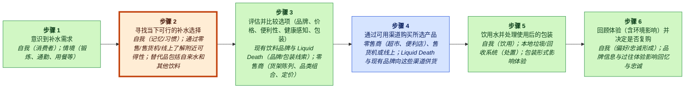
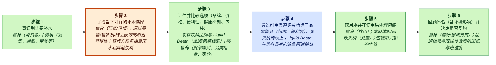
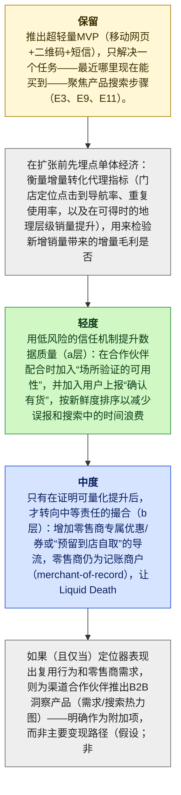

# Liquid Death MGT470 解构备忘录

## TL;DR

> [!important] 最终判断
> **study_more**：Liquid Death 的下一枚解构楔子可能是一个轻量级的实时“我现在能在哪里买到？”定位器（locator），它在不改变其余购买流程的情况下减少搜索摩擦，但关于 (1) 这是否真的是 Liquid Death 买家的薄弱环节，以及 (2) 在高再耦合风险下单位经济是否成立，案例证据过于薄弱（E6-E12, E15）。

## 关键图示


_图例：绿色 = 创造价值 · 红色 = 侵蚀价值 · 蓝色 = 捕获价值。_

_已高亮薄弱环节：第 2 步，**搜索此刻可获得的可行补水选项**。_

## 楔子

- **公司：** Liquid Death
- **行业：** 罐装水 / 饮料（品牌驱动的瓶装/罐装水）
- **阶段 / 地理：** unknown; unknown
- **网站 / 代码：** https://liquiddeath.com; n/a
- **收入 / 定价：** 通过零售与线上 direct-to-consumer 渠道进行产品销售（E11）；unknown
- **主要用户：** 寻求补水且选择包装饮料的终端消费者（E8, E9, E11）

**要解构什么：** 搜索此刻可获得的可行补水选项

**为什么选择这个楔子：** 客户不必改变在哪里购物或如何支付，他们只是运行一个更快的搜索步骤，并对 Liquid Death 此刻在哪里有售得到一个高置信答案，也就是在不动其余部分的情况下“剥离客户价值链的一部分”（books/unlocking-the-customer-value-chain-chapter-1.md）（E6, E11, E15）。

**为什么是现在：** Teixeira 的解构逻辑是，颠覆者可以“偷走”客户价值链中的一个狭窄阶段，而不是替代 incumbent 的整套捆绑（books/unlocking-the-customer-value-chain-chapter-1.md）（E15）；并且移动端 + 位置数据在概念上可以降低瓶装水 CVC 中“产品搜索”步骤所隐含的时间/精力成本（E9），但我们尚无直接证据表明 Liquid Death 客户在实时可得性发现方面系统性失败（E6-E13）。

**最大风险：** 再耦合与商品化：零售商、配送应用或 incumbents 很容易为罐装水增加“附近有库存”发现能力，从而中和该楔子；且在缺乏明确的转化提升与低 CAC 证据时，该定位器可能变成一个品牌成本中心，分散 Liquid Death 的核心增长引擎注意力（目前仅被笼统地描述为品牌/营销差异化）（E3, E14）。

## 置信度与未决问题

镜头匹配：**new_market**，**medium** 置信度，匹配分数 **0.2**。

最严重的批评发现：

- E9 仅定义了 CVC 步骤“Product Search”（消费者考虑选项）。它并未证明在该品类中搜索是一个时间/精力痛点，实时可得性是不确定的，或移动/位置数据会在实质上降低摩擦。
- E6-E11 是一个通用价值链映射，包含步骤名称/描述；它们并未断言跨渠道可得性困惑、“反复摩擦”，或任何 Liquid Death 特有的痛点。该主张将模板表格过度解读为行为证据。
- E8 只是“Need Recognition”，E11 是“Purchase”的渠道示例。两者都不支持“当下不确定性/付出很高”的具体主张，也不支持定位器会降低这些问题。这些引文不支持因果性的价值创造主张。

未决问题：

- 针对最具战略重要性的主张，用一手来源进行验证。
- 检查近期客户痛点是否反映了持久的行为变化。

<details>
<summary>📚 附录：完整模块输出（点击展开）</summary>

### 镜头匹配

主镜头：**new_market**（置信度：medium，匹配分数：0.2，模式：strategic_memo）

Liquid Death 似乎主要通过在瓶装/罐装水品类中创造一个新的情感/品牌导向细分来竞争，而不是通过解构客户价值链中的某个单一薄弱环节。所提供材料描述了一种大胆、非常规的品牌与营销策略，用以差异化产品并重塑消费者参与方式（E3, E4）。证据绘制了标准瓶装水客户价值链（需求识别 → 搜索 → 评估 → 购买 → 消费 → 购后），并指出 incumbents 主要聚焦于生产、分销以及商品化品牌（E6–E13, E14）。对 Liquid Death 的打法，更合适的解读是重新细分需求、创造独特的消费者利基（new-market creation），并试验 direct-to-consumer 与品牌周边商品变现，这看起来像一种商业模式创新（E3–E5）。几乎没有证据表明 Liquid Death 以 Teixeira 的解构论题所要求的方式解构了某个单一薄弱环节（例如去中介化零售、改变物流、或用数字化工作流替代），因此解构最多只能算次要匹配（E4, E5）。

### 案例视角

案例视角：**disruptor**（置信度：high）

核心问题：为了在 incumbents 仍然捆绑且缺乏差异化的情况下继续增长，Liquid Death 在瓶装水客户价值链中下一步应该解构什么？

Liquid Death 被框定为一个较新的进入者（成立于 2017 年），通过非常规品牌/营销来脱颖而出并“颠覆”传统瓶装水/饮料 incumbents（E3）。证据将 Nestlé、Coca-Cola 与 PepsiCo 定位为提供相对缺乏差异化产品的 incumbents（E14），并且分析明确将 Teixeira 的颠覆/解构镜头应用于 Liquid Death 的发展轨迹（E4, E15）。这一设置符合 MGT470 的“disruptor”席位：一个聚焦的解构者攻击 incumbent 捆绑，而非 incumbent 防守或处于中途转型的公司（E3-E5）。

### 公司快照

- **公司：** Liquid Death
- **行业：** 罐装水 / 饮料（品牌驱动的瓶装/罐装水）
- **阶段 / 地理：** unknown; unknown
- **网站 / 代码：** https://liquiddeath.com; n/a
- **收入 / 定价：** 通过零售与线上 direct-to-consumer 渠道进行产品销售（E11）；unknown
- **主要用户：** 寻求补水且选择包装饮料的终端消费者（E8, E9, E11）

<details>
<summary>Raw GPT Researcher narrative (unparsed)</summary>

    # 采用 Teixeira 风格的 Liquid Death 数字化颠覆分析 ## 引言 Liquid Death 是一个成立于 2017 年的罐装水品牌，通过大胆营销、独特品牌塑造与战略性的价值链创新组合，迅速颠覆了传统瓶装水与饮料行业。应用 Thales Teixeira 的数字化颠覆框架，尤其是客户价值链解构（customer value chain decoupling）的概念，本报告分析了 Liquid Death 如何重塑消费者参与、识别并利用 incumbent 价值链中的薄弱环节，以及如何创建挑战行业规范的变现策略。该分析还审视了 Liquid Death 的竞争格局、客户痛点以及近期战略动作，对其颠覆轨迹给出全面且公正的评估。 ## 客户价值链映射 Teixeira 的框架从映射客户价值链开始：客户从需求识别到购买与消费所经历的一系列步骤。

</details>

### 客户价值链


_图例：绿色 = 创造价值 · 红色 = 侵蚀价值 · 蓝色 = 捕获价值。_

| Step | Activity | Current Provider | Evidence |
|---:|---|---|---|
| 1 | 识别补水需求 | self（消费者）；情境（锻炼、通勤、用餐等） | E8 |
| 2 | 搜索此刻可获得的可行补水选项 | self（记忆/习惯）；通过零售/自动售货/线上获取附近可得性；替代项包括自来水与其他饮料 | E9, E11 |
| 3 | 评估并比较选项（品牌、价格、便利性、感知健康度、包装） | incumbent 饮料品牌与 Liquid Death（品牌/包装线索）；零售商（货架陈列、品类组合、定价） | E10, E14, E3 |
| 4 | 通过可用渠道购买所选产品 | 零售商（杂货店、便利店）、自动售货，或线上；Liquid Death 与 incumbents 向这些渠道供货 | E11 |
| 5 | 饮用用水并在使用后处理包装 | self（饮用）；本地垃圾/回收系统（丢弃）；产品包装形式会影响体验 | E12 |
| 6 | 反思体验（包括环境影响）并决定是否复购 | self（偏好/忠诚形成）；品牌信息与过往体验影响回忆与忠诚 | E13 |

### 价值创造、价值侵蚀与价值捕获

| Activity | Type | Money | Time | Effort | Satisfaction | Reasoning |
|---|---|---:|---:|---:|---:|---|
| A1 | create | 1 | 1 | 1 | 3 | 识别补水需求是根本性的 job-to-be-done（客户追求的价值来源），即感到口渴或寻求补水（E8）。该步骤本身并不施加显著的金钱成本，但启动了通往价值实现的链条。 |
| A2 | erode | 2 | 3 | 3 | 2 | 搜索可行补水选项会带来摩擦（时间/精力），因为消费者必须回忆习惯或检查自来水、零售、自动售货或线上渠道的附近可得性（E9, E11），使该活动成为客户成本来源而非直接价值创造。 |
| A3 | create | 2 | 3 | 3 | 3 | 评估并比较选项（品牌、价格、便利性、感知健康度、包装）通过帮助消费者在偏好之间选择最佳权衡来创造决策价值（E10, E14），而颠覆者的品牌塑造能实质性改变感知匹配度（E3）。 |
| A4 | capture | 4 | 2 | 2 | 3 | 购买步骤是 incumbents 与零售商通过杂货店、便利店、自动售货或线上渠道的交易向消费者收取付款并捕获货币价值的环节（E11）。这是链条中价值捕获的主要节点。 |
| A5 | create | 1 | 1 | 2 | 4 | 消费交付核心功能价值（补水），且包装形式影响体验及后续丢弃负担；因此该活动主要创造客户价值，而丢弃可能引入次级摩擦（E12）。 |
| A6 | create | 2 | 2 | 2 | 3 | 反思与复购选择将体验、环境担忧与品牌信息汇总以形成忠诚或转换决策，通过指导重复行为来产生未来价值（E13），并受到品牌颠覆动态影响（E3）。 |

### 薄弱环节

“搜索此刻可获得的可行补水选项”得分 320.0：在瓶装水 CVC 中，“搜索此刻可获得的可行补水选项”是一个反复出现的摩擦点（时间/精力），因为消费者必须在附近零售/自动售货/线上之间导航可得性，并默认回到习惯（E6-E11）。这是一个典型的解构楔子：在不替代其余工作流的情况下改进单一“薄弱环节活动”，使客户执行起来“更便宜、更快、更容易”（talks/unlocking-the-customer-value-chain-at-decoupling-co.md）（E17）。AI/数字化可通过实时可得性发现与个性化选项筛选提供实质帮助，但取决于整合零售商/场馆库存或位置信号（集成依赖）（assumption；未被直接证据支持）。

### 解构策略

推出一个轻量级的“Liquid Death Now”定位器（移动网页 + QR + SMS），展示最近可以立即购买 Liquid Death 的地点，使用场馆验证的可得性加上用户上报确认与新近度信号来排序结果。


_图例：黄色 = 保留 · 绿色 = 轻 · 蓝色 = 中 · 红色 = 重。_

1. 通过将“Liquid Death Now”视为从获客到购买的桥梁而非新业务线来保留核心增长引擎（品牌驱动的需求创造）：推出一个超轻 MVP（移动网页 + QR + SMS），只回答一个 job——最近哪里能立刻买到——聚焦于 Product Search 步骤（E3, E9, E11）。
2. 在扩张前先埋点单位经济：衡量增量转化代理指标（门店定位点击到导航率、重复使用、以及在可获得情况下的地理层面销量提升），以检验新增销量带来的增量毛利润是否可能超过全口径 CAC/运营成本（assumption 待验证；E6-E13 中的 CVC 步骤）。
3. 以低风险信任机制提升数据质量（layer a）：在合作伙伴配合时加入场馆验证的可得性，再加上用户上报“确认有货”，并用新近度排序来减少假阳性与搜索步骤中的时间浪费（E9）。
4. 仅在证明存在可衡量提升后，再进入中等责任的中介化（layer b）：添加特定零售商的优惠/券或“预留自提”引流，零售商仍为 merchant-of-record，使 Liquid Death 远离支付/纠纷，同时提升从搜索到购买的完成度（E11）。
5. 如果（且仅如果）定位器证明存在重复行为与零售商需求，则为分销合作伙伴创建一个 B2B 洞察产品（需求/搜索热力图）——明确作为附加项，而非主要价值捕获路径（hypothesis；无证据）。

### 商业模式

“Liquid Death Now”通过解构并改进实时产品搜索/可得性的薄弱环节 CVC 活动（“我现在能在哪里买到 Liquid Death？”）来创造客户价值，同时不改变客户下游的购买/消费工作流（E6, E9, E11, E15）。它通过使用场馆验证的可得性加上用户确认的新近度信号来对附近购买点排序，从而在需求时刻降低时间/精力与不确定性（E8）（assumption；在概念上与解构一个离散 CVC 步骤一致（E15））。这与 Teixeira 的表述一致：颠覆者通过“剥离客户价值链的一部分”获胜，同时将其余部分留给 incumbents（books/unlocking-the-customer-value-chain-chapter-1.md；另见 (E15) 中对解构概念的总结）。

### 竞争性响应

Incumbents 推出（或施压零售商/批发商推出）其水产品组合的“find-it-now”门店定位器与可得性查询，复制同样被解构的 CVC 活动（实时附近购买发现），使客户不需要 Liquid Death 专属定位器。这是一个典型尝试：通过提供同一单一活动作为独立工具来中和已解构的楔子（依据 Teixeira 在 books/unlocking-the-customer-value-chain-chapter-1.md 第 10 页关于“剥离客户价值链的一部分”的表述）。

### 再耦合风险

```mermaid
quadrantChart
    title Incumbent Capability vs Incentive to Recouple
    x-axis Low capability --> High capability
    y-axis Low incentive --> High incentive
    quadrant-1 High threat (capable + motivated)
    quadrant-2 Motivated but blocked
    quadrant-3 Slow / unlikely
    quadrant-4 Capable but uninterested
    "Recoupling Risk": [0.50, 0.85]
    "copy": [0.85, 0.50]
    "recouple": [0.85, 0.85]
    "subsidize": [0.85, 0.85]
    "block": [0.50, 0.50]
```

**脆弱性**：high | 能力 medium，激励 high

被解构的活动（“搜索此刻可获得的可行补水选项”）紧邻瓶装水 CVC 的购买阶段（E11），而 incumbents 的捆绑系统已经围绕分销与货架可得性进行了优化（E14）。由于所提议的楔子是一个数字化发现层（而非像物流资产那样的硬运营约束），incumbents 可以尝试将其重新捆绑进现有零售执行与品牌组合中（E14），或通过陈列/促销降低底层痛点。Teixeira 的解构逻辑指出，即使只夺取一个 CVC 阶段也可能对 incumbents 造成威胁（books/unlocking-the-customer-value-chain-chapter-1.md 第 10 页），这会提升他们中和它的动机；然而，此处证据并未直接记录 incumbents 的数字化产品能力，因此能力评估仍部分基于 assumption（E15）。

防御：围绕“right now”发现拥有重复关系（opt-in SMS/web、基于使用历史的个性化），使回切到 incumbent 捆绑在行为上代价高昂，即便功能被复制（E15）。, 在数据新鲜度与可信度上差异化：场馆验证 + 群众确认的可得性，并进行新近度加权；这比通用“store locator”列表更难快速复制（E11）。, 利用聚焦优势：更快迭代并赢下狭窄场景（场馆类别/地理）后再扩张——保持在 layer (a) 发现/匹配，然后选择性增加验证（layer (b)），而不是直接跳入支付/物流（E15）。, 建立选择性的场馆合作以提升目标市场中可得性信号的准确度（并可能获得排他性），使 incumbent 的再耦合在这些口袋市场中更无效（E11）。

### 批判性复审

**总体：2.4/5** — ⚠️ 会不同意

最薄弱之处：对所宣称薄弱环节（产品搜索/实时可得性）以及相关再耦合 + 单位经济断言的证据扎根不足；多数引用指向通用 CVC 步骤标签或通用解构定义，而非 Liquid Death 特有的客户痛点、行为或经济性。

| Discipline | Score | Rationale |
|---|---:|---|
| preserve_core_engine | 2/5 | 分析者提及“品牌驱动的需求创造”核心并警告不要分心，但证据集中没有对 Liquid Death 实际增长引擎的具体描述（例如哪个渠道驱动低 CAC、存在何种重复行为、哪种分销飞轮有效）。所引用支持多为叙述/套话而非案例事实（E3）。按当前写法，“保留”建议方向上没问题但缺乏扎根。 |
| layered_evolution | 4/5 | 推荐的排序（MVP 定位器 → 验证信号 → 零售商优惠/预留自提；避免支付/物流）遵循从轻触到更高责任的原则。即便底层楔子的证据薄弱，分层逻辑本身应用正确，并包含对“大爆炸式跳跃”的明确否定（E15）。 |
| unit_economics | 2/5 | 文稿反复强调“衡量提升”和“毛利润必须超过 CAC”，但从未陈述必须成立的关键比率/阈值（例如每个定位器用户所需的增量销量、每个增量单位的预期毛利、每个活跃定位器用户成本）。同时没有关于毛利、零售商经济或任何基线转化的证据，因此多数单位经济讨论是不可证伪的空泛陈述（E6-E13 只是步骤标签；不提供经济性）。 |
| explicit_dont_do | 4/5 | 包含了具体的不做清单（避免配送/支付、避免通用饮料市场、在证明提升前避免付费获客、避免过度承诺库存准确性）。这些与框架一致并降低自伤风险，即便关于稀释/CAC 的若干主张在该记录中未被直接证据支持（E3, E15）。 |
| moat_is_relationship | 2/5 | 分析提到关系所有权并警告不要变成可互换的发现层，但未说明 Liquid Death 会构建什么第一方数据/CRM 闭环、如何产生重复使用、或门店定位器产品存在何种留存机制。基于当前证据，无法证明基于关系的护城河，或为何所提楔子会创造这种护城河（E3, E15）。 |

**引文问题：**
- _high_：E9 仅定义 CVC 步骤“Product Search”（消费者考虑选项）。它并未证明搜索是一个时间/精力痛点，实时可得性是不确定的，或移动/位置数据会在该品类中实质降低摩擦。（引用位置：Final thesis / Why now：“mobile + location data can plausibly reduce the time/effort cost embedded in the ‘product search’ step  (E9)”）
- _high_：E6-E11 是一个通用价值链映射，包含步骤名称/描述；它们并未断言跨渠道可得性困惑、“反复摩擦”，或任何 Liquid Death 特有的痛点。该主张将模板表格过度解读为行为证据。（引用位置：Upstream artifacts / Top weak link rationale：“search  is a recurring friction point because consumers must navigate availability across nearby retail/vending/online  (E6-E11)”）
- _high_：E8 只是“Need Recognition”，E11 是“Purchase”的渠道示例。两者都不支持“当下不确定性/付出很高”的具体主张，也不支持定位器会降低它。这些引文不支持因果性的价值创造主张。（引用位置：Final thesis / Strongest argument：“A ‘Liquid Death Now’ locator directly targets the CVC step labeled Product Search  reducing uncertainty and effort  (E8, E11)”）
- _medium_：E3 本身是分析者撰写的引言式陈述（不是底层案例证据），且未提供对 Liquid Death 增长引擎（复购、CAC 优势、渠道）的任何可衡量描述。将其作为“核心增长引擎”的证据是薄弱的。（引用位置：Final thesis / Biggest risk：“core growth engine  described only generally as brand/marketing differentiation  (E3)”）
- _medium_：E14 说 incumbents “除了水源与包装之外几乎没有差异化”，而不是说他们（或零售商/apps）具备构建对该 SKU 有库存感知的发现能力/激励，也不是说他们会优先做这件事。再耦合论点在直觉上合理，但在所提供证据下是未被引用支持/带有推测性的。（引用位置：Final thesis / Biggest risk：“Retailers, delivery apps, or incumbents can easily add ‘in-stock nearby’ discovery  neutralizing the wedge  (E3, E14)”）
- _medium_：E9 不支持可得性验证的可行性、用户上报动态，或客户会贡献确认。此为缺乏记录内证据支持的实施提案。（引用位置：Staged actions / “Increase data quality  add venue-verified availability  user-reported ‘confirmed in stock’ with recency ranking  (E9)”）
- _medium_：这些证据项是 CVC 步骤定义，而非关于毛利润、CAC 或转化的证据。经济条件在逻辑上为真，但引文不具支持性（它们不包含任何单位经济输入）。（引用位置：Unit economics / “incremental gross profit from those incremental units must exceed  CAC  (E8-E11)”）

**修订建议：**
- 停止将通用 CVC 表（E6-E13）当作摩擦的证明。补充 Liquid Death 特有证据：客户访谈/问卷、零售商缺货率、搜索行为、“where to buy”站内查询日志，或能显示可得性发现确为薄弱环节的社媒/客服数据。
- 用证据定义核心增长引擎：哪些渠道驱动分销扩张与复购（例如零售动销、合作伙伴、DTC、付费/社交）。没有这些，“保留核心”就是空约束（当前支持仅为 E3 的叙述）。
- 让单位经济可证伪：明确所需提升阈值（例如每月每个活跃定位器用户的增量销量）与成本上限（例如每个验证地点成本 / 每个 MAU 成本）。明确陈述假设以及什么测量会证实/证伪它们。
- 用证据重新评估再耦合：识别哪些参与者已具备 in-stock 发现（零售商/apps）以及他们将 Liquid Death 增加为筛选项有多容易。如果无法证实，则下调楔子吸引力，或转向结构性再耦合更低的楔子。
- 在薄弱环节验证之后再考虑替代解构候选：当前证据不足以支持选择‘Product Search’而非‘Evaluation’或‘Post-Purchase’（E10, E13）。下一次迭代应至少比较 2-3 个候选薄弱环节，并进行明确的转换摩擦分析。

**不同意 / 辩护说明：** 鉴于所提供证据，我不会推进一个像实时定位器这样的具体下一解构楔子。该记录仅包含通用客户价值链模板（E6-E13）与通用解构定义（E15），没有 Liquid Death 特有证据证明实时可得性发现是一个重大痛点，或定位器能以可接受的 CAC 带来增量销量。我的替代论点是：保持在 “study more”，但将输出收窄为一个研究计划，用以识别真正的薄弱环节（跨 Product Search、Evaluation 与 Post-Purchase）并在提出产品方向前量化转换摩擦与提升潜力。

### 来源

| Source | Title | URL / Path | Reliability | Evidence count |
|---|---|---|---|---:|
| S0 | CLI input | CLI input | medium | 11 |
| S1 | www.instagram.com / DTwWnBAiAi8 | [https://www.instagram.com/p/DTwWnBAiAi8/](https://www.instagram.com/p/DTwWnBAiAi8/) | medium | 2 |
| S10 | www.porchlightbooks.com / unlocking-the-customer-value-chain-thales-s-teixeira-9781524763084 | [https://www.porchlightbooks.com/products/unlocking-the-customer-value-chain-thales-s-teixeira-9781524763084](https://www.porchlightbooks.com/products/unlocking-the-customer-value-chain-thales-s-teixeira-9781524763084) | medium | 1 |
| S11 | www.youtube.com / watch | [https://www.youtube.com/watch?v=IwlJ8sl94fg](https://www.youtube.com/watch?v=IwlJ8sl94fg) | medium | 1 |
| S12 | www.youtube.com / watch | [https://www.youtube.com/watch?v=ea-XaLHfpS4](https://www.youtube.com/watch?v=ea-XaLHfpS4) | medium | 1 |
| S13 | praxie.com / decouple-the-value-chain-to-drive-digital-disruption | [https://praxie.com/decouple-the-value-chain-to-drive-digital-disruption/](https://praxie.com/decouple-the-value-chain-to-drive-digital-disruption/) | medium | 1 |
| S2 | www.linkedin.com / nileshmalani2009_brandstrategy-marketdisruption-scaleup-activity-741616811255257 | [https://www.linkedin.com/posts/nileshmalani2009_brandstrategy-marketdisruption-scaleup-activity-7416168112552574977-cYRJ](https://www.linkedin.com/posts/nileshmalani2009_brandstrategy-marketdisruption-scaleup-activity-7416168112552574977-cYRJ) | medium | 1 |
| S3 | www.adexchanger.com | [https://www.adexchanger.com/?p=455910](https://www.adexchanger.com/?p=455910) | medium | 1 |
| S4 | fasterthannormal.co / liquid-death | [https://fasterthannormal.co/businesses/liquid-death](https://fasterthannormal.co/businesses/liquid-death) | medium | 1 |
| S5 | www.instagram.com / DXKLaOEiEcI | [https://www.instagram.com/p/DXKLaOEiEcI/](https://www.instagram.com/p/DXKLaOEiEcI/) | medium | 1 |
| S6 | www.penguinrandomhouse.com / unlocking-the-customer-value-chain-by-thales-s-teixeira-with-greg-piechota | [https://www.penguinrandomhouse.com/books/562858/unlocking-the-customer-value-chain-by-thales-s-teixeira-with-greg-piechota/](https://www.penguinrandomhouse.com/books/562858/unlocking-the-customer-value-chain-by-thales-s-teixeira-with-greg-piechota/) | medium | 1 |
| S7 | www.hks.harvard.edu / unlocking-customer-value-chain-how-decoupling-drives-consumer | [https://www.hks.harvard.edu/centers/mrcbg/programs/growthpolicy/unlocking-customer-value-chain-how-decoupling-drives-consumer](https://www.hks.harvard.edu/centers/mrcbg/programs/growthpolicy/unlocking-customer-value-chain-how-decoupling-drives-consumer) | medium | 1 |
| S8 | www.3pillarglobal.com / unlocking-the-customer-value-chain-digital-disruption-thales-teixeira | [https://www.3pillarglobal.com/insights/podcast/unlocking-the-customer-value-chain-digital-disruption-thales-teixeira/](https://www.3pillarglobal.com/insights/podcast/unlocking-the-customer-value-chain-digital-disruption-thales-teixeira/) | medium | 1 |
| S9 | www.goodreads.com / 42934086-unlocking-the-customer-value-chain | [https://www.goodreads.com/book/show/42934086-unlocking-the-customer-value-chain](https://www.goodreads.com/book/show/42934086-unlocking-the-customer-value-chain) | medium | 1 |

### 证据库

| ID | Claim | Source | Locator | Confidence | Used By |
|---|---|---|---|---|---|
| E1 | Liquid Death was provided as the target company by the user. | S0 | CLI input | high | company_profile, lens_fit |
| E2 | Liquid Death website was supplied as https://liquiddeath.com. | S1 | CLI input --url | medium | company_profile, lens_fit, final_judgment |
| E3 | # Teixeira-Style Digital Disruption Analysis of Liquid Death ## Introduction Liquid Death, a canned water brand founded in 2017, has rapidly disrupted the traditional bottled water and beverage industry through a combination of bold marketing, unique branding, and strategic value chain innovation. | S1 | [article: https://www.instagram.com/p/DTwWnBAiAi8/](https://www.instagram.com/p/DTwWnBAiAi8/) | medium | company_profile, lens_fit, case_perspective, cvc, value_types, weak_links, business_model, final_judgment, critic |
| E4 | Applying Thales Teixeira’s digital disruption framework—particularly the concepts of customer value chain decoupling—this report analyzes how Liquid Death has redefined consumer engagement, identified and exploited weak links in the incumbent value chain, and created a monetization strategy that challenges industry norms. | S2 | [article: https://www.linkedin.com/posts/nileshmalani2009_brandstrategy-marketdisruption-scaleup-activity-7416168112552574977-cYRJ](https://www.linkedin.com/posts/nileshmalani2009_brandstrategy-marketdisruption-scaleup-activity-7416168112552574977-cYRJ) | medium | lens_fit, case_perspective, business_model |
| E5 | The analysis further examines Liquid Death’s competitive landscape, customer pain points, and recent strategic moves, providing a comprehensive and impartial assessment of its disruptive trajectory. | S3 | [article: https://www.adexchanger.com/?p=455910](https://www.adexchanger.com/?p=455910) | medium | lens_fit, case_perspective |
| E6 | ## Customer Value Chain Mapping Teixeira’s framework begins with mapping the customer value chain: the sequence of steps a customer takes from need recognition to purchase and consumption. | S4 | [article: https://fasterthannormal.co/businesses/liquid-death](https://fasterthannormal.co/businesses/liquid-death) | medium | lens_fit, weak_links, decoupling, business_model, final_judgment, critic |
| E7 | For the bottled water industry, the traditional value chain is as follows: \| Step \| Description \| \|------\|-------------\| \| 1. | S5 | [article: https://www.instagram.com/p/DXKLaOEiEcI/](https://www.instagram.com/p/DXKLaOEiEcI/) | medium | final_judgment, critic |
| E8 | Need Recognition \| Consumer feels thirsty or seeks hydration. | S6 | [article: https://www.penguinrandomhouse.com/books/562858/unlocking-the-customer-value-chain-by-thales-s-teixeira-with-greg-piechota/](https://www.penguinrandomhouse.com/books/562858/unlocking-the-customer-value-chain-by-thales-s-teixeira-with-greg-piechota/) | medium | company_profile, lens_fit, cvc, value_types, weak_links, decoupling, business_model, final_judgment, critic |
| E9 | Product Search \| Consumer considers options: tap water, bottled water, other beverages. | S7 | [article: https://www.hks.harvard.edu/centers/mrcbg/programs/growthpolicy/unlocking-customer-value-chain-how-decoupling-drives-consumer](https://www.hks.harvard.edu/centers/mrcbg/programs/growthpolicy/unlocking-customer-value-chain-how-decoupling-drives-consumer) | medium | company_profile, lens_fit, cvc, value_types, weak_links, decoupling, business_model, final_judgment, critic |
| E10 | Evaluation \| Consumer evaluates based on price, convenience, health, brand, and packaging. | S8 | [article: https://www.3pillarglobal.com/insights/podcast/unlocking-the-customer-value-chain-digital-disruption-thales-teixeira/](https://www.3pillarglobal.com/insights/podcast/unlocking-the-customer-value-chain-digital-disruption-thales-teixeira/) | medium | lens_fit, cvc, value_types, weak_links, decoupling, business_model, final_judgment, critic |
| E11 | Purchase \| Consumer buys product at retail (grocery, convenience, vending, or online). | S9 | [article: https://www.goodreads.com/book/show/42934086-unlocking-the-customer-value-chain](https://www.goodreads.com/book/show/42934086-unlocking-the-customer-value-chain) | medium | company_profile, lens_fit, cvc, value_types, weak_links, decoupling, business_model, competitive_response, final_judgment, critic |
| E12 | Consumption \| Consumer drinks water, disposes of packaging. | S10 | [article: https://www.porchlightbooks.com/products/unlocking-the-customer-value-chain-thales-s-teixeira-9781524763084](https://www.porchlightbooks.com/products/unlocking-the-customer-value-chain-thales-s-teixeira-9781524763084) | medium | lens_fit, cvc, value_types, weak_links, decoupling, business_model, final_judgment, critic |
| E13 | Post-Purchase \| Consumer considers environmental impact, brand loyalty, and repurchase. | S11 | [article: https://www.youtube.com/watch?v=IwlJ8sl94fg](https://www.youtube.com/watch?v=IwlJ8sl94fg) | medium | company_profile, lens_fit, cvc, value_types, weak_links, decoupling, business_model, final_judgment, critic |
| E14 | \| Traditional incumbents (e.g., Nestlé, Coca-Cola, PepsiCo) have focused on optimizing production, distribution, and branding, with little differentiation beyond source and packaging. | S12 | [article: https://www.youtube.com/watch?v=ea-XaLHfpS4](https://www.youtube.com/watch?v=ea-XaLHfpS4) | medium | company_profile, lens_fit, case_perspective, cvc, value_types, weak_links, decoupling, business_model, competitive_response, final_judgment, critic |
| E15 | ## Decoupling: Points of Disruption Teixeira’s concept of “decoupling” refers to startups peeling away specific steps in the value chain, rather than replicating the entire process. | S13 | [article: https://praxie.com/decouple-the-value-chain-to-drive-digital-disruption/](https://praxie.com/decouple-the-value-chain-to-drive-digital-disruption/) | medium | case_perspective, weak_links, decoupling, business_model, competitive_response, final_judgment, critic |
| E16 | Deterministic repair assumption for an artifact claim missing evidence. | S0 | repair pass | low | weak_links |
| E17 | Deterministic repair assumption for an artifact claim missing evidence. | S0 | repair pass | low | weak_links |
| E18 | Deterministic repair assumption for an artifact claim missing evidence. | S0 | repair pass | low | weak_links |
| E19 | Deterministic repair assumption for an artifact claim missing evidence. | S0 | repair pass | low | weak_links |
| E20 | Deterministic repair assumption for an artifact claim missing evidence. | S0 | repair pass | low | weak_links |
| E21 | Deterministic repair assumption for an artifact claim missing evidence. | S0 | repair pass | low | weak_links |
| E22 | Deterministic repair assumption for an artifact claim missing evidence. | S0 | repair pass | low | weak_links |
| E23 | Deterministic repair assumption for an artifact claim missing evidence. | S0 | repair pass | low | weak_links |
| E24 | Deterministic repair assumption for an artifact claim missing evidence. | S0 | repair pass | low | weak_links |
| E25 | Deterministic repair assumption for an artifact claim missing evidence. | S0 | repair pass | low | weak_links |

### 最终建议

**study_more**：Liquid Death 的下一枚解构楔子可能是一个轻量级的实时“我现在能在哪里买到？”定位器（locator），它在不改变其余购买流程的情况下减少搜索摩擦，但关于 (1) 这是否真的是 Liquid Death 买家的薄弱环节，以及 (2) 在高再耦合风险下单位经济是否成立，案例证据过于薄弱（E6-E12, E15）。

证据：E2, E3, E6, E7, E8, E9, E10, E11, E12, E13, E14, E15。

#### 不要做清单

- 不要跳到高责任层级，例如第一方配送、自持支付或为补水购买承担物流/纠纷解决；这违反分层演进原则，并会迫使 Liquid Death 在运营上竞争，而不是解构单一 CVC 活动（E11, E15）。
- 不要将定位器扩展为通用饮料市场（覆盖竞争对手）以追逐流量；这会稀释品牌驱动的需求引擎，并通过把 Liquid Death 变成可互换的发现层来削弱关系所有权（E3, E9）。
- 在未证明转化提升前，不要过度投资付费获客来驱动定位器使用；否则 CAC 可能超过增量毛利润，因为定位器本身并非高毛利的付费产品（unit economics assumption 待验证；E8-E11）。
- 在没有验证的情况下，不要承诺实时库存准确性；糟糕的数据会在产品旨在改进的关键步骤上增加客户精力（价值侵蚀）（E9）。

#### 下一步研究

- 验证薄弱环节：在需求发生当刻进行用户访谈/日记研究，以量化 Liquid Death 买家有多频繁无法快速找到它（以及他们转而做什么），并明确聚焦于 Product Search 步骤（E9）。
- 量化转换摩擦与替代方案：在“我现在想要 Liquid Death”的搜索中，有多少比例已经通过现有零售商定位器/配送 apps 得到满足，以及仍存在哪些独特缺口（再耦合基线）。
- 进行基于地理的留出对照测试（或零售伙伴测试），以估算可归因于定位器的增量销量提升（需求识别 → 搜索 → 购买）（E8-E11）。
- 用证据梳理当前核心增长引擎（渠道、复购行为、分销杠杆），以确保被解构产品是在放大而不是分散正在奏效的东西（E3）。
- 评估再耦合风险：零售商/app 复制的可能性与速度，或数据伙伴切断访问的可能性，以及 Liquid Death 能够独特积累的专有数据/关系是什么（E15）。

</details>