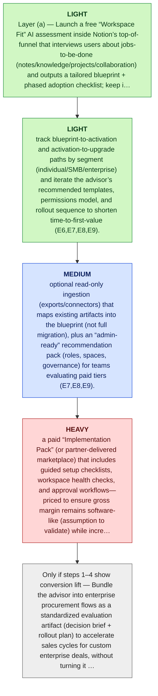

# Notion MGT470 Decoupling Memo

> [!important] Final Judgment
> Notion’s next disruptive wedge should decouple the “evaluation/choice” stage of the workspace customer value chain via a lightweight “Notion Workspace Fit” AI advisor that produces an adoption blueprint without forcing migration, consistent with Teixeira’s idea of “stealing one or a few stages” from an incumbent bundle (books/unlocking-the-customer-value-chain-chapter-1.md) (E3).

## Executive Summary

Notion already targets individuals, SMBs, and enterprises with tiered pricing up to custom enterprise contracts (E6,E7,E8,E9), so a pre-adoption decision/blueprint layer can (a) reduce evaluation friction and perceived migration risk before a user commits and (b) better qualify which workflows should move into Notion to improve conversion into paid tiers—without requiring an immediate, full-tool replacement (E3,E9).

Strongest argument: The advisor is a classic decoupling move: it isolates the weak-link activity of “search/evaluate/decide” and delivers a concrete phased plan, letting customers keep the rest of their workflow intact until confidence is high—matching Teixeira’s framing that disruptors win by carving out a narrow slice of the CVC rather than replacing the whole incumbent system (books/unlocking-the-customer-value-chain-chapter-1.md) (E3).

Biggest risk: High recoupling and low defensibility: large suite incumbents can replicate evaluation copilots and bundle them for free, and Notion could also accidentally add friction to its low-cost entry funnel if the advisor becomes a gated sales flow rather than a customer-centric planning tool (E3,E9).

## Lens Fit

Primary lens: **business_model** (confidence: medium, fit score: 0.4, mode: strategic_memo)

Notion positions itself as an all-in-one modular workspace that bundles note-taking, knowledge management, project and collaboration tools into a single platform (E3, E10). That positioning is primarily a business-model innovation: it changes how value is packaged and monetized (freemium tiers to enterprise), leverages community templates and modularity to capture broader portions of the customer workflow, and competes with many point solutions by offering a unified bundle (E3, E9). The evidence shows Notion targets multiple segments (individuals, SMBs, enterprise) with tiered pricing, indicating a deliberate monetization and go-to-market design rather than a pure single-activity decoupling play (E6, E7, E8, E9). Decoupling is a secondary lens: Notion can decouple specific weak-link activities (e.g., lightweight knowledge bases or customizable databases) from incumbents like legacy enterprise document systems, but the core strategic move is to re-bundle those activities into a broader platform and capture customer relationship and data (E3, E10). This is also partly a tech substitution because modern web/mobile, templates, and integrations replace legacy on-premise systems, and it creates new-market adoption among freelancers and teams seeking integrated workspaces (E6, E7). Given the documentation provided, the balance of evidence supports business-model innovation as primary with decoupling as an important but not dominant mechanism (E3, E10).

## Case Perspective

Case perspective: **disruptor** (confidence: medium)

Primary question: How should Notion extend its disruptive “all-in-one modular workspace” position into the next weak-link customer activities (without breaking its current adoption engine) while scaling subscription and enterprise monetization?

Notion is framed as an entrant that has “emerged as a leading all-in-one productivity platform” and is explicitly described as “disrupting the digital workspace market” via a modular, all-in-one alternative to a previously more fragmented toolchain for notes/knowledge/projects/collaboration (E3, E10). The evidence provided focuses on Notion’s value proposition, target segments, and SaaS monetization (E6-E10), but does not indicate an incumbent-defense posture or an in-flight business-model pivot (i.e., no explicit transition from one model to another). Therefore, the most consistent seat is analyzing Notion as the disruptor and asking what to do next to deepen/extend its disruption while monetizing via subscriptions/enterprise (E9).

## Company Snapshot

Target company: **Notion**.

# Digital Disruption Analysis of Notion (2026): A Teixeira-Style MGT470 Report ## Introduction Notion, accessible at [https://www.notion.so](https://www.notion.so), has emerged as a leading all-in-one productivity platform, disrupting the digital workspace market through its modular approach to note-taking, knowledge management, project management, and collaboration. This report conducts a Teixeira-style MGT470 digital disruption analysis, focusing on Notion’s impact on the customer value chain, monetization and unit economics, competition, decoupling signals, customer pain points, and recent strategic moves. The analysis draws from official company sources, pricing and documentation pages, credible news, customer reviews, and competitor comparisons to provide an objective, comprehensive, and actionable assessment. ## Customer Value Chain Analysis ### Customer Segments Notion targets a broad spectrum of users, including: - **Individuals and freelancers:** Solo users seeking personal productivity tools.

## Evidence Base

| ID | Claim | Source | Locator | Confidence | Used By |
|---|---|---|---|---|---|
| E1 | Notion was provided as the target company by the user. | S0 | CLI input | high | company_profile, case_perspective, final_judgment, critic |
| E2 | Notion website was supplied as https://www.notion.so. | S1 | CLI input --url | medium | company_profile, final_judgment, critic |
| E3 | # Digital Disruption Analysis of Notion (2026): A Teixeira-Style MGT470 Report ## Introduction Notion, accessible at [https://www.notion.so](https://www.notion.so), has emerged as a leading all-in-one productivity platform, disrupting the digital workspace market through its modular approach to note-taking, knowledge management, project management, and collaboration. | S1 | [article: https://www.notion.so](https://www.notion.so) | medium | company_profile, lens_fit, case_perspective, cvc, value_types, weak_links, decoupling, business_model, competitive_response, final_judgment, critic |
| E4 | This report conducts a Teixeira-style MGT470 digital disruption analysis, focusing on Notion’s impact on the customer value chain, monetization and unit economics, competition, decoupling signals, customer pain points, and recent strategic moves. | S2 | [article: https://www.notion.so/pricing](https://www.notion.so/pricing) | medium | company_profile, business_model, critic |
| E5 | The analysis draws from official company sources, pricing and documentation pages, credible news, customer reviews, and competitor comparisons to provide an objective, comprehensive, and actionable assessment. | S3 | [article: https://www.notion.so/product/ai](https://www.notion.so/product/ai) | medium | company_profile, weak_links, decoupling, business_model, competitive_response, critic |
| E6 | ## Customer Value Chain Analysis ### Customer Segments Notion targets a broad spectrum of users, including: - **Individuals and freelancers:** Solo users seeking personal productivity tools. | S4 | [article: https://www.reddit.com/r/Notion/comments/10q6b5k/notion_performance_with_large_databases/](https://www.reddit.com/r/Notion/comments/10q6b5k/notion_performance_with_large_databases/) | medium | company_profile, lens_fit, case_perspective, cvc, value_types, weak_links, decoupling, business_model, final_judgment, critic |
| E7 | **Small and medium-sized businesses (SMBs):** Teams requiring collaborative workspaces. | S5 | [article: https://developers.notion.com/](https://developers.notion.com/) | medium | company_profile, lens_fit, case_perspective, cvc, value_types, weak_links, decoupling, business_model, final_judgment, critic |
| E8 | **Enterprise clients:** Large organizations with complex knowledge management and workflow needs. | S6 | [article: https://vc.ru/u/1099651-vladimir-kuznetsov/708934-narushenie-notion-labs](https://vc.ru/u/1099651-vladimir-kuznetsov/708934-narushenie-notion-labs) | medium | company_profile, lens_fit, case_perspective, cvc, value_types, weak_links, decoupling, business_model, competitive_response, final_judgment, critic |
| E9 | Notion’s pricing and feature set reflect this segmentation, with offerings ranging from a free personal tier to custom-priced enterprise solutions ([Notion Pricing](https://www.notion.so/pricing)). | S7 | [article: https://www.notion.so/enterprise](https://www.notion.so/enterprise) | medium | company_profile, lens_fit, case_perspective, weak_links, decoupling, business_model, competitive_response, final_judgment, critic |
| E10 | ### Job-to-be-Done Notion’s core value proposition is to serve as an all-in-one workspace where users can: - Take notes and organize knowledge. | S8 | [article: https://www.notion.so/templates](https://www.notion.so/templates) | medium | company_profile, lens_fit, case_perspective, cvc, value_types, weak_links, decoupling, business_model, competitive_response, final_judgment, critic |

## Customer Value Chain

```mermaid
flowchart LR
    A1["<b>Step 1</b><br/>Recognize a need to centralize notes, knowledge, and project/work tracking in a more coherent system<br/><i>self</i>"]
    A2["<b>Step 2</b><br/>Search for and evaluate workspace options (all-in-one vs. multiple tools) and decide what to adopt<br/><i>a mix of software options and internal/ad-hoc practices</i>"]
    A3["<b>Step 3</b><br/>Create an account and set up the workspace (initial structure for notes/knowledge/projects; invite collaborators if needed)<br/><i>Notion or alternative workspace tools</i>"]
    A4["<b>Step 4</b><br/>Capture and maintain content in the workspace (notes, documents, tasks, project updates, and reference knowledge)<br/><i>Notion or a mix of other tools/manual documentation</i>"]
    A5["<b>Step 5</b><br/>Organize and connect information into reusable structures (knowledge base organization and project/workflow systemization)<br/><i>Notion or manual organization methods</i>"]
    A6["<b>Step 6</b><br/>Collaborate continuously (share, coordinate, and keep work/knowledge current as a team over time)<br/><i>Notion and surrounding team practices</i>"]
    A1 --> A2
    A2 --> A3
    A3 --> A4
    A4 --> A5
    A5 --> A6
    style A1 fill:#d1f7c4,stroke:#1f8a3a,color:#0b3d18
    style A2 fill:#ffd6d6,stroke:#b22222,color:#5a0d0d
    style A3 fill:#d1f7c4,stroke:#1f8a3a,color:#0b3d18
    style A4 fill:#d1f7c4,stroke:#1f8a3a,color:#0b3d18
    style A5 fill:#d1f7c4,stroke:#1f8a3a,color:#0b3d18
    style A6 fill:#d1f7c4,stroke:#1f8a3a,color:#0b3d18
```


_Legend: green = creates value · red = erodes value · blue = captures value._

| Step | Activity | Current Provider | Evidence |
|---:|---|---|---|
| 1 | Recognize a need to centralize notes, knowledge, and project/work tracking in a more coherent system | self | E3, E6, E7, E8, E10 |
| 2 | Search for and evaluate workspace options (all-in-one vs. multiple tools) and decide what to adopt | a mix of software options and internal/ad-hoc practices | E3, E10 |
| 3 | Create an account and set up the workspace (initial structure for notes/knowledge/projects; invite collaborators if needed) | Notion or alternative workspace tools | E3, E6, E7, E8, E10 |
| 4 | Capture and maintain content in the workspace (notes, documents, tasks, project updates, and reference knowledge) | Notion or a mix of other tools/manual documentation | E3, E10 |
| 5 | Organize and connect information into reusable structures (knowledge base organization and project/workflow systemization) | Notion or manual organization methods | E3, E10 |
| 6 | Collaborate continuously (share, coordinate, and keep work/knowledge current as a team over time) | Notion and surrounding team practices | E3, E7, E8, E10 |

## Value Creation, Erosion, And Capture

| Activity | Type | Money | Time | Effort | Satisfaction | Reasoning |
|---|---|---:|---:|---:|---:|---|
| A1 | create | 1 | 3 | 3 | 3 | Recognizing the need to centralize notes and projects is the first step that unlocks the all‑in‑one workspace job-to-be-done and therefore creates customer value by clarifying scope and goals (E3, E6, E7, E8, E10). |
| A2 | erode | 2 | 4 | 4 | 2 | Searching for and evaluating workspace options imposes time, cognitive effort, and potential subscription costs as customers weigh all-in-one versus multi-tool approaches, representing a pain point and value erosion in the CVC (E3, E10). |
| A3 | create | 1 | 3 | 3 | 4 | Creating an account and setting up an initial workspace converts the evaluation into an actionable, usable system and therefore creates value by enabling day‑one productivity and collaboration (E3, E6, E7, E8, E10). |
| A4 | create | 1 | 4 | 4 | 4 | Capturing and maintaining content is the core productive activity that turns the workspace into the default place for work artifacts, directly creating ongoing customer value (E3, E10). |
| A5 | create | 1 | 5 | 5 | 3 | Organizing and connecting information into reusable structures substantially increases the utility and reuse of knowledge (high value creation), though it is often time‑ and effort‑intensive for customers (E3, E10). |
| A6 | create | 2 | 4 | 4 | 4 | Continuous collaboration enables sustained team execution and preserves institutional knowledge, making it a high‑value activity for SMB and enterprise teams when the workspace supports it effectively (E3, E7, E8, E10). |

## Weak Link

Search for and evaluate workspace options (all-in-one vs. multiple tools) and decide what to adopt scored 320.0: Evaluating “all-in-one vs. multiple tools” is plausibly a high-friction step because the customer is comparing many alternatives and practices; a decoupled assistant (interactive needs diagnosis + guided evaluation) could reduce time/effort before any migration. This can be offered standalone (low integration dependency), matching Teixeira’s decoupling logic of improving a single step without forcing the rest of the workflow to move. Evidence supports that Notion competes as an all-in-one modular workspace in this category (E3) for individuals/teams/enterprise (E6,E7,E8), but direct evidence of the intensity/frequency of evaluation pain is limited, so this scoring is a hypothesis to validate (E5).

## Decoupling Strategy

A standalone “Notion Workspace Fit” AI advisor that interviews the user about their workflows, optionally ingests read-only signals (e.g., exported lists of tools/pages/projects), and outputs a decision brief plus a tailored Notion workspace blueprint and phased adoption plan—explicitly “peeling away a portion of the customer’s value chain” (books/unlocking-the-customer-value-chain-chapter-1.md) without requiring immediate migration (E3,E5).

## Business Model

The “Notion Workspace Fit” AI advisor decouples the evaluation/choice stage of the customer value chain by helping a user decide whether an all-in-one workspace fits their workflows and by producing a concrete, phased blueprint that reduces perceived migration risk and time-to-confidence (E3,E5). This aligns with Teixeira’s description of disruptors “peeling away a portion of the customer’s value chain” (books/unlocking-the-customer-value-chain-chapter-1.md, Chapter 1, Page 9; reflected in the decoupling framing here (E3,E5)).

## Competitive Response

Suite/workspace incumbents ship a similar AI “fit assessment” on their websites and admin consoles (questionnaire + workflow interview + generated recommendation brief), positioning it as a faster way to choose their stack—neutralizing Notion’s decoupled wedge at the “search/evaluate options” stage (i.e., making the weak-link decision step no longer a differentiator).

## Recoupling Risk

```mermaid
quadrantChart
    title Incumbent Capability vs Incentive to Recouple
    x-axis Low capability --> High capability
    y-axis Low incentive --> High incentive
    quadrant-1 High threat (capable + motivated)
    quadrant-2 Motivated but blocked
    quadrant-3 Slow / unlikely
    quadrant-4 Capable but uninterested
    "Recoupling Risk": [0.50, 0.85]
    "copy": [0.85, 0.85]
    "recouple": [0.85, 0.85]
    "subsidize": [0.85, 0.50]
    "acquire": [0.50, 0.50]
```

**Vulnerability**: high | capability medium, incentive high

The decoupled activity (helping customers decide what workspace stack to adopt) is inherently “front-end” and digitally deliverable, which typically makes it fast for incumbents to copy and then re-bundle into their onboarding flows. Because Notion’s proposed wedge explicitly targets the evaluation step before migration, incumbents can plausibly neutralize it by embedding similar AI assessments inside their existing adoption funnels. This directly matches Teixeira’s framing that startups ‘peel away a portion of the customer’s value chain’ and incumbents respond by trying to pull that portion back into the bundle (books/unlocking-the-customer-value-chain-chapter-1.md; talks/unlocking-the-customer-value-chain-at-decoupling-co.md). Evidence gap: the case materials provided do not specify which incumbents, their current AI/onboarding capabilities, or their willingness to price aggressively, so the rating is based on general recoupling logic rather than incumbent-specific proof (E3,E5).

Defenses: Make the advisor’s output uniquely actionable in Notion: a generated workspace blueprint that takes advantage of Notion’s “all-in-one modular workspace” flexibility across notes/knowledge/projects/collaboration (E3,E10)., Keep switching friction near-zero: exportable decision briefs + phased plans that don’t require immediate migration, preserving the decoupling benefit even if incumbents add similar wizards (E9,E3)., Own the relationship (not the surface/channel): ensure the advisor captures user workflow preferences and iterates recommendations over time inside Notion’s account context, improving personalization in ways that generic incumbent assessments can’t match without deep cross-tool visibility (E3)., Avoid heavy, human-intensive ‘consulting’ promises that are easy for incumbents to subsidize; stay product-led and tie upgrades to clear team/enterprise value moments reflected in Notion’s segmentation and tiers (E8,E9).

## Open Questions / Missing Data

- Validate the most strategically important claims against primary sources.
- Check whether recent customer pain points reflect durable behavior change.

## Sources

| Source | Title | URL / Path | Reliability | Evidence count |
|---|---|---|---|---:|
| S0 | CLI input | CLI input | medium | 1 |
| S1 | www.notion.so | [https://www.notion.so](https://www.notion.so) | medium | 2 |
| S2 | www.notion.so / pricing | [https://www.notion.so/pricing](https://www.notion.so/pricing) | medium | 1 |
| S3 | www.notion.so / ai | [https://www.notion.so/product/ai](https://www.notion.so/product/ai) | medium | 1 |
| S4 | www.reddit.com / notion_performance_with_large_databases | [https://www.reddit.com/r/Notion/comments/10q6b5k/notion_performance_with_large_databases/](https://www.reddit.com/r/Notion/comments/10q6b5k/notion_performance_with_large_databases/) | medium | 1 |
| S5 | developers.notion.com | [https://developers.notion.com/](https://developers.notion.com/) | medium | 1 |
| S6 | vc.ru / 708934-narushenie-notion-labs | [https://vc.ru/u/1099651-vladimir-kuznetsov/708934-narushenie-notion-labs](https://vc.ru/u/1099651-vladimir-kuznetsov/708934-narushenie-notion-labs) | medium | 1 |
| S7 | www.notion.so / enterprise | [https://www.notion.so/enterprise](https://www.notion.so/enterprise) | medium | 1 |
| S8 | www.notion.so / templates | [https://www.notion.so/templates](https://www.notion.so/templates) | medium | 1 |

## Critic Review (cross-pass audit)

**Overall: 2.1/5** — ⚠️ would disagree

Weakest aspect: Unit economics and evidence grounding for the chosen weak-link (evaluation/choice) are both underdeveloped; the analysis substitutes framework-consistent language for proof of pain, feasibility, or monetization impact.

| Discipline | Score | Rationale |
|---|---:|---|
| preserve_core_engine | 2/5 | The analyst gestures at protecting a “low-friction free-tier funnel” by keeping the advisor free and not requiring imports, but never actually identifies Notion’s core growth engine with evidence (e.g., PLG loop, virality, template ecosystem, network effects). The recommendation could still inadvertently shift Notion toward a sales-led/gated flow without any evidence-backed guardrails beyond intent (E9). |
| layered_evolution | 4/5 | The staged plan is largely consistent with Teixeira’s layered evolution doctrine: start with a low-risk assessment/blueprint (layer a), then add optional read-only connectors and governance packs (layer b), and explicitly warns against jumping to heavy services/logistics. The main weakness is that some “layer (b) transaction intermediation” language is vague and could quietly become services-heavy in practice without clearer boundaries (E6,E7,E8,E9). |
| unit_economics | 1/5 | There is essentially no unit-economics reasoning beyond “priced to ensure gross margin remains software-like (assumption).” No CAC/CLV discussion, no gross margin implications of advisor compute cost, no conversion-lift thresholds, and no partner/implementation economics. The idea depends on unproven ratios (conversion lift vs. incremental CAC/compute) that are not specified or tied to evidence (E9). |
| explicit_dont_do | 4/5 | A clear do-not-do list is provided and mostly aligned with the framework (avoid big-bang services, avoid generic chatbot positioning, avoid forced migration). However, several “don’t do” rationales are asserted without evidence of actual risks in Notion’s funnel or brand positioning beyond generic statements about “all-in-one modular workspace” (E3,E9,E10). |
| moat_is_relationship | 3/5 | The analyst correctly emphasizes value capture via conversion into paid tiers and warns against a standalone tool that would weaken relationship ownership. But the analysis does not demonstrate, with evidence, what relationship assets Notion currently owns (data lock-in, collaboration graph, switching costs) or how the proposed advisor would measurably deepen repeat behavior rather than being a one-time pre-adoption utility (E9). |

**Citation issues:**
- _high_: E3 is described as a “Digital Disruption Analysis of Notion (2026)” summary, not the Teixeira book chapter itself. It does not provide a verifiable quote or specific support that “evaluation/choice” is the correct stage to decouple for Notion; it mostly asserts Notion is an all-in-one platform. (cited: E3 at Final thesis / “decouple the evaluation/choice stage… consistent with Teixeira’s idea…”)
- _high_: E6–E8 are generic segment labels; E9 indicates tiered pricing. None of these establish that “evaluation friction” is high, that it is a dominant abandonment point, or that an AI blueprint would improve conversion. The causal leap is unsupported. (cited: E6, E7, E8, E9 at Why now / “Notion already targets individuals, SMBs, and enterprises with tiered pricing… so a pre-adoption decision/blueprint layer can reduce evaluation friction…”)
- _high_: E5 is a meta statement about the analysis drawing from sources; it is not evidence that customers experience intense evaluation pain, nor that evaluation is a frequent bottleneck for Notion adoption. (cited: E5 at Upstream weak link rationale / “Evaluating ‘all-in-one vs. multiple tools’ is plausibly a high-friction step…”)
- _medium_: E10 only states Notion’s JTBD as an all-in-one workspace (notes/knowledge). E9 is pricing. Neither supports the feasibility/necessity of an AI assessment, nor that import-free onboarding is a current constraint or best practice for Notion specifically. (cited: E10, E9 at Staged actions layer (a) / “Launch a free ‘Workspace Fit’ AI assessment… keep it usable without importing data…”)
- _high_: No evidence here identifies incumbents, their bundling behavior, their AI copilots, or pricing dynamics. This is plausible but uncited relative to the provided evidence set. (cited: E3, E9 at Biggest risk / “large suite incumbents can replicate evaluation copilots and bundle them for free”)
- _medium_: These citations only indicate segment targeting and pricing. They do not support that connectors/ingestion are low-risk, demanded by customers, technically feasible for Notion, or effective as a mid-layer wedge. (cited: E7, E8, E9 at Layer (b) / “optional read-only ingestion (exports/connectors)… maps existing artifacts into the blueprint”)
- _medium_: E9 shows pricing tiers, not relationship ownership, retention loops, or the strategic downside of a standalone evaluator. The logic is framework-consistent but not evidence-backed for Notion’s specific situation. (cited: E9 at Do-not-do / “Do not spin the advisor out as a separate standalone product… would weaken relationship ownership”)

**Revision suggestions:**
- Replace the asserted weak-link (“evaluation/choice”) with an evidence-backed one. If evidence is missing, explicitly propose a validation plan (e.g., measure drop-offs in activation/onboarding vs. competitive evaluation) before selecting the decoupling wedge (E9).
- Name Notion’s core growth engine with evidence (e.g., free-tier behavior, template adoption, team expansion path). Then state explicit guardrails (what must not change) and how the advisor would be inserted without increasing CAC or time-to-first-value (E9).
- Add unit-economics test conditions: what conversion-lift (trial→paid, self-serve→team, team→enterprise) must exceed incremental costs (AI compute, support, partner revshare). Even without numbers, specify directional thresholds and leading indicators to track (E9).
- Clarify the “layer (b) implementation pack” so it stays productized and does not become bespoke consulting. Define what is automated vs. partner-delivered, and how Notion avoids margin dilution and operational drag (E8,E9).
- Tighten citations: stop using meta-evidence (E5) as support for customer pain; either bring direct evidence of customer friction or mark the claim as a hypothesis and keep the recommendation at ‘study more’ with specific experiments.

**Disagreement / defense note:** Given the provided evidence, I would not select “evaluation/choice” as the next weak-link or endorse an AI evaluation advisor as the wedge. The evidence set supports only that Notion is an all-in-one workspace (E3, E10) sold via tiers up to enterprise (E9) to individuals/SMBs/enterprise (E6–E8); it does not support that evaluation is the primary erosion point. A more defensible conclusion from the same evidence is: remain in ‘study_more’ but focus discovery on activation/onboarding and enterprise admin/governance friction (implied by enterprise complexity in E8) rather than pre-adoption evaluation, and only then choose a decoupling wedge.

## Final Recommendation

**study_more**: Notion’s next disruptive wedge should decouple the “evaluation/choice” stage of the workspace customer value chain via a lightweight “Notion Workspace Fit” AI advisor that produces an adoption blueprint without forcing migration, consistent with Teixeira’s idea of “stealing one or a few stages” from an incumbent bundle (books/unlocking-the-customer-value-chain-chapter-1.md) (E3).

Evidence: E1, E2, E3, E6, E7, E8, E9, E10.

### Staged Execution Path


_Legend: yellow = preserve · green = light · blue = medium · red = heavy._

1. Layer (a) — Launch a free “Workspace Fit” AI assessment inside Notion’s top-of-funnel that interviews users about jobs-to-be-done (notes/knowledge/projects/collaboration) and outputs a tailored blueprint + phased adoption checklist; keep it usable without importing data so it doesn’t damage adoption into the free tier (E10,E9).
2. Layer (a) — Instrument outcomes: track blueprint-to-activation and activation-to-upgrade paths by segment (individual/SMB/enterprise) and iterate the advisor’s recommended templates, permissions model, and rollout sequence to shorten time-to-first-value (E6,E7,E8,E9).
3. Layer (b) — Add low-risk trust/verification features: optional read-only ingestion (exports/connectors) that maps existing artifacts into the blueprint (not full migration), plus an “admin-ready” recommendation pack (roles, spaces, governance) for teams evaluating paid tiers (E7,E8,E9).
4. Layer (b) — Introduce transaction intermediation without heavy ops: a paid “Implementation Pack” (or partner-delivered marketplace) that includes guided setup checklists, workspace health checks, and approval workflows—priced to ensure gross margin remains software-like (assumption to validate) while increasing enterprise conversion (E8,E9).
5. Only if steps 1–4 show conversion lift — Bundle the advisor into enterprise procurement flows as a standardized evaluation artifact (decision brief + rollout plan) to accelerate sales cycles for custom enterprise deals, without turning it into bespoke consulting (E8,E9).

### Do-Not-Do List

- Do not spin the advisor out as a separate standalone product that works equally well without Notion, because value capture is intended to be indirect via conversion into Notion’s paid tiers/enterprise plans and a standalone tool would weaken relationship ownership (E9).
- Do not jump to heavy-responsibility services (custom migrations, full managed implementation) early, because it risks becoming services-led with unfavorable margins and distracts from product-led conversion across segments (needs unit-economics validation) (E6,E7,E8,E9).
- Do not reposition the wedge as a generic “AI productivity chatbot,” because that blurs Notion’s all-in-one modular workspace differentiation and increases direct feature-parity competition with bundled suites, raising recoupling risk (E3,E10).
- Do not require deep integrations/imports as the default onboarding path, because forcing migration contradicts the decoupling logic (customers should be able to adopt the decoupled evaluation stage without switching the rest) and could increase drop-off before users experience value (E3).

### Next Research Steps

- Identify Notion’s actual core growth engine (e.g., free-tier virality, template-driven discovery, bottoms-up team expansion, community/creator loop) and the one thing the advisor must not degrade; current evidence confirms pricing tiers but not the adoption mechanism (E9).
- Quantify unit-economics deltas to justify building: (1) advisor-driven CAC reduction (or improved conversion at same CAC), (2) upgrade lift from free→paid and SMB→enterprise, and (3) incremental AI inference/review costs to maintain gross margins; current evidence provides no numbers (E9).
- Map the customer value chain at higher resolution (8–12 activities) for each segment (individual/SMB/enterprise) to confirm the true weak link is “evaluation/choice” rather than later stages like governance, migration, or compliance (E6,E7,E8).
- Run a recoupling pre-mortem: list which incumbents can bundle equivalent evaluation copilots and what unique data/behavior loops Notion could own to remain differentiated (relationship + repeat behavior), then define a defensible data flywheel for the advisor (E3).
