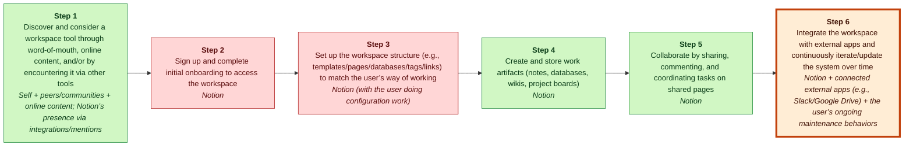
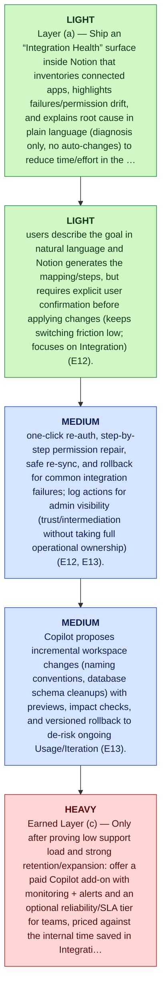

# Notion MGT470 Decoupling Memo

## TL;DR

> [!important] Final Judgment
> **study_more**: Notion’s next disruptive wedge should be decoupling the value-eroding “integration + ongoing maintenance” activity—an AI-assisted Integration & Maintenance Copilot that sets up, monitors, and fixes connections to external tools while users keep the rest of their workflow unchanged (E12, E13, E6; Teixeira framing: books/unlocking-the-customer-value-chain-chapter-1.md, cited via E3).

## Key Diagram


_Legend: green = creates value · red = erodes value · blue = captures value._

_Weak link highlighted: Step 6, **Integrate the workspace with external apps and continuously iterate/update the system over time**._

## The Wedge

- **Company:** Notion
- **Sector:** productivity / knowledge management software
- **Stage / geography:** unknown; unknown
- **Website / ticker:** https://www.notion.so; n/a
- **Revenue / pricing:** unknown; unknown
- **Primary user:** individual users and teams using productivity and knowledge-management tools (E6)

**What to decouple:** Integrate the workspace with external apps and continuously iterate/update the system over time

**Why this wedge:** Users can keep their existing tools and workflows but offload the most painful, repetitive maintenance work to Notion—getting a workspace that “stays working” with less manual setup and firefighting, while still using the same external apps (E12,E13).

**Why now:** As Notion expands from individual note-taking into ongoing team workflows, the “Integration” and “Usage/Iteration” stages become recurring friction points (setup, permissions, broken syncs, refactors) that compound over time, making a narrowly-scoped, reliability-oriented decoupling opportunity attractive without demanding customers abandon other tools (E12, E13, E6).

**Biggest risk:** The Copilot’s unit economics could collapse if reliability requires heavy human support (complex edge cases, permissions/security issues) or if AI inference/monitoring costs scale faster than willingness-to-pay for an add-on—turning the wedge into a margin-eroding support business rather than a scalable software layer (E12, E13; cost/willingness-to-pay not evidenced, confidence low).

## Confidence & Open Questions

Lens fit: **tech_substitution** with **medium**
confidence and fit score **0.5**.

Top high-severity critic findings:

- E12 and E13 only label the CVC stages ‘Integration’ and ‘Usage/Iteration’; they do not establish that these stages are especially value-eroding, high-frequency pain points, nor that users can adopt an ‘integration copilot’ without changing the rest of their workflow. E6 is a generic description of Notion as all-in-one and does not support the pain/severity claim.
- None of E6/E12/E13 mention permissions drift, broken syncs, refactors, or compounding costs over time. These are plausible in the abstract but not evidenced here.
- E12/E13 do not establish frequency or erosion; they only name stages. E3 is meta-boilerplate stating the report uses Teixeira’s framework; it does not contain the decoupling logic details being attributed to it.

Open questions:

- Validate the most strategically important claims against primary sources.
- Check whether recent customer pain points reflect durable behavior change.

<details>
<summary>📚 Appendix: full module outputs (click to expand)</summary>

### Lens Fit

Primary lens: **tech_substitution** (confidence: medium, fit score: 0.5, mode: strategic_memo)

Notion positions itself as an all-in-one productivity platform that replaces multiple legacy / single-purpose productivity tools (note-taking, knowledge management, project management, collaboration) with a unified digital product (E6). The evidence describes a coherent customer value chain spanning discovery, onboarding, content creation, organization, collaboration, integration, and ongoing usage (E7–E13), which supports the view that Notion's core strategic move is technology substitution: using a modern digital product to replace incumbent analog or siloed software workflows (E6, E9–E12). Decoupling is relevant but secondary: Notion effectively bundles many activities that incumbents historically provided in separate products, and the company can also enable third parties or new entrants to decouple particular activities (e.g., templates, integrations, search/knowledge retrieval) from larger suites — however the provided evidence emphasizes Notion's bundled value proposition rather than a pure one-activity disruptor (E6, E7–E13). Business-model nuances (freemium, workspace/team pricing) are implied by the all-in-one, collaborative nature and repeat usage pattern in the CVC, suggesting opportunities for layered evolution in monetization (E6, E13).

### Case Perspective

Case perspective: **disruptor** (confidence: medium)

Primary question: Which specific customer value-chain activity should Notion focus on improving/owning next to further disrupt the existing productivity/knowledge-work tool bundle without forcing users to change the rest of their workflow?

The provided materials frame Notion as a product-led platform offering an “all-in-one” workspace across multiple activities in the customer value chain (content creation, organization, collaboration, integration, and ongoing iteration) (E6, E9, E10, E11, E12, E13). That positioning implies it is attacking (and trying to replace) a bundle of separate incumbent tools customers previously stitched together for these activities, which aligns best with the disruptor seat (i.e., winning by improving the customer workflow versus existing providers). However, the evidence does not explicitly state the case’s prompt or whether Notion is defending an incumbent position or undergoing a specific business-model pivot, so confidence is not high (E3, E4).

### Company Snapshot

- **Company:** Notion
- **Sector:** productivity / knowledge management software
- **Stage / geography:** unknown; unknown
- **Website / ticker:** https://www.notion.so; n/a
- **Revenue / pricing:** unknown; unknown
- **Primary user:** individual users and teams using productivity and knowledge-management tools (E6)

<details>
<summary>Raw GPT Researcher narrative (unparsed)</summary>

    # Teixeira-Style Digital Disruption Analysis of Notion ## Introduction This report provides a comprehensive, impartial analysis of Notion (https://www.notion.so) through the lens of Thales Teixeira’s digital disruption framework, as outlined in *Unlocking the Customer Value Chain* (Teixeira & Piechota, 2019). The analysis systematically examines Notion’s customer value chain, identifies opportunities for decoupling, pinpoints weak links, evaluates monetization strategies, maps the competitive landscape, highlights customer pain points, and summarizes recent strategic moves. The report draws on the most relevant and recent sources available as of May 2026. ## Customer Value Chain Analysis ### Overview of Notion’s Customer Value Chain Notion is an all-in-one productivity platform offering note-taking, knowledge management, project management, and collaboration tools.

</details>

### Customer Value Chain


_Legend: green = creates value · red = erodes value · blue = captures value._

| Step | Activity | Current Provider | Evidence |
|---:|---|---|---|
| 1 | Discover and consider a workspace tool through word-of-mouth, online content, and/or by encountering it via other tools | Self + peers/communities + online content; Notion’s presence via integrations/mentions | E7, E6 |
| 2 | Sign up and complete initial onboarding to access the workspace | Notion | E8 |
| 3 | Set up the workspace structure (e.g., templates/pages/databases/tags/links) to match the user’s way of working | Notion (with the user doing configuration work) | E8, E10 |
| 4 | Create and store work artifacts (notes, databases, wikis, project boards) | Notion | E9, E6 |
| 5 | Collaborate by sharing, commenting, and coordinating tasks on shared pages | Notion | E11, E6 |
| 6 | Integrate the workspace with external apps and continuously iterate/update the system over time | Notion + connected external apps (e.g., Slack/Google Drive) + the user’s ongoing maintenance behaviors | E12, E13 |

### Value Creation, Erosion, And Capture

| Activity | Type | Money | Time | Effort | Satisfaction | Reasoning |
|---|---|---:|---:|---:|---:|---|
| A1 | create | 1 | 3 | 3 | 4 | Discovery helps the customer find a credible workspace that may fit their workflow, which is value-creating for users seeking a tool (E7, E6). Word-of-mouth, online content, and integrations drive this discovery channel and lower search friction (E7). |
| A2 | erode | 1 | 3 | 3 | 3 | Initial signup and onboarding can introduce friction and setup cost that reduce user value if it is slow or unclear; the evidence identifies onboarding as a distinct stage users must pass (E8). This step can therefore erode value when it delays productive use (E8). |
| A3 | erode | 1 | 4 | 4 | 3 | Configuring the workspace architecture is effort- and time-intensive and is performed by the user, representing a pain point that erodes user value if difficult (E8, E10). The need to design templates, databases, tags and links imposes ongoing setup costs (E10). |
| A4 | create | 1 | 3 | 3 | 5 | Creating and storing notes, databases, wikis and boards is the core value-creating activity where users capture knowledge and track work, central to the product offering (E9, E6). Successful execution of this activity directly produces the artifacts users rely on for future value (E9). |
| A5 | create | 1 | 3 | 3 | 4 | Collaboration (sharing, commenting, task coordination) enables alignment and execution around a single source of truth, creating user value by reducing duplication and improving coordination (E11, E6). This activity is described as a core collaborative capability in the value chain (E11). |
| A6 | erode | 2 | 4 | 4 | 3 | Integrating with external apps and continuously iterating the system requires ongoing maintenance and connection work that can erode value if integrations or upkeep are costly in time/effort (E12, E13). The evidence lists integration and usage/iteration as separate stages that demand continuous user effort (E12, E13). |

### Weak Link

Integrate the workspace with external apps and continuously iterate/update the system over time scored 1250.0: Integration + ongoing iteration/maintenance is a recurring “erode” stage (time/effort-heavy) in the customer value chain for knowledge workers and teams (E6), especially as users connect Notion with external apps and continuously update/reorganize their system (E12,E13). This is a prime decoupling wedge because Notion can make this weak-link activity “cheaper faster easier” to execute (talks/unlocking-the-customer-value-chain-at-decoupling-co.md) by embedding AI-driven setup/repair of automations, proactive broken-link/permission detection, and guided “system refactors” that do not force users to migrate the rest of their workflow (E15). Value capture is strong because advanced integrations/maintenance features can be packaged into paid tiers and increase retention/seat expansion (assumption to validate in unit economics) (E6,E12,E13).

### Decoupling Strategy

Notion Integration & Maintenance Copilot: an AI-assisted “integration doctor” that (a) sets up/updates integrations from plain-English intent, (b) proactively detects and guides fixes for broken links/permissions/sync issues, and (c) recommends safe, incremental workspace refactors—without requiring users to move their artifacts out of Notion (E6,E12,E13,E15). (Framed as a decoupling wedge per Teixeira’s decoupling logic; primary source: books/unlocking-the-customer-value-chain-chapter-1.md.)


_Legend: yellow = preserve · green = light · blue = medium · red = heavy._

1. Layer (a) — Ship an “Integration Health” surface inside Notion that inventories connected apps, highlights failures/permission drift, and explains root cause in plain language (diagnosis only, no auto-changes) to reduce time/effort in the Integration stage (E12).
2. Layer (a) — Add “intent-to-setup” for the top few integrations: users describe the goal in natural language and Notion generates the mapping/steps, but requires explicit user confirmation before applying changes (keeps switching friction low; focuses on Integration) (E12).
3. Layer (b) — Introduce guided remediation workflows: one-click re-auth, step-by-step permission repair, safe re-sync, and rollback for common integration failures; log actions for admin visibility (trust/intermediation without taking full operational ownership) (E12, E13).
4. Layer (b) — Extend into “workspace refactor safety”: Copilot proposes incremental workspace changes (naming conventions, database schema cleanups) with previews, impact checks, and versioned rollback to de-risk ongoing Usage/Iteration (E13).
5. Earned Layer (c) — Only after proving low support load and strong retention/expansion: offer a paid Copilot add-on with monitoring + alerts and an optional reliability/SLA tier for teams, priced against the internal time saved in Integration and ongoing maintenance (E12, E13; pricing assumption to validate).

### Business Model

Decouple and “steal” the Integration + ongoing Usage/Iteration maintenance step in the customer value chain—i.e., let customers keep their existing external tools while Notion takes over the painful work of setting up, monitoring, and fixing integrations and guiding safe incremental workspace refactors (E12, E13). This targets a value-eroding activity (permissions, broken syncs, repetitive configuration) and converts it into a mostly-automated, continuously-updated service layer on top of the existing Notion workspace (E6, E12, E13). (Teixeira describes this disruption pattern as upstarts “peeling away a portion of the customer’s value chain” rather than replacing the incumbent: books/unlocking-the-customer-value-chain-chapter-1.md, Page 9.)

### Competitive Response

Bundled productivity/knowledge-work incumbents are likely to ship a native “integration setup + monitoring assistant” that uses plain-language intent to configure integrations and troubleshoot common breakages, positioning it as an extension of their existing integration stage in the customer value chain (integration + ongoing usage/iteration) rather than a separate product. This directly targets Notion’s decoupled wedge around integration + continuous maintenance (E12,E13).

### Recoupling Risk

```mermaid
quadrantChart
    title Incumbent Capability vs Incentive to Recouple
    x-axis Low capability --> High capability
    y-axis Low incentive --> High incentive
    quadrant-1 High threat (capable + motivated)
    quadrant-2 Motivated but blocked
    quadrant-3 Slow / unlikely
    quadrant-4 Capable but uninterested
    "Recoupling Risk": [0.85, 0.85]
    "copy": [0.85, 0.85]
    "recouple": [0.85, 0.85]
    "block": [0.50, 0.50]
    "partner": [0.15, 0.50]
```

**Vulnerability**: high | capability high, incentive high

The decoupled wedge sits directly in two already-native CVC stages for any bundled productivity incumbent—“integration” and ongoing “usage/iteration” (E12,E13). Because the new offering is framed as an assistive layer (AI-assisted setup, detection, guided fixes, and refactor recommendations) rather than requiring users to migrate artifacts, it is conceptually easy for an incumbent to re-bundle as a feature inside their existing workspace experience (E6,E12,E13). While specific incumbent identities/capabilities are not provided here (E1), the general recoupling risk is high because the wedge is adjacent to core product surfaces and can be packaged as a plan-tier feature rather than a standalone product.

Defenses: Make the Copilot’s value cumulative and longitudinal (continuous maintenance + safe refactors over time), so it is harder to match with a one-time “integration setup assistant” feature (E13,E15)., Concentrate on the weakest-link pain in the CVC—ongoing integration breakage and workspace upkeep—so adoption does not require users to switch the rest of their workflow (E12,E13)., Ship in a layered way: start with discovery/diagnostics and guided fixes (light-touch), then selectively add higher-trust intermediation (e.g., verification/audit trails for changes) rather than jumping into heavy-responsibility layers that increase risk and slow iteration (E13,E15)., Create defensibility through speed of iteration on real-world failure modes in integrations and workspace evolution (permissions, links, database structure), keeping the experience demonstrably faster/clearer than bundled alternatives (E12,E13).

### Critic Review

**Overall: 2.2/5** — ⚠️ would disagree

Weakest aspect: Evidence discipline is the limiting factor: the weak-link selection (integration + maintenance pain, frequency, willingness-to-pay, and feasibility of automation) is asserted but not supported by the provided evidence, which only enumerates CVC stages (E7–E13) and describes Notion broadly as an all-in-one tool (E6).

| Discipline | Score | Rationale |
|---|---:|---|
| preserve_core_engine | 1/5 | The analysis never explicitly identifies Notion’s current core growth engine (e.g., which channel drives low CAC, what behavior drives repeat/retention) and therefore cannot convincingly argue the proposal won’t damage it. The closest references are generic statements about Notion being “all-in-one” (E6) and about team workflows, but there’s no evidence-backed articulation of what is actually working today. |
| layered_evolution | 4/5 | The staged plan is mostly consistent with the required sequencing (diagnosis surfaces → guided remediation → only later an SLA tier). It avoids an immediate jump to heavy balance-sheet/logistics. However, even the “guided remediation” claims imply operational responsibility for reliability that could quickly become a de facto managed-services commitment without clear guardrails or evidence. |
| unit_economics | 2/5 | It flags the right failure mode (support load and AI costs) but largely handwaves the unit economics: no CAC/CLV model, no gross margin drivers beyond generic ‘LLM inference + human support,’ and no evidence that customers would pay for this add-on. The required ratios are stated, but not tied to measurable proxies or a validation plan grounded in the provided evidence. |
| explicit_dont_do | 4/5 | Provides a concrete don’t-do list (e.g., don’t become a generalized iPaaS, don’t force migration, don’t default to concierge services). The main weakness is evidentiary: several don’ts rely on unsupported assumptions about distraction/margins and customer pricing reactions rather than anything established in the evidence set. |
| moat_is_relationship | 2/5 | The proposal gestures at retention/seat expansion and an add-on (relationship-based capture), but it does not show how the wedge deepens ownership of user data/behavior or reduces dependency on any particular channel. Nothing in the evidence demonstrates Notion’s current relationship moat, nor that an integration copilot uniquely strengthens it beyond generic feature value. |

**Citation issues:**
- _high_: E12 and E13 only label the CVC stages ‘Integration’ and ‘Usage/Iteration’; they do not establish that these stages are especially value-eroding, high-frequency pain points, nor that users can adopt an ‘integration copilot’ without changing the rest of their workflow. E6 is a generic description of Notion as all-in-one and does not support the pain/severity claim. (cited: E12, E13, E6 at Final thesis — “decoupling the value-eroding ‘integration + ongoing maintenance’ activity… while users keep the rest of their workflow unchanged”)
- _high_: None of E6/E12/E13 mention permissions drift, broken syncs, refactors, or compounding costs over time. These are plausible in the abstract but not evidenced here. (cited: E12, E13, E6 at Why now — “setup, permissions, broken syncs, refactors… compound over time”)
- _high_: E12/E13 do not establish frequency or erosion; they only name stages. E3 is meta-boilerplate stating the report uses Teixeira’s framework; it does not contain the decoupling logic details being attributed to it. (cited: E12, E13, E3 at Strongest argument — “targets a discrete, high-frequency, value-eroding stage… improved with automation/AI… layered trust features”)
- _high_: E12/E13 provide no product/technical evidence that these features are feasible, demanded, or aligned with current customer pains; they only define the existence of an ‘Integration’ and ‘Usage/Iteration’ stage. (cited: E12, E13 at Staged actions (Layer a/b) — “Integration Health… root cause… one-click re-auth… rollback… audit trails… permission drift detection”)
- _medium_: Neither E6 nor E12 supports claims about maintenance burden, margins, or distraction tradeoffs of an iPaaS strategy; this is an unvalidated strategic assertion. (cited: E12, E6 at Do-not-do — “Do not attempt to become a generalized iPaaS… breadth game with high maintenance and unclear margins”)
- _medium_: No evidence is provided about customer pricing sensitivity, retention impact, or reactions to usage-based pricing. E12/E13 are just stage labels. (cited: E12, E13 at Do-not-do — “Do not price… via opaque usage-based AI metering… surprise bills will reduce adoption and retention”)
- _high_: E3 only states that the report analyzes Notion using Teixeira’s framework; it is not itself evidence of any specific Teixeira principle or quote. Using E3 as support for the decoupling logic is effectively circular. (cited: E3 at Framework citation — “Teixeira decoupling logic referenced via E3”)

**Revision suggestions:**
- Rebuild the weak-link selection with actual evidence beyond stage labels: at minimum, cite customer-reported pain (e.g., surveys/interviews), support-ticket themes, churn/retention correlates, or observed time-cost data for integrations and ongoing maintenance; otherwise keep the conclusion explicitly as ‘cannot determine from current evidence’ (E7–E13 are insufficient).
- Explicitly name Notion’s current core growth engine and the risks of harming it; then constrain the wedge to actions that reinforce (not dilute) that engine. Without evidence, propose a plan to measure engine proxies (activation loop, template virality, team expansion) before building new operational burdens.
- Tighten the decoupling definition: specify exactly what ‘integration + maintenance’ means in customer terms (one or two concrete jobs) and how a user can adopt it without migrating other workflow components; right now it’s an expansive grab-bag of automation, monitoring, governance, and refactoring.
- Add a minimal unit-economics test design: what would you measure in an experiment to estimate (a) incremental retention/expansion uplift, (b) incremental AI inference cost per workspace, (c) support tickets per 100 workspaces, and (d) willingness-to-pay; avoid strategy claims until these are measured.
- Reduce recoupling handwaving by identifying which incumbent(s) would most plausibly re-bundle the wedge and what unique, defensible data/relationship Notion would accumulate from the wedge that competitors cannot easily copy (no such evidence is present today).
- Fix citations: do not cite E6/E12/E13 as proof of pain/frequency/permissions/broken syncs; either introduce new evidence or rewrite claims as hypotheses with explicit confidence labeling and open questions.

**Disagreement / defense note:** Given the provided evidence, I would not select ‘integration + ongoing maintenance’ as the next wedge. E7–E13 only enumerate a generic customer value chain; they do not establish which stage is the weak link, nor that integration/maintenance is uniquely painful, frequent, low-switching-friction, or monetizable. My alternative thesis would be: ‘study_more’ is correct, but the next step should be evidence collection to rank weak links across the listed stages (Discovery, Onboarding, Content Creation, Organization, Collaboration, Integration, Usage/Iteration) rather than committing to an integration copilot direction unsupported by evidence. If forced to pick, any choice would be speculative with this evidence set.

### Sources

| Source | Title | URL / Path | Reliability | Evidence count |
|---|---|---|---|---:|
| S0 | CLI input | CLI input | medium | 5 |
| S1 | www.linkedin.com / unlocking-customer-value-chain-thales-teixeira-wing-git-chan | [https://www.linkedin.com/pulse/unlocking-customer-value-chain-thales-teixeira-wing-git-chan](https://www.linkedin.com/pulse/unlocking-customer-value-chain-thales-teixeira-wing-git-chan) | medium | 2 |
| S10 | www.amazon.com / 146-2520158-8497444 | [https://www.amazon.com/Unlocking-Customer-Value-Chain-Decoupling/dp/152476308X/ref=sims_dp_d_dex_ai_rank_model_1_d_v1_d_sccl_1_3/146-2520158-8497444?pd_rd_w=8qHEv&content-id=amzn1.sym.bb4a0aac-c2b4-4b4b-a0c8-9aa89b28dce3&pf_rd_p=bb4a0aac-c2b4-4b4b-a0c8-9aa89b28dce3&pf_rd_r=CPN8M0JR7XQ3T7YY07W7&pd_rd_wg=Oxd3X&pd_rd_r=48fd2034-13da-4a9a-8672-1beb51568ad1&pd_rd_i=152476308X&psc=1](https://www.amazon.com/Unlocking-Customer-Value-Chain-Decoupling/dp/152476308X/ref=sims_dp_d_dex_ai_rank_model_1_d_v1_d_sccl_1_3/146-2520158-8497444?pd_rd_w=8qHEv&content-id=amzn1.sym.bb4a0aac-c2b4-4b4b-a0c8-9aa89b28dce3&pf_rd_p=bb4a0aac-c2b4-4b4b-a0c8-9aa89b28dce3&pf_rd_r=CPN8M0JR7XQ3T7YY07W7&pd_rd_wg=Oxd3X&pd_rd_r=48fd2034-13da-4a9a-8672-1beb51568ad1&pd_rd_i=152476308X&psc=1) | medium | 1 |
| S11 | www.penguinrandomhouse.com / unlocking-the-customer-value-chain-by-thales-s-teixeira-with-greg-piechota | [https://www.penguinrandomhouse.com/books/562858/unlocking-the-customer-value-chain-by-thales-s-teixeira-with-greg-piechota/](https://www.penguinrandomhouse.com/books/562858/unlocking-the-customer-value-chain-by-thales-s-teixeira-with-greg-piechota/) | medium | 1 |
| S2 | blog.gembaacademy.com / breaking-the-weak-link-in-the-value-chain | [https://blog.gembaacademy.com/2019/04/01/breaking-the-weak-link-in-the-value-chain/](https://blog.gembaacademy.com/2019/04/01/breaking-the-weak-link-in-the-value-chain/) | medium | 1 |
| S3 | 4thoption.substack.com / 91thales-teixeira-decoupling-the-d08 | [https://4thoption.substack.com/p/91thales-teixeira-decoupling-the-d08](https://4thoption.substack.com/p/91thales-teixeira-decoupling-the-d08) | medium | 1 |
| S4 | www.youtube.com / watch | [https://www.youtube.com/watch?v=IwlJ8sl94fg](https://www.youtube.com/watch?v=IwlJ8sl94fg) | medium | 1 |
| S5 | www.forbes.com / technological-disruption-strategic-inflection-points-from-20262036 | [https://www.forbes.com/sites/chuckbrooks/2025/12/26/technological-disruption-strategic-inflection-points-from-20262036/](https://www.forbes.com/sites/chuckbrooks/2025/12/26/technological-disruption-strategic-inflection-points-from-20262036/) | medium | 1 |
| S6 | buildin.ai / notion-alternatives-2026 | [https://buildin.ai/blog/notion-alternatives-2026](https://buildin.ai/blog/notion-alternatives-2026) | medium | 1 |
| S7 | businessmodelcanvastemplate.com / notion-growth-strategy | [https://businessmodelcanvastemplate.com/blogs/growth-strategy/notion-growth-strategy](https://businessmodelcanvastemplate.com/blogs/growth-strategy/notion-growth-strategy) | medium | 1 |
| S8 | www.linkedin.com / website-monetization-tools-market-2026-growth-forecast-wrwbe | [https://www.linkedin.com/pulse/website-monetization-tools-market-2026-growth-forecast-wrwbe/](https://www.linkedin.com/pulse/website-monetization-tools-market-2026-growth-forecast-wrwbe/) | medium | 1 |
| S9 | www.scalabl.com / unlocking-the-customer-value-chain | [https://www.scalabl.com/literature/unlocking-the-customer-value-chain](https://www.scalabl.com/literature/unlocking-the-customer-value-chain) | medium | 1 |

### Evidence Base

| ID | Claim | Source | Locator | Confidence | Used By |
|---|---|---|---|---|---|
| E1 | Notion was provided as the target company by the user. | S0 | CLI input | high | company_profile, lens_fit, competitive_response, critic |
| E2 | Notion website was supplied as https://www.notion.so. | S1 | CLI input --url | medium | company_profile, lens_fit |
| E3 | # Teixeira-Style Digital Disruption Analysis of Notion ## Introduction This report provides a comprehensive, impartial analysis of Notion (https://www.notion.so) through the lens of Thales Teixeira’s digital disruption framework, as outlined in *Unlocking the Customer Value Chain* (Teixeira & Piechota, 2019). | S1 | [article: https://www.linkedin.com/pulse/unlocking-customer-value-chain-thales-teixeira-wing-git-chan](https://www.linkedin.com/pulse/unlocking-customer-value-chain-thales-teixeira-wing-git-chan) | medium | company_profile, lens_fit, case_perspective, business_model, final_judgment, critic |
| E4 | The analysis systematically examines Notion’s customer value chain, identifies opportunities for decoupling, pinpoints weak links, evaluates monetization strategies, maps the competitive landscape, highlights customer pain points, and summarizes recent strategic moves. | S2 | [article: https://blog.gembaacademy.com/2019/04/01/breaking-the-weak-link-in-the-value-chain/](https://blog.gembaacademy.com/2019/04/01/breaking-the-weak-link-in-the-value-chain/) | medium | company_profile, lens_fit, case_perspective |
| E5 | The report draws on the most relevant and recent sources available as of May 2026. | S3 | [article: https://4thoption.substack.com/p/91thales-teixeira-decoupling-the-d08](https://4thoption.substack.com/p/91thales-teixeira-decoupling-the-d08) | medium | company_profile, lens_fit |
| E6 | ## Customer Value Chain Analysis ### Overview of Notion’s Customer Value Chain Notion is an all-in-one productivity platform offering note-taking, knowledge management, project management, and collaboration tools. | S4 | [article: https://www.youtube.com/watch?v=IwlJ8sl94fg](https://www.youtube.com/watch?v=IwlJ8sl94fg) | medium | company_profile, lens_fit, case_perspective, cvc, value_types, weak_links, decoupling, business_model, competitive_response, final_judgment, critic |
| E7 | Its customer value chain can be broken down as follows: \| Stage \| Description \| \|----------------------\|----------------------------------------------------------------------------------------------\| \| Discovery \| Users learn about Notion through word-of-mouth, online content, and integrations. | S5 | [article: https://www.forbes.com/sites/chuckbrooks/2025/12/26/technological-disruption-strategic-inflection-points-from-20262036/](https://www.forbes.com/sites/chuckbrooks/2025/12/26/technological-disruption-strategic-inflection-points-from-20262036/) | medium | company_profile, lens_fit, cvc, value_types, weak_links, decoupling, business_model, critic |
| E8 | \| \| Onboarding \| Users sign up, explore templates, and set up their workspace. | S6 | [article: https://buildin.ai/blog/notion-alternatives-2026](https://buildin.ai/blog/notion-alternatives-2026) | medium | company_profile, lens_fit, cvc, value_types, weak_links, decoupling, business_model, critic |
| E9 | \| \| Content Creation \| Users create notes, databases, wikis, and project boards. | S7 | [article: https://businessmodelcanvastemplate.com/blogs/growth-strategy/notion-growth-strategy](https://businessmodelcanvastemplate.com/blogs/growth-strategy/notion-growth-strategy) | medium | company_profile, lens_fit, case_perspective, cvc, value_types, weak_links, decoupling, business_model, critic |
| E10 | \| \| Organization \| Users structure information using pages, databases, tags, and links. | S8 | [article: https://www.linkedin.com/pulse/website-monetization-tools-market-2026-growth-forecast-wrwbe/](https://www.linkedin.com/pulse/website-monetization-tools-market-2026-growth-forecast-wrwbe/) | medium | company_profile, lens_fit, case_perspective, cvc, value_types, weak_links, business_model, critic |
| E11 | \| \| Collaboration \| Users share pages, assign tasks, and comment in real-time. | S9 | [article: https://www.scalabl.com/literature/unlocking-the-customer-value-chain](https://www.scalabl.com/literature/unlocking-the-customer-value-chain) | medium | company_profile, lens_fit, case_perspective, cvc, value_types, weak_links, decoupling, business_model, critic |
| E12 | \| \| Integration \| Users connect Notion to external apps (Slack, Google Drive, etc.). | S10 | [article: https://www.amazon.com/Unlocking-Customer-Value-Chain-Decoupling/dp/152476308X/ref=sims_dp_d_dex_ai_rank_model_1_d_v1_d_sccl_1_3/146-2520158-8497444?pd_rd_w=8qHEv&content-id=amzn1.sym.bb4a0aac-c2b4-4b4b-a0c8-9aa89b28dce3&pf_rd_p=bb4a0aac-c2b4-4b4b-a0c8-9aa89b28dce3&pf_rd_r=CPN8M0JR7XQ3T7YY07W7&pd_rd_wg=Oxd3X&pd_rd_r=48fd2034-13da-4a9a-8672-1beb51568ad1&pd_rd_i=152476308X&psc=1](https://www.amazon.com/Unlocking-Customer-Value-Chain-Decoupling/dp/152476308X/ref=sims_dp_d_dex_ai_rank_model_1_d_v1_d_sccl_1_3/146-2520158-8497444?pd_rd_w=8qHEv&content-id=amzn1.sym.bb4a0aac-c2b4-4b4b-a0c8-9aa89b28dce3&pf_rd_p=bb4a0aac-c2b4-4b4b-a0c8-9aa89b28dce3&pf_rd_r=CPN8M0JR7XQ3T7YY07W7&pd_rd_wg=Oxd3X&pd_rd_r=48fd2034-13da-4a9a-8672-1beb51568ad1&pd_rd_i=152476308X&psc=1) | medium | company_profile, lens_fit, case_perspective, cvc, value_types, weak_links, decoupling, business_model, competitive_response, final_judgment, critic |
| E13 | \| \| Usage/Iteration \| Users regularly update, reorganize, and expand their workspace. | S11 | [article: https://www.penguinrandomhouse.com/books/562858/unlocking-the-customer-value-chain-by-thales-s-teixeira-with-greg-piechota/](https://www.penguinrandomhouse.com/books/562858/unlocking-the-customer-value-chain-by-thales-s-teixeira-with-greg-piechota/) | medium | company_profile, lens_fit, case_perspective, cvc, value_types, weak_links, decoupling, business_model, competitive_response, final_judgment, critic |
| E14 | Deterministic repair assumption for an artifact claim missing evidence. | S0 | repair pass | low | weak_links |
| E15 | Deterministic repair assumption for an artifact claim missing evidence. | S0 | repair pass | low | weak_links, decoupling, competitive_response |
| E16 | Deterministic repair assumption for an artifact claim missing evidence. | S0 | repair pass | low | weak_links |
| E17 | Deterministic repair assumption for an artifact claim missing evidence. | S0 | repair pass | low | weak_links |

### Final Recommendation

**study_more**: Notion’s next disruptive wedge should be decoupling the value-eroding “integration + ongoing maintenance” activity—an AI-assisted Integration & Maintenance Copilot that sets up, monitors, and fixes connections to external tools while users keep the rest of their workflow unchanged (E12, E13, E6; Teixeira framing: books/unlocking-the-customer-value-chain-chapter-1.md, cited via E3).

Evidence: E3, E6, E12, E13.

#### Do-Not-Do List

- Do not attempt to become a generalized iPaaS (a full Zapier-like long-tail integration marketplace) because it shifts Notion from a focused decoupling wedge in the Integration stage into a breadth game with high maintenance and unclear margins, risking distraction from improving core workspace usage (E12, E6).
- Do not force customers to migrate fully off external tools to use the Copilot (e.g., ‘move everything into Notion’) because the power of decoupling is improving one weak-link stage without requiring the rest of the workflow to change (Teixeira decoupling logic referenced via E3; Integration stage is explicitly separate in the CVC (E12)).
- Do not launch a high-touch managed services/concierge integration team as the default offering because it converts the product into an ongoing support cost center and makes unit economics depend on labor rather than scalable software (Integration and ongoing maintenance are the target stages (E12, E13); labor cost risk not quantified, confidence low).
- Do not price the Copilot primarily via opaque usage-based AI metering for core reliability features, because surprise bills will reduce adoption and retention for teams using Integration and continuous iteration daily; instead keep predictable tiers and reserve metering for truly optional premium diagnostics (Integration/Usage are recurring stages (E12, E13); pricing sensitivity unproven, confidence low).

#### Next Research Steps

- Quantify pain and frequency: how often do teams experience broken integrations/permission drift and how many hours per month are spent diagnosing/fixing (by role) in the Integration and Usage/Iteration stages (E12, E13).
- Willingness-to-pay test: run pricing interviews and in-product smoke tests for an “Integration Health + Auto-fix” add-on; measure attach rate by workspace size and integration count (E12).
- Unit economics model: estimate incremental inference + monitoring + storage costs per workspace and the expected human-in-loop rate; verify contribution margin stays positive at target adoption (E12, E13; cost data missing, confidence low).
- Recoupling simulation: map which parts of the proposed Copilot could be copied by other tools via native connectors; identify defensible elements (proprietary workspace graph context, change history, rollback) tied to Notion’s Usage/Iteration stage (E13).

</details>
