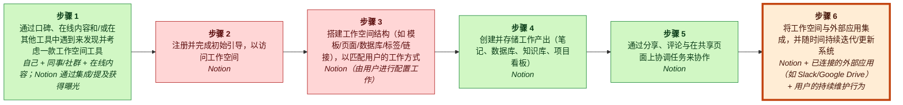
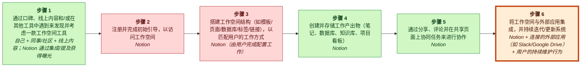
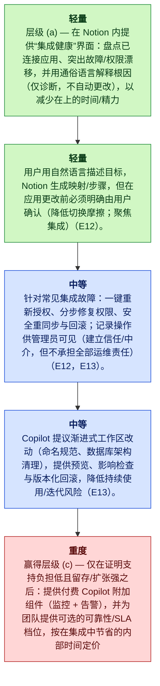

# Notion MGT470 解构备忘录

## TL;DR

> [!important] 最终判断
> **study_more**: Notion 的下一个颠覆性楔子应该是解构会侵蚀价值的“集成 + 持续维护”活动——一个 AI 辅助的集成与维护 Copilot，用于设置、监控并修复与外部工具的连接，同时让用户保持其余工作流不变（E12, E13, E6；Teixeira 框架：books/unlocking-the-customer-value-chain-chapter-1.md，经由 E3 引用）。

## 关键图示


_图例：绿色 = 创造价值 · 红色 = 侵蚀价值 · 蓝色 = 捕获价值。_

_已高亮薄弱环节：第 6 步，**将工作区与外部应用集成，并随着时间推移持续迭代/更新系统**。_

## 楔子

- **公司：** Notion
- **行业：** 生产力 / 知识管理软件
- **阶段 / 地理：** unknown; unknown
- **网站 / 代码：** https://www.notion.so; n/a
- **营收 / 定价：** unknown; unknown
- **主要用户：** 使用生产力与知识管理工具的个人用户与团队（E6）

**要解构的内容：** 将工作区与外部应用集成，并随着时间推移持续迭代/更新系统

**为什么选这个楔子：** 用户可以保留其现有工具与工作流，但将最痛苦、最重复的维护工作外包给 Notion——在减少手动设置与救火的情况下，获得一个“持续可用”的工作区，同时仍然使用相同的外部应用（E12,E13）。

**为什么是现在：** 随着 Notion 从个人笔记扩展到持续性的团队工作流，“集成”和“使用/迭代”阶段会变成反复出现的摩擦点（设置、权限、同步中断、重构），并且会随时间累积，使得一个范围较窄、以可靠性为导向的解构机会更具吸引力，同时不要求客户放弃其他工具（E12, E13, E6）。

**最大风险：** 如果可靠性需要大量人工支持（复杂边界案例、权限/安全问题），或者 AI 推理/监控成本的规模化速度快于客户对附加组件的支付意愿，Copilot 的单位经济可能会崩溃——使该楔子变成侵蚀毛利的支持型业务，而不是可规模化的软件层（E12, E13；成本/支付意愿无证据，置信度低）。

## 置信度与开放问题

Lens 适配：**tech_substitution**，置信度 **medium**
且适配评分 **0.5**。

最高严重度的批判性发现：

- E12 和 E13 仅标注了 CVC 阶段 ‘Integration’ 和 ‘Usage/Iteration’；它们并未证明这些阶段是特别侵蚀价值的、高频痛点，也未证明用户可以在不改变其余工作流的情况下采用一个‘integration copilot’。E6 是对 Notion 作为一体化工具的泛化描述，并不支持痛点/严重性主张。
- E6/E12/E13 均未提及权限漂移、同步中断、重构，或随时间累积的成本。这些在抽象层面上是合理的，但在此处没有证据支持。
- E12/E13 并未证明频率或侵蚀；它们只是命名了阶段。E3 是元层面的样板内容，说明报告使用 Teixeira 的框架；它并不包含此处所归因的解构逻辑细节。
  
开放问题：

- 针对一手资料验证最具战略重要性的主张。
- 检查近期客户痛点是否反映了可持续的行为变化。

<details>
<summary>📚 附录：完整模块输出（点击展开）</summary>

### Lens 适配

主要 lens：**tech_substitution**（confidence: medium, fit score: 0.5, mode: strategic_memo）

Notion 将自身定位为一体化生产力平台，用统一的数字化产品替代多个传统/单一用途的生产力工具（记笔记、知识管理、项目管理、协作）（E6）。证据描述了一条连贯的客户价值链，涵盖发现、入门、内容创建、组织、协作、集成与持续使用（E7–E13），这支持 Notion 的核心战略动作是技术替代：用现代数字化产品替代既有的类比式或割裂的软件工作流（E6, E9–E12）。解构相关但次要：Notion 实际上将许多活动打包在一起，而这些活动在历史上由不同的产品分别提供；公司也可以让第三方或新进入者从更大的套件中解构某些活动（例如模板、集成、搜索/知识检索）——然而提供的证据强调的是 Notion 的打包价值主张，而不是纯粹的单活动颠覆者（E6, E7–E13）。商业模式的细微差别（免费增值、工作区/团队定价）由 CVC 中的一体化、协作特性与重复使用模式所暗示，表明在变现方面存在分层演进的机会（E6, E13）。

### 案例视角

案例视角：**disruptor**（confidence: medium）

主要问题：Notion 接下来应该聚焦改进/拥有客户价值链中的哪一项具体活动，从而在不迫使用户改变其余工作流的前提下，进一步颠覆现有的生产力/知识工作工具捆绑？

提供的材料将 Notion 描述为产品驱动的平台，提供覆盖客户价值链多个活动的“一体化”工作区（内容创建、组织、协作、集成与持续迭代）（E6, E9, E10, E11, E12, E13）。这一定位意味着它正在攻击（并试图替代）客户过去为完成这些活动而拼接的一揽子分散的既有工具，这最符合 disruptor 位置（即通过改进客户工作流相对既有提供者取胜）。然而，证据并未明确陈述案例提示语，或 Notion 是否在防守既有地位、或正在进行特定的商业模式转型，因此置信度不高（E3, E4）。

### 公司概览

- **公司：** Notion
- **行业：** 生产力 / 知识管理软件
- **阶段 / 地理：** unknown; unknown
- **网站 / 代码：** https://www.notion.so; n/a
- **营收 / 定价：** unknown; unknown
- **主要用户：** 使用生产力与知识管理工具的个人用户与团队（E6）

<details>
<summary>Raw GPT Researcher narrative (unparsed)</summary>

    # Teixeira-Style Digital Disruption Analysis of Notion ## Introduction This report provides a comprehensive, impartial analysis of Notion (https://www.notion.so) through the lens of Thales Teixeira’s digital disruption framework, as outlined in *Unlocking the Customer Value Chain* (Teixeira & Piechota, 2019). The analysis systematically examines Notion’s customer value chain, identifies opportunities for decoupling, pinpoints weak links, evaluates monetization strategies, maps the competitive landscape, highlights customer pain points, and summarizes recent strategic moves. The report draws on the most relevant and recent sources available as of May 2026. ## Customer Value Chain Analysis ### Overview of Notion’s Customer Value Chain Notion is an all-in-one productivity platform offering note-taking, knowledge management, project management, and collaboration tools.

</details>

### 客户价值链


_图例：绿色 = 创造价值 · 红色 = 侵蚀价值 · 蓝色 = 捕获价值。_

| Step | Activity | Current Provider | Evidence |
|---:|---|---|---|
| 1 | 通过口碑、在线内容，和/或经由其他工具的接触来发现并考虑一个工作区工具 | 自己 + 同伴/社区 + 在线内容；Notion 通过集成/提及获得曝光 | E7, E6 |
| 2 | 注册并完成初始入门以访问工作区 | Notion | E8 |
| 3 | 设置工作区结构（例如模板/页面/数据库/标签/链接），以匹配用户的工作方式 | Notion（由用户完成配置工作） | E8, E10 |
| 4 | 创建并存储工作产物（笔记、数据库、wiki、项目看板） | Notion | E9, E6 |
| 5 | 通过共享、评论以及在共享页面上协调任务来协作 | Notion | E11, E6 |
| 6 | 将工作区与外部应用集成，并随着时间推移持续迭代/更新系统 | Notion + 已连接的外部应用（例如 Slack/Google Drive）+ 用户的持续维护行为 | E12, E13 |

### 价值创造、侵蚀与捕获

| Activity | Type | Money | Time | Effort | Satisfaction | Reasoning |
|---|---|---:|---:|---:|---:|---|
| A1 | create | 1 | 3 | 3 | 4 | 发现阶段帮助客户找到一个可信的、可能适配其工作流的工作区工具，这对寻求工具的用户而言是创造价值的（E7, E6）。口碑、在线内容与集成推动该发现渠道并降低搜索摩擦（E7）。 |
| A2 | erode | 1 | 3 | 3 | 3 | 初始注册与入门可能引入摩擦与设置成本；如果过程缓慢或不清晰，会降低用户价值。证据将入门识别为用户必须通过的一个独立阶段（E8）。因此，当该步骤延迟高效使用时，会侵蚀价值（E8）。 |
| A3 | erode | 1 | 4 | 4 | 3 | 配置工作区架构在精力与时间上都很密集，并由用户执行；如果困难，它就构成会侵蚀用户价值的痛点（E8, E10）。设计模板、数据库、标签与链接的需求带来持续的设置成本（E10）。 |
| A4 | create | 1 | 3 | 3 | 5 | 创建并存储笔记、数据库、wiki 与看板是核心的价值创造活动，用户在此捕获知识并跟踪工作，是产品供给的中心（E9, E6）。成功执行该活动会直接产出用户依赖以获得未来价值的产物（E9）。 |
| A5 | create | 1 | 3 | 3 | 4 | 协作（共享、评论、任务协调）使围绕单一事实来源进行对齐与执行成为可能，通过减少重复并改进协调来创造用户价值（E11, E6）。该活动被描述为价值链中的核心协作能力（E11）。 |
| A6 | erode | 2 | 4 | 4 | 3 | 与外部应用集成并持续迭代系统需要持续的维护与连接工作；如果集成或保养在时间/精力上代价高昂，就会侵蚀价值（E12, E13）。证据将集成以及使用/迭代列为需要持续用户投入的独立阶段（E12, E13）。 |

### 薄弱环节

将工作区与外部应用集成，并随着时间推移持续迭代/更新系统 得分为 1250.0：集成 + 持续迭代/维护是客户价值链中反复出现的“侵蚀”阶段（时间/精力负担重），面向知识工作者与团队（E6），尤其当用户把 Notion 与外部应用连接并持续更新/重组其系统时（E12,E13）。这是一个关键的解构楔子，因为 Notion 可以让这一薄弱环节活动“更便宜、更快、更容易”地执行（talks/unlocking-the-customer-value-chain-at-decoupling-co.md），通过嵌入 AI 驱动的设置/修复自动化、主动检测断链/权限问题，以及引导式“系统重构”，同时不迫使用户迁移其余工作流（E15）。价值捕获很强，因为高级集成/维护功能可以打包进付费档位并提升留存/席位扩张（需在单位经济中验证的假设）（E6,E12,E13）。

### 解构策略

Notion 集成与维护 Copilot：一个 AI 辅助的“集成医生”，用于 (a) 根据纯英文意图设置/更新集成，(b) 主动检测并引导修复断链/权限/同步问题，以及 (c) 推荐安全、渐进式的工作区重构——且不要求用户把产物移出 Notion（E6,E12,E13,E15）。（按 Teixeira 的解构逻辑框定为解构楔子；主要来源：books/unlocking-the-customer-value-chain-chapter-1.md。）


_图例：黄色 = 保留 · 绿色 = 轻 · 蓝色 = 中 · 红色 = 重。_

1. Layer (a) — 在 Notion 内部发布一个“集成健康度”界面，盘点已连接的应用，突出失败/权限漂移，并用通俗语言解释根因（仅诊断，不自动更改），以降低集成阶段的时间/精力（E12）。
2. Layer (a) — 为少数头部集成加入“意图到设置”：用户用自然语言描述目标，Notion 生成映射/步骤，但在应用更改前需要用户明确确认（保持切换摩擦低；聚焦集成）（E12）。
3. Layer (b) — 引入引导式修复流程：一键重新授权、逐步权限修复、安全重新同步，以及对常见集成失败的回滚；记录操作以便管理员可见（在不承担完全运营所有权的情况下建立信任/中介）（E12, E13）。
4. Layer (b) — 延伸到“工作区重构安全”：Copilot 提出渐进式工作区变更（命名规范、数据库 schema 清理），提供预览、影响检查与版本化回滚，以降低持续使用/迭代的风险（E13）。
5. Earned Layer (c) — 仅在证明支持负载低且留存/扩张强之后：提供付费 Copilot 附加组件，包含监控 + 告警，并为团队提供可选的可靠性/SLA 档位，定价对标集成与持续维护中节省的内部时间（E12, E13；定价假设需验证）。

### 商业模式

在客户价值链中解构并“夺取”集成 + 持续使用/迭代维护步骤——即让客户保留其现有外部工具，同时由 Notion 接管设置、监控与修复集成的痛苦工作，并引导安全的渐进式工作区重构（E12, E13）。这瞄准一个侵蚀价值的活动（权限、同步中断、重复配置），并将其转化为一个主要自动化、持续更新的服务层，覆盖在现有 Notion 工作区之上（E6, E12, E13）。（Teixeira 将这种颠覆模式描述为新进入者“剥离客户价值链的一部分”，而不是替代既有者：books/unlocking-the-customer-value-chain-chapter-1.md, Page 9。）

### 竞争应对

捆绑式生产力/知识工作领域的既有者很可能推出原生的“集成设置 + 监控助手”，使用通俗语言意图来配置集成并排查常见断裂问题，并将其定位为其客户价值链中既有集成阶段（集成 + 持续使用/迭代）的延伸，而不是独立产品。这将直接针对 Notion 围绕集成 + 持续维护的解构楔子（E12,E13）。

### 再耦合风险

```mermaid
quadrantChart
    title Incumbent Capability vs Incentive to Recouple
    x-axis Low capability --> High capability
    y-axis Low incentive --> High incentive
    quadrant-1 High threat (capable + motivated)
    quadrant-2 Motivated but blocked
    quadrant-3 Slow / unlikely
    quadrant-4 Capable but uninterested
    "Recoupling Risk": [0.85, 0.85]
    "copy": [0.85, 0.85]
    "recouple": [0.85, 0.85]
    "block": [0.50, 0.50]
    "partner": [0.15, 0.50]
```

**脆弱性**: high | capability high, incentive high

该解构楔子直接落在任何捆绑式生产力既有者的两个原生 CVC 阶段——“integration”和持续的“usage/iteration”（E12,E13）。由于新供给被框定为一个辅助层（AI 辅助设置、检测、引导修复与重构建议），而不是要求用户迁移产物，因此既有者在概念上很容易将其再打包为其既有工作区体验中的一个功能（E6,E12,E13）。尽管此处未提供具体既有者身份/能力（E1），但总体再耦合风险很高，因为该楔子紧邻核心产品界面，并可作为套餐档位功能打包，而非独立产品。

防御：让 Copilot 的价值具备累积性与纵向性（持续维护 + 随时间的安全重构），使其更难被一次性的“集成设置助手”功能匹配（E13,E15）。, 聚焦 CVC 中最薄弱环节的痛点——持续的集成断裂与工作区保养——使采用不要求用户切换其余工作流（E12,E13）。, 以分层方式交付：从发现/诊断与引导修复（轻触）开始，然后有选择地增加更高信任的中介能力（例如变更的验证/审计轨迹），而不是直接跳到高责任层，这会增加风险并减慢迭代（E13,E15）。, 通过对真实世界集成与工作区演进中的失败模式进行快速迭代建立防御性（权限、链接、数据库结构），使体验在速度/清晰度上可证明地优于捆绑替代方案（E12,E13）。

### 批判性复审

**总体：2.2/5** — ⚠️ 会不同意

最薄弱之处：证据纪律是限制因素：薄弱环节的选择（集成 + 维护痛点、频率、支付意愿与自动化可行性）是断言性的，但未被所提供证据支持；证据仅列举了 CVC 阶段（E7–E13）并将 Notion 宽泛地描述为一体化工具（E6）。

| Discipline | Score | Rationale |
|---|---:|---|
| preserve_core_engine | 1/5 | 分析从未明确识别 Notion 当前的核心增长引擎（例如哪个渠道驱动低 CAC、哪种行为驱动复购/留存），因此无法有说服力地论证该提案不会损害它。最接近的引用是关于 Notion “all-in-one”的泛化陈述（E6）以及关于团队工作流的说法，但没有基于证据的表述说明今天究竟什么在起作用。 |
| layered_evolution | 4/5 | 分阶段计划整体上符合所需的排序（诊断界面 → 引导式修复 → 之后才是 SLA 档位）。它避免立即跳入沉重的资产负债表/物流投入。然而，即便是“引导式修复”的主张也暗含对可靠性的运营责任，若无明确护栏或证据，可能迅速演变为事实上的托管服务承诺。 |
| unit_economics | 2/5 | 它指出了正确的失败模式（支持负载与 AI 成本），但在很大程度上对单位经济轻描淡写：没有 CAC/CLV 模型，除泛化的“LLM 推理 + 人工支持”外没有毛利驱动因素，也没有证据表明客户会为该附加组件付费。所需比率被陈述了，但未与可衡量的代理指标或基于所提供证据的验证计划相连接。 |
| explicit_dont_do | 4/5 | 提供了具体的不要做清单（例如不要变成通用 iPaaS，不要强制迁移，不要默认礼宾式服务）。主要弱点是证据性：若干不要做依赖于关于分心/利润与客户定价反应的未被支持的假设，而不是证据集中已经确立的内容。 |
| moat_is_relationship | 2/5 | 提案提到了留存/席位扩张与附加组件（基于关系的捕获），但未展示该楔子如何加深对用户数据/行为的拥有权，或如何降低对任何特定渠道的依赖。没有证据表明 Notion 当前的关系护城河，也没有证据表明集成 copilot 相较于一般功能价值能以独特方式强化它。 |

**引用问题：**
- _high_: E12 和 E13 仅标注 CVC 阶段 ‘Integration’ 与 ‘Usage/Iteration’；它们并未证明这些阶段是特别侵蚀价值的、高频痛点，也未证明用户能在不改变其余工作流的情况下采用一个‘integration copilot’。E6 是对 Notion 作为一体化工具的泛化描述，不支持痛点/严重性主张。（引用位置：最终论点 — “decoupling the value-eroding ‘integration + ongoing maintenance’ activity while users keep the rest of their workflow unchanged”，所引：E12, E13, E6）
- _high_: E6/E12/E13 均未提及权限漂移、同步中断、重构，或随时间累积的成本。这些在抽象层面上合理，但此处无证据。（引用位置：Why now — “setup, permissions, broken syncs, refactors compound over time”，所引：E12, E13, E6）
- _high_: E12/E13 并未证明频率或侵蚀；它们只是命名了阶段。E3 是元层面的样板内容，说明报告使用 Teixeira 的框架；它并不包含此处所归因的解构逻辑细节。（引用位置：Strongest argument — “targets a discrete, high-frequency, value-eroding stage improved with automation/AI layered trust features”，所引：E12, E13, E3）
- _high_: E12/E13 未提供任何产品/技术证据证明这些功能可行、被需求或与当前客户痛点一致；它们只是定义了存在一个‘Integration’与‘Usage/Iteration’阶段。（引用位置：Staged actions (Layer a/b) — “Integration Health root cause one-click re-auth rollback audit trails permission drift detection”，所引：E12, E13）
- _medium_: E6 与 E12 均不支持关于维护负担、毛利、或 iPaaS 策略的分心权衡的主张；这是未经验证的战略断言。（引用位置：Do-not-do — “Do not attempt to become a generalized iPaaS breadth game with high maintenance and unclear margins”，所引：E12, E6）
- _medium_: 没有提供关于客户定价敏感性、留存影响或对按使用量定价反应的证据。E12/E13 只是阶段标签。（引用位置：Do-not-do — “Do not price via opaque usage-based AI metering surprise bills will reduce adoption and retention”，所引：E12, E13）
- _high_: E3 仅陈述报告使用 Teixeira 的框架分析 Notion；它本身并不是任何具体 Teixeira 原则或引文的证据。用 E3 来支持解构逻辑实质上是循环论证。（引用位置：Framework citation — “Teixeira decoupling logic referenced via E3”，所引：E3）

**修订建议：**
- 用超出阶段标签的实际证据重建薄弱环节选择：至少引用客户报告的痛点（例如调查/访谈）、支持工单主题、流失/留存相关因素，或关于集成与持续维护的时间成本数据；否则将结论明确写为“cannot determine from current evidence”（E7–E13 不足）。
- 明确点名 Notion 当前的核心增长引擎以及损害它的风险；然后把楔子约束为强化（而非稀释）该引擎的行动。在缺乏证据的情况下，提出在构建新的运营负担之前，测量引擎代理指标（激活循环、模板病毒性、团队扩张）的计划。
- 收紧解构定义：精确说明‘integration + maintenance’在客户语境中意味着什么（一个或两个具体 jobs），以及用户如何在不迁移其他工作流组件的情况下采用它；当前它是一个将自动化、监控、治理与重构混杂在一起的宽泛大杂烩。
- 增加一个最小化的单位经济测试设计：在实验中你会测量什么来估计 (a) 增量留存/扩张提升，(b) 每个工作区的增量 AI 推理成本，(c) 每 100 个工作区的支持工单数，以及 (d) 支付意愿；在这些被测量前避免战略断言。
- 通过识别哪个（些）既有者最可能再打包该楔子，并说明 Notion 会从该楔子累积哪些竞争者无法轻易复制的独特数据/关系，来减少关于再耦合的空泛表述（今天没有此类证据）。
- 修正引用：不要将 E6/E12/E13 作为痛点/频率/权限/同步中断的证明；要么引入新证据，要么将主张改写为带有明确置信度标注与开放问题的假设。

**分歧 / 辩护说明：** 鉴于所提供的证据，我不会选择‘integration + ongoing maintenance’作为下一个楔子。E7–E13 仅列举了一条泛化的客户价值链；它们并未证明哪个阶段是薄弱环节，也未证明集成/维护是独特地痛苦、高频、低切换摩擦或可变现的。我的替代论点将是：‘study_more’是正确的，但下一步应该是进行证据收集，以在所列阶段（Discovery, Onboarding, Content Creation, Organization, Collaboration, Integration, Usage/Iteration）之间对薄弱环节进行排序，而不是在缺乏证据支持的情况下承诺走集成 copilot 方向。如果被迫选择，任何选择在该证据集下都将是推测性的。

### 来源

| Source | Title | URL / Path | Reliability | Evidence count |
|---|---|---|---|---:|
| S0 | CLI input | CLI input | medium | 5 |
| S1 | www.linkedin.com / unlocking-customer-value-chain-thales-teixeira-wing-git-chan | [https://www.linkedin.com/pulse/unlocking-customer-value-chain-thales-teixeira-wing-git-chan](https://www.linkedin.com/pulse/unlocking-customer-value-chain-thales-teixeira-wing-git-chan) | medium | 2 |
| S10 | www.amazon.com / 146-2520158-8497444 | [https://www.amazon.com/Unlocking-Customer-Value-Chain-Decoupling/dp/152476308X/ref=sims_dp_d_dex_ai_rank_model_1_d_v1_d_sccl_1_3/146-2520158-8497444?pd_rd_w=8qHEv&content-id=amzn1.sym.bb4a0aac-c2b4-4b4b-a0c8-9aa89b28dce3&pf_rd_p=bb4a0aac-c2b4-4b4b-a0c8-9aa89b28dce3&pf_rd_r=CPN8M0JR7XQ3T7YY07W7&pd_rd_wg=Oxd3X&pd_rd_r=48fd2034-13da-4a9a-8672-1beb51568ad1&pd_rd_i=152476308X&psc=1](https://www.amazon.com/Unlocking-Customer-Value-Chain-Decoupling/dp/152476308X/ref=sims_dp_d_dex_ai_rank_model_1_d_v1_d_sccl_1_3/146-2520158-8497444?pd_rd_w=8qHEv&content-id=amzn1.sym.bb4a0aac-c2b4-4b4b-a0c8-9aa89b28dce3&pf_rd_p=bb4a0aac-c2b4-4b4b-a0c8-9aa89b28dce3&pf_rd_r=CPN8M0JR7XQ3T7YY07W7&pd_rd_wg=Oxd3X&pd_rd_r=48fd2034-13da-4a9a-8672-1beb51568ad1&pd_rd_i=152476308X&psc=1) | medium | 1 |
| S11 | www.penguinrandomhouse.com / unlocking-the-customer-value-chain-by-thales-s-teixeira-with-greg-piechota | [https://www.penguinrandomhouse.com/books/562858/unlocking-the-customer-value-chain-by-thales-s-teixeira-with-greg-piechota/](https://www.penguinrandomhouse.com/books/562858/unlocking-the-customer-value-chain-by-thales-s-teixeira-with-greg-piechota/) | medium | 1 |
| S2 | blog.gembaacademy.com / breaking-the-weak-link-in-the-value-chain | [https://blog.gembaacademy.com/2019/04/01/breaking-the-weak-link-in-the-value-chain/](https://blog.gembaacademy.com/2019/04/01/breaking-the-weak-link-in-the-value-chain/) | medium | 1 |
| S3 | 4thoption.substack.com / 91thales-teixeira-decoupling-the-d08 | [https://4thoption.substack.com/p/91thales-teixeira-decoupling-the-d08](https://4thoption.substack.com/p/91thales-teixeira-decoupling-the-d08) | medium | 1 |
| S4 | www.youtube.com / watch | [https://www.youtube.com/watch?v=IwlJ8sl94fg](https://www.youtube.com/watch?v=IwlJ8sl94fg) | medium | 1 |
| S5 | www.forbes.com / technological-disruption-strategic-inflection-points-from-20262036 | [https://www.forbes.com/sites/chuckbrooks/2025/12/26/technological-disruption-strategic-inflection-points-from-20262036/](https://www.forbes.com/sites/chuckbrooks/2025/12/26/technological-disruption-strategic-inflection-points-from-20262036/) | medium | 1 |
| S6 | buildin.ai / notion-alternatives-2026 | [https://buildin.ai/blog/notion-alternatives-2026](https://buildin.ai/blog/notion-alternatives-2026) | medium | 1 |
| S7 | businessmodelcanvastemplate.com / notion-growth-strategy | [https://businessmodelcanvastemplate.com/blogs/growth-strategy/notion-growth-strategy](https://businessmodelcanvastemplate.com/blogs/growth-strategy/notion-growth-strategy) | medium | 1 |
| S8 | www.linkedin.com / website-monetization-tools-market-2026-growth-forecast-wrwbe | [https://www.linkedin.com/pulse/website-monetization-tools-market-2026-growth-forecast-wrwbe/](https://www.linkedin.com/pulse/website-monetization-tools-market-2026-growth-forecast-wrwbe/) | medium | 1 |
| S9 | www.scalabl.com / unlocking-the-customer-value-chain | [https://www.scalabl.com/literature/unlocking-the-customer-value-chain](https://www.scalabl.com/literature/unlocking-the-customer-value-chain) | medium | 1 |

### 证据库

| ID | Claim | Source | Locator | Confidence | Used By |
|---|---|---|---|---|---|
| E1 | Notion 是由用户提供的目标公司。 | S0 | CLI input | high | company_profile, lens_fit, competitive_response, critic |
| E2 | Notion 网站被提供为 https://www.notion.so。 | S1 | CLI input --url | medium | company_profile, lens_fit |
| E3 | # Teixeira-Style Digital Disruption Analysis of Notion ## Introduction This report provides a comprehensive, impartial analysis of Notion (https://www.notion.so) through the lens of Thales Teixeira’s digital disruption framework, as outlined in *Unlocking the Customer Value Chain* (Teixeira & Piechota, 2019). | S1 | [article: https://www.linkedin.com/pulse/unlocking-customer-value-chain-thales-teixeira-wing-git-chan](https://www.linkedin.com/pulse/unlocking-customer-value-chain-thales-teixeira-wing-git-chan) | medium | company_profile, lens_fit, case_perspective, business_model, final_judgment, critic |
| E4 | 该分析系统性地审视 Notion 的客户价值链，识别解构机会，定位薄弱环节，评估变现策略，绘制竞争格局，突出客户痛点，并总结近期战略动作。 | S2 | [article: https://blog.gembaacademy.com/2019/04/01/breaking-the-weak-link-in-the-value-chain/](https://blog.gembaacademy.com/2019/04/01/breaking-the-weak-link-in-the-value-chain/) | medium | company_profile, lens_fit, case_perspective |
| E5 | 该报告使用截至 2026 年 5 月最相关且最新的来源。 | S3 | [article: https://4thoption.substack.com/p/91thales-teixeira-decoupling-the-d08](https://4thoption.substack.com/p/91thales-teixeira-decoupling-the-d08) | medium | company_profile, lens_fit |
| E6 | ## Customer Value Chain Analysis ### Overview of Notion’s Customer Value Chain Notion is an all-in-one productivity platform offering note-taking, knowledge management, project management, and collaboration tools. | S4 | [article: https://www.youtube.com/watch?v=IwlJ8sl94fg](https://www.youtube.com/watch?v=IwlJ8sl94fg) | medium | company_profile, lens_fit, case_perspective, cvc, value_types, weak_links, decoupling, business_model, competitive_response, final_judgment, critic |
| E7 | 其客户价值链可拆解如下： \| Stage \| Description \| \|----------------------\|----------------------------------------------------------------------------------------------\| \| Discovery \| Users learn about Notion through word-of-mouth, online content, and integrations. | S5 | [article: https://www.forbes.com/sites/chuckbrooks/2025/12/26/technological-disruption-strategic-inflection-points-from-20262036/](https://www.forbes.com/sites/chuckbrooks/2025/12/26/technological-disruption-strategic-inflection-points-from-20262036/) | medium | company_profile, lens_fit, cvc, value_types, weak_links, decoupling, business_model, critic |
| E8 | \| \| Onboarding \| Users sign up, explore templates, and set up their workspace. | S6 | [article: https://buildin.ai/blog/notion-alternatives-2026](https://buildin.ai/blog/notion-alternatives-2026) | medium | company_profile, lens_fit, cvc, value_types, weak_links, decoupling, business_model, critic |
| E9 | \| \| Content Creation \| Users create notes, databases, wikis, and project boards. | S7 | [article: https://businessmodelcanvastemplate.com/blogs/growth-strategy/notion-growth-strategy](https://businessmodelcanvastemplate.com/blogs/growth-strategy/notion-growth-strategy) | medium | company_profile, lens_fit, case_perspective, cvc, value_types, weak_links, decoupling, business_model, critic |
| E10 | \| \| Organization \| Users structure information using pages, databases, tags, and links. | S8 | [article: https://www.linkedin.com/pulse/website-monetization-tools-market-2026-growth-forecast-wrwbe/](https://www.linkedin.com/pulse/website-monetization-tools-market-2026-growth-forecast-wrwbe/) | medium | company_profile, lens_fit, case_perspective, cvc, value_types, weak_links, business_model, critic |
| E11 | \| \| Collaboration \| Users share pages, assign tasks, and comment in real-time. | S9 | [article: https://www.scalabl.com/literature/unlocking-the-customer-value-chain](https://www.scalabl.com/literature/unlocking-the-customer-value-chain) | medium | company_profile, lens_fit, case_perspective, cvc, value_types, weak_links, decoupling, business_model, critic |
| E12 | \| \| Integration \| Users connect Notion to external apps (Slack, Google Drive, etc.). | S10 | [article: https://www.amazon.com/Unlocking-Customer-Value-Chain-Decoupling/dp/152476308X/ref=sims_dp_d_dex_ai_rank_model_1_d_v1_d_sccl_1_3/146-2520158-8497444?pd_rd_w=8qHEv&content-id=amzn1.sym.bb4a0aac-c2b4-4b4b-a0c8-9aa89b28dce3&pf_rd_p=bb4a0aac-c2b4-4b4b-a0c8-9aa89b28dce3&pf_rd_r=CPN8M0JR7XQ3T7YY07W7&pd_rd_wg=Oxd3X&pd_rd_r=48fd2034-13da-4a9a-8672-1beb51568ad1&pd_rd_i=152476308X&psc=1](https://www.amazon.com/Unlocking-Customer-Value-Chain-Decoupling/dp/152476308X/ref=sims_dp_d_dex_ai_rank_model_1_d_v1_d_sccl_1_3/146-2520158-8497444?pd_rd_w=8qHEv&content-id=amzn1.sym.bb4a0aac-c2b4-4b4b-a0c8-9aa89b28dce3&pf_rd_p=bb4a0aac-c2b4-4b4b-a0c8-9aa89b28dce3&pf_rd_r=CPN8M0JR7XQ3T7YY07W7&pd_rd_wg=Oxd3X&pd_rd_r=48fd2034-13da-4a9a-8672-1beb51568ad1&pd_rd_i=152476308X&psc=1) | medium | company_profile, lens_fit, case_perspective, cvc, value_types, weak_links, decoupling, business_model, competitive_response, final_judgment, critic |
| E13 | \| \| Usage/Iteration \| Users regularly update, reorganize, and expand their workspace. | S11 | [article: https://www.penguinrandomhouse.com/books/562858/unlocking-the-customer-value-chain-by-thales-s-teixeira-with-greg-piechota/](https://www.penguinrandomhouse.com/books/562858/unlocking-the-customer-value-chain-by-thales-s-teixeira-with-greg-piechota/) | medium | company_profile, lens_fit, case_perspective, cvc, value_types, weak_links, decoupling, business_model, competitive_response, final_judgment, critic |
| E14 | 对某个缺少证据的产物主张进行确定性修复的假设。 | S0 | repair pass | low | weak_links |
| E15 | 对某个缺少证据的产物主张进行确定性修复的假设。 | S0 | repair pass | low | weak_links, decoupling, competitive_response |
| E16 | 对某个缺少证据的产物主张进行确定性修复的假设。 | S0 | repair pass | low | weak_links |
| E17 | 对某个缺少证据的产物主张进行确定性修复的假设。 | S0 | repair pass | low | weak_links |

### 最终建议

**study_more**: Notion 的下一个颠覆性楔子应该是解构会侵蚀价值的“integration + ongoing maintenance”活动——一个 AI 辅助的集成与维护 Copilot，用于设置、监控并修复与外部工具的连接，同时让用户保持其余工作流不变（E12, E13, E6；Teixeira 框架：books/unlocking-the-customer-value-chain-chapter-1.md，经由 E3 引用）。

Evidence: E3, E6, E12, E13.

#### 不要做清单

- 不要试图成为通用 iPaaS（一个完整的、类似 Zapier 的长尾集成市场），因为这会让 Notion 从集成阶段的聚焦解构楔子转变为一个需要高维护且毛利不清晰的广度游戏，冒着分散改进核心工作区使用的风险（E12, E6）。
- 不要强迫客户完全迁移出外部工具才能使用 Copilot（例如“把所有东西都搬进 Notion”），因为解构的力量在于在不要求其余工作流改变的情况下改进一个薄弱环节阶段（Teixeira 解构逻辑经由 E3 引用；CVC 中集成阶段被明确分离（E12））。
- 不要默认推出一个高触达的托管服务/礼宾式集成团队作为默认供给，因为这会把产品变成持续支持的成本中心，并使单位经济依赖劳动而非可规模化软件（目标阶段是集成与持续维护（E12, E13）；人工成本风险未量化，置信度低）。
- 不要主要通过不透明的按使用量 AI 计量来为核心可靠性功能定价，因为意外账单会降低每天使用集成与持续迭代的团队的采用与留存；相反应保持可预测的分层，并将计量保留给真正可选的高级诊断（Integration/Usage 是反复出现的阶段（E12, E13）；定价敏感性未证实，置信度低）。

#### 下一步研究

- 量化痛点与频率：团队多久会遇到集成中断/权限漂移，以及在 Integration 与 Usage/Iteration 阶段用于诊断/修复的每月小时数是多少（按角色拆分）（E12, E13）。
- 支付意愿测试：针对“Integration Health + Auto-fix”附加组件进行定价访谈与产品内冒烟测试；按工作区规模与集成数量衡量附加率（E12）。
- 单位经济模型：估算每个工作区的增量推理 + 监控 + 存储成本以及预期的人类介入率；验证在目标采用率下贡献毛利保持为正（E12, E13；成本数据缺失，置信度低）。
- 再耦合模拟：梳理所提议 Copilot 的哪些部分可能被其他工具通过原生连接器复制；识别与 Notion 的 Usage/Iteration 阶段绑定的可防御要素（专有工作区图谱上下文、变更历史、回滚）（E13）。

</details>