# Nubank MGT470 Decoupling Memo

> [!important] Final Judgment
> Nubank’s next decoupling wedge should likely target “everyday money movement” (bill pay, recurring transfers, failure avoidance) because deepening primary-account behavior is the most plausible path to increased value capture without requiring customers to fully abandon incumbent banks, but the current evidence base is too thin to underwrite this as an investable move yet (E3, E4, E5).

## Executive Summary

Nubank is already at massive scale across multiple LatAm markets, so incremental adoption of high-frequency behaviors (paying bills, recurring transfers) could compound engagement and retention—yet those same behaviors are also where incumbents can copy quickly, making it urgent to validate whether the pain is acute enough and switching friction low enough for a “decoupled” workflow to win (E3, E4, E5).

Strongest argument: If Nubank can become the default surface for recurring payments and bill settlement, it can increase user frequency and relationship ownership (which is the most robust path to value capture in a digital banking relationship), while still letting customers keep other bank relationships—i.e., a decoupling move rather than a full migration (E3, E4, E5).

Biggest risk: Recoupling risk is high: incumbent banks can bundle similar “smart bill pay/alerts” into their existing apps, and without clear unit-economics proof (incremental retention/ARPU vs added support, fraud, and reliability costs) the feature could become a cost center rather than a moat (E4, E5).

## Lens Fit

Primary lens: **decoupling** (confidence: medium, fit score: 0.8, mode: full_decoupling)

The available evidence identifies Nubank as a large digital challenger that has rapidly taken share from incumbents in Latin America and serves >130M customers (E3, E4). That pattern aligns closely with Thales Teixeira's decoupling lens: a narrow, digitally-native entrant breaking the incumbent banking bundle by offering superior experiences (low-fee accounts, card/product simplicity, mobile-first UX) and capturing a weak link in the customer value chain, then expanding (E3, E4). The public description and case-study framing (E3, E4) support decoupling as the dominant strategic dynamic. Secondary drivers likely include business-model innovation (subscription/fee simplification and new monetization) and tech substitution (mobile-first platform replacing legacy IT stacks), but the supplied evidence does not include granular CVC activity mapping, unit-economics, or product-level details, so those are judged as secondary.

## Case Perspective

Case perspective: **disruptor** (confidence: medium)

Primary question: What should Nubank decouple next (and in what sequence) to deepen customer adoption and value capture against Latin American incumbent banks without undermining the growth engine that drove its rapid scale to 130M+ customers? (E3, E4)

Nubank is described as a digital-first challenger that has grown rapidly by disrupting and taking share from traditional incumbent banks in Latin America’s fee-heavy banking sector (E3, E4). That framing aligns with the MGT470 “disruptor” seat—i.e., analyzing how a focused digital entrant decouples weak-link activities from the incumbent banking bundle and expands from its initial beachhead—rather than defending an incumbent or managing an explicit internal pivot between legacy and new models (E3, E4). Confidence is medium because the prompt does not include an explicit case question, only a disruption framing (E3, E4).

## Company Snapshot

Target company: **Nubank**.

# Nubank: A Teixeira-Style MGT470 Digital Disruption Analysis (2026) ## Introduction Nubank, founded in 2013 in Brazil, has rapidly emerged as one of the world’s largest digital banking platforms, boasting over 130 million customers across Brazil, Mexico, and Colombia as of early 2026. The company’s meteoric rise is often cited as a case study in digital disruption, challenging entrenched incumbents in Latin America’s traditionally oligopolistic and fee-heavy banking sector. This report provides a comprehensive Teixeira-style MGT470 digital disruption analysis of Nubank, focusing on its customer value chain, monetization and unit economics, competitive landscape, decoupling strategies, customer pain points, and recent strategic moves. All findings are substantiated with current, reliable sources.

## Evidence Base

| ID | Claim | Source | Locator | Confidence | Used By |
|---|---|---|---|---|---|
| E1 | Nubank was provided as the target company by the user. | S0 | CLI input | high | company_profile, lens_fit, case_perspective, value_types, business_model, final_judgment, critic |
| E2 | Nubank website was supplied as https://nubank.com.br. | S1 | CLI input --url | medium | company_profile, lens_fit, cvc, value_types, final_judgment, critic |
| E3 | # Nubank: A Teixeira-Style MGT470 Digital Disruption Analysis (2026) ## Introduction Nubank, founded in 2013 in Brazil, has rapidly emerged as one of the world’s largest digital banking platforms, boasting over 130 million customers across Brazil, Mexico, and Colombia as of early 2026. | S1 | [article: https://nubank.com.br](https://nubank.com.br) | medium | company_profile, lens_fit, case_perspective, cvc, value_types, weak_links, decoupling, business_model, competitive_response, final_judgment, critic |
| E4 | The company’s meteoric rise is often cited as a case study in digital disruption, challenging entrenched incumbents in Latin America’s traditionally oligopolistic and fee-heavy banking sector. | S2 | [article: https://nubank.com.br/](https://nubank.com.br/) | medium | company_profile, lens_fit, case_perspective, cvc, value_types, weak_links, decoupling, business_model, competitive_response, final_judgment, critic |
| E5 | Deterministic repair assumption for an artifact claim missing evidence. | S0 | repair pass | low | decoupling, business_model, final_judgment, critic |

## Customer Value Chain

```mermaid
flowchart LR
    A1["<b>Step 1</b><br/>Recognize a need for a better banking relationship (lower fees, less friction, more convenience) and decide to switch or add an account<br/><i>Self (customer), influenced by experiences with incumbent banks</i>"]
    A2["<b>Step 2</b><br/>Discover and evaluate banking options (digital vs incumbent), comparing trust, fees, and ease of use<br/><i>Incumbent banks (as comparison baseline) and Nubank (as a digital-first alternative)</i>"]
    A3["<b>Step 3</b><br/>Open an account and complete onboarding/verification to start the relationship<br/><i>Nubank or incumbent banks</i>"]
    A4["<b>Step 4</b><br/>Move money in and use the account for everyday banking (receive funds, pay bills, make transfers, transact)<br/><i>Nubank or incumbent banks; external counterparties (employers, billers, merchants) participate in the workflow</i>"]
    A5["<b>Step 5</b><br/>Add additional financial services when needed (e.g., credit or other financial products) without redoing the whole banking setup<br/><i>Nubank and/or incumbent banks</i>"]
    A6["<b>Step 6</b><br/>Get support, manage settings, and periodically reassess the relationship (stay, expand usage, or revert to incumbents)<br/><i>Nubank or incumbent banks; self (customer) for reassessment</i>"]
    A1 --> A2
    A2 --> A3
    A3 --> A4
    A4 --> A5
    A5 --> A6
    style A1 fill:#d1f7c4,stroke:#1f8a3a,color:#0b3d18
    style A2 fill:#d1f7c4,stroke:#1f8a3a,color:#0b3d18
    style A3 fill:#d1f7c4,stroke:#1f8a3a,color:#0b3d18
    style A4 fill:#ffd6d6,stroke:#b22222,color:#5a0d0d
    style A5 fill:#d1f7c4,stroke:#1f8a3a,color:#0b3d18
    style A6 fill:#d1f7c4,stroke:#1f8a3a,color:#0b3d18
```


_Legend: green = creates value · red = erodes value · blue = captures value._

| Step | Activity | Current Provider | Evidence |
|---:|---|---|---|
| 1 | Recognize a need for a better banking relationship (lower fees, less friction, more convenience) and decide to switch or add an account | Self (customer), influenced by experiences with incumbent banks | E3, E4 |
| 2 | Discover and evaluate banking options (digital vs incumbent), comparing trust, fees, and ease of use | Incumbent banks (as comparison baseline) and Nubank (as a digital-first alternative) | E3, E4 |
| 3 | Open an account and complete onboarding/verification to start the relationship | Nubank or incumbent banks | E2, E3 |
| 4 | Move money in and use the account for everyday banking (receive funds, pay bills, make transfers, transact) | Nubank or incumbent banks; external counterparties (employers, billers, merchants) participate in the workflow | E3, E4 |
| 5 | Add additional financial services when needed (e.g., credit or other financial products) without redoing the whole banking setup | Nubank and/or incumbent banks | E3, E4 |
| 6 | Get support, manage settings, and periodically reassess the relationship (stay, expand usage, or revert to incumbents) | Nubank or incumbent banks; self (customer) for reassessment | E3, E4 |

## Value Creation, Erosion, And Capture

| Activity | Type | Money | Time | Effort | Satisfaction | Reasoning |
|---|---|---:|---:|---:|---:|---|
| A1 | create | 1 | 2 | 3 | 3 | Identifying that the incumbent relationship is painful is a value-creating activity because it surfaces the customer’s need to seek a lower-fee, lower-friction alternative; Nubank’s rise reflects that customers in the region recognize this pain and seek change (E3, E4, E1). |
| A2 | create | 3 | 3 | 3 | 3 | Discovering and evaluating options creates value by allowing customers to compare trust, fees, and usability; Nubank’s position as a digital alternative has shifted those comparisons in the market (E3, E4, E1). |
| A3 | create | 1 | 2 | 2 | 4 | Opening an account and completing onboarding is value-creating because it activates the relationship and enables cheaper, digital-first banking — a core part of Nubank’s disruptive service offering in the region (E3, E2, E1). |
| A4 | erode | 4 | 3 | 2 | 3 | Day-to-day money movement can be value-eroding under incumbent providers because Latin American incumbents have traditionally imposed fees and frictions that customers seek to avoid — a central grievance that enabled digital challengers like Nubank to grow (E4, E3, E1). |
| A5 | create | 3 | 3 | 3 | 3 | Adding credit and other financial services through the same provider creates customer value by meeting new needs without redoing the relationship; this extensibility is a growth path for digital platforms like Nubank (E3, E4, E1). |
| A6 | create | 2 | 3 | 3 | 3 | Support and periodic reassessment are value-creating when they keep the banking experience low-friction; Nubank’s disruptive positioning implies focus on ongoing customer experience as incumbent pain points persist (E3, E4, E1). |

## Weak Link

Move money in and use the account for everyday banking (receive funds, pay bills, make transfers, transact) scored 400.0: Everyday banking usage (paying bills, transferring, transacting) is where mass-market customers most repeatedly feel the pain of an oligopolistic, fee-heavy incumbent system (E4), making it the highest-frequency erosion point in the CVC. A focused decoupler can win by making this weak-link activity cheaper/faster/easier via digital UX and automation at scale (E3, E4), without requiring customers to fully abandon their incumbent accounts (higher willingness to adopt as an “add-on” behavior). AI/digital leverage is meaningful for routing, anomaly detection, proactive cashflow nudges, and reducing failed/late payments (assumption—needs validation beyond provided evidence). Integration dependency is high because success depends on rails, counterparties (billers/merchants/employers), and reliability expectations, which lowers the decoupling score despite high pain/frequency (assumption). PRIMARY SOURCE attribution requested by prompt (not included in provided E-evidence set): Teixeira describes disruption as “peeling away a portion of the customer’s value chain” (books/unlocking-the-customer-value-chain-chapter-1.md).

## Decoupling Strategy

Nubank “Payments Autopilot”: a single home screen that (1) detects upcoming bills and recurring payments, (2) schedules one-tap or automatic payments/transfers with clear fee disclosure, and (3) proactively flags likely failures (insufficient funds / wrong details) before the transaction is attempted—without requiring the customer to close their incumbent bank account (E3, E4).

## Business Model

Nubank “Payments Autopilot” creates customer value by decoupling the repetitive, failure-prone step of “paying bills / moving money” into a simpler, proactive workflow: detecting upcoming obligations, enabling one-tap/automatic scheduling, disclosing fees clearly, and flagging likely failures before they happen (E3, E4). This matches Teixeira’s framing that disruptors win by “peeling away a portion of the customer’s value chain” rather than replacing the entire incumbent bundle (books/unlocking-the-customer-value-chain-chapter-1.md) (E5).

## Competitive Response

Incumbent banks re-bundle the decoupled everyday-money-movement activity by adding a native “autopilot” layer inside their own apps (bill detection, recurring-pay scheduling, proactive failure alerts) to keep customers’ daily payment behavior inside the incumbent relationship and reduce the need for a separate Nubank-led workflow (E4).

## Recoupling Risk

```mermaid
quadrantChart
    title Incumbent Capability vs Incentive to Recouple
    x-axis Low capability --> High capability
    y-axis Low incentive --> High incentive
    quadrant-1 High threat (capable + motivated)
    quadrant-2 Motivated but blocked
    quadrant-3 Slow / unlikely
    quadrant-4 Capable but uninterested
    "Recoupling Risk": [0.50, 0.85]
    "recouple": [0.85, 0.85]
    "copy": [0.85, 0.50]
    "subsidize": [0.85, 0.50]
    "block": [0.50, 0.50]
```

**Vulnerability**: medium | capability medium, incentive high

Recoupling risk is material because the decoupled activity (everyday payments/transfers) sits inside the incumbent banks’ historically bundled relationship and revenue model in Latin America’s oligopolistic, fee-heavy banking sector (E4). However, the entrant’s concept explicitly avoids forcing full migration/closure of the incumbent account, which can preserve the decoupled wedge if Nubank’s overlay remains meaningfully easier and clearer than an incumbent’s re-bundled alternative (E3, E4).

Defenses: Preserve the wedge: keep “Payments Autopilot” valuable even when the customer maintains an incumbent account, so incumbents must win on experience (not just lock-in) to recouple successfully (E3, E4)., Make differentiation behavioral and compounding: use payment-usage learning and rapid iteration to improve detection, scheduling, and failure prevention over time so parity is hard to sustain (E3)., Avoid margin-eroding escalation: resist competing primarily via fee subsidies; prioritize retention and repeat usage to improve unit economics resilience if incumbents subsidize (E3, E4)., Reduce chokepoints: build multiple connectivity paths and operational processes so incumbent friction cannot easily degrade reliability of the decoupled experience (E3, E4).

## Open Questions / Missing Data

- Validate the most strategically important claims against primary sources.
- Check whether recent customer pain points reflect durable behavior change.

## Sources

| Source | Title | URL / Path | Reliability | Evidence count |
|---|---|---|---|---:|
| S0 | CLI input | CLI input | medium | 2 |
| S1 | nubank.com.br | [https://nubank.com.br](https://nubank.com.br) | medium | 2 |
| S2 | nubank.com.br | [https://nubank.com.br/](https://nubank.com.br/) | medium | 1 |

## Critic Review (cross-pass audit)

**Overall: 2.6/5** — ⚠️ would disagree

Weakest aspect: Evidence discipline is poor: the analysis repeatedly uses E5 (which is explicitly a placeholder for missing evidence) to justify core claims, while many critical assertions (bill-pay pain intensity, switching friction, incumbent copy dynamics, Nubank monetization mechanics) are unsupported by E1-E4.

| Discipline | Score | Rationale |
|---|---:|---|
| preserve_core_engine | 2/5 | The analyst states the doctrine (“explicitly defining what is currently driving low-CAC customer acquisition and repeat usage”) but never actually identifies Nubank’s current growth engine from evidence, nor tests whether the proposed wedge would erode it. With the provided evidence, there is no support for what the engine is beyond scale (E3). |
| layered_evolution | 4/5 | The proposed sequencing (reminders/discovery → scheduling rules → verification/disputes → selective intermediation; avoid balance-sheet guarantees) is structurally aligned with layered evolution and explicitly avoids a big-bang jump to heavy-responsibility layers. However, the layers are not anchored to Nubank-specific constraints or prior capabilities in the evidence (E1-E5). |
| unit_economics | 2/5 | Unit economics are mostly gestured at (retention/ARPU uplift vs support/fraud/reliability costs) without specifying what ratios must hold (e.g., retention lift required, variable cost per bill paid, incremental support contact rate) or what Nubank’s current monetization levers are. The analysis admits gaps but still makes design recommendations without measurable gates grounded in evidence (E3-E5). |
| explicit_dont_do | 3/5 | There is a clear don’t-do list (avoid guarantees, avoid forcing account closure, avoid early fees, avoid unrelated super-app verticals). But the rationale is largely generic and repeatedly (mis)cites E5, which is not substantive evidence. The list is directionally good, evidentially weak (E5). |
| moat_is_relationship | 4/5 | The analysis consistently frames value capture as deepening primary-account behaviors and relationship ownership rather than a single channel surface. This is coherent with the doctrine, though it is not backed by Nubank-specific behavioral or revenue evidence in the provided set (E3-E4). |

**Citation issues:**
- _high_: E4 states the sector is oligopolistic and fee-heavy, but does not establish that bill pay/recurring transfers are the highest-frequency pain point, nor that this specific activity is the largest erosion in the CVC. This is an overreach from a broad industry characterization. (cited: E4 at Upstream artifacts > Top weak link rationale: "Everyday banking usage (paying bills, transferring, transacting) is where mass-market customers most repeatedly feel the pain...")
- _high_: E3 supports scale; E4 supports incumbent oligopoly/fees; neither supports bill pay/recurring transfers as the next best decoupling wedge. E5 is explicitly a 'missing evidence' placeholder and cannot support the claim. The wedge selection is speculative given the evidence set. (cited: E3, E4, E5 at Analyst final thesis > Thesis: "next decoupling wedge should likely target 'everyday money movement' (bill pay, recurring transfers, failure avoidance)")
- _high_: No evidence is provided about incumbent feature velocity, app capabilities, or historical copy/recoupling behavior. This is asserted without support; E5 does not contain facts. (cited: E3, E4, E5 at Analyst final thesis > Why now: "those same behaviors are also where incumbents can copy quickly")
- _medium_: These are plausible tactics but entirely uncited in the provided evidence set. The analyst labels some as assumption, but the output still uses them to bolster feasibility. (cited:  at Upstream artifacts > AI/digital leverage: "routing, anomaly detection, proactive cashflow nudges, and reducing failed/late payments")
- _high_: E5 is not a Teixeira quote or primary text; it is a placeholder noting a missing-evidence assumption. Also, the analyst references a non-evidence source path (books/unlocking-the-customer-value-chain-chapter-1.md), which is outside the allowed evidence universe. (cited: E5 at Upstream artifacts > Business-model value_creation: "matches Teixeira’s framing that disruptors win by 'peeling away a portion of the customer’s value chain' ... (E5)")
- _high_: E5 does not substantiate product, risk, fraud, dispute, or monetization claims. Using E5 as support is effectively uncited reasoning dressed as citation. (cited: E5 at Analyst final thesis > Staged actions and Do-not-do list repeatedly justified with (E5))
- _low_: The 130M+ customer figure is supported by E3, but E4 does not add support for the specific number. Minor citation imprecision (over-citing). (cited: E3, E4 at Analyst final thesis > Primary question: "rapid scale to 130M+ customers")
- _medium_: This is a reasonable caution, but neither E4 nor E5 provides evidence about cost structure, support costs, fraud rates, or reliability economics for Nubank or peers. It's largely generic risk analysis presented as if evidenced. (cited: E4, E5 at Analyst final thesis > Biggest risk: "without clear unit-economics proof ... feature could become a cost center")

**Revision suggestions:**
- Replace the single-wedge recommendation with a short list of candidate weak links (e.g., onboarding, credit access, bill pay, dispute resolution, fee transparency) and specify exactly what evidence would rank them (pain frequency/severity, switching friction, attach rate, incremental margin). With E1-E4, you cannot defend bill pay as the top weak link.
- Identify (from evidence) Nubank’s actual core growth engine (e.g., which product drove acquisition, what repeat behavior exists, what channels were low-CAC). If the case materials don’t include this, explicitly state it as a blocking unknown and propose measurement/diagnostics rather than strategy.
- Turn unit-economics handwaving into testable gates: define required deltas (e.g., retention lift, % of actives adopting autopay, incremental support tickets per 1k payments, fraud loss per $ volume) and decision thresholds before moving from layer 1 to layer 2.
- Fix evidence discipline: stop citing E5 as factual support; either remove claims or mark them as assumptions without evidence. Remove non-E-id source references unless they are included as evidence items.
- Clarify recoupling risk with a Nubank- and market-specific mechanism (what incumbents can actually rebundle, how quickly, and why customers wouldn’t multi-home). If not in evidence, label as open question rather than a key risk conclusion.

**Disagreement / defense note:** Given E1-E4, I would not elevate 'everyday money movement/bill pay' as the likely next decoupling wedge; the evidence only supports Nubank’s scale (E3) and the general incumbent context (E4), not the specific weak-link diagnosis, switching-friction claim, or feasibility. I would keep the 'study_more' judgment but change the thesis to: 'insufficient evidence to pick the next decoupling activity; first map the CVC with real customer pain/frequency data and Nubank’s current growth engine metrics, then rank candidate weak links by pain gap and switching friction.'

## Final Recommendation

**study_more**: Nubank’s next decoupling wedge should likely target “everyday money movement” (bill pay, recurring transfers, failure avoidance) because deepening primary-account behavior is the most plausible path to increased value capture without requiring customers to fully abandon incumbent banks, but the current evidence base is too thin to underwrite this as an investable move yet (E3, E4, E5).

Evidence: E1, E2, E3, E4, E5.

### Staged Execution Path

```mermaid
flowchart TD
    S1["<b>PRESERVE</b><br/>Preserve the core growth engine by explicitly defining what is currently driving low-CAC customer acquisition and repeat usage (channels, products, and behaviors) and constrain the new wedge to amplify—rather than cannibalize—those behavio…"]
    S2["Layer 1 (low-risk): launch a “Bills & Recurring” discovery layer that detects upcoming obligations, consolidates reminders, and explains fees/processing times clearly—optimized for trust and daily opens, not monetization (assumption: this …"]
    S3["<b>MEDIUM</b><br/>Layer 1.5 (low/medium): add one-tap scheduling and configurable autopay rules with pre-flight checks (insufficient funds, wrong payee details, missed due dates) while keeping execution on existing rails; measure incremental actives, bill-p…"]
    S4["<b>MEDIUM</b><br/>Layer 2 (medium): introduce verification and dispute-handling primitives (payee directory quality scoring, receipts, cancellation flows, support tooling) to reduce failure anxiety and make the workflow defensible via reliability, not just …"]
    S5["Only if metrics clear thresholds: expand to select “intermediation” where it improves success rate (e.g., guaranteed on-time posting for specific billers via partnerships), with strict loss caps and explicit unit-economics gates; avoid bal…"]
    S1 --> S2
    S2 --> S3
    S3 --> S4
    S4 --> S5
    style S1 fill:#fff7d6,stroke:#a07b00,color:#3a2e00
    style S2 fill:#eeeeee,stroke:#666,color:#222
    style S3 fill:#d6e4ff,stroke:#1c4ed8,color:#0a1f5e
    style S4 fill:#d6e4ff,stroke:#1c4ed8,color:#0a1f5e
    style S5 fill:#eeeeee,stroke:#666,color:#222
```


_Legend: yellow = preserve · green = light · blue = medium · red = heavy._

1. Preserve the core growth engine by explicitly defining what is currently driving low-CAC customer acquisition and repeat usage (channels, products, and behaviors) and constrain the new wedge to amplify—rather than cannibalize—those behaviors (E3, E4).
2. Layer 1 (low-risk): launch a “Bills & Recurring” discovery layer that detects upcoming obligations, consolidates reminders, and explains fees/processing times clearly—optimized for trust and daily opens, not monetization (assumption: this targets a weak-link activity) (E5).
3. Layer 1.5 (low/medium): add one-tap scheduling and configurable autopay rules with pre-flight checks (insufficient funds, wrong payee details, missed due dates) while keeping execution on existing rails; measure incremental actives, bill-pay share-of-wallet, and complaint rates (E5).
4. Layer 2 (medium): introduce verification and dispute-handling primitives (payee directory quality scoring, receipts, cancellation flows, support tooling) to reduce failure anxiety and make the workflow defensible via reliability, not just UI (E5).
5. Only if metrics clear thresholds: expand to select “intermediation” where it improves success rate (e.g., guaranteed on-time posting for specific billers via partnerships), with strict loss caps and explicit unit-economics gates; avoid balance-sheet-heavy guarantees until proven (E5).

### Do-Not-Do List

- Do not jump directly into balance-sheet-backed payment guarantees/overdraft-style promises to make autopay ‘always succeed’ before failure modes and fraud vectors are quantified, because that converts a decoupling wedge into a risk business with potentially negative unit economics (E5).
- Do not require customers to close or port their incumbent bank accounts as a prerequisite for the new workflow, because it raises switching friction and undermines the decoupling advantage of fitting into an existing multi-bank reality (E5).
- Do not monetize the wedge early with aggressive fees on bill pay/automation features until retention and frequency lift are demonstrated, because pricing can suppress adoption exactly where network effects and habit formation are needed (E5).
- Do not broaden into unrelated “super-app” verticals as part of this initiative, because it dilutes product focus and complicates attribution of whether the decoupled activity is actually strengthening relationship ownership (E5).

### Next Research Steps

- Add primary evidence (internal or external) that documents Nubank’s current growth engine (primary acquisition channels, hero products, repeat behaviors) to satisfy the ‘preserve the core’ requirement (E3, E4).
- Customer Value Chain validation: quantify the largest pain points in everyday payments (bill-pay failures, time/effort, fee confusion, due-date anxiety) and map current providers customers use today (incumbent bank app, wallets, spreadsheets, reminders) (E5).
- Switching friction study: test whether users will run “bills and recurring payments” through Nubank without migrating salary deposit or closing other bank accounts; measure adoption drivers and blockers (E5).
- Unit economics instrumentation plan: define the causal link between autopay adoption and incremental CLV (retention, balances, cross-sell) versus incremental costs (support, fraud/chargebacks, reliability engineering); set go/no-go thresholds before Layer 2 (E5).
- Recoupling threat scan: benchmark incumbent bank apps’ current bill-pay automation features and their likely ability to replicate; identify what defensibility could come from (data, integrations, reliability, customer support tooling) rather than UI (E4, E5).
- Evidence hygiene: incorporate Teixeira primary-source statements into the evidence list so any framework-phrase attributions can be properly supported with E-ids rather than uncited source paths (E5).
