# Nubank MGT470 Decoupling Memo

## TL;DR

> [!important] Final Judgment
> **invest_watchlist**: Nubank’s next decoupling wedge should be an AI-driven “Financial Match + Pre-check” that isolates the high-friction “evaluate and choose a provider/product” step—guiding customers to a transparent shortlist and instant eligibility-style pre-assessment with one-tap handoff into Nubank onboarding—so it grows by lowering CAC without taking on heavy balance-sheet or ops complexity (E6) (talks/unlocking-the-customer-value-chain-at-decoupling-co.md) (E14).

## Key Diagram

```mermaid
flowchart LR
    A1["<b>Step 1</b><br/>Recognize a need for a banking/credit product and become aware of available providers/options<br/><i>Traditional banks’ marketing/branches, word-of-mouth, and digital channels; Nubank may also be part of the awareness set</i>"]
    A2["<b>Step 2</b><br/>Evaluate and choose a provider/product (fees, friction, transparency, convenience)<br/><i>Self (research and comparison) across incumbent banks and digital banks; decision influenced by how bundled banking steps are delivered</i>"]
    A3["<b>Step 3</b><br/>Open the account and complete onboarding (identity/documents, activation, card issuance, initial setup)<br/><i>Incumbent banks via branch visits/paperwork; Nubank via fully digital, branchless onboarding in-app</i>"]
    A4["<b>Step 4</b><br/>Conduct daily transactions (payments, transfers, withdrawals, deposits) and monitor balances/statements<br/><i>Traditional banks’ bundled channels (branch/ATM/digital) and Nubank’s no-fee, real-time digital transactions; ongoing monitoring via account management tools</i>"]
    A5["<b>Step 5</b><br/>Apply for, use, and repay credit products (credit card/loan) as needed<br/><i>Traditional banks’ lending processes and Nubank’s transparent, accessible credit products</i>"]
    A6["<b>Step 6</b><br/>Get help, resolve issues, and adjust account settings; escalate to physical touchpoints if needed<br/><i>Traditional banks’ call centers and in-branch support; Nubank’s 24/7 digital customer service using AI/chatbots</i>"]
    A1 --> A2
    A2 --> A3
    A3 --> A4
    A4 --> A5
    A5 --> A6
    style A1 fill:#d1f7c4,stroke:#1f8a3a,color:#0b3d18
    style A2 fill:#ffd6d6,stroke:#b22222,color:#5a0d0d
    style A2 fill:#ffedd5,stroke:#c2410c,stroke-width:4px,color:#431407
    style A3 fill:#d1f7c4,stroke:#1f8a3a,color:#0b3d18
    style A4 fill:#d1f7c4,stroke:#1f8a3a,color:#0b3d18
    style A5 fill:#d1f7c4,stroke:#1f8a3a,color:#0b3d18
    style A6 fill:#d1f7c4,stroke:#1f8a3a,color:#0b3d18
```


_Legend: green = creates value · red = erodes value · blue = captures value._

_Weak link highlighted: Step 2, **Evaluate and choose a provider/product (fees, friction, transparency, convenience)**._

## The Wedge

- **Company:** Nubank
- **Sector:** digital banking / fintech
- **Stage / geography:** unknown; Latin America, United States, Asia
- **Website / ticker:** https://nubank.com.br; n/a
- **Revenue / pricing:** unknown; unknown
- **Primary user:** retail consumers / individual account holders (digital-first customers)

**What to decouple:** Evaluate and choose a provider/product (fees, friction, transparency, convenience)

**Why this wedge:** They can keep their current banking setup while instantly getting a clearer, faster decision on “what should I choose?”—reducing evaluation effort now, and only switching the rest of the workflow if/when Nubank is the obvious fit; this aligns with Teixeira’s decoupling idea of “peeling away a portion of the customer’s value chain” (books/unlocking-the-customer-value-chain-chapter-1.md) rather than replicating the full bank bundle (E7, E6).

**Why now:** As incumbents and neobanks converge on similar digital onboarding and day-to-day transaction experiences (E8, E9), the next scalable weak link is upstream decision-making—helping customers figure out what to pick and whether they’ll qualify—because that choice stage can be decoupled without forcing customers to migrate the rest of their banking workflow (E6) and aligns with Teixeira’s observation that disruptors often compete by “sharing customers” and intervening only in one part of the journey rather than replacing everything (E13).

**Biggest risk:** High recoupling and trust/regulatory risk: banks and other neobanks can quickly copy “AI advisor/pre-check” features inside their own apps (neutralizing differentiation), and any monetization via partner-paid placement/lead fees can undermine customer trust and invite scrutiny if recommendations appear conflicted or opaque (E6, E7).

## Confidence & Open Questions

Lens fit: **decoupling** with **high**
confidence and fit score **0.9**.

Top high-severity critic findings:

- E6 is a generic CVC table for traditional banking; it contains no claims about Nubank CAC, CAC reduction mechanics, or operational complexity for an AI pre-check product. Also, the thesis cites “E14,” which is not present in the provided evidence set, so that part of the citation trail is broken.
- E8 and E9 describe what Nubank did (digital onboarding; no-fee real-time transactions). They do not evidence market-wide convergence by incumbents/neobanks, nor that differentiation has eroded.
- E6’s CVC stages include “Awareness,” but it does not define an “evaluate and choose” activity, quantify friction there, or show it is a weak link relative to other stages. The claim that it has low dependency/switching friction is not supported by E6.

Open questions:

- Validate the most strategically important claims against primary sources.
- Check whether recent customer pain points reflect durable behavior change.

<details>
<summary>📚 Appendix: full module outputs (click to expand)</summary>

### Lens Fit

Primary lens: **decoupling** (confidence: high, fit score: 0.9, mode: full_decoupling)

Nubank’s growth strategy fits Thales Teixeira’s decoupling lens because the company explicitly targeted and unbundled high-friction activities in the traditional banking Customer Value Chain (CVC). Evidence shows Nubank focused on digital, branchless account opening and onboarding via mobile app (E8), real-time no-fee daily transactions (E9), AI-enabled 24/7 customer service (E10), and simplified transparent consumer credit (E11). These represent discrete CVC activities where incumbents were weak and switching frictions were relatively low, enabling Nubank to acquire customers without replicating the incumbents’ full branch and legacy infrastructure (E4, E6). The firm’s use of digital-first channels and AI indicates meaningful tech substitution and automation that amplify the decoupling advantage (E2, E10). The reporting explicitly frames Nubank’s rise as a decoupling-led disruption in the financial services value chain (E3, E4, E7). Given this alignment across multiple CVC activities and the documented strategy in the supplied evidence, decoupling is the primary strategic lens; complementary lenses are tech_substitution (AI, mobile-first delivery) and business_model (no-fee pricing, customer-centric product design) (E8–E11).

### Case Perspective

Case perspective: **disruptor** (confidence: medium)

Primary question: What is Nubank’s next decoupling move (i.e., which weak-link activity in the consumer financial-services value chain should it target next) to keep growing against traditional banks and other neobanks while preserving its digital-first advantage?

Nubank is described as a challenger that entered by decoupling weak-link activities in the traditional banking customer value chain—digital account opening/onboarding, no-fee real-time transactions, AI-enabled service, and transparent credit—specifically attacking the bundled, branch-based incumbent model of traditional banks (E6, E8, E9, E10, E11). Even though it has scaled into a very large digital bank across Latin America (E3), the case framing and stated value proposition remain centered on disruption via decoupling rather than defending an incumbent bundle or managing a mid-pivot restructuring (E4).

### Company Snapshot

- **Company:** Nubank
- **Sector:** digital banking / fintech
- **Stage / geography:** unknown; Latin America, United States, Asia
- **Website / ticker:** https://nubank.com.br; n/a
- **Revenue / pricing:** unknown; unknown
- **Primary user:** retail consumers / individual account holders (digital-first customers)

<details>
<summary>Raw GPT Researcher narrative (unparsed)</summary>

    # Teixeira-Style Digital Disruption Analysis of Nubank (2026) ## Introduction Nubank, founded in 2013 in Brazil, has rapidly evolved from a challenger credit card provider into the world’s largest digital bank, serving over 131 million customers across Latin America, with expansion plans for the United States and Asia. Leveraging a digital-first, customer-centric model, Nubank has redefined the financial services landscape by decoupling and disrupting traditional banking value chains, targeting customer pain points neglected by incumbents, and innovating through strategic partnerships and technology. This report applies Thales Teixeira’s digital disruption framework to analyze Nubank’s business model, focusing on the customer value chain, decoupling points, weak links, monetization strategies, competitive landscape, customer pain points, and recent strategic moves. ## Customer Value Chain in Financial Services ### Mapping the Traditional Customer Value Chain The customer value chain in traditional banking typically includes the following stages: | Stage | Description | |-------------------------|-----------------------------------------------------------------------------| | Awareness | Customers learn about financial products and services | | Account Opening | Customers visit branches, fill forms, and provide documentation | | Onboarding | Account activation, card issuance, and initial setup | | Daily Transactions | Payments, transfers, withdrawals, deposits | | Credit & Lending | Applying for loans, credit cards, and managing repayments | | Customer Service | Resolving issues, inquiries, and support | | Cross-Selling | Offering insurance, investments, and other financial products | | Account Management | Monitoring balances, statements, and account settings | | Branch Visits | Physical interactions for complex or unresolved issues | Traditional banks have historically bundled these activities, requiring customers to interact with multiple touchpoints, often in person, leading to friction and inefficiency.

</details>

### Customer Value Chain


_Legend: green = creates value · red = erodes value · blue = captures value._

| Step | Activity | Current Provider | Evidence |
|---:|---|---|---|
| 1 | Recognize a need for a banking/credit product and become aware of available providers/options | Traditional banks’ marketing/branches, word-of-mouth, and digital channels; Nubank may also be part of the awareness set | E6 |
| 2 | Evaluate and choose a provider/product (fees, friction, transparency, convenience) | Self (research and comparison) across incumbent banks and digital banks; decision influenced by how bundled banking steps are delivered | E6, E11 |
| 3 | Open the account and complete onboarding (identity/documents, activation, card issuance, initial setup) | Incumbent banks via branch visits/paperwork; Nubank via fully digital, branchless onboarding in-app | E6, E8 |
| 4 | Conduct daily transactions (payments, transfers, withdrawals, deposits) and monitor balances/statements | Traditional banks’ bundled channels (branch/ATM/digital) and Nubank’s no-fee, real-time digital transactions; ongoing monitoring via account management tools | E6, E9 |
| 5 | Apply for, use, and repay credit products (credit card/loan) as needed | Traditional banks’ lending processes and Nubank’s transparent, accessible credit products | E6, E11 |
| 6 | Get help, resolve issues, and adjust account settings; escalate to physical touchpoints if needed | Traditional banks’ call centers and in-branch support; Nubank’s 24/7 digital customer service using AI/chatbots | E6, E10 |

### Value Creation, Erosion, And Capture

| Activity | Type | Money | Time | Effort | Satisfaction | Reasoning |
|---|---|---:|---:|---:|---:|---|
| A1 | create | 1 | 2 | 2 | 3 | Awareness helps customers identify institutions and products that can solve money-management or credit needs; digital channels and brand presence (including Nubank) expand that set and therefore create customer value (E6, E3). |
| A2 | erode | 2 | 4 | 4 | 2 | Evaluating and choosing providers can erode value because incumbents present opaque fees and bundled offerings that make comparison costly and time-consuming for customers (E6, E11). |
| A3 | create | 1 | 2 | 2 | 4 | Fast, fully digital, branchless onboarding reduces paperwork, eliminates physical visits, and therefore creates clear customer value compared with legacy branch processes (E6, E8). |
| A4 | create | 1 | 1 | 1 | 5 | No-fee, real-time digital transactions increase reliability and lower cost for daily money movement, representing a value-creating improvement over traditional high-fee, slow incumbents (E6, E9). |
| A5 | create | 3 | 2 | 2 | 4 | Transparent, accessible credit products reduce opacity and bureaucracy, improving access and manageability of lending for customers compared with traditional banks (E6, E11). |
| A6 | create | 1 | 3 | 3 | 3 | Rapid, 24/7 digital customer service and AI/chatbot support reduce wait times and branch dependence, turning customer service from a traditional pain point into a value-creating activity when implemented (E6, E10). |

### Weak Link

Evaluate and choose a provider/product (fees, friction, transparency, convenience) scored 1125.0: A decoupled “choose the right provider/product” layer (e.g., an AI financial coach/comparison-and-eligibility pre-check) can attack a likely weak-link moment created by traditional banks’ bundled, multi-touchpoint friction and inefficiency (E6) and the broader pattern that disruptors win by making a “weak link activity” “cheaper, faster, easier” (talks/unlocking-the-customer-value-chain-at-decoupling-co.md) (E7). This can be delivered without forcing customers to migrate their whole banking stack (low dependency), while monetizing via acquisition/lead-gen or improved conversion into Nubank products (E4).

### Decoupling Strategy

Launch a Nubank “Financial Match + Pre-check” layer: an AI-guided comparison and eligibility pre-assessment that, in a few minutes, translates a customer’s goals into a transparent shortlist (Nubank + alternatives) and gives a clear next-best action, with one-tap handoff into Nubank onboarding if Nubank is the match (E4, E6).

```mermaid
flowchart TD
    S1["<b>LIGHT</b><br/>Layer (a) — Launch “Nubank Match” as a free in-app (and web) guided discovery flow that translates user goals into plain-language product attributes (fees, credit access, use case) and outputs a transparent shortlist, with clear disclosure…"]
    S2["<b>LIGHT</b><br/>Layer (a) — Add “Pre-check” eligibility estimation using consented data (e.g., self-reported income and/or permitted data connections) to provide a probability/limit range and the specific next-best action; only if Nubank is a fit, provide…"]
    S3["<b>LIGHT</b><br/>automated checklist to move recurring payments/PIX keys and set up daily-transaction behaviors so customers can adopt Nubank without immediately closing their incumbent account (protects decoupling-by-sharing rather than forcing full migra…"]
    S4["<b>LIGHT</b><br/>Layer (b) — Introduce lightweight trust primitives that improve match quality and reduce fraud/abandonment (e.g., verified identity badges, document capture, and explainable reasons for ineligibility), but keep decisions and underwriting w…"]
    S5["<b>MEDIUM</b><br/>Layer (b) — Only after strong conversion + retention metrics, test a tightly governed “alternative options” marketplace where non-Nubank products appear only when Nubank is not the best fit, with strict ranking transparency and compliance …"]
    S1 --> S2
    S2 --> S3
    S3 --> S4
    S4 --> S5
    style S1 fill:#d1f7c4,stroke:#1f8a3a,color:#0b3d18
    style S2 fill:#d1f7c4,stroke:#1f8a3a,color:#0b3d18
    style S3 fill:#d1f7c4,stroke:#1f8a3a,color:#0b3d18
    style S4 fill:#d1f7c4,stroke:#1f8a3a,color:#0b3d18
    style S5 fill:#d6e4ff,stroke:#1c4ed8,color:#0a1f5e
```


_Legend: yellow = preserve · green = light · blue = medium · red = heavy._

1. Layer (a) — Launch “Nubank Match” as a free in-app (and web) guided discovery flow that translates user goals into plain-language product attributes (fees, credit access, use case) and outputs a transparent shortlist, with clear disclosure that it is guidance, not approval (E6, E4).
2. Layer (a) — Add “Pre-check” eligibility estimation using consented data (e.g., self-reported income and/or permitted data connections) to provide a probability/limit range and the specific next-best action; only if Nubank is a fit, provide one-tap handoff into Nubank’s existing digital onboarding/apply flow to preserve the proven conversion engine (E8, E11).
3. Layer (a) — Build a switching-friction reducer: automated checklist to move recurring payments/PIX keys and set up daily-transaction behaviors so customers can adopt Nubank without immediately closing their incumbent account (protects decoupling-by-sharing rather than forcing full migration) (E6, E13).
4. Layer (b) — Introduce lightweight trust primitives that improve match quality and reduce fraud/abandonment (e.g., verified identity badges, document capture, and explainable reasons for ineligibility), but keep decisions and underwriting within Nubank’s existing risk framework (E10, E11).
5. Layer (b) — Only after strong conversion + retention metrics, test a tightly governed “alternative options” marketplace where non-Nubank products appear only when Nubank is not the best fit, with strict ranking transparency and compliance review; monetize primarily via improved Nubank conversion/retention rather than paid placement (E4, E7).

### Business Model

The “Financial Match + Pre-check” layer creates customer value by decoupling the high-friction “evaluate and choose” stage from the rest of banking—reducing time/effort and uncertainty in deciding which product/provider fits, and giving a fast eligibility-style pre-assessment with a one-tap handoff into Nubank onboarding when it is the match (E6, E8). This follows Teixeira’s idea that disruptors can build a business by “peeling away a portion of the customer’s value chain” (books/unlocking-the-customer-value-chain-chapter-1.md, p.9) rather than replacing the entire incumbent bundle (E7).

### Competitive Response

Traditional banks re-bundle the decoupled “evaluate/choose + pre-check” step by embedding product comparison, fee transparency messaging, and instant eligibility pre-assessment directly inside their existing digital channels (mobile apps / internet banking) and branch-assisted onboarding flows—so customers can complete evaluation and application without ever leaving the incumbent’s bundle (E6).

### Recoupling Risk

```mermaid
quadrantChart
    title Incumbent Capability vs Incentive to Recouple
    x-axis Low capability --> High capability
    y-axis Low incentive --> High incentive
    quadrant-1 High threat (capable + motivated)
    quadrant-2 Motivated but blocked
    quadrant-3 Slow / unlikely
    quadrant-4 Capable but uninterested
    "Recoupling Risk": [0.50, 0.85]
    "recouple": [0.85, 0.85]
    "copy": [0.85, 0.85]
    "subsidize": [0.85, 0.50]
    "block": [0.50, 0.50]
```

**Vulnerability**: high | capability medium, incentive high

The targeted activity—helping customers evaluate/choose financial products and pre-assessing eligibility—sits upstream of account opening and lending. Because incumbents already bundle the end-to-end customer value chain and control many customer touchpoints, they can re-bundle (recouple) evaluation + pre-check into their existing digital acquisition funnels, reducing the need for customers to use an external matching layer (E6). The feature surface (AI-guided guidance / pre-check) is also relatively easy to imitate using digital service interfaces and chatbots (E10), making differentiation fragile unless Nubank compounds a data/learning advantage and ties the wedge tightly to its proven low-friction onboarding (E8).

Defenses: Exploit Nubank’s existing strength in fully digital account opening/onboarding: make the pre-check output immediately actionable with one-tap conversion into a seamless onboarding flow (E8)., Compound a proprietary interaction data advantage: treat the pre-check as a repeated-use advisory product (not a one-off acquisition widget) so personalization improves with each customer interaction (E4)., Differentiate on transparency and trust: present clear, comparable fee/term tradeoffs and avoid hidden-fee complexity that customers associate with incumbents, reinforcing why an independent match layer is valuable (E11)., Use digital customer service as a conversion backstop: route edge cases and uncertainty into fast, app-native support to reduce drop-off and increase perceived reliability vs. incumbent processes (E10).

### Critic Review

**Overall: 2.6/5** — ⚠️ would disagree

Weakest aspect: unit_economics

| Discipline | Score | Rationale |
|---|---:|---|
| preserve_core_engine | 3/5 | The analysis tries to preserve the existing “fast, branchless onboarding + digital CX” engine by feeding higher-intent users into the current onboarding funnel (E8) and avoids jumping into balance-sheet-heavy third-party guarantees. However, it asserts CAC reduction and a proven conversion engine without any CAC/conversion evidence in the record (E4, E8). It also proposes an off-funnel web experience, which could dilute focus if it becomes a top-of-funnel content/SEO play (not evidenced either way). |
| layered_evolution | 4/5 | The sequencing is mostly aligned with the “a→b→c” doctrine: start with guided discovery and pre-check (a), then add verification/trust primitives (b), and explicitly warns against underwriting/guarantees for third parties (c). Still, the proposed “alternative options marketplace” is a step toward multi-provider intermediation with nontrivial compliance/ops burden, and the analysis doesn’t specify what minimum metrics gate that expansion. |
| unit_economics | 1/5 | Unit economics are largely handwaved. The core justification is “lower CAC” and “capture value downstream,” but the evidence set contains no CAC, conversion, retention, or margin data for Nubank (E4, E8, E11). The proposal also introduces incremental costs (model development, compliance, potential liability for advice) without a gross-margin or CLV sensitivity check. |
| explicit_dont_do | 4/5 | A clear, specific don’t-do list is provided (avoid big-bang, avoid opaque paid placement, avoid balance-sheet exposure for third-party approvals). The logic is directionally consistent with Teixeira-style decoupling language (E7). Some don’ts cite generic framework boilerplate rather than Nubank-specific constraints (E5). |
| moat_is_relationship | 3/5 | The analysis emphasizes keeping activity inside Nubank’s app/relationship and not relying on commoditized SEO surfaces, consistent with relationship ownership (E4). But it simultaneously proposes showing third-party alternatives, which can shift perceived ownership of the decision moment away from Nubank unless trust/conflict management is exceptionally strong—something not supported by evidence beyond generic “customer-centric” positioning (E4). |

**Citation issues:**
- _high_: E6 is a generic CVC table for traditional banking; it contains no claims about Nubank CAC, CAC reduction mechanics, or operational complexity for an AI pre-check product. Also, the thesis cites “E14,” which is not present in the provided evidence set, so that part of the citation trail is broken. (cited: E6 at Final thesis: “so it grows by lowering CAC without taking on heavy balance-sheet or ops complexity (E6) (…)(E14)”)
- _high_: E8 and E9 describe what Nubank did (digital onboarding; no-fee real-time transactions). They do not evidence market-wide convergence by incumbents/neobanks, nor that differentiation has eroded. (cited: E8, E9 at Why now: “incumbents and neobanks converge on similar digital onboarding and day-to-day transaction experiences (E8, E9)”)
- _high_: E6’s CVC stages include “Awareness,” but it does not define an “evaluate and choose” activity, quantify friction there, or show it is a weak link relative to other stages. The claim that it has low dependency/switching friction is not supported by E6. (cited: E6 at Weak link selection: “evaluate and choose a provider/product… is the next scalable weak link… can be decoupled without forcing customers to migrate the rest of their banking workflow (E6)”)
- _medium_: E8 supports branchless onboarding. E10 supports digital customer service with AI/chatbots. E4 is broad positioning language (“digital-first, customer-centric”) and does not evidence what the “core growth engine” is (e.g., repeat behavior loop, referrals, CAC channel, activation rate). The term “growth engine” is asserted rather than evidenced. (cited: E4, E8, E10 at Strongest argument: “preserves Nubank’s core growth engine—fast, branchless onboarding and customer-centric digital experience (E4, E8, E10)”)
- _medium_: E8 and E11 describe Nubank’s digital onboarding and transparent credit products, but do not evidence that Nubank has (or can legally/operationally deploy) a probabilistic eligibility pre-check, what data sources it can use, or that presenting limit ranges is compliant/feasible in its markets. (cited: E8, E11 at Staged actions: “Pre-check eligibility estimation using consented data… provide a probability/limit range… (E8, E11)”)
- _high_: E6 is a generic value-chain map and does not mention PIX, switching mechanics, or recurring-payment portability. E13 is explicitly labeled a “deterministic repair assumption for an artifact claim missing evidence,” so it is not reliable support for this specific Brazil payment-rail tactic. (cited: E6, E13 at Staged actions: “switching-friction reducer… move recurring payments/PIX keys… (E6, E13)”)
- _medium_: This is plausible, but E6 and E7 do not discuss lead-fee monetization, disclosure regimes, or regulatory scrutiny. The risk assessment is largely uncited inference. (cited: E6, E7 at Recoupling/trust risk: “any monetization via partner-paid placement/lead fees can undermine customer trust and invite scrutiny… (E6, E7)”)
- _medium_: E5 is meta-text about what the report covers; it is not evidence of a layered doctrine requirement or Nubank’s payback constraints. E11 is about transparent credit products, not CAC→CLV payback measurement or thresholds. (cited: E5, E11 at Do-not-do: “violates the layered evolution path before the wedge proves CAC→CLV payback (E5, E11)”)
- _high_: E13 is low-confidence and explicitly marked as a “deterministic repair assumption… missing evidence,” so it should not be used as a foundational citation for a central strategic mechanism (“sharing customers”). (cited: E13 at Use of Teixeira logic: “disruptors often compete by ‘sharing customers’… (E13)”)

**Revision suggestions:**
- Replace the asserted weak-link (“evaluate and choose”) with an evidence-backed one, or explicitly mark it as a hypothesis and add what data would validate it (e.g., drop-off reasons, time-to-decision, pre-approval demand). Right now E6 does not support that this is the largest pain gap (E6).
- Fix the citation trail: remove the non-existent E14 reference and avoid using low-confidence “repair assumption” evidence (E12, E13) for core claims.
- Add a unit-economics test plan: what must be true about incremental conversion lift vs added product cost for CAC reduction to be real; what CLV lever is improved (deposit primacy, credit attachment, churn). No such data exists in the evidence set, so state assumptions clearly and define validation metrics (E4, E8, E11).
- Clarify AI leverage with evidence or constrain the claim: E10 mentions AI/chatbots in customer service, but nothing supports AI for eligibility estimation or product matching. Reframe as “rules + guided UX” first, then AI once accuracy/compliance is proven (E10).
- Tighten layered evolution gates: define explicit criteria before launching any third-party marketplace/intermediation (complaints rate, model calibration error, compliance sign-off, incremental activation). Without gates, the plan risks creeping into higher-responsibility layers.
- Reassess recoupling: if the feature is easily copied, propose a defensible moat tied to Nubank’s first-party data/relationship (E4) rather than generic “AI advisor” functionality.

**Disagreement / defense note:** Yes. Given the provided evidence, I would not pick “evaluate and choose provider/product” as the next decoupling wedge because the evidence does not establish it as a distinct CVC activity or a weak link (E6), nor does it support the claimed “convergence” that forces Nubank upstream (E8, E9). A more evidence-consistent next move is to target the CVC stage that is explicitly mapped but not yet substantiated as disrupted by Nubank in the evidence set: “Cross-Selling” (E6). Thesis alternative: launch a transparent, low-friction in-app “product shelf” for adjacent financial products (starting with discovery/education and partner comparisons as layer (a), then moving to lightweight verification/intermediation as layer (b)) that leverages Nubank’s digital-first, customer-centric positioning (E4) while staying closer to its existing app relationship and onboarding strengths (E8).

### Sources

| Source | Title | URL / Path | Reliability | Evidence count |
|---|---|---|---|---:|
| S0 | CLI input | CLI input | medium | 3 |
| S1 | blog.gembaacademy.com / breaking-the-weak-link-in-the-value-chain | [https://blog.gembaacademy.com/2019/04/01/breaking-the-weak-link-in-the-value-chain/](https://blog.gembaacademy.com/2019/04/01/breaking-the-weak-link-in-the-value-chain/) | medium | 2 |
| S2 | 4thoption.substack.com / 91thales-teixeira-decoupling-the-d08 | [https://4thoption.substack.com/p/91thales-teixeira-decoupling-the-d08](https://4thoption.substack.com/p/91thales-teixeira-decoupling-the-d08) | medium | 1 |
| S3 | www.sorenkaplan.com / decouple-the-value-chain-to-drive-digital-disruption | [https://www.sorenkaplan.com/decouple-the-value-chain-to-drive-digital-disruption/](https://www.sorenkaplan.com/decouple-the-value-chain-to-drive-digital-disruption/) | medium | 1 |
| S4 | www.youtube.com / watch | [https://www.youtube.com/watch?v=IwlJ8sl94fg](https://www.youtube.com/watch?v=IwlJ8sl94fg) | medium | 1 |
| S5 | www.linkedin.com / thales-teixeira-391587_034-thales-teixeira-on-digital-disruption-activity-697874 | [https://www.linkedin.com/posts/thales-teixeira-391587_034-thales-teixeira-on-digital-disruption-activity-6978741300627951616-y19z?trk=public_profile_like_view](https://www.linkedin.com/posts/thales-teixeira-391587_034-thales-teixeira-on-digital-disruption-activity-6978741300627951616-y19z?trk=public_profile_like_view) | medium | 1 |
| S6 | businessmodelcanvastemplate.com / nubank-competitive-landscape | [https://businessmodelcanvastemplate.com/blogs/competitors/nubank-competitive-landscape](https://businessmodelcanvastemplate.com/blogs/competitors/nubank-competitive-landscape) | medium | 1 |
| S7 | international.nubank.com.br / nubank-customers-saved-29-million-in-one-year-via-strategic-partnerships | [https://international.nubank.com.br/company/nubank-customers-saved-29-million-in-one-year-via-strategic-partnerships/](https://international.nubank.com.br/company/nubank-customers-saved-29-million-in-one-year-via-strategic-partnerships/) | medium | 1 |
| S8 | fasterthannormal.co / nubank | [https://fasterthannormal.co/businesses/nubank](https://fasterthannormal.co/businesses/nubank) | medium | 1 |
| S9 | www.youtube.com / watch | [https://www.youtube.com/watch?v=srIgbMlERew](https://www.youtube.com/watch?v=srIgbMlERew) | medium | 1 |

### Evidence Base

| ID | Claim | Source | Locator | Confidence | Used By |
|---|---|---|---|---|---|
| E1 | Nubank was provided as the target company by the user. | S0 | CLI input | high | company_profile, business_model, critic |
| E2 | Nubank website was supplied as https://nubank.com.br. | S1 | CLI input --url | medium | company_profile, lens_fit, critic |
| E3 | # Teixeira-Style Digital Disruption Analysis of Nubank (2026) ## Introduction Nubank, founded in 2013 in Brazil, has rapidly evolved from a challenger credit card provider into the world’s largest digital bank, serving over 131 million customers across Latin America, with expansion plans for the United States and Asia. | S1 | [article: https://blog.gembaacademy.com/2019/04/01/breaking-the-weak-link-in-the-value-chain/](https://blog.gembaacademy.com/2019/04/01/breaking-the-weak-link-in-the-value-chain/) | medium | company_profile, lens_fit, case_perspective, value_types, critic |
| E4 | Leveraging a digital-first, customer-centric model, Nubank has redefined the financial services landscape by decoupling and disrupting traditional banking value chains, targeting customer pain points neglected by incumbents, and innovating through strategic partnerships and technology. | S2 | [article: https://4thoption.substack.com/p/91thales-teixeira-decoupling-the-d08](https://4thoption.substack.com/p/91thales-teixeira-decoupling-the-d08) | medium | company_profile, lens_fit, case_perspective, weak_links, decoupling, business_model, competitive_response, final_judgment, critic |
| E5 | This report applies Thales Teixeira’s digital disruption framework to analyze Nubank’s business model, focusing on the customer value chain, decoupling points, weak links, monetization strategies, competitive landscape, customer pain points, and recent strategic moves. | S3 | [article: https://www.sorenkaplan.com/decouple-the-value-chain-to-drive-digital-disruption/](https://www.sorenkaplan.com/decouple-the-value-chain-to-drive-digital-disruption/) | medium | final_judgment, critic |
| E6 | ## Customer Value Chain in Financial Services ### Mapping the Traditional Customer Value Chain The customer value chain in traditional banking typically includes the following stages: \| Stage \| Description \| \|-------------------------\|-----------------------------------------------------------------------------\| \| Awareness \| Customers learn about financial products and services \| \| Account Opening \| Customers visit branches, fill forms, and provide documentation \| \| Onboarding \| Account activation, card issuance, and initial setup \| \| Daily Transactions \| Payments, transfers, withdrawals, deposits \| \| Credit & Lending \| Applying for loans, credit cards, and managing repayments \| \| Customer Service \| Resolving issues, inquiries, and support \| \| Cross-Selling \| Offering insurance, investments, and other financial products \| \| Account Management \| Monitoring balances, statements, and account settings \| \| Branch Visits \| Physical interactions for complex or unresolved issues \| Traditional banks have historically bundled these activities, requiring customers to interact with multiple touchpoints, often in person, leading to friction and inefficiency. | S4 | [article: https://www.youtube.com/watch?v=IwlJ8sl94fg](https://www.youtube.com/watch?v=IwlJ8sl94fg) | medium | company_profile, lens_fit, case_perspective, cvc, value_types, weak_links, decoupling, business_model, competitive_response, final_judgment, critic |
| E7 | ## Decoupling: Nubank’s Approach ### Decoupling in the Value Chain Teixeira’s concept of decoupling involves targeting and excelling at specific activities within the customer value chain that incumbents deliver poorly, thereby breaking the chain and capturing value ([Teixeira, 2019](https://www.hbs.edu/faculty/Pages/item.aspx?num=55788)). | S5 | [article: https://www.linkedin.com/posts/thales-teixeira-391587_034-thales-teixeira-on-digital-disruption-activity-6978741300627951616-y19z?trk=public_profile_like_view](https://www.linkedin.com/posts/thales-teixeira-391587_034-thales-teixeira-on-digital-disruption-activity-6978741300627951616-y19z?trk=public_profile_like_view) | medium | lens_fit, weak_links, decoupling, business_model, final_judgment, critic |
| E8 | Nubank’s disruptive entry into the market exemplifies this approach: - **Account Opening & Onboarding:** Nubank decoupled the account opening process by enabling fully digital, branchless onboarding via a mobile app, eliminating paperwork and physical visits. | S6 | [article: https://businessmodelcanvastemplate.com/blogs/competitors/nubank-competitive-landscape](https://businessmodelcanvastemplate.com/blogs/competitors/nubank-competitive-landscape) | medium | company_profile, lens_fit, case_perspective, cvc, value_types, weak_links, decoupling, business_model, competitive_response, final_judgment, critic |
| E9 | **Daily Transactions:** Nubank offered no-fee, real-time digital transactions, challenging the high-fee, slow processes of incumbents. | S7 | [article: https://international.nubank.com.br/company/nubank-customers-saved-29-million-in-one-year-via-strategic-partnerships/](https://international.nubank.com.br/company/nubank-customers-saved-29-million-in-one-year-via-strategic-partnerships/) | medium | company_profile, lens_fit, case_perspective, cvc, value_types, weak_links, decoupling, business_model, final_judgment, critic |
| E10 | **Customer Service:** Nubank replaced traditional call centers and in-branch support with 24/7 digital customer service, leveraging AI and chatbots for rapid resolution. | S8 | [article: https://fasterthannormal.co/businesses/nubank](https://fasterthannormal.co/businesses/nubank) | medium | company_profile, lens_fit, case_perspective, cvc, value_types, weak_links, decoupling, business_model, competitive_response, final_judgment, critic |
| E11 | **Credit & Lending:** Nubank introduced transparent, easily accessible credit products with no hidden fees, addressing the opacity and bureaucracy of traditional banks. | S9 | [article: https://www.youtube.com/watch?v=srIgbMlERew](https://www.youtube.com/watch?v=srIgbMlERew) | medium | company_profile, lens_fit, case_perspective, cvc, value_types, weak_links, decoupling, business_model, competitive_response, final_judgment, critic |
| E12 | Deterministic repair assumption for an artifact claim missing evidence. | S0 | repair pass | low | final_judgment, critic |
| E13 | Deterministic repair assumption for an artifact claim missing evidence. | S0 | repair pass | low | final_judgment, critic |

### Final Recommendation

**invest_watchlist**: Nubank’s next decoupling wedge should be an AI-driven “Financial Match + Pre-check” that isolates the high-friction “evaluate and choose a provider/product” step—guiding customers to a transparent shortlist and instant eligibility-style pre-assessment with one-tap handoff into Nubank onboarding—so it grows by lowering CAC without taking on heavy balance-sheet or ops complexity (E6) (talks/unlocking-the-customer-value-chain-at-decoupling-co.md) (E14).

Evidence: E4, E5, E6, E7, E8, E9, E10, E11, E12, E13.

#### Do-Not-Do List

- Do not jump to Layer (c) by offering guarantees, underwriting-as-a-service, or balance-sheet-backed approvals for third-party products; it increases risk/ops complexity and violates the layered evolution path before the wedge proves CAC→CLV payback (E5, E11).
- Do not monetize early via opaque paid placement/lead sales that could bias recommendations; it risks eroding Nubank’s customer-centric trust advantage and increases regulatory exposure, which would damage the relationship moat (E4, E10).
- Do not attempt to “own the whole journey” with a big-bang rebuild of every financial activity (full brokerage + full payments/escrow + dispute operations) in one step; Teixeira’s logic is to decouple a single weak-link activity first, then expand only if earned (E13, E7).
- Do not compete on broad, undifferentiated content/SEO comparison sites as the primary surface; the strategic asset is owning repeat behavior and first-party data inside Nubank’s relationship, not a commoditized channel (E4).

#### Next Research Steps

- Quantify where “evaluate & choose” sits as a drop-off point for Nubank prospects (share of abandoners, time-to-decision, top confusions) and estimate CAC reduction required for ROI given expected AI + compliance costs (E6, E5).
- Run an A/B test: baseline onboarding funnel vs. Match+Pre-check → onboarding handoff; measure conversion lift, approval rate changes, early delinquency proxy signals, and customer support contact rate (E8, E10, E11).
- Regulatory/compliance assessment: what constitutes advice vs. marketing vs. brokerage in Nubank’s key markets, and what disclosures are required for eligibility estimation and any partner listings (E6).
- Recoupling scan: benchmark incumbent/neobank “AI advisor” features and speed-to-copy; identify defensible data/UX advantages Nubank can build (first-party behavioral data, explainability, switching kit) (E4, E7).

</details>
