# Nubank 数字解构分析摘要

> [!important] 一句话结论
> Nubank 的下一个“解耦楔子”应是 AI 驱动的「金融匹配 + 预检」，将高摩擦的“评估并选择机构/产品”环节单独拆出：引导客户获得透明的候选清单，并即时完成类似资质/额度的预评估，一键跳转进入 Nubank 开户流程——以更低 CA…

## 镜头判断
- **主透镜**：解构 （置信度：高，契合度：0.9）
- **案例视角**：颠覆者 （置信度：中等）

## 客户价值链与弱链

```mermaid
flowchart LR
    A1["<b>Step 1</b><br/>识别对银行/信贷产品的需求，并了解可选的机构/…"]
    A2["<b>Step 2</b><br/>评估并选择机构/产品（费用、摩擦、透明度、便利…"]
    A3["<b>Step 3</b><br/>开立账户并完成开户流程（身份/资料、激活、发卡…"]
    A4["<b>Step 4</b><br/>进行日常交易（支付、转账、取现、存款）并查看余…"]
    A5["<b>Step 5</b><br/>按需申请、使用并偿还信贷产品（信用卡/贷款）"]
    A6["<b>Step 6</b><br/>获取帮助、解决问题并调整账户设置；必要时升级到…"]
    A1 --> A2
    A2 --> A3
    A3 --> A4
    A4 --> A5
    A5 --> A6
    style A1 fill:#d1f7c4,stroke:#1f8a3a,color:#0b3d18
    style A2 fill:#ffd6d6,stroke:#b22222,color:#5a0d0d
    style A2 fill:#ffedd5,stroke:#c2410c,stroke-width:4px,color:#431407
    style A3 fill:#d1f7c4,stroke:#1f8a3a,color:#0b3d18
    style A4 fill:#d1f7c4,stroke:#1f8a3a,color:#0b3d18
    style A5 fill:#d1f7c4,stroke:#1f8a3a,color:#0b3d18
    style A6 fill:#d1f7c4,stroke:#1f8a3a,color:#0b3d18
```

_Legend: green = creates value · red = erodes value · blue = captures value._

**弱链定位**：第 2 步「评估并选择机构/产品（费用、摩擦、透明度、便利性）」—— 将“选择合适的机构/产品”做成独立层（如 AI 金融教练/对比 + 资格预检），可针对传统银行捆绑式、多触点带来的摩擦与低效所形成的薄弱环节（E6），也契合“颠覆者通过让薄弱环节更便宜、更快、更容易而取胜”的通用规律（…

## 推荐切入点（The Wedge）

- **切什么**：评估并选择机构/产品（费用、摩擦、透明度、便利性）
- **为什么**：客户可保留现有银行配置，同时立刻更清晰、更快速地得到“我该选什么”的答案——先降低当下的评估成本，只有当 Nubank 明显更匹配时再切换后续流程；这符合 Teixeira 所说的解耦：只“剥离客户价值链的一部分”（books/unlocking-the-customer-value-chain-…
- **最大风险**：再耦合与信任/监管风险高：银行与其他新型银行可迅速在自家 App 内复制“AI 顾问/预检”功能（削弱差异化）；若通过合作方付费置顶/导流费变现，一旦推荐被认为有利益冲突或不透明，将损害信任并引发监管关注（E6、E7）。

## 信心 & 关键缺口

- **整体置信度**：高；最终判断为「invest_watchlist」。
- **关键缺口**：
  1. E6 只是传统银行的通用 CVC 表，未提供关于 Nubank CAC、CAC 降低机制或 AI 预检产品运营复杂度的证据。此外论点引用了“E14”，但该证据不在已提供材料中，引…
  2. E8 与 E9 描述的是 Nubank 已做的事（数字化开户；免手续费实时交易），但未证明行业层面被传统银行/新型银行趋同复制，也未证明差异化已被削弱。
  3. E6 的 CVC 阶段包含“Awareness”，但并未定义“评估并选择”这一活动，也未量化该环节摩擦，或证明其相对其他阶段更薄弱；“依赖低/切换摩擦低”的判断亦缺乏 E6 支撑。

## 6 个月后可回看的具体主张

到 2026-11-09，层级（a）——推出「Nubank Match」，作为免费 App 内（及 Web）引导式发现流程，将用户目标转译为通俗的产品属性（费用、授信可得性、使用场景），输出透明的候选清单，并明确披露：这是建议而非批准（E6、E4）。

---
完整英文报告见 [`final_report.md`](final_report.md)
