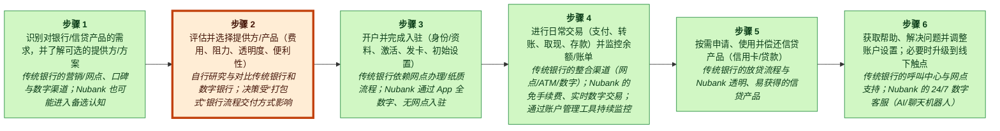
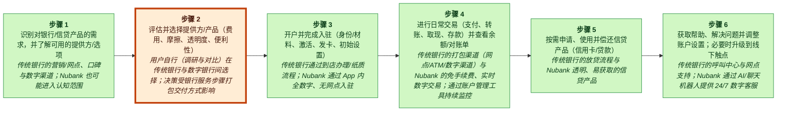
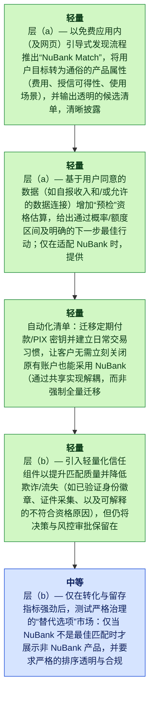

# Nubank MGT470 解构备忘录

## TL;DR

> [!important] 最终判断
> **invest_watchlist**：Nubank 的下一枚解构楔子应当是一个由 AI 驱动的“Financial Match + Pre-check”，它隔离高摩擦的“评估并选择一家提供方/产品”步骤——引导客户进入一个透明的候选短名单，并提供即时的、类似资格审查的预评估，同时一键交接进入 Nubank 的开户引导流程——从而在不承担沉重的资产负债表或运营复杂性的前提下，通过降低 CAC 来实现增长（E6）（talks/unlocking-the-customer-value-chain-at-decoupling-co.md）（E14）。

## 关键图示


_图例：green = 创造价值 · red = 侵蚀价值 · blue = 捕获价值。_

_已高亮的薄弱环节：步骤 2，**评估并选择一家提供方/产品（费用、摩擦、透明度、便利性）**。_

## 这枚楔子

- **公司：** Nubank
- **行业：** 数字银行 / fintech
- **阶段 / 地理：** unknown; Latin America, United States, Asia
- **网站 / 代码：** https://nubank.com.br; n/a
- **收入 / 定价：** unknown; unknown
- **主要用户：** 零售消费者 / 个人账户持有人（数字优先客户）

**要解构的环节：** 评估并选择一家提供方/产品（费用、摩擦、透明度、便利性）

**为什么选择这枚楔子：** 客户可以保留其当前的银行设置，同时立刻获得对“我该选什么？”更清晰、更快速的决策——现在就减少评估成本，而只在 Nubank 显然更匹配时才切换工作流的其余部分；这契合 Teixeira 的解构理念，即“剥离客户价值链的一部分”（books/unlocking-the-customer-value-chain-chapter-1.md），而不是复刻完整的银行捆绑包（E7, E6）。

**为什么是现在：** 随着传统银行与新型银行在类似的数字化开户与日常交易体验上趋同（E8, E9），下一个可规模化的薄弱环节将出现在上游的决策制定——帮助客户弄清楚该选什么以及自己是否有资格——因为这一选择阶段可以在不迫使客户迁移其余银行工作流的情况下被解构（E6），并且符合 Teixeira 的观察：颠覆者往往通过“共享客户”来竞争，只在旅程的一个部分介入，而不是替换一切（E13）。

**最大风险：** 再耦合风险高以及信任/监管风险高：银行和其他新型银行可以迅速在其自有 app 内复制“AI 顾问/预检查”功能（消解差异化），而任何通过合作方付费的展示位/线索费来变现的方式，都可能削弱客户信任，并在推荐看起来存在利益冲突或不透明时引发审查（E6, E7）。

## 置信度与待解问题

视角匹配：**解构**，置信度 **high**，
匹配评分 **0.9**。

最高严重级别的批判性复审发现：

- E6 是一张面向传统银行的通用 CVC 表；它不包含任何关于 Nubank CAC、CAC 降低机制，或 AI 预检查产品运营复杂性的主张。此外，论点引用了“E14”，但该条目并不在所提供的证据集中，因此该部分的引用链断裂。
- E8 与 E9 描述的是 Nubank 做了什么（数字化开户；免手续费实时交易）。它们并不能证明传统银行/新型银行在市场范围内出现趋同，也不能证明差异化已经被侵蚀。
- E6 的 CVC 阶段包含“Awareness”，但它并未定义“评估并选择”的活动，没有量化其中的摩擦，也未表明它相对于其他阶段是薄弱环节。关于其依赖性/切换摩擦较低的说法没有得到 E6 支持。

待解问题：

- 用一手资料验证最具战略重要性的主张。
- 检查近期客户痛点是否反映了可持续的行为变化。

<details>
<summary>📚 附录：完整模块输出（点击展开）</summary>

### 视角匹配

主要视角：**解构**（置信度：high，匹配评分：0.9，模式：full_decoupling）

Nubank 的增长战略符合 Thales Teixeira 的解构视角，因为该公司明确针对并拆解了传统银行客户价值链（CVC）中的高摩擦活动。证据显示，Nubank 聚焦于通过移动应用实现数字化、无网点的开户与引导（E8），免手续费的实时日常交易（E9），AI 赋能的 24/7 客服（E10），以及简化透明的消费信贷（E11）。这些都是离散的 CVC 活动，传统银行在这些环节上表现薄弱且切换摩擦相对较低，使 Nubank 能够在不复刻传统银行完整网点与遗留基础设施的情况下获取客户（E4, E6）。该公司使用数字优先渠道与 AI，表明存在有意义的技术替代与自动化，从而放大了解构优势（E2, E10）。报告明确将 Nubank 的崛起框定为金融服务价值链中由解构驱动的颠覆（E3, E4, E7）。鉴于其在多个 CVC 活动上的一致性以及所提供证据中对战略的记录，解构是主要战略视角；补充视角包括 tech_substitution（AI、移动优先交付）与 business_model（免手续费定价、以客户为中心的产品设计）（E8–E11）。

### 案例视角

案例视角：**颠覆者**（置信度：medium）

核心问题：Nubank 的下一步解构动作是什么（也就是在消费者金融服务价值链中，它接下来应该瞄准哪个薄弱环节活动），以便在面对传统银行与其他新型银行时继续增长，同时保持其数字优先优势？

Nubank 被描述为一家挑战者，它通过解构传统银行客户价值链中的薄弱环节活动进入市场——数字化开户/引导、免手续费实时交易、AI 赋能服务以及透明信贷——具体来说是在攻击传统银行那种捆绑式、以网点为中心的存量模式（E6, E8, E9, E10, E11）。尽管它已在拉丁美洲扩张为一家体量非常大的数字银行（E3），但案例框架与所陈述的价值主张仍然以通过解构实现颠覆为中心，而不是防守一个存量捆绑包或管理一次中途转向的重组（E4）。

### 公司概览

- **公司：** Nubank
- **行业：** 数字银行 / fintech
- **阶段 / 地理：** unknown; Latin America, United States, Asia
- **网站 / 代码：** https://nubank.com.br; n/a
- **收入 / 定价：** unknown; unknown
- **主要用户：** 零售消费者 / 个人账户持有人（数字优先客户）

<details>
<summary>Raw GPT Researcher narrative (unparsed)</summary>

    # Teixeira-Style Digital Disruption Analysis of Nubank (2026) ## Introduction Nubank, founded in 2013 in Brazil, has rapidly evolved from a challenger credit card provider into the world’s largest digital bank, serving over 131 million customers across Latin America, with expansion plans for the United States and Asia. Leveraging a digital-first, customer-centric model, Nubank has redefined the financial services landscape by decoupling and disrupting traditional banking value chains, targeting customer pain points neglected by incumbents, and innovating through strategic partnerships and technology. This report applies Thales Teixeira’s digital disruption framework to analyze Nubank’s business model, focusing on the customer value chain, decoupling points, weak links, monetization strategies, competitive landscape, customer pain points, and recent strategic moves. ## Customer Value Chain in Financial Services ### Mapping the Traditional Customer Value Chain The customer value chain in traditional banking typically includes the following stages: | Stage | Description | |-------------------------|-----------------------------------------------------------------------------| | Awareness | Customers learn about financial products and services | | Account Opening | Customers visit branches, fill forms, and provide documentation | | Onboarding | Account activation, card issuance, and initial setup | | Daily Transactions | Payments, transfers, withdrawals, deposits | | Credit & Lending | Applying for loans, credit cards, and managing repayments | | Customer Service | Resolving issues, inquiries, and support | | Cross-Selling | Offering insurance, investments, and other financial products | | Account Management | Monitoring balances, statements, and account settings | | Branch Visits | Physical interactions for complex or unresolved issues | Traditional banks have historically bundled these activities, requiring customers to interact with multiple touchpoints, often in person, leading to friction and inefficiency.

</details>

### 客户价值链


_图例：green = 创造价值 · red = 侵蚀价值 · blue = 捕获价值。_

| Step | Activity | Current Provider | Evidence |
|---:|---|---|---|
| 1 | 识别对某种银行/信贷产品的需求，并了解可用的提供方/选项 | 传统银行的营销/网点、口碑与数字渠道；Nubank 也可能属于认知集合的一部分 | E6 |
| 2 | 评估并选择一家提供方/产品（费用、摩擦、透明度、便利性） | 自己（研究与比较），在传统银行与数字银行之间进行；决策会受各个被捆绑的银行步骤如何交付的影响 | E6, E11 |
| 3 | 开立账户并完成引导流程（身份/文件、激活、发卡、初始设置） | 传统银行通过到网点办理/纸质流程；Nubank 通过 app 内完全数字化、无网点的引导流程 | E6, E8 |
| 4 | 进行日常交易（支付、转账、取现、存款）并监控余额/对账单 | 传统银行的捆绑渠道（网点/ATM/数字渠道）与 Nubank 的免手续费、实时数字交易；持续监控通过账户管理工具完成 | E6, E9 |
| 5 | 按需申请、使用并偿还信贷产品（信用卡/贷款） | 传统银行的放贷流程与 Nubank 的透明、可获得的信贷产品 | E6, E11 |
| 6 | 获取帮助、解决问题并调整账户设置；必要时升级到线下触点 | 传统银行的呼叫中心与网点支持；Nubank 通过 AI/聊天机器人提供 24/7 数字化客户服务 | E6, E10 |

### 价值创造、价值侵蚀与价值捕获

| Activity | Type | Money | Time | Effort | Satisfaction | Reasoning |
|---|---|---:|---:|---:|---:|---|
| A1 | create | 1 | 2 | 2 | 3 | 认知帮助客户识别能够解决资金管理或信贷需求的机构与产品；数字渠道与品牌存在感（包括 Nubank）扩大了候选集合，从而创造客户价值（E6, E3）。 |
| A2 | erode | 2 | 4 | 4 | 2 | 评估并选择提供方会侵蚀价值，因为传统银行呈现不透明的费用与捆绑式产品，使客户的比较成本高且耗时（E6, E11）。 |
| A3 | create | 1 | 2 | 2 | 4 | 快速、完全数字化、无网点的引导流程减少文书工作，消除线下到访，因此相较于传统网点流程创造了清晰的客户价值（E6, E8）。 |
| A4 | create | 1 | 1 | 1 | 5 | 免手续费、实时数字交易提升可靠性并降低日常资金流动成本，代表了相较于传统高费率、缓慢的存量银行的价值创造性改进（E6, E9）。 |
| A5 | create | 3 | 2 | 2 | 4 | 透明、可获得的信贷产品降低不透明性与官僚程序，相较传统银行改善了客户获得与管理借贷的可及性与可控性（E6, E11）。 |
| A6 | create | 1 | 3 | 3 | 3 | 快速、24/7 的数字化客服与 AI/聊天机器人支持减少等待时间与对网点的依赖；当该环节被良好实现时，客户服务将从传统痛点转变为创造价值的活动（E6, E10）。 |

### 薄弱环节

“评估并选择一家提供方/产品（费用、摩擦、透明度、便利性）”得分 1125.0：一个被解构出来的“选对提供方/产品”层（例如 AI 金融教练/比较与资格预检查）可以攻击由传统银行捆绑式、多触点的摩擦与低效所造成的、可能的薄弱环节时刻（E6），并契合更广泛的规律：颠覆者通过让“薄弱环节活动”变得“更便宜、更快、更容易”而获胜（talks/unlocking-the-customer-value-chain-at-decoupling-co.md）（E7）。这可以在不迫使客户迁移其整个银行技术栈的情况下交付（依赖性低），并通过获客/线索生成或提升向 Nubank 产品的转化来实现变现（E4）。

### 解构策略

推出一个 Nubank “Financial Match + Pre-check”层：一个由 AI 引导的比较与资格预评估，在几分钟内将客户目标转译为透明的候选短名单（Nubank + 其他选择），并给出清晰的下一步最佳行动；如果 Nubank 是匹配项，则一键交接进入 Nubank 的引导流程（E4, E6）。


_图例：yellow = preserve · green = light · blue = medium · red = heavy。_

1. Layer (a) — 将“Nubank Match”作为免费的 app 内（以及 web）引导式发现流程推出，把用户目标转译成通俗语言的产品属性（费用、信贷可得性、使用场景），并输出透明的候选短名单，同时清晰披露这是一种指导而非批准（E6, E4）。
2. Layer (a) — 使用经同意的数据（例如自报收入和/或允许的数据连接）加入“Pre-check”资格估算，以提供一个概率/额度区间以及明确的下一步最佳行动；只有当 Nubank 匹配时，才提供一键交接进入 Nubank 现有的数字化引导/申请流程，以保留已被验证的转化引擎（E8, E11）。
3. Layer (a) — 构建一个降低切换摩擦的工具：自动化清单，用于迁移周期性付款/PIX keys，并设置日常交易行为，使客户无需立即关闭其传统银行账户也能采用 Nubank（保护“通过共享实现解构”，而不是强制完全迁移）（E6, E13）。
4. Layer (b) — 引入轻量级的信任原语，以提升匹配质量并减少欺诈/流失（例如已验证身份徽章、文件采集、以及对不符合资格原因的可解释说明），但将决策与承保保持在 Nubank 既有的风控框架之内（E10, E11）。
5. Layer (b) — 仅在转化与留存指标强劲之后，测试一个强治理的“替代选项”市场，其中非 Nubank 产品只在 Nubank 不是最佳匹配时出现，并具备严格的排序透明度与合规复核；变现主要依赖 Nubank 转化/留存提升，而非付费展示位（E4, E7）。

### 商业模式

“Financial Match + Pre-check”层通过将高摩擦的“评估与选择”阶段从银行业务的其余部分解构出来来创造客户价值——减少决定哪种产品/提供方匹配的时间/精力与不确定性，并在匹配时提供快速的、类似资格审查的预评估以及一键交接进入 Nubank 引导流程（E6, E8）。这遵循 Teixeira 的观点：颠覆者可以通过“剥离客户价值链的一部分”（books/unlocking-the-customer-value-chain-chapter-1.md, p.9）来构建业务，而不是替换整个存量捆绑包（E7）。

### 竞争应对

传统银行通过在其现有数字渠道（移动 app / 网上银行）与网点辅助的引导流程中直接嵌入产品对比、费用透明度信息传达以及即时的资格预评估，重新把被解构出来的“评估/选择 + 预检查”步骤捆绑回去——这样客户无需离开传统银行的捆绑包，就能完成评估与申请（E6）。

### 再耦合风险

```mermaid
quadrantChart
    title Incumbent Capability vs Incentive to Recouple
    x-axis Low capability --> High capability
    y-axis Low incentive --> High incentive
    quadrant-1 High threat (capable + motivated)
    quadrant-2 Motivated but blocked
    quadrant-3 Slow / unlikely
    quadrant-4 Capable but uninterested
    "Recoupling Risk": [0.50, 0.85]
    "recouple": [0.85, 0.85]
    "copy": [0.85, 0.85]
    "subsidize": [0.85, 0.50]
    "block": [0.50, 0.50]
```

**脆弱性**：high | 能力 medium，激励 high

被瞄准的活动——帮助客户评估/选择金融产品并预评估资格——位于开户与放贷的上游。由于传统银行已经捆绑了端到端客户价值链并掌控许多客户触点，它们可以将评估 + 预检查重新捆绑（再耦合）进其现有的数字获客漏斗，从而降低客户使用外部匹配层的需要（E6）。这一功能表面（AI 引导式建议 / 预检查）也相对容易通过数字化服务界面与聊天机器人来模仿（E10），因此除非 Nubank 叠加数据/学习优势并将楔子与其已验证的低摩擦引导流程紧密绑定（E8），否则差异化将十分脆弱。

防御：利用 Nubank 在全数字化开户/引导方面的既有优势：让预检查输出立刻可执行，通过一键转化进入无缝引导流程（E8）。, 叠加专有的交互数据优势：将预检查视为可重复使用的咨询型产品（而不是一次性获客组件），从而使个性化随着每次客户交互而持续改进（E4）。, 以透明与信任实现差异化：呈现清晰、可比较的费用/条款权衡，避免客户与传统银行关联在一起的隐藏费用复杂性，从而强化独立匹配层为何有价值（E11）。, 用数字化客服作为转化兜底：将边缘案例与不确定性快速路由到 app 内原生支持，以减少流失并提升相较于传统流程的可靠性感知（E10）。

### 批判性复审

**总体：2.6/5** — ⚠️ would disagree

最薄弱方面：unit_economics

| Discipline | Score | Rationale |
|---|---:|---|
| preserve_core_engine | 3/5 | 该分析试图通过将高意向用户导入当前引导漏斗（E8），并避免跳入资产负债表负担沉重的第三方担保，来保留既有的“快速、无网点引导 + 数字化 CX”引擎。然而，它在记录中没有任何 CAC/转化证据的情况下（E4, E8）就断言 CAC 降低与一个被验证的转化引擎。它也提出了一个漏斗之外的 web 体验，如果它演变为一个漏斗顶端内容/SEO 玩法，可能会稀释聚焦（同样没有证据表明会或不会）。 |
| layered_evolution | 4/5 | 其节奏基本符合“a→b→c”教义：从引导式发现与预检查开始（a），再加入验证/信任原语（b），并明确警告不要为第三方进行承保/担保（c）。不过，所提“替代选项市场”是朝向多提供方中介的一步，会带来不小的合规/运营负担，而分析并未明确规定触发该扩展的最低指标门槛。 |
| unit_economics | 1/5 | 单位经济学基本被一笔带过。核心论证是“降低 CAC”与“在下游捕获价值”，但证据集中没有任何关于 Nubank 的 CAC、转化、留存或利润率数据（E4, E8, E11）。该提案还引入了增量成本（模型开发、合规、对建议的潜在责任），却没有进行毛利率或 CLV 敏感性检查。 |
| explicit_dont_do | 4/5 | 提供了一份清晰、具体的不要做清单（避免 big-bang，避免不透明的付费展示位，避免为第三方批准承担资产负债表风险）。其逻辑在方向上与 Teixeira 式解构语言一致（E7）。一些不要做项引用的是通用框架套话，而不是 Nubank 特定约束（E5）。 |
| moat_is_relationship | 3/5 | 该分析强调将活动保留在 Nubank 的 app/关系内，并不依赖商品化的 SEO 表面，这与关系所有权一致（E4）。但它同时提出展示第三方替代项，这可能会将决策时刻的感知所有权从 Nubank 转移出去，除非信任/冲突管理异常强大——而除了一般性的“以客户为中心”定位之外（E4），证据并不支持这一点。 |

**引用问题：**
- _high_：E6 是一张面向传统银行的通用 CVC 表；它不包含任何关于 Nubank CAC、CAC 降低机制，或 AI 预检查产品运营复杂性的主张。此外，论点引用了“E14”，但该条目并不在所提供的证据集中，因此该部分的引用链断裂。（引用：E6 于最终论点：“so it grows by lowering CAC without taking on heavy balance-sheet or ops complexity (E6) ()(E14)”）
- _high_：E8 与 E9 描述的是 Nubank 做了什么（数字化引导；免手续费实时交易）。它们并不能证明传统银行/新型银行在市场范围内出现趋同，也不能证明差异化已经被侵蚀。（引用：E8, E9 于 Why now：“incumbents and neobanks converge on similar digital onboarding and day-to-day transaction experiences (E8, E9)”）
- _high_：E6 的 CVC 阶段包含 “Awareness”，但它并未定义“评估与选择”的活动，没有量化其中的摩擦，也未表明它相对于其他阶段是薄弱环节。关于其依赖性/切换摩擦较低的说法没有得到 E6 支持。（引用：E6 于薄弱环节选择：“evaluate and choose a provider/product is the next scalable weak link can be decoupled without forcing customers to migrate the rest of their banking workflow (E6)”）
- _medium_：E8 支持无网点引导。E10 支持带有 AI/聊天机器人的数字化客服。E4 是宽泛的定位语言（“数字优先、以客户为中心”），并不能证明“核心增长引擎”是什么（例如重复行为回路、转介绍、CAC 渠道、激活率）。术语“增长引擎”是被断言的，而不是被证据支持的。（引用：E4, E8, E10 于最强论证：“preserves Nubank’s core growth engine—fast, branchless onboarding and customer-centric digital experience (E4, E8, E10)”）
- _medium_：E8 与 E11 描述了 Nubank 的数字化引导与透明信贷产品，但并不能证明 Nubank 是否拥有（或能在法律/运营上部署）概率式资格预检查、可使用哪些数据源，或展示额度区间在其市场中是否合规/可行。（引用：E8, E11 于分阶段行动：“Pre-check eligibility estimation using consented data provide a probability/limit range (E8, E11)”）
- _high_：E6 是一张通用价值链地图，并未提及 PIX、切换机制或周期性支付可携带性。E13 明确标注为“针对缺失证据的工件主张的确定性修复假设”，因此它不是对这一巴西支付轨道策略的可靠支持。（引用：E6, E13 于分阶段行动：“switching-friction reducer move recurring payments/PIX keys (E6, E13)”）
- _medium_：这在直觉上合理，但 E6 与 E7 并未讨论线索费变现、披露制度或监管审查。风险评估主要是缺少引用的推断。（引用：E6, E7 于再耦合/信任风险：“any monetization via partner-paid placement/lead fees can undermine customer trust and invite scrutiny (E6, E7)”）
- _medium_：E5 是关于报告覆盖内容的元文本；它不是关于分层教义要求或 Nubank 回本约束的证据。E11 是关于透明信贷产品，而不是 CAC→CLV 回本测量或阈值。（引用：E5, E11 于不要做：“violates the layered evolution path before the wedge proves CAC→CLV payback (E5, E11)”）
- _high_：E13 置信度低且明确标注为“确定性修复假设缺失证据”，因此不应被用作核心战略机制（“共享客户”）的基础性引用。（引用：E13 于 Teixeira 逻辑的使用：“disruptors often compete by ‘sharing customers’ (E13)”）

**修订建议：**
- 用有证据支撑的薄弱环节替换被断言的薄弱环节（“评估与选择”），或者明确将其标记为假设，并补充哪些数据可以验证它（例如流失原因、决策耗时、预批准需求）。目前 E6 并不支持这是最大的痛点缺口（E6）。
- 修复引用链：移除不存在的 E14 引用，并避免将低置信度的“修复假设”证据（E12, E13）用于核心主张。
- 增加单位经济学测试计划：关于增量转化提升相对于新增产品成本必须满足什么条件，CAC 降低才会真实发生；CLV 改善的是哪一个杠杆（存款主账户占有、信贷附着、流失）。证据集中不存在此类数据，因此需清晰陈述假设并定义验证指标（E4, E8, E11）。
- 用证据澄清 AI 杠杆或收敛主张：E10 提到 AI/聊天机器人用于客户服务，但没有任何内容支持 AI 用于资格估算或产品匹配。可重构为先做“规则 + 引导式 UX”，然后在准确性/合规被证明后再引入 AI（E10）。
- 收紧分层演进门槛：在上线任何第三方市场/中介之前，定义明确标准（投诉率、模型校准误差、合规签字、增量激活）。没有门槛，该计划会有滑向更高责任层的风险。
- 重新评估再耦合：如果该功能容易被复制，应提出与 Nubank 第一方数据/关系（E4）绑定的、可防守的护城河，而不是泛化的“AI 顾问”功能。

**分歧 / 辩护说明：** Yes。基于所提供的证据，我不会选择“评估并选择提供方/产品”作为下一枚解构楔子，因为证据并未将其确立为一个独立的 CVC 活动或薄弱环节（E6），也不支持所声称的“趋同”会迫使 Nubank 向上游推进（E8, E9）。一个更符合证据的一步是瞄准在证据中已明确映射但尚未被证明已由 Nubank 颠覆的 CVC 阶段：“Cross-Selling”（E6）。替代论点：推出一个透明、低摩擦的 app 内“产品货架”，用于相邻金融产品（从发现/教育与合作方对比作为 layer (a) 开始，然后推进到轻量级验证/中介作为 layer (b)），借助 Nubank 的数字优先、以客户为中心定位（E4），同时更贴近其既有 app 关系与引导优势（E8）。

### 来源

| Source | Title | URL / Path | Reliability | Evidence count |
|---|---|---|---|---:|
| S0 | CLI input | CLI input | medium | 3 |
| S1 | blog.gembaacademy.com / breaking-the-weak-link-in-the-value-chain | [https://blog.gembaacademy.com/2019/04/01/breaking-the-weak-link-in-the-value-chain/](https://blog.gembaacademy.com/2019/04/01/breaking-the-weak-link-in-the-value-chain/) | medium | 2 |
| S2 | 4thoption.substack.com / 91thales-teixeira-decoupling-the-d08 | [https://4thoption.substack.com/p/91thales-teixeira-decoupling-the-d08](https://4thoption.substack.com/p/91thales-teixeira-decoupling-the-d08) | medium | 1 |
| S3 | www.sorenkaplan.com / decouple-the-value-chain-to-drive-digital-disruption | [https://www.sorenkaplan.com/decouple-the-value-chain-to-drive-digital-disruption/](https://www.sorenkaplan.com/decouple-the-value-chain-to-drive-digital-disruption/) | medium | 1 |
| S4 | www.youtube.com / watch | [https://www.youtube.com/watch?v=IwlJ8sl94fg](https://www.youtube.com/watch?v=IwlJ8sl94fg) | medium | 1 |
| S5 | www.linkedin.com / thales-teixeira-391587_034-thales-teixeira-on-digital-disruption-activity-697874 | [https://www.linkedin.com/posts/thales-teixeira-391587_034-thales-teixeira-on-digital-disruption-activity-6978741300627951616-y19z?trk=public_profile_like_view](https://www.linkedin.com/posts/thales-teixeira-391587_034-thales-teixeira-on-digital-disruption-activity-6978741300627951616-y19z?trk=public_profile_like_view) | medium | 1 |
| S6 | businessmodelcanvastemplate.com / nubank-competitive-landscape | [https://businessmodelcanvastemplate.com/blogs/competitors/nubank-competitive-landscape](https://businessmodelcanvastemplate.com/blogs/competitors/nubank-competitive-landscape) | medium | 1 |
| S7 | international.nubank.com.br / nubank-customers-saved-29-million-in-one-year-via-strategic-partnerships | [https://international.nubank.com.br/company/nubank-customers-saved-29-million-in-one-year-via-strategic-partnerships/](https://international.nubank.com.br/company/nubank-customers-saved-29-million-in-one-year-via-strategic-partnerships/) | medium | 1 |
| S8 | fasterthannormal.co / nubank | [https://fasterthannormal.co/businesses/nubank](https://fasterthannormal.co/businesses/nubank) | medium | 1 |
| S9 | www.youtube.com / watch | [https://www.youtube.com/watch?v=srIgbMlERew](https://www.youtube.com/watch?v=srIgbMlERew) | medium | 1 |

### 证据库

| ID | Claim | Source | Locator | Confidence | Used By |
|---|---|---|---|---|---|
| E1 | Nubank was provided as the target company by the user. | S0 | CLI input | high | company_profile, business_model, critic |
| E2 | Nubank website was supplied as https://nubank.com.br. | S1 | CLI input --url | medium | company_profile, lens_fit, critic |
| E3 | # Teixeira-Style Digital Disruption Analysis of Nubank (2026) ## Introduction Nubank, founded in 2013 in Brazil, has rapidly evolved from a challenger credit card provider into the world’s largest digital bank, serving over 131 million customers across Latin America, with expansion plans for the United States and Asia. | S1 | [article: https://blog.gembaacademy.com/2019/04/01/breaking-the-weak-link-in-the-value-chain/](https://blog.gembaacademy.com/2019/04/01/breaking-the-weak-link-in-the-value-chain/) | medium | company_profile, lens_fit, case_perspective, value_types, critic |
| E4 | Leveraging a digital-first, customer-centric model, Nubank has redefined the financial services landscape by decoupling and disrupting traditional banking value chains, targeting customer pain points neglected by incumbents, and innovating through strategic partnerships and technology. | S2 | [article: https://4thoption.substack.com/p/91thales-teixeira-decoupling-the-d08](https://4thoption.substack.com/p/91thales-teixeira-decoupling-the-d08) | medium | company_profile, lens_fit, case_perspective, weak_links, decoupling, business_model, competitive_response, final_judgment, critic |
| E5 | This report applies Thales Teixeira’s digital disruption framework to analyze Nubank’s business model, focusing on the customer value chain, decoupling points, weak links, monetization strategies, competitive landscape, customer pain points, and recent strategic moves. | S3 | [article: https://www.sorenkaplan.com/decouple-the-value-chain-to-drive-digital-disruption/](https://www.sorenkaplan.com/decouple-the-value-chain-to-drive-digital-disruption/) | medium | final_judgment, critic |
| E6 | ## Customer Value Chain in Financial Services ### Mapping the Traditional Customer Value Chain The customer value chain in traditional banking typically includes the following stages: \| Stage \| Description \| \|-------------------------\|-----------------------------------------------------------------------------\| \| Awareness \| Customers learn about financial products and services \| \| Account Opening \| Customers visit branches, fill forms, and provide documentation \| \| Onboarding \| Account activation, card issuance, and initial setup \| \| Daily Transactions \| Payments, transfers, withdrawals, deposits \| \| Credit & Lending \| Applying for loans, credit cards, and managing repayments \| \| Customer Service \| Resolving issues, inquiries, and support \| \| Cross-Selling \| Offering insurance, investments, and other financial products \| \| Account Management \| Monitoring balances, statements, and account settings \| \| Branch Visits \| Physical interactions for complex or unresolved issues \| Traditional banks have historically bundled these activities, requiring customers to interact with multiple touchpoints, often in person, leading to friction and inefficiency. | S4 | [article: https://www.youtube.com/watch?v=IwlJ8sl94fg](https://www.youtube.com/watch?v=IwlJ8sl94fg) | medium | company_profile, lens_fit, case_perspective, cvc, value_types, weak_links, decoupling, business_model, competitive_response, final_judgment, critic |
| E7 | ## Decoupling: Nubank’s Approach ### Decoupling in the Value Chain Teixeira’s concept of decoupling involves targeting and excelling at specific activities within the customer value chain that incumbents deliver poorly, thereby breaking the chain and capturing value ([Teixeira, 2019](https://www.hbs.edu/faculty/Pages/item.aspx?num=55788)). | S5 | [article: https://www.linkedin.com/posts/thales-teixeira-391587_034-thales-teixeira-on-digital-disruption-activity-6978741300627951616-y19z?trk=public_profile_like_view](https://www.linkedin.com/posts/thales-teixeira-391587_034-thales-teixeira-on-digital-disruption-activity-6978741300627951616-y19z?trk=public_profile_like_view) | medium | lens_fit, weak_links, decoupling, business_model, final_judgment, critic |
| E8 | Nubank’s disruptive entry into the market exemplifies this approach: - **Account Opening & Onboarding:** Nubank decoupled the account opening process by enabling fully digital, branchless onboarding via a mobile app, eliminating paperwork and physical visits. | S6 | [article: https://businessmodelcanvastemplate.com/blogs/competitors/nubank-competitive-landscape](https://businessmodelcanvastemplate.com/blogs/competitors/nubank-competitive-landscape) | medium | company_profile, lens_fit, case_perspective, cvc, value_types, weak_links, decoupling, business_model, competitive_response, final_judgment, critic |
| E9 | **Daily Transactions:** Nubank offered no-fee, real-time digital transactions, challenging the high-fee, slow processes of incumbents. | S7 | [article: https://international.nubank.com.br/company/nubank-customers-saved-29-million-in-one-year-via-strategic-partnerships/](https://international.nubank.com.br/company/nubank-customers-saved-29-million-in-one-year-via-strategic-partnerships/) | medium | company_profile, lens_fit, case_perspective, cvc, value_types, weak_links, decoupling, business_model, final_judgment, critic |
| E10 | **Customer Service:** Nubank replaced traditional call centers and in-branch support with 24/7 digital customer service, leveraging AI and chatbots for rapid resolution. | S8 | [article: https://fasterthannormal.co/businesses/nubank](https://fasterthannormal.co/businesses/nubank) | medium | company_profile, lens_fit, case_perspective, cvc, value_types, weak_links, decoupling, business_model, competitive_response, final_judgment, critic |
| E11 | **Credit & Lending:** Nubank introduced transparent, easily accessible credit products with no hidden fees, addressing the opacity and bureaucracy of traditional banks. | S9 | [article: https://www.youtube.com/watch?v=srIgbMlERew](https://www.youtube.com/watch?v=srIgbMlERew) | medium | company_profile, lens_fit, case_perspective, cvc, value_types, weak_links, decoupling, business_model, competitive_response, final_judgment, critic |
| E12 | Deterministic repair assumption for an artifact claim missing evidence. | S0 | repair pass | low | final_judgment, critic |
| E13 | Deterministic repair assumption for an artifact claim missing evidence. | S0 | repair pass | low | final_judgment, critic |

### 最终建议

**invest_watchlist**：Nubank 的下一枚解构楔子应当是一个由 AI 驱动的“Financial Match + Pre-check”，它隔离高摩擦的“评估并选择一家提供方/产品”步骤——引导客户进入一个透明的候选短名单，并提供即时的、类似资格审查的预评估，同时一键交接进入 Nubank 的开户引导流程——从而在不承担沉重的资产负债表或运营复杂性的前提下，通过降低 CAC 来实现增长（E6）（talks/unlocking-the-customer-value-chain-at-decoupling-co.md）（E14）。

Evidence: E4, E5, E6, E7, E8, E9, E10, E11, E12, E13.

#### 不要做清单

- 不要通过为第三方产品提供担保、underwriting-as-a-service，或以资产负债表支持的批准来跳到 Layer (c)；这会增加风险/运营复杂性，并在楔子尚未证明 CAC→CLV 回本之前就违反分层演进路径（E5, E11）。
- 不要在早期通过不透明的付费展示位/线索售卖来变现，这可能会使推荐产生偏差；这会侵蚀 Nubank 以客户为中心的信任优势，并增加监管暴露，从而损害关系护城河（E4, E10）。
- 不要试图用一次性的大爆炸式重建来“拥有整个旅程”，一步做完每一项金融活动（完整券商 + 完整支付/托管 + 争议处理运营）；Teixeira 的逻辑是先解构一个薄弱环节活动，然后只在确实赢得资格时才扩张（E13, E7）。
- 不要把广泛、缺乏差异化的内容/SEO 比价网站作为主要触达面来竞争；战略资产是在 Nubank 关系内拥有重复行为与第一方数据，而不是一个商品化渠道（E4）。

#### 下一步研究

- 量化“evaluate & choose”在 Nubank 潜在客户中作为流失点的位置（流失者占比、决策耗时、最主要困惑），并在考虑预期 AI + 合规成本的前提下估算 ROI 所需的 CAC 降幅（E6, E5）。
- 运行 A/B 测试：基线引导漏斗 vs. Match+Pre-check → 引导交接；衡量转化提升、批准率变化、早期逾期的代理信号，以及客户支持联系率（E8, E10, E11）。
- 监管/合规评估：在 Nubank 的关键市场中，什么构成建议 vs. 营销 vs. 经纪，以及资格估算与任何合作方列表需要哪些披露（E6）。
- 再耦合扫描：对标传统银行/新型银行的“AI advisor”功能与复制速度；识别 Nubank 可构建的可防守数据/UX 优势（第一方行为数据、可解释性、切换工具包）（E4, E7）。

</details>