# Birchbox MGT470 Decoupling Memo

## TL;DR

> [!important] Final Judgment
> **study_more**: Birchbox’s best path to extend its decoupled wedge is to deepen ownership of the at-home evaluation/testing moment and then selectively monetize the post-trial “next purchase” decision with low-friction intermediation—without prematurely taking on full commerce/logistics that could erode the subscription-led engine (books/unlocking-the-customer-value-chain-chapter-1.md > Page 7; E12, E3).

## Key Diagram

```mermaid
flowchart LR
    A1["<b>Step 1</b><br/>Recognize a need or desire to try a new beauty product (e.g., skincare, makeup, haircare)<br/><i>self</i>"]
    A2["<b>Step 2</b><br/>Discover candidate products and brands<br/><i>Brick-and-mortar beauty retailers and major beauty brands (in-store displays/advertising/word-of-mouth) and Birchbox (curated monthly discovery)</i>"]
    A3["<b>Step 3</b><br/>Evaluate products by trying them before buying full-size<br/><i>Beauty retailers (in-store testing) and Birchbox (at-home sample trial via delivered boxes)</i>"]
    A4["<b>Step 4</b><br/>Purchase full-size product(s)<br/><i>Beauty retailers and brands (in-store or online purchasing)</i>"]
    A5["<b>Step 5</b><br/>Use the product at home and assess satisfaction over time<br/><i>self</i>"]
    A6["<b>Step 6</b><br/>Repurchase favorites (and restart discovery/evaluation when needs change)<br/><i>Beauty retailers and brands (store/online) and the customer’s own routine</i>"]
    A1 --> A2
    A2 --> A3
    A3 --> A4
    A4 --> A5
    A5 --> A6
    style A1 fill:#d1f7c4,stroke:#1f8a3a,color:#0b3d18
    style A2 fill:#d1f7c4,stroke:#1f8a3a,color:#0b3d18
    style A3 fill:#d1f7c4,stroke:#1f8a3a,color:#0b3d18
    style A3 fill:#ffedd5,stroke:#c2410c,stroke-width:4px,color:#431407
    style A4 fill:#d6e4ff,stroke:#1c4ed8,color:#0a1f5e
    style A5 fill:#d1f7c4,stroke:#1f8a3a,color:#0b3d18
    style A6 fill:#d6e4ff,stroke:#1c4ed8,color:#0a1f5e
```


_Legend: green = creates value · red = erodes value · blue = captures value._

_Weak link highlighted: Step 3, **Evaluate products by trying them before buying full-size**._

## The Wedge

- **Company:** Birchbox
- **Sector:** beauty subscription / retail
- **Stage / geography:** unknown; unknown
- **Website / ticker:** unknown; n/a
- **Revenue / pricing:** Subscription revenue (monthly box) plus monetization of downstream sales and related strategies referenced in the analysis (E12, E4); Monthly subscription fee for curated sample box (E12)
- **Primary user:** individual consumers seeking curated beauty product discovery and samples (E2, E12)

**What to decouple:** Evaluate products by trying them before buying full-size

**Why this wedge:** They can adopt Birchbox just for the trial/evaluation step without changing where they buy full-size products—an archetypal decoupling move that “peel[s] away a portion of the customer’s value chain” while the disruptor and incumbent can still ‘share’ the customer (books/unlocking-the-customer-value-chain-chapter-1.md > Page 6) (E3).

**Why now:** Teixeira highlights that Birchbox initially “interfered with just one part of the consumer’s activities: testing,” making store visits less necessary as more consumers learn and trial at home (books/unlocking-the-customer-value-chain-chapter-1.md > Page 7; E3). Because evaluation sits immediately before purchase in the beauty customer value chain (E7, E8), Birchbox can capture more value right after the trial moment—if it does so in ways that don’t force customers to switch the rest of their workflow (E12, E3).

**Biggest risk:** Recoupling: incumbents can re-bundle the evaluation step (e.g., by improving at-home sampling and digital discovery tied to their existing purchase channels), neutralizing Birchbox’s weak-link advantage; confidence is medium/low because the provided evidence documents the decoupling threat but not incumbent-specific countermeasures or Birchbox’s defensibility metrics (books/unlocking-the-customer-value-chain-chapter-1.md > Page 6-7; E3, E12).

## Confidence & Open Questions

Lens fit: **decoupling** with **high**
confidence and fit score **0.95**.

Top high-severity critic findings:

- Neither E12 nor E3 provides evidence that referral/commission intermediation is feasible, desired by customers, or available via partners; E3 is a generic statement that Birchbox is a textbook example, not support for this specific monetization mechanism.
- E7/E8 define stages; E12 (as shown) only partially lists Birchbox’s approach and does not explicitly state multi-homing behavior (“buy elsewhere”) or scaling dynamics; E3 is non-specific. The claim may be plausible but is not evidenced here.
- No evidence provided documents any incumbent recoupling moves, incentives, or capability specifics. E3 is general about decoupling framework; E12 describes Birchbox’s decoupling but not incumbent countermeasures.

Open questions:

- Validate the most strategically important claims against primary sources.
- Check whether recent customer pain points reflect durable behavior change.

<details>
<summary>📚 Appendix: full module outputs (click to expand)</summary>

### Lens Fit

Primary lens: **decoupling** (confidence: high, fit score: 0.95, mode: full_decoupling)

The evidence explicitly frames Birchbox as a textbook example of Teixeira-style decoupling: it separated discovery and evaluation (sampling) from the incumbent brick-and-mortar retail bundle (E3, E12). The core customer-value-chain mapping provided shows the traditional stages (discovery, evaluation, purchase, usage, repurchase) (E6–E11) and documents how Birchbox replaced in-store discovery/evaluation with curated monthly sample delivery (E2, E12). That pattern—serving one weak-link activity (evaluation/discovery) better and independently of the incumbent bundle—is the defining signature of decoupling under the MGT470 framework (E3). Secondary new-market characteristics are supported because the subscription-sampling model created a new recurring delivery channel and habit for discovery that was not prominent in pre-existing retail formats (E2, E12).

### Case Perspective

Case perspective: **disruptor** (confidence: high)

Primary question: How should Birchbox extend and monetize its decoupled discovery/evaluation wedge in beauty retail while maintaining the subscription-led model and staying ahead of incumbent recoupling?

Birchbox is presented as a pioneering entrant that disrupted traditional beauty retail by decoupling the discovery and evaluation stages from brick-and-mortar incumbents (E12) via a curated at-home sampling subscription model (E2). The brief explicitly frames Birchbox as a “textbook example” of Teixeira-style digital disruption through decoupling, implying the analysis seat is that of the disruptor extending/defending its decoupled wedge rather than an incumbent defending or a firm mid-pivot (E3, E4).

### Company Snapshot

- **Company:** Birchbox
- **Sector:** beauty subscription / retail
- **Stage / geography:** unknown; unknown
- **Website / ticker:** unknown; n/a
- **Revenue / pricing:** Subscription revenue (monthly box) plus monetization of downstream sales and related strategies referenced in the analysis (E12, E4); Monthly subscription fee for curated sample box (E12)
- **Primary user:** individual consumers seeking curated beauty product discovery and samples (E2, E12)

<details>
<summary>Raw GPT Researcher narrative (unparsed)</summary>

    # Teixeira-Style Digital Disruption Analysis of Birchbox ## Introduction Birchbox, founded in 2010, is a pioneer in the beauty subscription box industry, offering consumers curated samples of beauty products delivered to their homes. The company’s model has been widely cited as a textbook example of digital disruption, particularly through the lens of Thales Teixeira’s “decoupling” framework, as outlined in his book *Unlocking the Customer Value Chain* (Teixeira & Piechota, 2019). This report provides a comprehensive analysis of Birchbox’s disruption of the beauty retail value chain, focusing on customer value chain mapping, decoupling opportunities, weak links, monetization strategies, competitive landscape, customer pain points, and recent strategic moves. The analysis draws on Teixeira’s frameworks and integrates insights from trusted sources.

</details>

### Customer Value Chain


_Legend: green = creates value · red = erodes value · blue = captures value._

| Step | Activity | Current Provider | Evidence |
|---:|---|---|---|
| 1 | Recognize a need or desire to try a new beauty product (e.g., skincare, makeup, haircare) | self | E6, E11 |
| 2 | Discover candidate products and brands | Brick-and-mortar beauty retailers and major beauty brands (in-store displays/advertising/word-of-mouth) and Birchbox (curated monthly discovery) | E6, E11, E12, E2 |
| 3 | Evaluate products by trying them before buying full-size | Beauty retailers (in-store testing) and Birchbox (at-home sample trial via delivered boxes) | E7, E12, E2 |
| 4 | Purchase full-size product(s) | Beauty retailers and brands (in-store or online purchasing) | E8, E11 |
| 5 | Use the product at home and assess satisfaction over time | self | E9 |
| 6 | Repurchase favorites (and restart discovery/evaluation when needs change) | Beauty retailers and brands (store/online) and the customer’s own routine | E10, E11 |

### Value Creation, Erosion, And Capture

| Activity | Type | Money | Time | Effort | Satisfaction | Reasoning |
|---|---|---:|---:|---:|---:|---|
| A1 | create | 1 | 2 | 2 | 3 | Recognizing a need is a customer-created step that initiates the chain and provides the intent signal for later discovery and trial (E6, E11). Birchbox and retailers do not 'charge' for need recognition; it mainly enables downstream actions (E12). |
| A2 | create | 1 | 2 | 2 | 4 | Discovery is value-creating for customers by generating a short list of promising products without exhaustive search; Birchbox explicitly decoupled and improved discovery versus in-store discovery (E6, E12, E2, E11). |
| A3 | create | 2 | 3 | 3 | 4 | Evaluation via samples reduces uncertainty and avoids wasting money on wrong full-size purchases; Birchbox's at-home sampling is a core decoupled value proposition that enhances evaluation vs. in-store testing (E7, E12, E2). |
| A4 | capture | 4 | 2 | 2 | 3 | Purchasing full-size products is where retailers and brands extract payment and therefore capture value; traditional incumbents and online channels control this transaction stage (E8, E11). |
| A5 | create | 2 | 3 | 2 | 4 | In-use assessment creates customer value by confirming efficacy and fit over time; this is primarily a self-managed activity that determines satisfaction and future repurchase (E9). |
| A6 | capture | 4 | 1 | 1 | 4 | Repurchase is a continued capture point where retailers and brands collect recurring revenue and where customers settle into routines that incumbents historically owned (E10, E11). |

### Weak Link

Evaluate products by trying them before buying full-size scored 512.0: Product evaluation via trial is a prime decoupling wedge because traditional evaluation is tied to in-store testing (E7), while Birchbox enables at-home sample trial delivered on a recurring basis (E2), effectively decoupling evaluation from the retail environment (E12). This fits Teixeira’s decoupling pattern of “peeling away a portion of the customer’s value chain” (books/unlocking-the-customer-value-chain-chapter-1.md > Page 6) (E3) and competing on making a “weak link activity” cheaper/faster/easier (talks/unlocking-the-customer-value-chain-at-decoupling-co.md) (E3). Switching friction can be relatively low because the customer can still purchase elsewhere (i.e., the disruptor and incumbent can ‘share’ the customer) (books/unlocking-the-customer-value-chain-chapter-1.md > Page 6) (E3). Value capture is plausible via the subscription model already tied to this activity (E2), without needing full-stack retail integration (integration dependency remains moderate, since samples and fulfillment are required but not full catalog commerce).

### Decoupling Strategy

A subscription-based, at-home trial service that delivers curated beauty samples monthly so customers can evaluate products at home before buying full-size (E2, E12).

```mermaid
flowchart TD
    S1["<b>LIGHT</b><br/>(Layer a — strengthen the wedge) Make the subscription box explicitly an ‘evaluation product’: instrument every sample with lightweight feedback loops so the core output is structured preference data that improves future curation (E12, E7)."]
    S2["<b>LIGHT</b><br/>(Layer a — extend into decision support) Add post-trial decision aids that reduce purchase friction without owning checkout: personalized ‘what to buy next’ recommendations and reminders keyed to the evaluation outcomes, keeping the custom…"]
    S3["<b>HEAVY</b><br/>(Layer b — monetize without heavy ops) Introduce retailer/brand referral intermediation after a positive trial (e.g., tracked links/codes) so Birchbox captures value when evaluation converts to purchase, while avoiding inventory and fulfil…"]
    S4["<b>MEDIUM</b><br/>(Layer b — trust/verification) Offer brand-facing reporting on trial-to-interest signals (aggregated), positioning Birchbox as a measurement layer for sampling effectiveness; gate this behind data-quality milestones from the prior steps (E…"]
    S5["<b>MEDIUM</b><br/>(Conditional Layer b→c, only if unit economics clear) Pilot limited full-size selling only for the highest-converting SKUs/categories to test whether incremental gross margin exceeds added CAC, returns, and ops burden—do not scale until th…"]
    S1 --> S2
    S2 --> S3
    S3 --> S4
    S4 --> S5
    style S1 fill:#d1f7c4,stroke:#1f8a3a,color:#0b3d18
    style S2 fill:#d1f7c4,stroke:#1f8a3a,color:#0b3d18
    style S3 fill:#ffd6d6,stroke:#b22222,color:#5a0d0d
    style S4 fill:#d6e4ff,stroke:#1c4ed8,color:#0a1f5e
    style S5 fill:#d6e4ff,stroke:#1c4ed8,color:#0a1f5e
```


_Legend: yellow = preserve · green = light · blue = medium · red = heavy._

1. (Layer a — strengthen the wedge) Make the subscription box explicitly an ‘evaluation product’: instrument every sample with lightweight feedback loops so the core output is structured preference data that improves future curation (E12, E7).
2. (Layer a — extend into decision support) Add post-trial decision aids that reduce purchase friction without owning checkout: personalized ‘what to buy next’ recommendations and reminders keyed to the evaluation outcomes, keeping the customer’s broader purchase behavior intact (E7, E8, E12).
3. (Layer b — monetize without heavy ops) Introduce retailer/brand referral intermediation after a positive trial (e.g., tracked links/codes) so Birchbox captures value when evaluation converts to purchase, while avoiding inventory and fulfillment complexity until proven (E7, E8, E12).
4. (Layer b — trust/verification) Offer brand-facing reporting on trial-to-interest signals (aggregated), positioning Birchbox as a measurement layer for sampling effectiveness; gate this behind data-quality milestones from the prior steps (E12, E7).
5. (Conditional Layer b→c, only if unit economics clear) Pilot limited full-size selling only for the highest-converting SKUs/categories to test whether incremental gross margin exceeds added CAC, returns, and ops burden—do not scale until the referral path proves conversion and repeat behavior (E8, E10, E12).

### Business Model

Birchbox creates customer value by decoupling the beauty-retail customer value chain specifically at the “evaluation/testing” step—letting customers try curated samples at home via a recurring subscription box—so customers can adopt Birchbox for this single activity without changing where they purchase full-size products (E12, E7, E8). This is the archetypal decoupling move of “peel[ing] away a portion of the customer’s value chain” (books/unlocking-the-customer-value-chain-chapter-1.md > Page 10; E3) and reduces the need for in-store testing that traditionally happened at beauty retailers (E6, E7, E11).

### Competitive Response

Incumbent beauty retailers re-bundle the “evaluate/try-before-buy” activity back into their owned journey by launching at-home sampling programs tightly integrated with their loyalty/app and purchase flow—so customers can trial at home but still buy (and repurchase) inside the incumbent’s ecosystem. This mirrors Teixeira’s point that disruptors “peel away a portion of the customer’s value chain” (books/unlocking-the-customer-value-chain-chapter-1.md, Page 10; E3) and that losing even one stage can be highly threatening to incumbents (books/unlocking-the-customer-value-chain-chapter-1.md, Page 10; E3).

### Recoupling Risk

```mermaid
quadrantChart
    title Incumbent Capability vs Incentive to Recouple
    x-axis Low capability --> High capability
    y-axis Low incentive --> High incentive
    quadrant-1 High threat (capable + motivated)
    quadrant-2 Motivated but blocked
    quadrant-3 Slow / unlikely
    quadrant-4 Capable but uninterested
    "Recoupling Risk": [0.85, 0.85]
    "recouple": [0.85, 0.85]
    "copy": [0.85, 0.85]
    "block": [0.50, 0.50]
    "acquire": [0.50, 0.50]
```

**Vulnerability**: high | capability high, incentive high

Birchbox’s wedge is a single, well-defined activity—product evaluation via at-home sampling (E12)—that incumbents can re-bundle into their existing discovery-to-purchase journey, which they historically controlled end-to-end (E11). Teixeira highlights that disruption often targets “just a small part” of the incumbent business and that incumbents can be highly threatened by losing even one stage (books/unlocking-the-customer-value-chain-chapter-1.md, Page 6 and Page 10; E3). Because evaluation traditionally occurred in-store (E7), an incumbent can attempt to recreate the experience through at-home kits, sample-with-purchase programs, and app-driven personalization, reducing Birchbox’s differentiation. Direct evidence of specific incumbent recoupling actions is not provided; this assessment is based on the CVC structure and incentive logic implied by the decoupling framework (E3, E11, E12).

Defenses: Lock in the customer relationship (not the box): build persistent preference profiles and feedback loops so the evaluation experience improves over time and switching resets value (E12)., Lock in the brand relationship: provide brands with targeting and measurement (who sampled, what converted) so Birchbox becomes a consumer-insight/distribution platform rather than a generic sampler (E4, E12)., Decrease dependence on any single incumbent-controlled input by diversifying brand supply (especially emerging brands) to reduce vulnerability to blocking/exclusivity (E2, E4)., Keep the wedge narrow and compounding: double down on discovery/evaluation excellence rather than moving prematurely into heavy balance-sheet or logistics commitments that would dilute focus and raise attack surface (E3, E12).

### Critic Review

**Overall: 2.3/5** — ⚠️ would disagree

Weakest aspect: Unit economics and evidence discipline: key claims about monetization feasibility, switching friction, and recoupling are not supported by the cited evidence; the plan relies on unvalidated assumptions about conversion, partner commissions, and data defensibility.

| Discipline | Score | Rationale |
|---|---:|---|
| preserve_core_engine | 3/5 | The analyst repeatedly states “don’t erode the subscription-led engine,” but never identifies what the engine concretely is (e.g., retention loop, low-CAC channel, brand-funded sampling economics) or supports it with evidence. The recommendation directionally tries to protect the core, yet it’s asserted rather than evidenced (E2, E12 are descriptive; they don’t establish an engine). |
| layered_evolution | 4/5 | The staged roadmap is structurally aligned with Teixeira’s sequencing (a→b→conditional c) and explicitly warns against jumping to full-stack commerce/logistics. However, several “layer b” steps (referrals, reporting) are not grounded in evidence about feasibility, partner appetite, or Birchbox capabilities; so the layering is doctrinally good but empirically thin (E3, E12). |
| unit_economics | 1/5 | Unit economics are mostly hand-waved. The analyst mentions CAC/returns/ops burden conceptually, but provides no evidence-based constraints, no proxy metrics, and no explicit testable thresholds beyond generic ‘exceeds added costs.’ With the provided evidence, the write-up should have been far more explicit about unknowns and what would need to be true (no evidence provides CAC, retention, margins, or conversion) (E2, E12). |
| explicit_dont_do | 4/5 | A clear don’t-do list is present and tied to the decoupling logic (avoid full-stack commerce, avoid degrading trial novelty, avoid forcing full migration). The logic is coherent, though citations offered for these claims are often not actually evidentiary (E3, E12). |
| moat_is_relationship | 2/5 | The analyst emphasizes preference data and repeat evaluation as the relationship moat, which is directionally consistent. But the evidence does not demonstrate that Birchbox currently owns meaningful data advantage, feedback loops, or lock-in; those are proposed features, not evidenced assets. The moat claim is therefore aspirational rather than supported (E12, E2). |

**Citation issues:**
- _high_: Neither E12 nor E3 provides evidence that referral/commission intermediation is feasible, desired by customers, or available via partners; E3 is a generic statement that Birchbox is a textbook example, not support for this specific monetization mechanism. (cited: E12, E3 at Final thesis: “selectively monetize the post-trial ‘next purchase’ decision with low-friction intermediation… (E12, E3)”)
- _medium_: E7/E8 are table-row definitions (evaluation, purchase). They support ordering, but not the leap that Birchbox can “capture more value” at that junction; that requires evidence on willingness to pay, conversion, or channel influence. (cited: E7, E8 at Why now: “Because evaluation sits immediately before purchase in the beauty customer value chain (E7, E8)… capture more value right after the trial moment”)
- _high_: E7/E8 define stages; E12 (as shown) only partially lists Birchbox’s approach and does not explicitly state multi-homing behavior (“buy elsewhere”) or scaling dynamics; E3 is non-specific. The claim may be plausible but is not evidenced here. (cited: E12, E7, E8, E3 at Strongest argument: “customers can adopt it… while continuing to buy full-size products elsewhere… wedge can scale without requiring full end-to-end replacement (E12, E7, E8, E3)”)
- _high_: No evidence provided documents any incumbent recoupling moves, incentives, or capability specifics. E3 is general about decoupling framework; E12 describes Birchbox’s decoupling but not incumbent countermeasures. (cited: E3, E12 at Biggest risk: “incumbents can re-bundle the evaluation step… (E3, E12)”)
- _medium_: E12/E7 do not mention instrumentation, feedback loops, or data capture. This is a product idea, not supported as an existing capability or proven lever in the evidence. (cited: E12, E7 at Layer a: “instrument every sample with lightweight feedback loops… structured preference data… (E12, E7)”)
- _high_: No evidence indicates brands want or will pay for such reporting, that Birchbox can measure it, or that it improves sampling ROI. The citations are descriptive of stages, not market demand. (cited: E12, E7 at Layer b: “Offer brand-facing reporting on trial-to-interest signals… (E12, E7)”)
- _medium_: E12 (as provided) does not state pricing, revenue, or even explicitly that the model is paid subscription revenue; E2 indicates a subscription box conceptually, but revenue capture is still asserted without specifics. (cited: E12 at Business-model value_capture (upstream): “Primary value capture is direct subscription revenue… (E12)”)
- _high_: E3 is a generic description that Birchbox is a textbook example of decoupling per Teixeira; it does not supply evidence on switching friction, multi-homing rates, or customer behavior. (cited: E3 at Weak link rationale: “Switching friction can be relatively low… ‘share’ the customer… (E3)”)
- _low_: E11 is a broad assertion without operational detail; it may be directionally true, but it’s not enough to support strong conclusions about bargaining power, channel control, or recoupling responses. (cited: E11 at CVC / incumbent control: “historically controlled by brick-and-mortar retailers… ‘owned’ the customer experience… (E11)”)

**Revision suggestions:**
- State the core growth engine as a falsifiable claim and tie it to evidence: e.g., retention loop (repeat subscription), low-CAC acquisition channel, or brand-funded sampling unit economics. If evidence is missing, explicitly list it as required inputs before recommending monetization expansions (E2, E12).
- Tighten evidence discipline: avoid citing stage-definition tables (E7–E10) as support for monetization feasibility, partner economics, or customer behavior. Reframe those as assumptions and convert them into open questions.
- Recast the roadmap as hypotheses with validation gates: (1) does improved feedback increase retention? (2) do recommendations increase downstream conversion? (3) will brands/retailers pay commission or analytics? Define what metrics would confirm/kill each step (no current evidence supports any of these).
- Separate ‘what Teixeira’s framework suggests’ from ‘what Birchbox can do.’ Use E3 only for framework-level logic, not as support for Birchbox-specific execution claims.
- Strengthen recoupling analysis by specifying what to monitor (incumbent sampling programs, loyalty app personalization, direct-to-consumer sampling) and what would make Birchbox defensible; current evidence doesn’t substantiate incumbent behavior (E3, E12).
- Unit economics minimums: explicitly articulate required relationships (e.g., incremental CLV from recommendations must exceed incremental product/tech cost; any referral revenue per subscriber must be meaningful vs. subscription margin; returns and ops costs must not swamp gross margin) and label them as assumptions to test.

**Disagreement / defense note:** Given the same evidence, I would not endorse the specific monetization extension (referrals/commissions and brand-facing reporting) as the “best path,” because none of the provided evidence supports partner willingness-to-pay, conversion influence, or measurement capability (E7, E8, E12, E3). My alternative thesis would be: remain in ‘study more’ mode but narrow the near-term focus to protecting subscription retention and validating whether Birchbox can measurably influence downstream purchase at all (incremental lift), before designing intermediation layers. In other words: prove influence and data defensibility first; only then choose between consumer-side intermediation or brand-funded sampling analytics.

### Sources

| Source | Title | URL / Path | Reliability | Evidence count |
|---|---|---|---|---:|
| S0 | CLI input | CLI input | medium | 1 |
| S1 | praxie.com / decouple-the-value-chain-to-drive-digital-disruption | [https://praxie.com/decouple-the-value-chain-to-drive-digital-disruption/](https://praxie.com/decouple-the-value-chain-to-drive-digital-disruption/) | medium | 1 |
| S10 | www.amazon.de / 152476308X | [https://www.amazon.de/-/en/Unlocking-Customer-Value-Chain-Decoupling/dp/152476308X](https://www.amazon.de/-/en/Unlocking-Customer-Value-Chain-Decoupling/dp/152476308X) | medium | 1 |
| S11 | www.amazon.com / 152476308X | [https://www.amazon.com/Unlocking-Customer-Value-Chain-Decoupling/dp/152476308X](https://www.amazon.com/Unlocking-Customer-Value-Chain-Decoupling/dp/152476308X) | medium | 1 |
| S2 | www.customerbliss.com / understand-your-customers-needs-unlock-the-value-chain | [https://www.customerbliss.com/podcasts/understand-your-customers-needs-unlock-the-value-chain/](https://www.customerbliss.com/podcasts/understand-your-customers-needs-unlock-the-value-chain/) | medium | 1 |
| S3 | books.google.com / Unlocking_the_Customer_Value_Chain.html | [https://books.google.com/books/about/Unlocking_the_Customer_Value_Chain.html?id=xSdcDwAAQBAJ](https://books.google.com/books/about/Unlocking_the_Customer_Value_Chain.html?id=xSdcDwAAQBAJ) | medium | 1 |
| S4 | www.youtube.com / watch | [https://www.youtube.com/watch?v=IwlJ8sl94fg](https://www.youtube.com/watch?v=IwlJ8sl94fg) | medium | 1 |
| S5 | www.amazon.com / B07MWBS4WS | [https://www.amazon.com/Unlocking-Customer-Value-Chain-Decoupling/dp/B07MWBS4WS](https://www.amazon.com/Unlocking-Customer-Value-Chain-Decoupling/dp/B07MWBS4WS) | medium | 1 |
| S6 | 4thoption.substack.com / 91thales-teixeira-decoupling-the-d08 | [https://4thoption.substack.com/p/91thales-teixeira-decoupling-the-d08](https://4thoption.substack.com/p/91thales-teixeira-decoupling-the-d08) | medium | 1 |
| S7 | www.youtube.com / watch | [https://www.youtube.com/watch?v=FQAmKKsQ0ZE](https://www.youtube.com/watch?v=FQAmKKsQ0ZE) | medium | 1 |
| S8 | podcasts.apple.com / id1485202972 | [https://podcasts.apple.com/in/podcast/034-thales-teixeira-on-digital-disruption-through-decoupling/id1485202972?i=1000580174920](https://podcasts.apple.com/in/podcast/034-thales-teixeira-on-digital-disruption-through-decoupling/id1485202972?i=1000580174920) | medium | 1 |
| S9 | www.porchlightbooks.com / unlocking-the-customer-value-chain-thales-s-teixeira-9781524763084 | [https://www.porchlightbooks.com/products/unlocking-the-customer-value-chain-thales-s-teixeira-9781524763084](https://www.porchlightbooks.com/products/unlocking-the-customer-value-chain-thales-s-teixeira-9781524763084) | medium | 1 |

### Evidence Base

| ID | Claim | Source | Locator | Confidence | Used By |
|---|---|---|---|---|---|
| E1 | Birchbox was provided as the target company by the user. | S0 | CLI input | high | company_profile, lens_fit, business_model, final_judgment |
| E2 | # Teixeira-Style Digital Disruption Analysis of Birchbox ## Introduction Birchbox, founded in 2010, is a pioneer in the beauty subscription box industry, offering consumers curated samples of beauty products delivered to their homes. | S1 | [article: https://praxie.com/decouple-the-value-chain-to-drive-digital-disruption/](https://praxie.com/decouple-the-value-chain-to-drive-digital-disruption/) | medium | company_profile, lens_fit, case_perspective, cvc, value_types, weak_links, decoupling, business_model, competitive_response, final_judgment, critic |
| E3 | The company’s model has been widely cited as a textbook example of digital disruption, particularly through the lens of Thales Teixeira’s “decoupling” framework, as outlined in his book *Unlocking the Customer Value Chain* (Teixeira & Piechota, 2019). | S2 | [article: https://www.customerbliss.com/podcasts/understand-your-customers-needs-unlock-the-value-chain/](https://www.customerbliss.com/podcasts/understand-your-customers-needs-unlock-the-value-chain/) | medium | company_profile, lens_fit, case_perspective, weak_links, decoupling, business_model, competitive_response, final_judgment, critic |
| E4 | This report provides a comprehensive analysis of Birchbox’s disruption of the beauty retail value chain, focusing on customer value chain mapping, decoupling opportunities, weak links, monetization strategies, competitive landscape, customer pain points, and recent strategic moves. | S3 | [article: https://books.google.com/books/about/Unlocking_the_Customer_Value_Chain.html?id=xSdcDwAAQBAJ](https://books.google.com/books/about/Unlocking_the_Customer_Value_Chain.html?id=xSdcDwAAQBAJ) | medium | company_profile, case_perspective, business_model, competitive_response, critic |
| E5 | The analysis draws on Teixeira’s frameworks and integrates insights from trusted sources. | S4 | [article: https://www.youtube.com/watch?v=IwlJ8sl94fg](https://www.youtube.com/watch?v=IwlJ8sl94fg) | medium | company_profile |
| E6 | ## Customer Value Chain in Beauty Retail ### Traditional Beauty Retail Value Chain The traditional beauty retail customer value chain encompasses several stages: \| Stage \| Description \| \|-------------------\|-----------------------------------------------------------------------------\| \| Discovery \| Customers learn about new products via in-store displays, advertising, or word-of-mouth. | S5 | [article: https://www.amazon.com/Unlocking-Customer-Value-Chain-Decoupling/dp/B07MWBS4WS](https://www.amazon.com/Unlocking-Customer-Value-Chain-Decoupling/dp/B07MWBS4WS) | medium | company_profile, lens_fit, cvc, value_types, weak_links, business_model, final_judgment, critic |
| E7 | \| \| Evaluation \| Customers test products in-store (e.g., Sephora, department stores). | S6 | [article: https://4thoption.substack.com/p/91thales-teixeira-decoupling-the-d08](https://4thoption.substack.com/p/91thales-teixeira-decoupling-the-d08) | medium | company_profile, lens_fit, cvc, value_types, weak_links, decoupling, business_model, competitive_response, final_judgment, critic |
| E8 | \| \| Purchase \| Customers buy full-sized products in-store or online. | S7 | [article: https://www.youtube.com/watch?v=FQAmKKsQ0ZE](https://www.youtube.com/watch?v=FQAmKKsQ0ZE) | medium | company_profile, lens_fit, cvc, value_types, weak_links, decoupling, business_model, final_judgment, critic |
| E9 | \| \| Usage \| Customers use products at home. | S8 | [article: https://podcasts.apple.com/in/podcast/034-thales-teixeira-on-digital-disruption-through-decoupling/id1485202972?i=1000580174920](https://podcasts.apple.com/in/podcast/034-thales-teixeira-on-digital-disruption-through-decoupling/id1485202972?i=1000580174920) | medium | company_profile, lens_fit, cvc, value_types, weak_links |
| E10 | \| \| Repurchase \| Customers return to stores or online to repurchase favorite products. | S9 | [article: https://www.porchlightbooks.com/products/unlocking-the-customer-value-chain-thales-s-teixeira-9781524763084](https://www.porchlightbooks.com/products/unlocking-the-customer-value-chain-thales-s-teixeira-9781524763084) | medium | company_profile, lens_fit, cvc, value_types, weak_links, decoupling, business_model, final_judgment, critic |
| E11 | \| This chain was historically controlled by brick-and-mortar retailers and major beauty brands, who “owned” the customer experience from discovery to repurchase. | S10 | [article: https://www.amazon.de/-/en/Unlocking-Customer-Value-Chain-Decoupling/dp/152476308X](https://www.amazon.de/-/en/Unlocking-Customer-Value-Chain-Decoupling/dp/152476308X) | medium | company_profile, lens_fit, case_perspective, cvc, value_types, weak_links, decoupling, business_model, competitive_response, final_judgment, critic |
| E12 | ### Birchbox’s Disruptive Value Chain Birchbox fundamentally altered this value chain by decoupling the discovery and evaluation stages from the traditional retail environment: \| Stage \| Birchbox’s Approach \| \|-------------------\|-----------------------------------------------------------------------------\| \| Discovery \| Curated selection of new and trending products delivered monthly. | S11 | [article: https://www.amazon.com/Unlocking-Customer-Value-Chain-Decoupling/dp/152476308X](https://www.amazon.com/Unlocking-Customer-Value-Chain-Decoupling/dp/152476308X) | medium | company_profile, lens_fit, case_perspective, cvc, value_types, weak_links, decoupling, business_model, competitive_response, final_judgment, critic |

### Final Recommendation

**study_more**: Birchbox’s best path to extend its decoupled wedge is to deepen ownership of the at-home evaluation/testing moment and then selectively monetize the post-trial “next purchase” decision with low-friction intermediation—without prematurely taking on full commerce/logistics that could erode the subscription-led engine (books/unlocking-the-customer-value-chain-chapter-1.md > Page 7; E12, E3).

Evidence: E2, E3, E6, E7, E8, E10, E11, E12, E1.

#### Do-Not-Do List

- Do not jump straight to a full-stack commerce + logistics buildout as the primary growth plan; it violates layered evolution and risks turning a focused decoupled wedge into a capital/ops-heavy business before monetization is proven (E3, E12).
- Do not redesign the subscription in ways that reduce trial frequency/novelty (the core ‘evaluation’ job) just to push immediate product sales; that would weaken the very activity Birchbox decoupled and made valuable to customers (books/unlocking-the-customer-value-chain-chapter-1.md > Page 7; E12, E3).
- Do not depend on a strategy that requires customers to abandon their existing full-size buying destinations; the power of decoupling is that Birchbox can ‘share customers’ with incumbents rather than forcing full migration (books/unlocking-the-customer-value-chain-chapter-1.md > Page 6; E3).

#### Next Research Steps

- Quantify the core growth engine economics: subscription retention/tenure (CLV driver), gross margin structure of sample fulfillment, and primary acquisition channels (CAC); without these, it’s impossible to know how much intermediation revenue is needed to be meaningful (E2, E12).
- Measure the evaluation→purchase funnel: what fraction of sampled items generate intent, what fraction convert to full-size purchases, and how long conversion takes; this validates whether ‘purchase intermediation’ is the right adjacent activity to monetize (E7, E8, E12).
- Map recoupling threats by incumbent: identify which retailers/brands can replicate at-home trial and which can’t, and what assets (stores, loyalty, data) they can deploy to re-bundle evaluation with purchase (books/unlocking-the-customer-value-chain-chapter-1.md > Page 6-7; E3).
- Test switching friction: assess how willing users are to buy through Birchbox referrals vs. their default retailer, and what incentives (if any) are required—explicitly track incentive cost vs. incremental margin (E8, E10).

</details>
