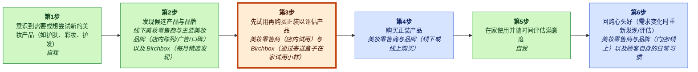
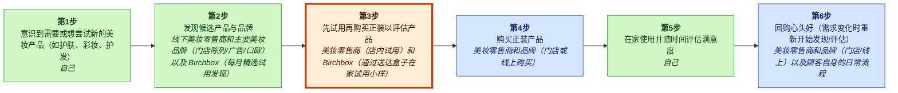
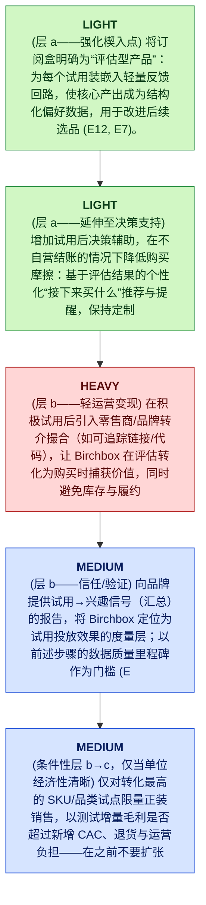

# Birchbox MGT470 解构备忘录

## TL;DR

> [!important] 最终判断
> **study_more**：Birchbox 延伸其解构楔子（decoupled wedge）的最佳路径，是加深对“居家评估/测试”这一时刻的掌控，然后以低摩擦的中介方式选择性地将试用后的“下一次购买”决策变现——而不要过早承担可能侵蚀订阅驱动引擎的全套电商/物流（books/unlocking-the-customer-value-chain-chapter-1.md > Page 7; E12, E3）。

## 关键图示


_图例：绿色 = 创造价值 · 红色 = 侵蚀价值 · 蓝色 = 捕获价值。_

_已高亮的薄弱环节：步骤 3，**通过在购买正装前先试用来评估产品**。_

## 楔子（The Wedge）

- **公司：** Birchbox
- **行业：** 美妆订阅 / 零售
- **阶段 / 地理：** unknown; unknown
- **网站 / 股票代码：** unknown; n/a
- **收入 / 定价：** 订阅收入（月度盒子）+ 对下游销售和分析中提到的相关策略的变现（E12, E4）；精选小样盒的月度订阅费（E12）
- **主要用户：** 寻求精选美妆产品发现与小样的个人消费者（E2, E12）

**要解构什么：** 通过在购买正装前先试用来评估产品

**为什么选择这个楔子：** 用户可以只为试用/评估步骤采用 Birchbox，而无需改变他们购买正装产品的渠道——这是典型的解构动作，即在破坏者与既有者仍可“共享”客户的情况下，“剥离客户价值链的一部分”（books/unlocking-the-customer-value-chain-chapter-1.md > Page 6）（E3）。

**为什么是现在：** Teixeira 强调 Birchbox 最初只“干扰了消费者活动的一个环节：测试”，随着更多消费者在家学习与试用，去门店变得不那么必要（books/unlocking-the-customer-value-chain-chapter-1.md > Page 7; E3）。由于在美妆客户价值链中，评估紧邻购买之前（E7, E8），Birchbox 可以在试用时刻之后立刻捕获更多价值——前提是它采用的方式不迫使客户切换其余工作流（E12, E3）。

**最大风险：** 再耦合（recoupling）：既有者可以将评估步骤重新打包（例如，改进与其既有购买渠道绑定的居家试用与数字化发现），从而中和 Birchbox 的薄弱环节优势；信心为中等/偏低，因为现有证据记录了解构威胁，但没有提供既有者的具体反制举措或 Birchbox 可防御性指标（books/unlocking-the-customer-value-chain-chapter-1.md > Page 6-7; E3, E12）。

## 置信度与开放问题

透镜匹配：**解构（decoupling）**，置信度 **high**
，匹配分数 **0.95**。

高严重度的主要批判性复审发现：

- E12 与 E3 都未提供证据证明“推荐/佣金型中介”是可行的、客户想要的、或可通过合作伙伴获得；E3 只是一个泛化陈述，称 Birchbox 是教科书式案例，并不能支持这一特定变现机制。
- E7/E8 定义了阶段；E12（如展示）仅部分列出 Birchbox 的做法，并未明确陈述多栖行为（“在别处购买”）或规模化动态；E3 也不具体。该主张可能合理，但在此没有证据支持。
- 没有任何证据记录既有者再耦合行动、激励或能力细节。E3 仅概述解构框架；E12 描述了 Birchbox 的解构，但未描述既有者反制措施。

开放问题：

- 用一手资料验证最具战略重要性的主张。
- 检查近期客户痛点是否反映了可持续的行为改变。

<details>
<summary>📚 附录：完整模块输出（点击展开）</summary>

### 透镜匹配（Lens Fit）

主透镜：**解构（decoupling）**（置信度：high，匹配分数：0.95，模式：full_decoupling）

证据明确将 Birchbox 界定为 Teixeira 式解构的教科书案例：它将发现与评估（试用/小样）从既有线下零售的捆绑中分离出来（E3, E12）。所提供的核心客户价值链映射展示了传统阶段（发现、评估、购买、使用、复购）（E6–E11），并记录了 Birchbox 如何用每月精选小样配送替代门店内发现/评估（E2, E12）。这种模式——把某个薄弱环节活动（评估/发现）做得更好，并且独立于既有捆绑提供服务——正是 MGT470 框架下解构的定义性特征（E3）。次级的新市场特征也得到支持，因为订阅小样模式创造了一个新的、按期递送的发现渠道与习惯，这在既有零售形态中并不突出（E2, E12）。

### 案例视角（Case Perspective）

案例视角：**破坏者（disruptor）**（置信度：high）

核心问题：Birchbox 应如何在保持订阅驱动模式并领先既有者再耦合的同时，在美妆零售中延伸并变现其解构的发现/评估楔子？

Birchbox 被呈现为一个开创性进入者：它通过精选居家试用订阅模式（E2），将发现与评估阶段从线下既有者处解构出来（E12），从而扰动传统美妆零售。简报明确将 Birchbox 框定为 Teixeira 式通过解构实现数字化颠覆的“教科书式案例”，这意味着分析坐席应是破坏者去延伸/防守其解构楔子，而不是既有者防守或处于中途转型的公司（E3, E4）。

### 公司快照（Company Snapshot）

- **公司：** Birchbox
- **行业：** 美妆订阅 / 零售
- **阶段 / 地理：** unknown; unknown
- **网站 / 股票代码：** unknown; n/a
- **收入 / 定价：** 订阅收入（月度盒子）+ 对下游销售和分析中提到的相关策略的变现（E12, E4）；精选小样盒的月度订阅费（E12）
- **主要用户：** 寻求精选美妆产品发现与小样的个人消费者（E2, E12）

<details>
<summary>Raw GPT Researcher narrative (unparsed)</summary>

    # Teixeira-Style Digital Disruption Analysis of Birchbox ## Introduction Birchbox, founded in 2010, is a pioneer in the beauty subscription box industry, offering consumers curated samples of beauty products delivered to their homes. The company’s model has been widely cited as a textbook example of digital disruption, particularly through the lens of Thales Teixeira’s “decoupling” framework, as outlined in his book *Unlocking the Customer Value Chain* (Teixeira & Piechota, 2019). This report provides a comprehensive analysis of Birchbox’s disruption of the beauty retail value chain, focusing on customer value chain mapping, decoupling opportunities, weak links, monetization strategies, competitive landscape, customer pain points, and recent strategic moves. The analysis draws on Teixeira’s frameworks and integrates insights from trusted sources.

</details>

### 客户价值链（Customer Value Chain）


_图例：绿色 = 创造价值 · 红色 = 侵蚀价值 · 蓝色 = 捕获价值。_

| Step | Activity | Current Provider | Evidence |
|---:|---|---|---|
| 1 | 识别尝试新的美妆产品（例如护肤、彩妆、护发）的需求或欲望 | self | E6, E11 |
| 2 | 发现候选产品与品牌 | 线下美妆零售商与主要美妆品牌（门店陈列/广告/口碑）以及 Birchbox（每月精选发现） | E6, E11, E12, E2 |
| 3 | 通过在购买正装前先试用来评估产品 | 美妆零售商（门店试用）以及 Birchbox（通过配送盒子实现居家小样试用） | E7, E12, E2 |
| 4 | 购买正装产品 | 美妆零售商与品牌（门店或线上购买） | E8, E11 |
| 5 | 在家使用产品并随着时间推移评估满意度 | self | E9 |
| 6 | 复购心头好（当需求变化时重新开始发现/评估） | 美妆零售商与品牌（门店/线上）以及客户自身的日常习惯 | E10, E11 |

### 价值创造、侵蚀与捕获（Value Creation, Erosion, And Capture）

| Activity | Type | Money | Time | Effort | Satisfaction | Reasoning |
|---|---|---:|---:|---:|---:|---|
| A1 | create | 1 | 2 | 2 | 3 | 识别需求是客户自我创造的一步，它启动价值链并为后续发现与试用提供意图信号（E6, E11）。Birchbox 和零售商不会对“识别需求”收费；它主要是促成下游动作（E12）。 |
| A2 | create | 1 | 2 | 2 | 4 | 发现对客户而言是创造价值的，因为它在不进行穷尽搜索的情况下生成一份有希望的产品短名单；Birchbox 明确地相对于门店发现实现了解构并改进了发现环节（E6, E12, E2, E11）。 |
| A3 | create | 2 | 3 | 3 | 4 | 通过小样进行评估可降低不确定性并避免把钱浪费在错误的正装购买上；Birchbox 的居家小样是其核心的解构价值主张，相比门店试用增强了评估（E7, E12, E2）。 |
| A4 | capture | 4 | 2 | 2 | 3 | 购买正装是零售商与品牌获得付款、因此捕获价值的环节；传统既有者与线上渠道掌控该交易阶段（E8, E11）。 |
| A5 | create | 2 | 3 | 2 | 4 | 使用中的评估通过长期确认效果与适配度来创造客户价值；这主要是自我管理的活动，决定满意度与未来复购（E9）。 |
| A6 | capture | 4 | 1 | 1 | 4 | 复购是持续的价值捕获点：零售商与品牌获得经常性收入，客户也会形成既有者历史上所掌控的例行路径（E10, E11）。 |

### 薄弱环节（Weak Link）

“通过在购买正装前先试用来评估产品”得分 512.0：通过试用进行产品评估是一个极佳的解构楔子，因为传统评估与门店试用绑定（E7），而 Birchbox 通过按期配送的小样居家试用实现评估，从而有效地将评估从零售环境中解构出来（E12）。这符合 Teixeira 的解构模式，即“剥离客户价值链的一部分”（books/unlocking-the-customer-value-chain-chapter-1.md > Page 6）（E3），并在“薄弱环节活动”上通过更便宜/更快/更容易来竞争（talks/unlocking-the-customer-value-chain-at-decoupling-co.md）（E3）。切换摩擦可以相对较低，因为客户仍可在别处购买（也就是说，破坏者与既有者可以“共享”客户）（books/unlocking-the-customer-value-chain-chapter-1.md > Page 6）（E3）。通过与该活动绑定的订阅模型来捕获价值是合理的（E2），而无需全栈零售整合（整合依赖度仍为中等，因为需要小样与履约，但不需要全目录电商）。

### 解构策略（Decoupling Strategy）

一种基于订阅的居家试用服务：每月配送精选美妆小样，让客户在购买正装前先在家评估产品（E2, E12）。


_图例：黄色 = 保留 · 绿色 = 轻度 · 蓝色 = 中度 · 红色 = 重度。_

1.（层 a — 加固楔子）把订阅盒子明确定位为“评估产品”：为每个小样加入轻量反馈回路，使核心产出成为结构化偏好数据，从而提升后续选品质量（E12, E7）。
2.（层 a — 延伸到决策支持）在不拥有结账环节的情况下，加入试用后的决策辅助以降低购买摩擦：根据评估结果提供个性化“下一步买什么”推荐与提醒，同时保持客户更广泛的购买行为不变（E7, E8, E12）。
3.（层 b — 不做重运营的变现）在正向试用之后引入零售商/品牌的推荐中介（例如可追踪链接/代码），使 Birchbox 在评估转化为购买时捕获价值，同时在验证之前避免库存与履约的复杂性（E7, E8, E12）。
4.（层 b — 信任/验证）向品牌提供关于“试用到兴趣”信号的报告（聚合口径），将 Birchbox 定位为衡量试用有效性的度量层；在此前步骤的数据质量达到里程碑后再开放该能力（E12, E7）。
5.（条件性层 b→c，仅当单位经济模型清晰）仅针对转化最高的 SKU/品类试点有限的正装销售，以测试增量毛利是否超过新增 CAC、退货与运营负担；在推荐路径证明转化与复购行为之前不要规模化（E8, E10, E12）。

### 商业模式（Business Model）

Birchbox 通过在美妆零售客户价值链中，特别是在“评估/测试”步骤进行解构来为客户创造价值——让客户通过按期订阅盒在家试用精选小样——因此客户可以只为这一单一活动采用 Birchbox，而无需改变他们购买正装产品的地点（E12, E7, E8）。这是“剥离客户价值链的一部分”的典型解构动作（books/unlocking-the-customer-value-chain-chapter-1.md > Page 10; E3），并减少了传统上发生在美妆零售商门店内的试用需求（E6, E7, E11）。

### 竞争应对（Competitive Response）

既有美妆零售商通过推出与其会员体系/APP 及购买流程紧密整合的居家试用项目，将“评估/先试后买”活动重新打包回其自有旅程中——使客户可以在家试用，但仍在既有者生态内完成购买（以及复购）。这呼应 Teixeira 的观点：破坏者会“剥离客户价值链的一部分”（books/unlocking-the-customer-value-chain-chapter-1.md, Page 10; E3），而对既有者而言，即便失去一个阶段也可能构成高度威胁（books/unlocking-the-customer-value-chain-chapter-1.md, Page 10; E3）。

### 再耦合风险（Recoupling Risk）

```mermaid
quadrantChart
    title Incumbent Capability vs Incentive to Recouple
    x-axis Low capability --> High capability
    y-axis Low incentive --> High incentive
    quadrant-1 High threat (capable + motivated)
    quadrant-2 Motivated but blocked
    quadrant-3 Slow / unlikely
    quadrant-4 Capable but uninterested
    "Recoupling Risk": [0.85, 0.85]
    "recouple": [0.85, 0.85]
    "copy": [0.85, 0.85]
    "block": [0.50, 0.50]
    "acquire": [0.50, 0.50]
```

**脆弱性**：high | capability high, incentive high

Birchbox 的楔子是单一且定义清晰的活动——通过居家小样进行产品评估（E12）——既有者可以把它重新捆绑进其既有的“发现到购买”旅程之中，而这一旅程在历史上一直由既有者端到端控制（E11）。Teixeira 强调，颠覆往往只针对既有业务“很小的一部分”，而对既有者而言，哪怕失去一个阶段也会受到强烈威胁（books/unlocking-the-customer-value-chain-chapter-1.md, Page 6 and Page 10; E3）。由于评估传统上发生在门店（E7），既有者可以通过居家套装、随购买附送小样项目以及 APP 驱动的个性化来尝试复刻体验，从而削弱 Birchbox 的差异化。没有提供关于既有者具体再耦合行动的直接证据；该判断基于客户价值链结构以及解构框架所隐含的激励逻辑（E3, E11, E12）。

防御：锁定客户关系（而非盒子）：建立持续的偏好档案与反馈回路，使评估体验随时间推移不断变好，且切换会重置价值（E12）。, 锁定品牌关系：为品牌提供定向与衡量（谁试用、什么转化），使 Birchbox 成为消费者洞察/分发平台，而非通用小样发放方（E4, E12）。, 通过多元化品牌供给（尤其是新兴品牌）降低对任何单一由既有者控制的输入的依赖，以降低被封锁/排他带来的脆弱性（E2, E4）。, 保持楔子狭窄且可复利：加倍投入发现/评估卓越性，而不是过早进入重资产或物流承诺；后者会稀释聚焦并扩大受攻击面（E3, E12）。

### 批判性复审（Critic Review）

**总体：2.3/5** — ⚠️ would disagree

最薄弱之处：单位经济模型与证据纪律：关于变现可行性、切换摩擦与再耦合的关键主张缺乏所引证据支持；计划依赖于关于转化、合作伙伴佣金与数据可防御性的未经验证假设。

| Discipline | Score | Rationale |
|---|---:|---|
| preserve_core_engine | 3/5 | 分析多次强调“不要侵蚀订阅驱动引擎”，但从未识别该引擎具体是什么（例如留存循环、低 CAC 渠道、品牌补贴小样的单位经济）。建议方向上试图保护核心，但属于断言而非证据支持（E2, E12 只是描述性的；它们并未建立一个“引擎”）。 |
| layered_evolution | 4/5 | 分阶段路线图在结构上与 Teixeira 的顺序（a→b→条件性 c）一致，并明确警告不要跳到全栈电商/物流。尽管如此，若干“层 b”步骤（推荐、报告）缺乏关于可行性、合作伙伴意愿或 Birchbox 能力的证据支撑；因此分层在教义上是好的，但在经验上较薄（E3, E12）。 |
| unit_economics | 1/5 | 单位经济模型基本被含糊带过。分析师在概念上提到 CAC/退货/运营负担，但没有任何基于证据的约束、代理指标，或除泛化的“超过新增成本”之外的可测试阈值。在现有证据下，写作应更明确未知项以及必须成立的条件（没有证据提供 CAC、留存、利润率或转化）（E2, E12）。 |
| explicit_dont_do | 4/5 | 提供了明确的不做清单，并与解构逻辑相绑定（避免全栈电商、避免削弱试用新鲜感、避免强迫全面迁移）。逻辑连贯，但为这些主张提供的引用往往并非真正的证据（E3, E12）。 |
| moat_is_relationship | 2/5 | 分析师强调偏好数据与重复评估是关系护城河，这在方向上是一致的。但证据并未表明 Birchbox 当前拥有显著的数据优势、反馈回路或锁定效应；这些是提议功能，而非已被证据证明的资产。因此护城河主张是愿景性的，而非被支持的（E12, E2）。 |

**引用问题：**
- _high_：E12 与 E3 均未提供证据证明推荐/佣金中介可行、客户渴望或可通过合作伙伴获得；E3 只是对 Birchbox 为教科书案例的泛化陈述，并不支持这一具体变现机制。（引用位置：E12, E3 于最终论断：“selectively monetize the post-trial ‘next purchase’ decision with low-friction intermediation (E12, E3)”）
- _medium_：E7/E8 是表格行定义（评估、购买）。它们支持顺序，但不支持“Birchbox 能在该连接点捕获更多价值”的跳跃；这需要关于支付意愿、转化或渠道影响的证据。（引用位置：E7, E8 于 Why now：“Because evaluation sits immediately before purchase (E7, E8) capture more value right after the trial moment”）
- _high_：E7/E8 定义阶段；E12（如展示）仅部分列出 Birchbox 的方法，并未明确陈述多栖行为（“buy elsewhere”）或规模化动态；E3 也不具体。该主张可能合理，但在此没有证据支持。（引用位置：E12, E7, E8, E3 于最强论点：“customers can adopt it while continuing to buy full-size products elsewhere wedge can scale”）
- _high_：没有任何证据记录既有者的再耦合行动、激励或能力细节。E3 是关于解构框架的一般性内容；E12 描述 Birchbox 的解构但未描述既有者反制。（引用位置：E3, E12 于最大风险：“incumbents can re-bundle the evaluation step (E3, E12)”）
- _medium_：E12/E7 未提及埋点、反馈回路或数据捕获。这是一个产品想法，而非证据支持的既有能力或已验证杠杆。（引用位置：E12, E7 于层 a：“instrument every sample with lightweight feedback loops structured preference data (E12, E7)”）
- _high_：没有证据表明品牌想要或愿意为此类报告付费，Birchbox 能测量它，或它能提升试用 ROI。引用只是阶段描述，而非市场需求。（引用位置：E12, E7 于层 b：“Offer brand-facing reporting on trial-to-interest signals (E12, E7)”）
- _medium_：E12（按提供内容）未说明定价、收入，甚至未明确该模式是付费订阅收入；E2 在概念上说明订阅盒，但收入捕获仍是断言且无细节。（引用位置：E12 于商业模式 value_capture（上游）：“Primary value capture is direct subscription revenue (E12)”）
- _high_：E3 是对 Birchbox 作为 Teixeira 解构教科书案例的泛化描述；它并未提供关于切换摩擦、多栖率或客户行为的证据。（引用位置：E3 于薄弱环节论证：“Switching friction can be relatively low ‘share’ the customer (E3)”）
- _low_：E11 是缺乏操作细节的宽泛断言；方向上可能正确，但不足以支撑关于议价权、渠道控制或再耦合反应的强结论。（引用位置：E11 于 CVC / 既有控制：“historically controlled by brick-and-mortar retailers ‘owned’ the customer experience (E11)”）

**修订建议：**
- 将核心增长引擎表述为可证伪的主张并与证据绑定：例如留存循环（重复订阅）、低 CAC 获客渠道、或品牌补贴小样的单位经济。如果缺乏证据，应在提出变现扩张建议前明确将其列为必要输入（E2, E12）。
- 收紧证据纪律：避免用阶段定义表（E7–E10）来支持变现可行性、伙伴经济或客户行为。将这些重述为假设，并转化为开放问题。
- 将路线图重构为带验证闸门的假设：(1) 改善反馈是否提升留存？(2) 推荐是否提升下游转化？(3) 品牌/零售商是否会为佣金或分析付费？定义哪些指标会确认/否决每一步（当前证据均不支持这些）。
- 将“Teixeira 框架暗示的内容”与“Birchbox 能做的事情”分开。仅用 E3 支持框架层逻辑，而非用其支持 Birchbox 的具体执行主张。
- 通过明确要监测的内容（既有者小样项目、会员 APP 个性化、DTC 试用）来强化再耦合分析，并说明何种条件能使 Birchbox 具备防御性；当前证据未证实既有者行为（E3, E12）。
- 单位经济模型底线：明确表达所需关系（例如推荐带来的增量 CLV 必须超过增量产品/技术成本；每订阅用户的任何推荐收入必须相对订阅毛利显著；退货与运营成本不得吞噬毛利），并标注为待检验假设。

**分歧 / 辩护说明：** 在同样证据下，我不会认可该特定变现延伸（推荐/佣金与面向品牌的报告）作为“最佳路径”，因为所提供证据均不支持合作伙伴支付意愿、转化影响力或测量能力（E7, E8, E12, E3）。我的替代论断将是：仍保持在“study more”模式，但将近期重点收敛到保护订阅留存，并验证 Birchbox 是否能够在任何程度上可测量地影响下游购买（增量提升），然后再设计中介层。换言之：先证明影响力与数据可防御性；之后再在面向消费者的中介与品牌付费的小样分析之间做选择。

### 来源（Sources）

| Source | Title | URL / Path | Reliability | Evidence count |
|---|---|---|---|---:|
| S0 | CLI input | CLI input | medium | 1 |
| S1 | praxie.com / decouple-the-value-chain-to-drive-digital-disruption | [https://praxie.com/decouple-the-value-chain-to-drive-digital-disruption/](https://praxie.com/decouple-the-value-chain-to-drive-digital-disruption/) | medium | 1 |
| S10 | www.amazon.de / 152476308X | [https://www.amazon.de/-/en/Unlocking-Customer-Value-Chain-Decoupling/dp/152476308X](https://www.amazon.de/-/en/Unlocking-Customer-Value-Chain-Decoupling/dp/152476308X) | medium | 1 |
| S11 | www.amazon.com / 152476308X | [https://www.amazon.com/Unlocking-Customer-Value-Chain-Decoupling/dp/152476308X](https://www.amazon.com/Unlocking-Customer-Value-Chain-Decoupling/dp/152476308X) | medium | 1 |
| S2 | www.customerbliss.com / understand-your-customers-needs-unlock-the-value-chain | [https://www.customerbliss.com/podcasts/understand-your-customers-needs-unlock-the-value-chain/](https://www.customerbliss.com/podcasts/understand-your-customers-needs-unlock-the-value-chain/) | medium | 1 |
| S3 | books.google.com / Unlocking_the_Customer_Value_Chain.html | [https://books.google.com/books/about/Unlocking_the_Customer_Value_Chain.html?id=xSdcDwAAQBAJ](https://books.google.com/books/about/Unlocking_the_Customer_Value_Chain.html?id=xSdcDwAAQBAJ) | medium | 1 |
| S4 | www.youtube.com / watch | [https://www.youtube.com/watch?v=IwlJ8sl94fg](https://www.youtube.com/watch?v=IwlJ8sl94fg) | medium | 1 |
| S5 | www.amazon.com / B07MWBS4WS | [https://www.amazon.com/Unlocking-Customer-Value-Chain-Decoupling/dp/B07MWBS4WS](https://www.amazon.com/Unlocking-Customer-Value-Chain-Decoupling/dp/B07MWBS4WS) | medium | 1 |
| S6 | 4thoption.substack.com / 91thales-teixeira-decoupling-the-d08 | [https://4thoption.substack.com/p/91thales-teixeira-decoupling-the-d08](https://4thoption.substack.com/p/91thales-teixeira-decoupling-the-d08) | medium | 1 |
| S7 | www.youtube.com / watch | [https://www.youtube.com/watch?v=FQAmKKsQ0ZE](https://www.youtube.com/watch?v=FQAmKKsQ0ZE) | medium | 1 |
| S8 | podcasts.apple.com / id1485202972 | [https://podcasts.apple.com/in/podcast/034-thales-teixeira-on-digital-disruption-through-decoupling/id1485202972?i=1000580174920](https://podcasts.apple.com/in/podcast/034-thales-teixeira-on-digital-disruption-through-decoupling/id1485202972?i=1000580174920) | medium | 1 |
| S9 | www.porchlightbooks.com / unlocking-the-customer-value-chain-thales-s-teixeira-9781524763084 | [https://www.porchlightbooks.com/products/unlocking-the-customer-value-chain-thales-s-teixeira-9781524763084](https://www.porchlightbooks.com/products/unlocking-the-customer-value-chain-thales-s-teixeira-9781524763084) | medium | 1 |

### 证据库（Evidence Base）

| ID | Claim | Source | Locator | Confidence | Used By |
|---|---|---|---|---|---|
| E1 | Birchbox was provided as the target company by the user. | S0 | CLI input | high | company_profile, lens_fit, business_model, final_judgment |
| E2 | # Teixeira-Style Digital Disruption Analysis of Birchbox ## Introduction Birchbox, founded in 2010, is a pioneer in the beauty subscription box industry, offering consumers curated samples of beauty products delivered to their homes. | S1 | [article: https://praxie.com/decouple-the-value-chain-to-drive-digital-disruption/](https://praxie.com/decouple-the-value-chain-to-drive-digital-disruption/) | medium | company_profile, lens_fit, case_perspective, cvc, value_types, weak_links, decoupling, business_model, competitive_response, final_judgment, critic |
| E3 | The company’s model has been widely cited as a textbook example of digital disruption, particularly through the lens of Thales Teixeira’s “decoupling” framework, as outlined in his book *Unlocking the Customer Value Chain* (Teixeira & Piechota, 2019). | S2 | [article: https://www.customerbliss.com/podcasts/understand-your-customers-needs-unlock-the-value-chain/](https://www.customerbliss.com/podcasts/understand-your-customers-needs-unlock-the-value-chain/) | medium | company_profile, lens_fit, case_perspective, weak_links, decoupling, business_model, competitive_response, final_judgment, critic |
| E4 | This report provides a comprehensive analysis of Birchbox’s disruption of the beauty retail value chain, focusing on customer value chain mapping, decoupling opportunities, weak links, monetization strategies, competitive landscape, customer pain points, and recent strategic moves. | S3 | [article: https://books.google.com/books/about/Unlocking_the_Customer_Value_Chain.html?id=xSdcDwAAQBAJ](https://books.google.com/books/about/Unlocking_the_Customer_Value_Chain.html?id=xSdcDwAAQBAJ) | medium | company_profile, case_perspective, business_model, competitive_response, critic |
| E5 | The analysis draws on Teixeira’s frameworks and integrates insights from trusted sources. | S4 | [article: https://www.youtube.com/watch?v=IwlJ8sl94fg](https://www.youtube.com/watch?v=IwlJ8sl94fg) | medium | company_profile |
| E6 | ## Customer Value Chain in Beauty Retail ### Traditional Beauty Retail Value Chain The traditional beauty retail customer value chain encompasses several stages: \| Stage \| Description \| \|-------------------\|-----------------------------------------------------------------------------\| \| Discovery \| Customers learn about new products via in-store displays, advertising, or word-of-mouth. | S5 | [article: https://www.amazon.com/Unlocking-Customer-Value-Chain-Decoupling/dp/B07MWBS4WS](https://www.amazon.com/Unlocking-Customer-Value-Chain-Decoupling/dp/B07MWBS4WS) | medium | company_profile, lens_fit, cvc, value_types, weak_links, business_model, final_judgment, critic |
| E7 | \| \| Evaluation \| Customers test products in-store (e.g., Sephora, department stores). | S6 | [article: https://4thoption.substack.com/p/91thales-teixeira-decoupling-the-d08](https://4thoption.substack.com/p/91thales-teixeira-decoupling-the-d08) | medium | company_profile, lens_fit, cvc, value_types, weak_links, decoupling, business_model, competitive_response, final_judgment, critic |
| E8 | \| \| Purchase \| Customers buy full-sized products in-store or online. | S7 | [article: https://www.youtube.com/watch?v=FQAmKKsQ0ZE](https://www.youtube.com/watch?v=FQAmKKsQ0ZE) | medium | company_profile, lens_fit, cvc, value_types, weak_links, decoupling, business_model, final_judgment, critic |
| E9 | \| \| Usage \| Customers use products at home. | S8 | [article: https://podcasts.apple.com/in/podcast/034-thales-teixeira-on-digital-disruption-through-decoupling/id1485202972?i=1000580174920](https://podcasts.apple.com/in/podcast/034-thales-teixeira-on-digital-disruption-through-decoupling/id1485202972?i=1000580174920) | medium | company_profile, lens_fit, cvc, value_types, weak_links |
| E10 | \| \| Repurchase \| Customers return to stores or online to repurchase favorite products. | S9 | [article: https://www.porchlightbooks.com/products/unlocking-the-customer-value-chain-thales-s-teixeira-9781524763084](https://www.porchlightbooks.com/products/unlocking-the-customer-value-chain-thales-s-teixeira-9781524763084) | medium | company_profile, lens_fit, cvc, value_types, weak_links, decoupling, business_model, final_judgment, critic |
| E11 | \| This chain was historically controlled by brick-and-mortar retailers and major beauty brands, who “owned” the customer experience from discovery to repurchase. | S10 | [article: https://www.amazon.de/-/en/Unlocking-Customer-Value-Chain-Decoupling/dp/152476308X](https://www.amazon.de/-/en/Unlocking-Customer-Value-Chain-Decoupling/dp/152476308X) | medium | company_profile, lens_fit, case_perspective, cvc, value_types, weak_links, decoupling, business_model, competitive_response, final_judgment, critic |
| E12 | ### Birchbox’s Disruptive Value Chain Birchbox fundamentally altered this value chain by decoupling the discovery and evaluation stages from the traditional retail environment: \| Stage \| Birchbox’s Approach \| \|-------------------\|-----------------------------------------------------------------------------\| \| Discovery \| Curated selection of new and trending products delivered monthly. | S11 | [article: https://www.amazon.com/Unlocking-Customer-Value-Chain-Decoupling/dp/152476308X](https://www.amazon.com/Unlocking-Customer-Value-Chain-Decoupling/dp/152476308X) | medium | company_profile, lens_fit, case_perspective, cvc, value_types, weak_links, decoupling, business_model, competitive_response, final_judgment, critic |

### 最终建议（Final Recommendation）

**study_more**：Birchbox 延伸其解构楔子的最佳路径，是加深对“居家评估/测试”这一时刻的掌控，然后以低摩擦的中介方式选择性地将试用后的“下一次购买”决策变现——而不要过早承担可能侵蚀订阅驱动引擎的全套电商/物流（books/unlocking-the-customer-value-chain-chapter-1.md > Page 7; E12, E3）。

证据：E2, E3, E6, E7, E8, E10, E11, E12, E1。

#### 不要做清单（Do-Not-Do List）

- 不要把“直接搭建全栈电商 + 物流”作为主要增长计划；这违背分层演进，并且在变现尚未被证明之前，会把一个聚焦的解构楔子变成资本/运营重的业务（E3, E12）。
- 不要为了推动即时产品销售而以降低试用频率/新鲜感（核心“评估”工作）的方式重塑订阅；那会削弱 Birchbox 所解构并让客户感到有价值的关键活动（books/unlocking-the-customer-value-chain-chapter-1.md > Page 7; E12, E3）。
- 不要依赖一种要求客户放弃其既有正装购买目的地的策略；解构的力量在于 Birchbox 可以与既有者“共享客户”，而不是强迫全面迁移（books/unlocking-the-customer-value-chain-chapter-1.md > Page 6; E3）。

#### 下一步研究（Next Research Steps）

- 量化核心增长引擎的经济性：订阅留存/在订时长（CLV 驱动因素）、小样履约的毛利结构、以及主要获客渠道（CAC）；没有这些，就无法知道需要多少中介收入才算“有意义”（E2, E12）。
- 衡量评估→购买漏斗：被试用的商品中有多大比例产生意向，有多大比例转化为正装购买，以及转化需要多长时间；这将验证“购买中介”是否是正确的相邻变现活动（E7, E8, E12）。
- 按既有者绘制再耦合威胁：识别哪些零售商/品牌能复制居家试用、哪些不能，以及它们可以动用哪些资产（门店、会员体系、数据）来把评估与购买重新捆绑（books/unlocking-the-customer-value-chain-chapter-1.md > Page 6-7; E3）。
- 测试切换摩擦：评估用户通过 Birchbox 推荐购买 vs. 其默认零售商的意愿有多强，以及需要哪些激励（如果需要）；明确跟踪激励成本 vs. 增量毛利（E8, E10）。

</details>