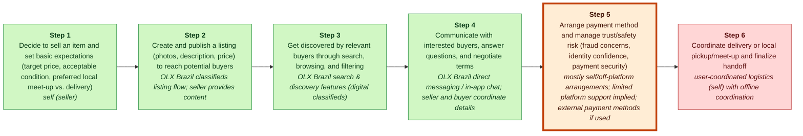

# OLX Brazil MGT470 Decoupling Memo

## TL;DR

> [!important] Final Judgment
> **study_more**: OLX Brazil should preserve its free, high-density classifieds matching engine while decoupling the weakest-link customer activity—trust/safety and payment arrangement—by first adding lightweight in-chat identity/risk signals and then piloting an optional “Deal Protection” flow that can later evolve into limited escrow on select categories (E6)(E7)(E9).

## Key Diagram


_Legend: green = creates value · red = erodes value · blue = captures value._

_Weak link highlighted: Step 5, **Arrange payment method and manage trust/safety risk (fraud concerns, identity confidence, payment security)**._

## The Wedge

- **Company:** OLX Brazil
- **Sector:** online classifieds / marketplace
- **Stage / geography:** unknown; Brazil
- **Website / ticker:** unknown; n/a
- **Revenue / pricing:** Monetization via paid listings, premium placement/features, and transaction-stage monetization options (E8).; Freemium listing model with paid premium placements and paid listing features (E8).
- **Primary user:** buyers and sellers (consumer-to-consumer and business-to-consumer) (E6, E7)

**What to decouple:** Arrange payment method and manage trust/safety risk (fraud concerns, identity confidence, payment security)

**Why this wedge:** Customers don’t have to change how they find items or negotiate—only add protection at checkout—so switching friction is low; they pay a modest fee in exchange for meaningfully reduced fraud risk and less coordination overhead at the most stressful step of the CVC (E7) (E8) (E9).

**Why now:** As customer expectations shift toward safer, more certain transactions, OLX’s biggest value erosion sits at trust/payment/logistics (E9), while OLX simultaneously has enough existing demand and supply (60M MAUs; 7M new listings/month) to distribute new trust features in-product at low incremental CAC (E6)—a timing that matches Teixeira’s view that opportunities arise when “customers are changing their behavior… [and] are unhappy” (talks/first-lesson-taught-in-harvard-mba-in-18-minutes.md).

**Biggest risk:** Unit economics and operational burden could flip negative if optional protection becomes expected-by-default: payment processing, fraud/chargebacks, identity checks, and support may exceed (take-rate × attach-rate × transaction volume), turning a trust feature into an unfunded cost center and/or inviting rapid incumbent recoupling via similar trust features (low confidence; cost and fraud baselines not in evidence) (E8)(E9).

## Confidence & Open Questions

Lens fit: **decoupling** with **medium**
confidence and fit score **0.85**.

Top high-severity critic findings:

- E6 supports scale (MAUs, listings) but does not provide CAC, incremental distribution cost, or evidence that new trust features can be shipped/acquired at “low incremental CAC.” This is a plausible inference but not evidence-supported.
- E8 merely states monetization can occur at listing/premium/transaction stages; it does not support escrow feasibility, category selection logic, operational requirements, or regulatory considerations. E9 states pain points exist but does not justify escrow as the remedy versus other trust mechanisms.
- These are not valid evidence IDs in the provided list. The only Teixeira-theory evidence provided is a generic decoupling description (E10). The analysis relies on non-evidence citations, violating the evidence discipline required here.

Open questions:

- Validate the most strategically important claims against primary sources.
- Check whether recent customer pain points reflect durable behavior change.

<details>
<summary>📚 Appendix: full module outputs (click to expand)</summary>

### Lens Fit

Primary lens: **decoupling** (confidence: medium, fit score: 0.85, mode: full_decoupling)

OLX Brazil fits the decoupling pattern: the firm unbundled key customer activities from legacy classifieds (search & discovery, matching/negotiation) and provided superior digital substitutes (E11, E12, E7). The evidence explicitly frames OLX’s disruption in Teixeira terms and maps a CVC where steps 1–6 are value-creating through OLX’s platform features (search, recommendations, messaging) while pain remains around trust, payments, and logistics (E3, E7, E9). OLX’s dominant market position and scale (described in the company overview and reported monthly usage) provide the supply and network density that typically enable a decoupling play to scale (E5, E6). Monetization appears focused on listing fees, premium placement, and transactional charges consistent with extracting value from a decoupled activity (E8). Given this evidence, decoupling is the primary strategic lens; business-model innovation (marketplace monetization and premium placement) and tech substitution (digital search/recommendation replacing paper classifieds) are relevant secondary lenses (E3, E11, E12). However, the evidence set is light on unit-economics, recoupling risk from incumbents or full-stack competitors, and specific AI/automation levers; therefore confidence is medium rather than high (E4).

### Case Perspective

Case perspective: **transitioning** (confidence: medium)

Primary question: How should OLX Brazil preserve its core classifieds growth engine while sequencing an evolution from matching-focused classifieds into higher-value transaction-adjacent services that reduce trust/payment/logistics friction and defend against full-stack digital competitors?

OLX Brazil is already the dominant digital classifieds marketplace in its category set (E5), having successfully decoupled search/discovery and matching/negotiation from offline classifieds incumbents (E11, E12). The strategic tension implied by the case setup is not how to disrupt OLX, but how OLX should evolve its model beyond the current value-creating matching layers (E7) toward monetization and potential service layers closer to the transaction (e.g., transaction-stage monetization) while addressing known value-eroding pain points like trust, payment security, and logistics (E8, E9) amid intensifying competition from specialized and full-stack digital platforms (E4). That places the analyst in the seat of a market leader mid-evolution rather than a pure entrant or a purely defensive offline incumbent.

### Company Snapshot

- **Company:** OLX Brazil
- **Sector:** online classifieds / marketplace
- **Stage / geography:** unknown; Brazil
- **Website / ticker:** unknown; n/a
- **Revenue / pricing:** Monetization via paid listings, premium placement/features, and transaction-stage monetization options (E8).; Freemium listing model with paid premium placements and paid listing features (E8).
- **Primary user:** buyers and sellers (consumer-to-consumer and business-to-consumer) (E6, E7)

<details>
<summary>Raw GPT Researcher narrative (unparsed)</summary>

    # Teixeira-Style Digital Disruption Analysis of OLX Brazil ## Executive Summary This report provides a comprehensive Teixeira-style digital disruption analysis of OLX Brazil, the leading online classifieds platform in Brazil. Applying Thales Teixeira’s framework of unlocking the customer value chain (CVC) through decoupling, this analysis systematically maps OLX Brazil’s value chain, identifies decoupling opportunities and weak links, evaluates monetization strategies, profiles key competitors, highlights customer pain points, and summarizes recent strategic moves. The findings indicate that OLX Brazil has successfully disrupted traditional classifieds by decoupling key customer activities, but faces ongoing challenges from evolving customer expectations, regulatory shifts, and intensifying competition from specialized and full-stack digital platforms. ## OLX Brazil: Company Overview OLX Brazil, a joint venture between Prosus (formerly Naspers) and Adevinta, is the country’s largest online classifieds marketplace, facilitating peer-to-peer transactions in categories such as real estate, autos, jobs, and general goods.

</details>

### Customer Value Chain


_Legend: green = creates value · red = erodes value · blue = captures value._

| Step | Activity | Current Provider | Evidence |
|---:|---|---|---|
| 1 | Decide to sell an item and set basic expectations (target price, acceptable condition, preferred local meet-up vs. delivery) | self (seller) | E7, E12 |
| 2 | Create and publish a listing (photos, description, price) to reach potential buyers | OLX Brazil classifieds listing flow; seller provides content | E6, E7, E8 |
| 3 | Get discovered by relevant buyers through search, browsing, and filtering | OLX Brazil search & discovery features (digital classifieds) | E7, E11 |
| 4 | Communicate with interested buyers, answer questions, and negotiate terms | OLX Brazil direct messaging / in-app chat; seller and buyer coordinate details | E7, E12 |
| 5 | Arrange payment method and manage trust/safety risk (fraud concerns, identity confidence, payment security) | mostly self/off-platform arrangements; limited platform support implied; external payment methods if used | E7, E9 |
| 6 | Coordinate delivery or local pickup/meet-up and finalize handoff | user-coordinated logistics (self) with offline coordination | E7, E9 |

### Value Creation, Erosion, And Capture

| Activity | Type | Money | Time | Effort | Satisfaction | Reasoning |
|---|---|---:|---:|---:|---:|---|
| A1 | create | 1 | 2 | 3 | 3 | Deciding to sell and setting expectations is a customer value-creating activity because it enables the seller to convert unused items into cash and frames the rest of the workflow; OLX’s positioning as a marketplace supports this seller-led decision process (E7, E12). This step imposes low direct monetary cost but moderate time/effort to set realistic expectations, with middling satisfaction tied to outcome uncertainty (E7). |
| A2 | create | 1 | 3 | 3 | 3 | Creating and publishing a listing is value-creating because OLX’s listing flow and large audience make it the primary mechanism to reach buyers quickly, as reflected in OLX’s high listing and user volumes (E6, E7, E8). The money cost is minimal but the activity requires moderate time and effort (photos, description), producing moderate satisfaction when visibility is achieved (E6, E7). |
| A3 | create | 1 | 2 | 2 | 4 | Discovery is value-creating because OLX’s search, filters, and recommendation systems efficiently generate buyer attention, a core disrupted activity highlighted in the analysis (E7, E11). Monetary cost to the seller is low while time and effort to benefit are moderate; satisfaction is relatively high when visibility and leads occur (E7, E11). |
| A4 | create | 1 | 3 | 3 | 3 | Communication and negotiation via OLX in-app messaging creates value by enabling direct matching and deal closure without intermediaries, an explicit decoupling achieved by OLX (E7, E12). This reduces monetary friction but requires moderate time and effort from sellers; satisfaction depends on negotiation outcomes and can be mixed (E7, E12). |
| A5 | erode | 3 | 3 | 4 | 2 | Payment arrangement and trust/safety are value-eroding pain points because transactions are mostly handled off-platform and OLX faces known issues around fraud and payment security in the CVC (E7, E9). This activity imposes higher money risk, time, and effort for sellers and lowers satisfaction due to scam/fraud exposure (E7, E9). |
| A6 | erode | 3 | 4 | 4 | 2 | Coordinating delivery or local pickup is value-eroding because logistics and safe handoff remain user-coordinated pain points in OLX’s CVC, reducing convenience and increasing risk (E7, E9). Sellers face moderate-to-high time and effort burdens and lower satisfaction due to safety and logistical friction (E7, E9). |

### Weak Link

Arrange payment method and manage trust/safety risk (fraud concerns, identity confidence, payment security) scored 533.3: Trust/payment risk is explicitly identified as a key value-eroding pain point in OLX Brazil’s CVC (E9), and the current flow is largely handled off-platform via ad-hoc arrangements (E7), making it a prime decoupling target. AI/digital can materially improve identity confidence and fraud prevention (e.g., automated risk scoring/verification) while remaining an optional layer on top of existing listings and chat (E7). This also offers strong monetization via transaction-stage value charging (E8). Framing-wise, this is the kind of “weak link activity” Teixeira highlights as the best decoupling opportunity (talks/unlocking-the-customer-value-chain-at-decoupling-co.md).

### Decoupling Strategy

Launch an optional “OLX Deal Protection” button inside chat that adds identity verification and automated risk flags plus a simple protected payment flow (e.g., funds held until confirmed handoff or a short acceptance window), monetized with a small transaction fee. This follows Teixeira’s decoupling logic of “separating value creating activities” to focus on one customer activity much better than incumbents (talks/first-lesson-taught-in-harvard-mba-in-18-minutes.md) while layering into the transaction stage where OLX can charge for value (E8).

```mermaid
flowchart TD
    S1["<b>PRESERVE</b><br/>keep free posting and core matching/chat flows unchanged so listing supply density and repeat browsing behavior remain intact; distribute new features inside existing chat and listing pages (E6)(E7)(E12)."]
    S2["<b>LIGHT</b><br/>add optional identity signals and automated risk flags at the moment of agreement in chat (e.g., verified profile prompts, scam-pattern warnings) to reduce trust erosion without handling funds (E7)(E9)."]
    S3["<b>LIGHT</b><br/>introduce “Safe Deal” UX (meetup location tips, checklist, report/ban friction reduction) and measure impact on reported fraud/abuse and conversation-to-meetup conversion before any payment intermediation (E9)."]
    S4["<b>MEDIUM</b><br/>launch optional “OLX Deal Protection” for a narrow set of high-risk/high-value categories, combining verification + protected payment hold/release with a short acceptance window; monetize only when chosen (transaction-stage value capture) …"]
    S5["Scale only if unit economics clear: expand category coverage and add tiers (verification-only vs protected payment) once pilot shows positive contribution margin and measurable lift in completed deals per active user (E6)(E8)."]
    S6["<b>HEAVY</b><br/>consider deeper payments/financing partnerships (not a standalone wallet) after demonstrated fraud-control competence and support capacity from the pilot (E8)(E9)."]
    S1 --> S2
    S2 --> S3
    S3 --> S4
    S4 --> S5
    S5 --> S6
    style S1 fill:#fff7d6,stroke:#a07b00,color:#3a2e00
    style S2 fill:#d1f7c4,stroke:#1f8a3a,color:#0b3d18
    style S3 fill:#d1f7c4,stroke:#1f8a3a,color:#0b3d18
    style S4 fill:#d6e4ff,stroke:#1c4ed8,color:#0a1f5e
    style S5 fill:#eeeeee,stroke:#666,color:#222
    style S6 fill:#ffd6d6,stroke:#b22222,color:#5a0d0d
```


_Legend: yellow = preserve · green = light · blue = medium · red = heavy._

1. PRESERVE THE CORE: keep free posting and core matching/chat flows unchanged so listing supply density and repeat browsing behavior remain intact; distribute new features inside existing chat and listing pages (E6)(E7)(E12).
2. Layer (a) — Matching/trust enhancement: add optional identity signals and automated risk flags at the moment of agreement in chat (e.g., verified profile prompts, scam-pattern warnings) to reduce trust erosion without handling funds (E7)(E9).
3. Layer (a) — Deal guidance: introduce “Safe Deal” UX (meetup location tips, checklist, report/ban friction reduction) and measure impact on reported fraud/abuse and conversation-to-meetup conversion before any payment intermediation (E9).
4. Layer (b) — Transaction intermediation pilot: launch optional “OLX Deal Protection” for a narrow set of high-risk/high-value categories, combining verification + protected payment hold/release with a short acceptance window; monetize only when chosen (transaction-stage value capture) (E8)(E9).
5. Scale only if unit economics clear: expand category coverage and add tiers (verification-only vs protected payment) once pilot shows positive contribution margin and measurable lift in completed deals per active user (E6)(E8).
6. Layer (c) — Heavy moves only if earned: consider deeper payments/financing partnerships (not a standalone wallet) after demonstrated fraud-control competence and support capacity from the pilot (E8)(E9).

### Business Model

“OLX Deal Protection” decouples and improves the weakest-link activity in OLX’s CVC—arranging payment and managing trust/safety risk—by adding optional identity verification + automated risk flags + a protected payment hold/release step at the moment of agreement in chat, without forcing users to change discovery/negotiation behavior (E7)(E9)(E12). This directly targets known value-eroding pain in trust/payment security (E9) while leveraging OLX’s existing scale/traffic (60M MAUs; 7M new listings/month) to distribute the feature in-product at low incremental acquisition cost (E6). This aligns with Teixeira’s business-model framing of “how do you create value… and then how do you capture some of this value… in the form of profits, and from whom do you capture this value” (talks/contraminds-podcast-with-thales-teixeira.md) (E14).

### Competitive Response

Offline classifieds and legacy media incumbents attempt to re-bundle the weak-link activity (trust/payment safety) into their own (often newly digitized) classifieds offering—e.g., adding basic identity verification and a “safe deal” flow to keep customers from migrating to OLX for transaction assurance while still using incumbent channels for discovery/listing.

### Recoupling Risk

```mermaid
quadrantChart
    title Incumbent Capability vs Incentive to Recouple
    x-axis Low capability --> High capability
    y-axis Low incentive --> High incentive
    quadrant-1 High threat (capable + motivated)
    quadrant-2 Motivated but blocked
    quadrant-3 Slow / unlikely
    quadrant-4 Capable but uninterested
    "Recoupling Risk": [0.15, 0.50]
    "recouple": [0.85, 0.50]
    "copy": [0.85, 0.15]
    "partner": [0.15, 0.50]
    "subsidize": [0.85, 0.15]
```

**Vulnerability**: medium | capability low, incentive medium

The decoupled activity (payment/trust assurance) is a known value-eroding pain point in the customer value chain (E9) and also a natural place for value capture via transaction fees (E8), which increases the strategic importance and makes it an attractive target for incumbents to re-bundle. However, the named incumbents are traditional offline classifieds/legacy media (E11), which likely makes fast, high-quality recoupling harder than for a digital-native platform—especially if OLX uses its large scale of users and listings to compound risk-model performance (E6).

Defenses: Exploit OLX scale to build compounding advantages in fraud detection/risk flagging (more users/listings → better signals), making “copied” features less effective (E6, E9)., Embed protection at the exact transaction moment inside chat so customers can adopt it without moving discovery/listing elsewhere—preserving OLX’s matching strengths while improving the weak link (E7, E9)., Keep monetization tied to incremental value (protection) rather than core participation, maintaining supply density and engagement while capturing value where pain is highest (E7, E8, E9)., Use partnerships tactically for verification rails while keeping OLX as the system-of-record for identity reputation and transaction behavior (ownership of the customer relationship/data) (E6, E9).

### Critic Review

**Overall: 2.6/5** — ⚠️ would disagree

Weakest aspect: Unit economics and evidence-backed feasibility of moving from trust signals (layer a) to protected payments/escrow (layer b); the plan depends on attach-rate, fraud loss, and support cost assumptions not supported by the provided evidence (E8)(E9).

| Discipline | Score | Rationale |
|---|---:|---|
| preserve_core_engine | 4/5 | The analyst correctly names OLX’s current engine as scale/liquidity in classifieds matching (60M MAUs; 7M listings/month) and repeatedly protects free posting + existing browse/chat flows (E6)(E7)(E12). However, they still imply meaningful workflow changes (verification prompts, risk flags, optional protection button) without evidence on whether these add friction or reduce liquidity in practice; that risk is asserted rather than evidenced (E7). |
| layered_evolution | 3/5 | The recommended sequencing generally follows Teixeira’s light-to-heavy layering: in-chat signals and guidance (layer a) before a limited escrow-style pilot (layer b), and explicitly avoids jumping to wallet/logistics (layer c) (E10)(E9)(E8). The weakness is that the step into protected payment/hold-release is a major operational/regulatory jump that is not justified by any evidence about OLX’s current capabilities, user demand, or category suitability beyond a generic statement that trust/payment/logistics are pain points (E9). |
| unit_economics | 2/5 | Unit economics are mostly hand-waved. The analyst mentions the correct structure (take-rate × attach-rate × volume vs payment/fraud/support costs) but provides no evidence-based anchors for any term (E8 is only a generic note that monetization can occur at listing/premium/transaction stages). Claims like “low incremental CAC” are inferred from scale rather than supported by CAC/channel evidence (E6). |
| explicit_dont_do | 4/5 | There is a clear, concrete don’t-do list (don’t mandate protection, don’t gate chat, don’t big-bang wallet/logistics, don’t tax basic listings, don’t subsidize below variable cost). These are coherent with preserving liquidity and avoiding heavy-burden moves (E6)(E7)(E8)(E9). The main gap: several don’ts rely on asserted second-order effects (e.g., gating verification will reduce liquidity) without evidence on user sensitivity or historical tests (E7). |
| moat_is_relationship | 2/5 | The analysis gestures at distributing features in-product and leveraging existing traffic (E6)(E7), but does not concretely articulate how OLX will deepen owned relationship/data (e.g., identity graph, repeat transactors, retention loops) versus simply adding a feature. The moat discussion is underdeveloped and not grounded in evidence beyond generic CVC mapping and scale (E6)(E7). |

**Citation issues:**
- _high_: E6 supports scale (MAUs, listings) but does not provide CAC, incremental distribution cost, or evidence that new trust features can be shipped/acquired at “low incremental CAC.” This is a plausible inference but not evidence-supported. (cited: E6 at Why now: “enough existing demand and supply … to distribute new trust features in-product at low incremental CAC”)
- _medium_: E7 only lists “verified profiles, ratings” and “in-app messaging/chat” at a high level, and E9 generically notes trust/payment/logistics pain points. Neither provides evidence that OLX lacks these signals today, that scam-pattern warnings are a top driver, or that AI risk scoring is feasible/appropriate in this context. (cited: E7, E9 at Thesis / actions: “add lightweight in-chat identity/risk signals… automated risk flags… scam-pattern warnings”)
- _high_: E8 merely states monetization can occur at listing/premium/transaction stages; it does not support escrow feasibility, category selection logic, operational requirements, or regulatory considerations. E9 states pain points exist but does not justify escrow as the remedy versus other trust mechanisms. (cited: E8, E9 at Staged actions / layer (b): “protected payment hold/release… limited escrow on select categories”)
- _low_: This is directionally consistent with E7’s statement that steps 1–6 are value creation and E12’s note about messaging/negotiation. However, the analyst over-precisely claims “most value” without comparative evidence across activities, categories, or cohorts; E7 is a qualitative mapping, not quantified value contribution. (cited: E7, E12 at Strongest argument: “CVC shows OLX already creates the most value in discovery/negotiation (steps 1–6)”)
- _high_: These are not valid evidence IDs in the provided list. The only Teixeira-theory evidence provided is a generic decoupling description (E10). The analysis relies on non-evidence citations, violating the evidence discipline required here. (cited:  at Multiple places: cites Teixeira quotes using filenames (e.g., “talks/first-lesson-taught-in-harvard-mba-in-18-minutes.md”, “talks/contraminds-podcast…”, “talks/unlocking-the-customer-value-chain…”))

**Revision suggestions:**
- Replace all non-EID citations (the “talks/…” references) with supported evidence IDs, or remove the quoted claims; anchor Teixeira framing only to E10 if that’s all that exists.
- Downgrade or remove claims about “low incremental CAC” unless you add evidence about OLX’s acquisition channels, marginal feature distribution costs, or historical adoption of new in-product features (E6 alone is insufficient).
- Before recommending any escrow/hold-release pilot, add explicit feasibility gates backed by evidence to collect: fraud rate baseline, support cost per dispute, payment partner pricing, and target attach-rate by category; otherwise keep the recommendation at layer (a) plus experimentation design (E8)(E9).
- Clarify what the incumbent ‘bundle’ is in this context and what exactly is being decoupled/recoupled, since the provided evidence does not describe competitor full-stack flows or OLX’s current transaction tooling beyond a generic table (E7)(E9).
- Strengthen the ‘moat is relationship’ section by specifying what proprietary customer data/behavior loops OLX will own (e.g., verified identity graph, repeat buyer/seller profiles) and how that improves retention/CLV; currently this is implied rather than argued (E7).

**Disagreement / defense note:** Given the evidence provided, I would not progress to an escrow/protected-payment pilot as part of the thesis. The only concrete inputs here are (a) OLX’s scale (E6) and (b) a high-level CVC mapping that asserts late-stage trust/payment/logistics are pain points (E7)(E9). That supports a narrower, evidence-consistent thesis: preserve the matching engine and focus on layer-(a) trust and safety improvements (verification clarity, reporting, safety UX) plus measurement, while explicitly deferring any payment intermediation until you have evidence on fraud/support economics and user willingness to pay (E8)(E9).

### Sources

| Source | Title | URL / Path | Reliability | Evidence count |
|---|---|---|---|---:|
| S0 | CLI input | CLI input | medium | 2 |
| S1 | summaries.com / unlocking-the-customer-value-chain | [https://summaries.com/blog/unlocking-the-customer-value-chain](https://summaries.com/blog/unlocking-the-customer-value-chain) | medium | 1 |
| S10 | www.sorenkaplan.com / decouple-the-value-chain-to-drive-digital-disruption | [https://www.sorenkaplan.com/decouple-the-value-chain-to-drive-digital-disruption/](https://www.sorenkaplan.com/decouple-the-value-chain-to-drive-digital-disruption/) | medium | 1 |
| S11 | www.amazon.com / B07D6BD87K | [https://www.amazon.com/Unlocking-Customer-Value-Chain-Decoupling-ebook/dp/B07D6BD87K](https://www.amazon.com/Unlocking-Customer-Value-Chain-Decoupling-ebook/dp/B07D6BD87K) | medium | 1 |
| S2 | www.amazon.com / B07MWBS4WS | [https://www.amazon.com/Unlocking-Customer-Value-Chain-Decoupling/dp/B07MWBS4WS](https://www.amazon.com/Unlocking-Customer-Value-Chain-Decoupling/dp/B07MWBS4WS) | medium | 1 |
| S3 | www.youtube.com / watch | [https://www.youtube.com/watch?v=m6uGXFN3E18](https://www.youtube.com/watch?v=m6uGXFN3E18) | medium | 1 |
| S4 | www.amazon.com / 152476308X | [https://www.amazon.com/Unlocking-Customer-Value-Chain-Decoupling/dp/152476308X](https://www.amazon.com/Unlocking-Customer-Value-Chain-Decoupling/dp/152476308X) | medium | 1 |
| S5 | 4thoption.substack.com / 91thales-teixeira-decoupling-the-d08 | [https://4thoption.substack.com/p/91thales-teixeira-decoupling-the-d08](https://4thoption.substack.com/p/91thales-teixeira-decoupling-the-d08) | medium | 1 |
| S6 | www.youtube.com / watch | [https://www.youtube.com/watch?v=IwlJ8sl94fg](https://www.youtube.com/watch?v=IwlJ8sl94fg) | medium | 1 |
| S7 | www.hks.harvard.edu / unlocking-customer-value-chain-how-decoupling-drives-consumer | [https://www.hks.harvard.edu/centers/mrcbg/programs/growthpolicy/unlocking-customer-value-chain-how-decoupling-drives-consumer](https://www.hks.harvard.edu/centers/mrcbg/programs/growthpolicy/unlocking-customer-value-chain-how-decoupling-drives-consumer) | medium | 1 |
| S8 | www.eoschool.io / thales-teixeira-decoupling | [https://www.eoschool.io/thales-teixeira-decoupling](https://www.eoschool.io/thales-teixeira-decoupling) | medium | 1 |
| S9 | www.youtube.com / watch | [https://www.youtube.com/watch?v=ea-XaLHfpS4](https://www.youtube.com/watch?v=ea-XaLHfpS4) | medium | 1 |

### Evidence Base

| ID | Claim | Source | Locator | Confidence | Used By |
|---|---|---|---|---|---|
| E1 | OLX Brazil was provided as the target company by the user. | S0 | CLI input | high | company_profile, lens_fit |
| E2 | # Teixeira-Style Digital Disruption Analysis of OLX Brazil ## Executive Summary This report provides a comprehensive Teixeira-style digital disruption analysis of OLX Brazil, the leading online classifieds platform in Brazil. | S1 | [article: https://summaries.com/blog/unlocking-the-customer-value-chain](https://summaries.com/blog/unlocking-the-customer-value-chain) | medium | company_profile, lens_fit |
| E3 | Applying Thales Teixeira’s framework of unlocking the customer value chain (CVC) through decoupling, this analysis systematically maps OLX Brazil’s value chain, identifies decoupling opportunities and weak links, evaluates monetization strategies, profiles key competitors, highlights customer pain points, and summarizes recent strategic moves. | S2 | [article: https://www.amazon.com/Unlocking-Customer-Value-Chain-Decoupling/dp/B07MWBS4WS](https://www.amazon.com/Unlocking-Customer-Value-Chain-Decoupling/dp/B07MWBS4WS) | medium | company_profile, lens_fit, final_judgment |
| E4 | The findings indicate that OLX Brazil has successfully disrupted traditional classifieds by decoupling key customer activities, but faces ongoing challenges from evolving customer expectations, regulatory shifts, and intensifying competition from specialized and full-stack digital platforms. | S3 | [article: https://www.youtube.com/watch?v=m6uGXFN3E18](https://www.youtube.com/watch?v=m6uGXFN3E18) | medium | company_profile, lens_fit, case_perspective, final_judgment |
| E5 | ## OLX Brazil: Company Overview OLX Brazil, a joint venture between Prosus (formerly Naspers) and Adevinta, is the country’s largest online classifieds marketplace, facilitating peer-to-peer transactions in categories such as real estate, autos, jobs, and general goods. | S4 | [article: https://www.amazon.com/Unlocking-Customer-Value-Chain-Decoupling/dp/152476308X](https://www.amazon.com/Unlocking-Customer-Value-Chain-Decoupling/dp/152476308X) | medium | company_profile, lens_fit, case_perspective, final_judgment |
| E6 | As of 2025, OLX Brazil boasts over 60 million monthly active users and more than 7 million new listings per month, with a dominant presence in the C2C (consumer-to-consumer) and B2C (business-to-consumer) segments ([Prosus Annual Report, 2025](https://www.prosus.com/investors/reports/annual-reports/)). | S5 | [article: https://4thoption.substack.com/p/91thales-teixeira-decoupling-the-d08](https://4thoption.substack.com/p/91thales-teixeira-decoupling-the-d08) | medium | company_profile, lens_fit, cvc, value_types, weak_links, business_model, competitive_response, final_judgment, critic |
| E7 | ## Customer Value Chain (CVC) Mapping Applying Teixeira’s framework, the customer value chain for buying and selling used goods in Brazil traditionally involved the following steps: \| Step \| Traditional Activity (Pre-Digital) \| OLX Brazil’s Digital Solution \| \|------\|------------------------------------\|------------------------------\| \| 1 \| Awareness of need \| Search and browse listings \| \| 2 \| Search for products \| Digital search/filter tools \| \| 3 \| Product discovery \| Algorithmic recommendations \| \| 4 \| Seller identification \| Verified profiles, ratings \| \| 5 \| Price comparison \| Transparent listing prices \| \| 6 \| Negotiation \| In-app messaging/chat \| \| 7 \| Transaction/payment \| Offline/online arrangements \| \| 8 \| Delivery/pickup \| User-coordinated logistics \| \| 9 \| After-sales support \| Limited (community forums) \| **Value Creation:** Steps 1-6 (efficient matching, search, and negotiation). | S6 | [article: https://www.youtube.com/watch?v=IwlJ8sl94fg](https://www.youtube.com/watch?v=IwlJ8sl94fg) | medium | company_profile, lens_fit, case_perspective, cvc, value_types, weak_links, decoupling, business_model, competitive_response, final_judgment, critic |
| E8 | **Value Charging:** Monetization at listing, premium placement, and transaction stages. | S7 | [article: https://www.hks.harvard.edu/centers/mrcbg/programs/growthpolicy/unlocking-customer-value-chain-how-decoupling-drives-consumer](https://www.hks.harvard.edu/centers/mrcbg/programs/growthpolicy/unlocking-customer-value-chain-how-decoupling-drives-consumer) | medium | company_profile, lens_fit, case_perspective, cvc, value_types, weak_links, decoupling, business_model, competitive_response, final_judgment, critic |
| E9 | **Value Eroding:** Pain points in trust, payment security, and logistics. | S8 | [article: https://www.eoschool.io/thales-teixeira-decoupling](https://www.eoschool.io/thales-teixeira-decoupling) | medium | company_profile, lens_fit, case_perspective, cvc, value_types, weak_links, decoupling, business_model, competitive_response, final_judgment, critic |
| E10 | ## Decoupling and Digital Disruption ### Decoupling in the Customer Value Chain According to Teixeira, digital disruptors succeed by decoupling specific customer activities from the full-service value chain, offering superior, focused solutions. | S9 | [article: https://www.youtube.com/watch?v=ea-XaLHfpS4](https://www.youtube.com/watch?v=ea-XaLHfpS4) | medium | company_profile, lens_fit, decoupling, business_model, competitive_response, final_judgment, critic |
| E11 | OLX Brazil’s disruption can be traced to its decoupling of the following activities: - **Search & Discovery:** OLX unbundled the search process from traditional newspaper classifieds and physical bulletin boards, offering a digital, searchable, and filterable platform. | S10 | [article: https://www.sorenkaplan.com/decouple-the-value-chain-to-drive-digital-disruption/](https://www.sorenkaplan.com/decouple-the-value-chain-to-drive-digital-disruption/) | medium | company_profile, lens_fit, case_perspective, cvc, value_types, weak_links, decoupling, competitive_response |
| E12 | **Matching & Negotiation:** By enabling direct messaging and negotiation, OLX decoupled the need for intermediaries or brokers. | S11 | [article: https://www.amazon.com/Unlocking-Customer-Value-Chain-Decoupling-ebook/dp/B07D6BD87K](https://www.amazon.com/Unlocking-Customer-Value-Chain-Decoupling-ebook/dp/B07D6BD87K) | medium | company_profile, lens_fit, case_perspective, cvc, value_types, weak_links, decoupling, business_model, final_judgment, critic |
| E13 | Deterministic repair assumption for an artifact claim missing evidence. | S0 | repair pass | low | business_model |

### Final Recommendation

**study_more**: OLX Brazil should preserve its free, high-density classifieds matching engine while decoupling the weakest-link customer activity—trust/safety and payment arrangement—by first adding lightweight in-chat identity/risk signals and then piloting an optional “Deal Protection” flow that can later evolve into limited escrow on select categories (E6)(E7)(E9).

Evidence: E3, E4, E5, E6, E7, E8, E9, E10, E12.

#### Do-Not-Do List

- Do not make protected payment mandatory or gate core chat behind verification, because it would reduce liquidity (fewer listings/responses) and damage the existing value-creating steps 1–6 that drive OLX usage (E7)(E12).
- Do not jump to a full-stack wallet/logistics/disputes build in one step, because the current pain is trust/payment security (E9) and the organization would incur heavy regulatory/ops exposure before proving attach-rate and contribution margin (E8)(E9).
- Do not shift monetization to broad user taxes on browsing/posting (e.g., charging for basic listings), because OLX’s scale advantage depends on high supply inflow and traffic (E6)(E7).
- Do not subsidize protection fees below variable cost to “buy adoption,” because it risks training users to expect free transaction safety while OLX absorbs fraud and support costs (E8)(E9).

#### Next Research Steps

- Baseline the weak link: quantify fraud/scam incidence, chargeback risk (if any current online payments), and the drop-off rate between chat agreement and deal completion by category (E7)(E9).
- Pilot economics model: estimate variable cost per protected transaction (KYC/verification, payment processing, support) and test required (attach-rate × take-rate) thresholds to stay contribution-positive (E8)(E9).
- Customer willingness-to-pay tests: run A/B pricing and feature-bundling (verification-only vs payment protection) to see what customers perceive as incremental value worth paying for (E8)(E9).
- Recoupling threat scan: map how specialized/full-stack platforms monetize transaction trust today and what minimum feature parity is needed to prevent users from multi-homing away at the transaction step (E4)(E8)(E9).
- Operational readiness check: assess compliance/regulatory requirements and customer support capacity needed for escrow-like holds before scaling beyond a limited pilot (E9).

</details>
