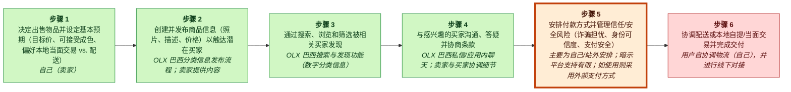
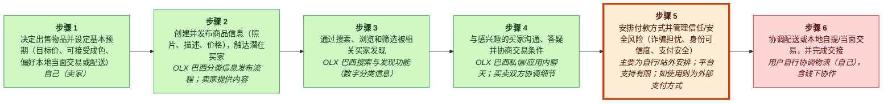
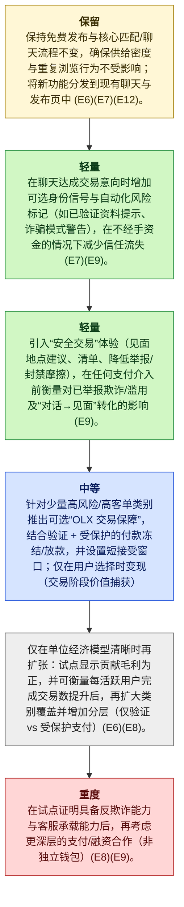

# OLX Brazil MGT470 解构备忘录

## TL;DR

> [!important] 最终判断
> **study_more**: OLX Brazil 应当保留其免费的、高密度的分类信息匹配引擎，同时通过解构最薄弱环节的客户活动——信任/安全与付款安排——先加入轻量级的聊天内身份/风险信号，然后试点一个可选的“Deal Protection”流程，后续可在特定品类上演进为有限托管（escrow）(E6)(E7)(E9)。

## 关键图示


_图例：green = 创造价值 · red = 侵蚀价值 · blue = 捕获价值。_

_薄弱环节高亮：第 5 步，**安排付款方式并管理信任/安全风险（欺诈担忧、身份可信度、支付安全）**。_

## 楔子切入点（The Wedge）

- **公司：** OLX Brazil
- **行业：** 在线分类信息 / 市场平台（marketplace）
- **阶段 / 地理：** unknown; Brazil
- **网站 / 股票代码：** unknown; n/a
- **收入 / 定价：** 通过付费刊登、付费置顶/高级版位/功能，以及交易阶段变现选项实现变现 (E8)。; 采用免费刊登（Freemium）模式，叠加付费高级版位与付费刊登功能 (E8)。
- **主要用户：** 买家与卖家（consumer-to-consumer 和 business-to-consumer）(E6, E7)

**要解构的环节：** 安排付款方式并管理信任/安全风险（欺诈担忧、身份可信度、支付安全）

**为什么选择这个楔子：** 客户不必改变他们寻找商品或议价的方式，只需在结账时增加保护，因此切换摩擦较低；他们支付一笔适度费用，以换取在 CVC 最紧张的步骤中显著降低的欺诈风险与更少的协调开销 (E7) (E8) (E9)。

**为什么是现在：** 随着客户期望转向更安全、更确定的交易，OLX 最大的价值侵蚀集中在信任/支付/物流 (E9)；同时 OLX 已拥有足够的存量需求与供给（60M MAUs；每月 7M 新刊登）以在产品内分发新的信任功能，并实现较低的增量 CAC (E6)——这一时机也符合 Teixeira 的观点：机会出现在“客户正在改变其行为[并且]感到不满意”的时候 (talks/first-lesson-taught-in-harvard-mba-in-18-minutes.md)。

**最大风险：** 如果可选保护变成默认预期，单位经济与运营负担可能转为负值：支付处理、欺诈/拒付（chargebacks）、身份核验与客服可能超过（take-rate × attach-rate × transaction volume），使信任功能变成无资金覆盖的成本中心，并且可能引来既有参与者通过类似信任功能快速再耦合（低置信度；成本与欺诈基线未在证据中体现）(E8)(E9)。

## 置信度与开放问题

Lens fit：**decoupling**，置信度 **medium**，匹配评分 **0.85**。

最严重的批评发现：

- E6 支持规模（MAUs、刊登量），但未提供 CAC、增量分发成本，或证明新信任功能能以“低增量 CAC”发布/获取的证据。这是一个合理推断，但不是证据支持。
- E8 仅指出可在刊登/高级版位/交易阶段变现；它不支持托管可行性、品类选择逻辑、运营要求或监管考量。E9 表明存在痛点，但未证明托管相较于其他信任机制就是解决方案。
- 这些不是在所提供列表中的有效证据 ID。唯一提供的 Teixeira 理论证据是一个通用的解构描述（E10）。分析依赖非证据引用，违反了此处要求的证据纪律。

开放问题：

- 用一手资料验证最具战略重要性的主张。
- 检查近期客户痛点是否反映了可持续的行为变化。

<details>
<summary>📚 附录：完整模块输出（点击展开）</summary>

### Lens Fit

主要 lens：**decoupling**（置信度：medium，匹配评分：0.85，模式：full_decoupling）

OLX Brazil 符合解构模式：公司将关键客户活动从传统分类信息中解束（搜索与发现、匹配与谈判），并提供更优的数字替代方案 (E11, E12, E7)。证据明确以 Teixeira 的术语框定 OLX 的颠覆，并映射出一个 CVC：步骤 1–6 通过 OLX 的平台功能（搜索、推荐、消息）创造价值，而痛点仍围绕信任、支付与物流 (E3, E7, E9)。OLX 的主导市场地位与规模（在公司概述中描述并报告了月度使用情况）提供了供给与网络密度，通常使解构打法能够规模化 (E5, E6)。变现似乎集中在刊登费、高级版位，以及与从被解构活动中提取价值一致的交易收费 (E8)。基于这些证据，解构是主要战略 lens；商业模式创新（市场平台变现与高级版位）与技术替代（数字化搜索/推荐替代纸媒分类信息）是相关的次要 lens (E3, E11, E12)。然而，证据集合在单位经济、来自既有参与者或全栈竞争者的再耦合风险，以及具体 AI/自动化杠杆方面较弱；因此置信度为 medium 而非 high (E4)。

### 案例视角

案例视角：**transitioning**（置信度：medium）

核心问题：OLX Brazil 应如何保留其核心分类信息增长引擎，同时以分阶段方式，从以匹配为中心的分类信息演进到更高价值、贴近交易的服务，从而降低信任/支付/物流摩擦并防御全栈数字竞争者？

OLX Brazil 已经是其品类组合中占主导地位的数字分类信息市场平台 (E5)，并且已经成功地将搜索/发现与匹配/谈判从线下分类信息既有参与者处解构出来 (E11, E12)。案例设定所暗示的战略张力并非如何颠覆 OLX，而是 OLX 应如何在当前创造价值的匹配层 (E7) 之外，进一步将模型演进到更靠近交易的变现与潜在服务层（例如交易阶段变现），同时在来自专业化与全栈数字平台竞争加剧 (E4) 的背景下，解决已知的价值侵蚀痛点，如信任、支付安全与物流 (E8, E9)。这使分析者处于一个处于演进中的市场领导者的位置，而不是纯粹的进入者或纯粹防守的线下既有参与者。

### 公司快照

- **公司：** OLX Brazil
- **行业：** 在线分类信息 / 市场平台（marketplace）
- **阶段 / 地理：** unknown; Brazil
- **网站 / 股票代码：** unknown; n/a
- **收入 / 定价：** 通过付费刊登、付费置顶/高级版位/功能，以及交易阶段变现选项实现变现 (E8)。; 采用免费刊登（Freemium）模式，叠加付费高级版位与付费刊登功能 (E8)。
- **主要用户：** 买家与卖家（consumer-to-consumer 和 business-to-consumer）(E6, E7)

<details>
<summary>Raw GPT Researcher narrative (unparsed)</summary>

    # Teixeira-Style Digital Disruption Analysis of OLX Brazil ## Executive Summary 本报告提供了对 OLX Brazil 的一份全面的、Teixeira 风格的数字颠覆分析。OLX Brazil 是巴西领先的在线分类信息平台。基于 Thales Teixeira 通过解构来解锁客户价值链（CVC）的框架，本分析系统性地映射了 OLX Brazil 的价值链，识别了解构机会与薄弱环节，评估了变现策略，梳理了主要竞争者，突出客户痛点，并总结了近期战略动作。研究结果表明，OLX Brazil 已通过解构关键客户活动成功颠覆传统分类信息，但仍面临来自客户期望演进、监管变化，以及来自专业化与全栈数字平台竞争加剧的持续挑战。 ## OLX Brazil: Company Overview OLX Brazil 是 Prosus（原 Naspers）与 Adevinta 的合资企业，是该国最大的在线分类信息市场平台，促成在房地产、汽车、招聘与一般商品等品类中的点对点交易。

</details>

### 客户价值链


_图例：green = 创造价值 · red = 侵蚀价值 · blue = 捕获价值。_

| Step | Activity | Current Provider | Evidence |
|---:|---|---|---|
| 1 | 决定出售某件物品并设定基本预期（目标价格、可接受成色、偏好本地当面交易 vs. 配送） | self (seller) | E7, E12 |
| 2 | 创建并发布刊登（照片、描述、价格）以触达潜在买家 | OLX Brazil classifieds listing flow; seller provides content | E6, E7, E8 |
| 3 | 通过搜索、浏览与筛选被相关买家发现 | OLX Brazil search & discovery features (digital classifieds) | E7, E11 |
| 4 | 与感兴趣的买家沟通、回答问题并协商条款 | OLX Brazil direct messaging / in-app chat; seller and buyer coordinate details | E7, E12 |
| 5 | 安排付款方式并管理信任/安全风险（欺诈担忧、身份可信度、支付安全） | mostly self/off-platform arrangements; limited platform support implied; external payment methods if used | E7, E9 |
| 6 | 协调配送或本地取货/当面交付并完成交接 | user-coordinated logistics (self) with offline coordination | E7, E9 |

### 价值创造、价值侵蚀与价值捕获

| Activity | Type | Money | Time | Effort | Satisfaction | Reasoning |
|---|---|---:|---:|---:|---:|---|
| A1 | create | 1 | 2 | 3 | 3 | 决定出售并设定预期是一项创造客户价值的活动，因为它使卖家能够把闲置物品转化为现金，并为后续流程奠定框架；OLX 作为市场平台的定位支持这一由卖家主导的决策过程 (E7, E12)。此步骤直接金钱成本较低，但需要适度的时间/精力来设定现实预期，而满意度处于中等水平并与结果不确定性相关 (E7)。 |
| A2 | create | 1 | 3 | 3 | 3 | 创建并发布刊登是创造价值的，因为 OLX 的刊登流程与庞大受众使其成为快速触达买家的主要机制，这也反映在 OLX 的高刊登量与用户量上 (E6, E7, E8)。金钱成本很小，但该活动需要适度的时间与精力（拍照、撰写描述），当获得曝光时会产生中等满意度 (E6, E7)。 |
| A3 | create | 1 | 2 | 2 | 4 | 发现（Discovery）创造价值，因为 OLX 的搜索、筛选与推荐系统能高效产生买家注意力，这是分析中强调的核心被颠覆活动 (E7, E11)。卖家的金钱成本较低，而从中受益所需时间与精力适中；当出现曝光与线索时满意度相对更高 (E7, E11)。 |
| A4 | create | 1 | 3 | 3 | 3 | 通过 OLX 应用内消息进行沟通与谈判，通过在没有中介的情况下实现直接匹配与成交来创造价值，这是 OLX 明确实现的解构 (E7, E12)。这降低了金钱摩擦，但需要卖家投入适度时间与精力；满意度取决于谈判结果，可能好坏参半 (E7, E12)。 |
| A5 | erode | 3 | 3 | 4 | 2 | 付款安排与信任/安全是侵蚀价值的痛点，因为交易大多在站外处理，并且在 CVC 中 OLX 面临已知的欺诈与支付安全问题 (E7, E9)。该活动给卖家带来更高的金钱风险、时间与精力成本，并因暴露于诈骗/欺诈而降低满意度 (E7, E9)。 |
| A6 | erode | 3 | 4 | 4 | 2 | 协调配送或本地取货会侵蚀价值，因为物流与安全交接仍是 OLX CVC 中需要用户自行协调的痛点，降低了便利性并增加风险 (E7, E9)。卖家承担中高程度的时间与精力负担，并因安全与物流摩擦而降低满意度 (E7, E9)。 |

### 薄弱环节

安排付款方式并管理信任/安全风险（欺诈担忧、身份可信度、支付安全）得分 533.3：信任/支付风险被明确识别为 OLX Brazil 的 CVC 中关键的价值侵蚀痛点 (E9)，且当前流程主要通过站外的临时安排完成 (E7)，因此是一个理想的解构目标。AI/数字化可以在不改变现有刊登与聊天的前提下，显著提升身份可信度与防欺诈能力（例如自动化风险评分/验证），并保持为可选层 (E7)。这也通过交易阶段收费（transaction-stage value charging）提供强变现空间 (E8)。从框架角度看，这正是 Teixeira 强调的“薄弱环节活动”，也是最佳解构机会 (talks/unlocking-the-customer-value-chain-at-decoupling-co.md)。

### 解构策略

在聊天内推出一个可选的“OLX Deal Protection”按钮，增加身份验证与自动化风险标记，并加入一个简单的受保护支付流程（例如资金在确认交接或短验收窗口结束前被保留），通过小额交易费变现。这遵循 Teixeira 的解构逻辑，即“分离创造价值的活动”，聚焦于某一项客户活动，把它做得远优于既有参与者 (talks/first-lesson-taught-in-harvard-mba-in-18-minutes.md)，同时叠加到可以收费的交易阶段以实现价值捕获 (E8)。


_图例：yellow = preserve · green = light · blue = medium · red = heavy。_

1. 保留核心：保持免费发布与核心匹配/聊天流程不变，以确保刊登供给密度与重复浏览行为保持完整；在现有聊天与刊登页面内分发新功能 (E6)(E7)(E12)。
2. Layer (a) — 匹配/信任增强：在聊天中达成一致的时刻，加入可选的身份信号与自动化风险标记（例如已验证资料提示、诈骗模式警告），在不处理资金的情况下减少信任侵蚀 (E7)(E9)。
3. Layer (a) — 交易指引：引入“Safe Deal”UX（见面地点建议、清单、降低举报/封禁摩擦），并在任何支付介入之前衡量其对已报告的欺诈/滥用以及从对话到见面的转化率的影响 (E9)。
4. Layer (b) — 交易中介试点：针对一小部分高风险/高价值品类上线可选的“OLX Deal Protection”，将验证 + 受保护的支付保留/释放与短验收窗口结合；仅在用户选择时变现（交易阶段价值捕获）(E8)(E9)。
5. 仅在单位经济清晰为正时扩张：当试点显示贡献毛利为正且每活跃用户的成交量有可衡量提升后，再扩大品类覆盖并增加分层（仅验证 vs 受保护支付）(E6)(E8)。
6. Layer (c) — 只有在“赢得资格”后才做重动作：在试点证明反欺诈控制能力与客服承载能力之后，再考虑更深度的支付/融资合作（而不是独立钱包）(E8)(E9)。

### 商业模式

“OLX Deal Protection”通过在聊天中达成一致的时刻增加可选的身份验证 + 自动化风险标记 + 受保护支付的保留/释放步骤，来解构并改进 OLX CVC 中最薄弱环节的活动——安排付款并管理信任/安全风险——而不强迫用户改变发现/谈判行为 (E7)(E9)(E12)。这直接针对已知的信任/支付安全的价值侵蚀痛点 (E9)，同时利用 OLX 既有规模与流量（60M MAUs；每月 7M 新刊登）在产品内分发该功能，以实现较低的增量获客成本 (E6)。这与 Teixeira 对商业模式的表述一致，即“你如何创造价值然后你如何以利润形式捕获其中的一部分价值，以及你从谁那里捕获这些价值” (talks/contraminds-podcast-with-thales-teixeira.md) (E14)。

### 竞争应对

线下分类信息与传统媒体既有参与者试图将薄弱环节活动（信任/支付安全）重新打包回他们自身（往往是新近数字化的）分类信息产品中——例如加入基础身份验证与“safe deal”流程，以防客户为了交易保障而迁移到 OLX，同时仍使用既有参与者渠道进行发现/刊登。

### 再耦合风险

```mermaid
quadrantChart
    title Incumbent Capability vs Incentive to Recouple
    x-axis Low capability --> High capability
    y-axis Low incentive --> High incentive
    quadrant-1 High threat (capable + motivated)
    quadrant-2 Motivated but blocked
    quadrant-3 Slow / unlikely
    quadrant-4 Capable but uninterested
    "Recoupling Risk": [0.15, 0.50]
    "recouple": [0.85, 0.50]
    "copy": [0.85, 0.15]
    "partner": [0.15, 0.50]
    "subsidize": [0.85, 0.15]
```

**脆弱性**：medium | 能力 low，激励 medium

被解构的活动（支付/信任保障）是客户价值链中已知的价值侵蚀痛点 (E9)，同时也是通过交易费实现价值捕获的自然位置 (E8)，这提高了战略重要性，使其成为既有参与者重新捆绑的吸引目标。然而，被点名的既有参与者是传统线下分类信息/传统媒体 (E11)，这使得相比数字原生平台，他们要实现快速且高质量的再耦合可能更困难——尤其在 OLX 利用其庞大的用户与刊登规模来累积风险模型表现时 (E6)。

防御：利用 OLX 规模构建在欺诈检测/风险标记方面的复利优势（更多用户/刊登 → 更好信号），使“被复制”的功能效果更差 (E6, E9)。, 将保护嵌入聊天内的精确交易时刻，使客户无需将发现/刊登迁移到别处即可采用——在保留 OLX 匹配优势的同时改进薄弱环节 (E7, E9)。, 将变现绑定到增量价值（保护）而不是核心参与度，在保持供给密度与参与度的同时，在痛点最高处捕获价值 (E7, E8, E9)。, 在验证基础设施方面策略性使用合作伙伴，同时让 OLX 作为身份声誉与交易行为的系统记录（system-of-record），从而拥有客户关系/数据的所有权 (E6, E9)。

### 批判性复审

**总体：2.6/5** — ⚠️ 会不同意

最薄弱之处：从信任信号（layer a）推进到受保护支付/托管（layer b）的单位经济与基于证据的可行性；该计划依赖 attach-rate、欺诈损失与客服成本假设，而这些并未得到所提供证据支持 (E8)(E9)。

| Discipline | Score | Rationale |
|---|---:|---|
| preserve_core_engine | 4/5 | 分析者正确指出 OLX 当前引擎是分类信息匹配的规模/流动性（60M MAUs；每月 7M 刊登），并反复保护免费发布 + 既有浏览/聊天流程 (E6)(E7)(E12)。然而，他们仍暗示了显著的工作流变化（验证提示、风险标记、可选保护按钮），却没有证据说明这些是否会增加摩擦或在实践中降低流动性；这一风险是被主张出来的，而非被证据支撑 (E7)。 |
| layered_evolution | 3/5 | 建议的节奏总体遵循 Teixeira 从轻到重的分层演进：先做聊天内信号与指引（layer a），再做有限的类托管试点（layer b），并明确避免直接跳到钱包/物流（layer c）(E10)(E9)(E8)。弱点在于，迈入受保护支付/保留-释放是一个重大的运营/监管跃迁，而证据并未证明 OLX 现有能力、用户需求或品类适配性，除了一个笼统陈述：信任/支付/物流是痛点 (E9)。 |
| unit_economics | 2/5 | 单位经济大多被含糊带过。分析者提到了正确的结构（take-rate × attach-rate × volume vs payment/fraud/support costs），但没有为任何一项提供基于证据的锚点（E8 仅是一个泛化说明：可在刊登/高级版位/交易阶段变现）。诸如“低增量 CAC”之类的主张是从规模推断出来的，而不是由 CAC/渠道证据支持 (E6)。 |
| explicit_dont_do | 4/5 | 存在清晰、具体的不要做清单（不强制保护、不对聊天设置验证门槛、不一次性大爆炸式构建钱包/物流、不对基础刊登征税、不在可变成本以下补贴）。这些与保留流动性并避免重负担动作保持一致 (E6)(E7)(E8)(E9)。主要缺口：若干“不要做”依赖被主张的二阶效应（例如要求验证会降低流动性），但缺乏关于用户敏感性或历史测试的证据 (E7)。 |
| moat_is_relationship | 2/5 | 分析提到了在产品内分发功能并利用既有流量 (E6)(E7)，但没有具体阐明 OLX 将如何深化自有关系/数据（例如身份图谱、复购交易者、留存闭环），而不仅仅是增加一个功能。护城河讨论不充分，并且除泛化的 CVC 映射与规模外缺乏证据支撑 (E6)(E7)。 |

**引用问题：**
- _high_: E6 支持规模（MAUs、刊登量），但未提供 CAC、增量分发成本，或证明新信任功能能以“低增量 CAC”发布/获取的证据。这是一个合理推断，但不是证据支持。(cited: E6 at Why now: “enough existing demand and supply  to distribute new trust features in-product at low incremental CAC”)
- _medium_: E7 仅在高层次列出“verified profiles, ratings”与 “in-app messaging/chat”，E9 则笼统指出信任/支付/物流痛点。两者都未提供证据表明 OLX 今日缺少这些信号、诈骗模式警告是首要驱动因素，或 AI 风险评分在此情境下可行/适当。(cited: E7, E9 at Thesis / actions: “add lightweight in-chat identity/risk signals automated risk flags scam-pattern warnings”)
- _high_: E8 仅指出可在刊登/高级版位/交易阶段变现；它不支持托管可行性、品类选择逻辑、运营要求或监管考量。E9 表明存在痛点，但未证明托管相较于其他信任机制就是解决方案。(cited: E8, E9 at Staged actions / layer (b): “protected payment hold/release limited escrow on select categories”)
- _low_: 这在方向上与 E7 关于步骤 1–6 为价值创造、以及 E12 关于消息/谈判的说明一致。然而，分析者过于精确地主张“most value”，但没有跨活动、品类或人群队列的对比证据；E7 是定性映射而非量化的价值贡献。(cited: E7, E12 at Strongest argument: “CVC shows OLX already creates the most value in discovery/negotiation (steps 1–6)”)
- _high_: 这些不是在所提供列表中的有效证据 ID。唯一提供的 Teixeira 理论证据是一个通用的解构描述（E10）。分析依赖非证据引用，违反了此处要求的证据纪律。(cited:  at Multiple places: cites Teixeira quotes using filenames (e.g., “talks/first-lesson-taught-in-harvard-mba-in-18-minutes.md”, “talks/contraminds-podcast”, “talks/unlocking-the-customer-value-chain”))

**修订建议：**
- 将所有非 EID 引用（“talks/...”引用）替换为有支撑的证据 ID，或删除被引用的主张；如仅有 E10 存在，则将 Teixeira 框架锚定到 E10。
- 除非增加关于 OLX 获客渠道、边际功能分发成本或历史产品内新功能采纳的证据，否则下调或移除“低增量 CAC”的主张（仅 E6 不足）。
- 在推荐任何托管/保留-释放试点之前，加入明确的、由证据支持的可行性闸门，明确需要收集：欺诈率基线、每次争议的客服成本、支付合作伙伴定价、以及按品类的目标 attach-rate；否则将建议保持在 layer (a) + 实验设计层面 (E8)(E9)。
- 澄清在此情境下既有参与者的“bundle”是什么，以及究竟被解构/再耦合的具体对象是什么，因为现有证据并未描述竞争者的全栈流程，或 OLX 当前的交易工具，除了一张泛化表格 (E7)(E9)。
- 通过明确 OLX 将拥有的专有客户数据/行为闭环（例如已验证身份图谱、重复买家/卖家画像）来强化“moat is relationship”部分，并解释这如何提升留存/CLV；目前只是暗示而非论证 (E7)。

**不同意 / 辩护说明：** 基于所提供证据，我不会将托管/受保护支付试点作为论点的一部分推进。此处唯一具体输入是 (a) OLX 的规模 (E6) 与 (b) 一份高层次 CVC 映射，主张后期的信任/支付/物流是痛点 (E7)(E9)。这支持一个更窄且与证据一致的论点：保留匹配引擎，聚焦于 layer-(a) 的信任与安全改进（验证清晰度、举报、安全 UX）并进行测量，同时在获得关于欺诈/客服经济性与用户付费意愿的证据之前，明确推迟任何支付中介化 (E8)(E9)。

### 来源

| Source | Title | URL / Path | Reliability | Evidence count |
|---|---|---|---|---:|
| S0 | CLI input | CLI input | medium | 2 |
| S1 | summaries.com / unlocking-the-customer-value-chain | [https://summaries.com/blog/unlocking-the-customer-value-chain](https://summaries.com/blog/unlocking-the-customer-value-chain) | medium | 1 |
| S10 | www.sorenkaplan.com / decouple-the-value-chain-to-drive-digital-disruption | [https://www.sorenkaplan.com/decouple-the-value-chain-to-drive-digital-disruption/](https://www.sorenkaplan.com/decouple-the-value-chain-to-drive-digital-disruption/) | medium | 1 |
| S11 | www.amazon.com / B07D6BD87K | [https://www.amazon.com/Unlocking-Customer-Value-Chain-Decoupling-ebook/dp/B07D6BD87K](https://www.amazon.com/Unlocking-Customer-Value-Chain-Decoupling-ebook/dp/B07D6BD87K) | medium | 1 |
| S2 | www.amazon.com / B07MWBS4WS | [https://www.amazon.com/Unlocking-Customer-Value-Chain-Decoupling/dp/B07MWBS4WS](https://www.amazon.com/Unlocking-Customer-Value-Chain-Decoupling/dp/B07MWBS4WS) | medium | 1 |
| S3 | www.youtube.com / watch | [https://www.youtube.com/watch?v=m6uGXFN3E18](https://www.youtube.com/watch?v=m6uGXFN3E18) | medium | 1 |
| S4 | www.amazon.com / 152476308X | [https://www.amazon.com/Unlocking-Customer-Value-Chain-Decoupling/dp/152476308X](https://www.amazon.com/Unlocking-Customer-Value-Chain-Decoupling/dp/152476308X) | medium | 1 |
| S5 | 4thoption.substack.com / 91thales-teixeira-decoupling-the-d08 | [https://4thoption.substack.com/p/91thales-teixeira-decoupling-the-d08](https://4thoption.substack.com/p/91thales-teixeira-decoupling-the-d08) | medium | 1 |
| S6 | www.youtube.com / watch | [https://www.youtube.com/watch?v=IwlJ8sl94fg](https://www.youtube.com/watch?v=IwlJ8sl94fg) | medium | 1 |
| S7 | www.hks.harvard.edu / unlocking-customer-value-chain-how-decoupling-drives-consumer | [https://www.hks.harvard.edu/centers/mrcbg/programs/growthpolicy/unlocking-customer-value-chain-how-decoupling-drives-consumer](https://www.hks.harvard.edu/centers/mrcbg/programs/growthpolicy/unlocking-customer-value-chain-how-decoupling-drives-consumer) | medium | 1 |
| S8 | www.eoschool.io / thales-teixeira-decoupling | [https://www.eoschool.io/thales-teixeira-decoupling](https://www.eoschool.io/thales-teixeira-decoupling) | medium | 1 |
| S9 | www.youtube.com / watch | [https://www.youtube.com/watch?v=ea-XaLHfpS4](https://www.youtube.com/watch?v=ea-XaLHfpS4) | medium | 1 |

### 证据库（Evidence Base）

| ID | Claim | Source | Locator | Confidence | Used By |
|---|---|---|---|---|---|
| E1 | 用户将 OLX Brazil 提供为目标公司。 | S0 | CLI input | high | company_profile, lens_fit |
| E2 | # Teixeira-Style Digital Disruption Analysis of OLX Brazil ## Executive Summary 本报告提供了对 OLX Brazil 的一份全面的、Teixeira 风格的数字颠覆分析。OLX Brazil 是巴西领先的在线分类信息平台。 | S1 | [article: https://summaries.com/blog/unlocking-the-customer-value-chain](https://summaries.com/blog/unlocking-the-customer-value-chain) | medium | company_profile, lens_fit |
| E3 | 基于 Thales Teixeira 通过解构来解锁客户价值链（CVC）的框架，本分析系统性地映射了 OLX Brazil 的价值链，识别了解构机会与薄弱环节，评估了变现策略，梳理了主要竞争者，突出客户痛点，并总结了近期战略动作。 | S2 | [article: https://www.amazon.com/Unlocking-Customer-Value-Chain-Decoupling/dp/B07MWBS4WS](https://www.amazon.com/Unlocking-Customer-Value-Chain-Decoupling/dp/B07MWBS4WS) | medium | company_profile, lens_fit, final_judgment |
| E4 | 研究结果表明，OLX Brazil 已通过解构关键客户活动成功颠覆传统分类信息，但仍面临来自客户期望演进、监管变化，以及来自专业化与全栈数字平台竞争加剧的持续挑战。 | S3 | [article: https://www.youtube.com/watch?v=m6uGXFN3E18](https://www.youtube.com/watch?v=m6uGXFN3E18) | medium | company_profile, lens_fit, case_perspective, final_judgment |
| E5 | ## OLX Brazil: Company Overview OLX Brazil 是 Prosus（原 Naspers）与 Adevinta 的合资企业，是该国最大的在线分类信息市场平台，促成在房地产、汽车、招聘与一般商品等品类中的点对点交易。 | S4 | [article: https://www.amazon.com/Unlocking-Customer-Value-Chain-Decoupling/dp/152476308X](https://www.amazon.com/Unlocking-Customer-Value-Chain-Decoupling/dp/152476308X) | medium | company_profile, lens_fit, case_perspective, final_judgment |
| E6 | 截至 2025 年，OLX Brazil 拥有超过 60 million monthly active users，并且每月新增刊登超过 7 million，且在 C2C（consumer-to-consumer）与 B2C（business-to-consumer）细分市场具有主导地位（[Prosus Annual Report, 2025](https://www.prosus.com/investors/reports/annual-reports/)）。 | S5 | [article: https://4thoption.substack.com/p/91thales-teixeira-decoupling-the-d08](https://4thoption.substack.com/p/91thales-teixeira-decoupling-the-d08) | medium | company_profile, lens_fit, cvc, value_types, weak_links, business_model, competitive_response, final_judgment, critic |
| E7 | ## Customer Value Chain (CVC) Mapping 应用 Teixeira 的框架，在巴西买卖二手商品的客户价值链传统上包含以下步骤： \| Step \| Traditional Activity (Pre-Digital) \| OLX Brazil’s Digital Solution \| \|------\|------------------------------------\|------------------------------\| \| 1 \| Awareness of need \| Search and browse listings \| \| 2 \| Search for products \| Digital search/filter tools \| \| 3 \| Product discovery \| Algorithmic recommendations \| \| 4 \| Seller identification \| Verified profiles, ratings \| \| 5 \| Price comparison \| Transparent listing prices \| \| 6 \| Negotiation \| In-app messaging/chat \| \| 7 \| Transaction/payment \| Offline/online arrangements \| \| 8 \| Delivery/pickup \| User-coordinated logistics \| \| 9 \| After-sales support \| Limited (community forums) \| **Value Creation:** Steps 1-6 (efficient matching, search, and negotiation). | S6 | [article: https://www.youtube.com/watch?v=IwlJ8sl94fg](https://www.youtube.com/watch?v=IwlJ8sl94fg) | medium | company_profile, lens_fit, case_perspective, cvc, value_types, weak_links, decoupling, business_model, competitive_response, final_judgment, critic |
| E8 | **Value Charging:** 在刊登、高级版位与交易阶段实现变现。 | S7 | [article: https://www.hks.harvard.edu/centers/mrcbg/programs/growthpolicy/unlocking-customer-value-chain-how-decoupling-drives-consumer](https://www.hks.harvard.edu/centers/mrcbg/programs/growthpolicy/unlocking-customer-value-chain-how-decoupling-drives-consumer) | medium | company_profile, lens_fit, case_perspective, cvc, value_types, weak_links, decoupling, business_model, competitive_response, final_judgment, critic |
| E9 | **Value Eroding:** 信任、支付安全与物流方面的痛点。 | S8 | [article: https://www.eoschool.io/thales-teixeira-decoupling](https://www.eoschool.io/thales-teixeira-decoupling) | medium | company_profile, lens_fit, case_perspective, cvc, value_types, weak_links, decoupling, business_model, competitive_response, final_judgment, critic |
| E10 | ## Decoupling and Digital Disruption ### Decoupling in the Customer Value Chain 根据 Teixeira，数字颠覆者通过从全服务价值链中解构特定客户活动，并提供更优且更聚焦的解决方案而获得成功。 | S9 | [article: https://www.youtube.com/watch?v=ea-XaLHfpS4](https://www.youtube.com/watch?v=ea-XaLHfpS4) | medium | company_profile, lens_fit, decoupling, business_model, competitive_response, final_judgment, critic |
| E11 | OLX Brazil 的颠覆可追溯到其对以下活动的解构：- **Search & Discovery:** OLX 将搜索过程从传统报纸分类广告与线下公告栏中解束出来，提供一个数字化、可搜索且可筛选的平台。 | S10 | [article: https://www.sorenkaplan.com/decouple-the-value-chain-to-drive-digital-disruption/](https://www.sorenkaplan.com/decouple-the-value-chain-to-drive-digital-disruption/) | medium | company_profile, lens_fit, case_perspective, cvc, value_types, weak_links, decoupling, competitive_response |
| E12 | **Matching & Negotiation:** 通过支持直接消息与谈判，OLX 解构了对中介或经纪人的需求。 | S11 | [article: https://www.amazon.com/Unlocking-Customer-Value-Chain-Decoupling-ebook/dp/B07D6BD87K](https://www.amazon.com/Unlocking-Customer-Value-Chain-Decoupling-ebook/dp/B07D6BD87K) | medium | company_profile, lens_fit, case_perspective, cvc, value_types, weak_links, decoupling, business_model, final_judgment, critic |
| E13 | 针对缺失证据的工件主张所做的确定性修复假设。 | S0 | repair pass | low | business_model |

### 最终建议

**study_more**: OLX Brazil 应当保留其免费的、高密度的分类信息匹配引擎，同时通过解构最薄弱环节的客户活动——信任/安全与付款安排——先加入轻量级的聊天内身份/风险信号，然后试点一个可选的“Deal Protection”流程，后续可在特定品类上演进为有限托管（escrow）(E6)(E7)(E9)。

Evidence: E3, E4, E5, E6, E7, E8, E9, E10, E12.

#### 不要做清单（Do-Not-Do List）

- 不要把受保护支付设为强制，也不要在验证之前对核心聊天设置门槛，因为这会降低流动性（更少的刊登/回复），并损害驱动 OLX 使用的既有创造价值步骤 1–6 (E7)(E12)。
- 不要一步到位跳到全栈的钱包/物流/争议处理构建，因为当前痛点是信任/支付安全 (E9)，并且组织会在证明 attach-rate 与贡献毛利之前就承担沉重的监管/运营暴露 (E8)(E9)。
- 不要把变现转向对浏览/发布的广泛用户税（例如对基础刊登收费），因为 OLX 的规模优势依赖高供给流入与流量 (E6)(E7)。
- 不要将保护费补贴到可变成本以下来“买来采用”，因为这会训练用户期待免费的交易安全，同时让 OLX 吸收欺诈与客服成本 (E8)(E9)。

#### 下一步研究

- 为薄弱环节建立基线：按品类量化欺诈/诈骗发生率、拒付（chargeback）风险（如当前存在任何线上支付），以及从聊天达成一致到交易完成之间的流失率 (E7)(E9)。
- 试点经济模型：估算每笔受保护交易的可变成本（KYC/verification、支付处理、客服），并测试保持贡献为正所需的（attach-rate × take-rate）阈值 (E8)(E9)。
- 客户付费意愿测试：进行 A/B 定价与功能打包（仅验证 vs 支付保护），以了解客户认为哪些增量价值值得付费 (E8)(E9)。
- 再耦合威胁扫描：绘制专业化/全栈平台当前如何对交易信任变现，以及为防止用户在交易步骤多归属（multi-homing away）所需的最低功能对标（feature parity）(E4)(E8)(E9)。
- 运营就绪性检查：评估在扩大到有限试点之外之前，托管式保留所需的合规/监管要求与客服承载能力 (E9)。

</details>