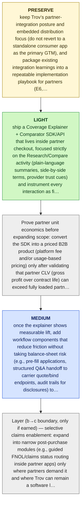

# Trov MGT470 Decoupling Memo

## TL;DR

> [!important] Final Judgment
> **study_more**: Trov should preserve its embedded-insurance integration capability while entering/expanding partners with a narrowly decoupled “Coverage Explainer + Comparator” SDK that fixes the research/compare weak link, then only later layer in higher-responsibility transaction/claims tooling once partner-level unit economics are proven (E6, E7, E8, E10, E11).

## Key Diagram

```mermaid
flowchart LR
    A1["<b>Step 1</b><br/>Recognize a need for protection tied to an item or a specific digital experience (e.g., mobility/gig/platform usage)<br/><i>Self and/or the partner platform context that surfaces the risk moment</i>"]
    A2["<b>Step 2</b><br/>Research and compare insurance options (coverage, price, terms, provider trust)<br/><i>Traditional insurers/agents, online search/comparison, and/or embedded offer details inside a partner experience</i>"]
    A3["<b>Step 3</b><br/>Purchase/activate coverage at the moment of need (on-demand or embedded)<br/><i>Trov mobile app for on-demand item coverage and/or partner platform embedding Trov’s insurance integration</i>"]
    A4["<b>Step 4</b><br/>Onboard and set up the policy (confirm identity/item details, receive policy issuance and documentation)<br/><i>Insurance provider workflow (Trov-enabled flow and/or partner-integrated flow) and the underlying insurer issuing the policy</i>"]
    A5["<b>Step 5</b><br/>Manage coverage over time (turn on/off, adjust coverage, monitor protection, handle premium payments where applicable)<br/><i>Trov’s digital on-demand experience and/or partner platform’s embedded insurance management surface</i>"]
    A6["<b>Step 6</b><br/>File a claim and track resolution; then renew/continue or exit coverage<br/><i>Insurance claims process (Trov-targeted claims stage in its initial model and/or the insurer/partner-integrated claims workflow)</i>"]
    A1 --> A2
    A2 --> A3
    A3 --> A4
    A4 --> A5
    A5 --> A6
    style A1 fill:#d1f7c4,stroke:#1f8a3a,color:#0b3d18
    style A2 fill:#d1f7c4,stroke:#1f8a3a,color:#0b3d18
    style A2 fill:#ffedd5,stroke:#c2410c,stroke-width:4px,color:#431407
    style A3 fill:#d6e4ff,stroke:#1c4ed8,color:#0a1f5e
    style A4 fill:#ffd6d6,stroke:#b22222,color:#5a0d0d
    style A5 fill:#d1f7c4,stroke:#1f8a3a,color:#0b3d18
    style A6 fill:#ffd6d6,stroke:#b22222,color:#5a0d0d
```


_Legend: green = creates value · red = erodes value · blue = captures value._

_Weak link highlighted: Step 2, **Research and compare insurance options (coverage, price, terms, provider trust)**._

## The Wedge

- **Company:** Trov
- **Sector:** insurtech (insurance technology) (E5)
- **Stage / geography:** unknown; unknown
- **Website / ticker:** unknown; n/a
- **Revenue / pricing:** Insurance premiums and revenue via partner integrations/embedded insurance arrangements (evidence indicates shift to embedded insurance partnerships) (E6, E7); On-demand, item-level pricing for consumer policies and partner-negotiated pricing for embedded products (E12, E13, E6)
- **Primary user:** End consumers purchasing on-demand, item-level insurance via mobile app and users of partner platforms embedding insurance (E5, E12, E7)

**What to decouple:** A2: Research and compare insurance options (coverage, price, terms, provider trust)

**Why this wedge:** From the customer POV: “I can understand what I’m buying and pick the right protection inside the app I’m already using—without hunting across multiple insurer pages or deciphering policy language—and I still complete purchase in the same partner flow” (E7, E8, E11).

**Why now:** Trov has already pivoted toward embedded insurance for digital platforms (E6, E7, E9), and the highest-friction step in that embedded funnel is often helping end-users understand and compare coverage at the moment of decision—an activity Trov can decouple and deliver inside partner experiences (E8, E10, E11).

**Biggest risk:** High recoupling risk: carriers/platforms or large incumbents can copy coverage explanation/comparison UX and bundle it into their own embedded flows, compressing Trov’s ability to capture value unless it develops defensible data/insights and deep partner integration switching costs (E10, E11).

## Confidence & Open Questions

Lens fit: **decoupling** with **medium**
confidence and fit score **0.9**.

Top high-severity critic findings:

- None of these sources establish that research/compare is the highest-friction step in embedded insurance, nor that it is a dominant pain point. E8 merely lists value-chain stages; E10–E11 define decoupling generally without insurance-specific funnel friction evidence.
- E8 provides a generic stage list and mentions where Trov initially played; it does not justify low switching friction or “easy to decouple.” E10–E11 provide general decoupling theory but no factual support for this activity being low-friction in insurance.
- No evidence supports Trov’s ability to legally/contractually own “first-party telemetry” in partner surfaces, nor that partners would allow it. This is a major, ungrounded assumption disguised as an execution detail.

Open questions:

- Validate the most strategically important claims against primary sources.
- Check whether recent customer pain points reflect durable behavior change.

<details>
<summary>📚 Appendix: full module outputs (click to expand)</summary>

### Lens Fit

Primary lens: **decoupling** (confidence: medium, fit score: 0.9, mode: full_decoupling)

Evidence indicates Trov unbundled insurance by serving discrete activities in the insurance customer value chain rather than the incumbent bundled annual policy. Trov originally targeted on-demand, item-level insurance for purchase, use & management, and claims via a mobile-first product (E5, E8, E12, E13). Its later pivot to embedded insurance for mobility and gig platforms shows a continued strategy of integrating into partners' awareness and purchase stages to replace or augment incumbents' offerings (E6, E7, E9). Teixeira's decoupling framework—targeting weak-link activities with superior digital experiences—maps directly to Trov's moves (E11). Given this evidence, the dominant pattern is decoupling (unbundling purchase/management functions) enabled by technology, with clear business-model innovation (embedded insurance) and technology substitution (mobile/app-driven policy management) as important secondary lenses (E5, E6, E7, E12, E13).

### Case Perspective

Case perspective: **transitioning** (confidence: medium)

Primary question: How should Trov sequence and execute its pivot from on-demand, item-level consumer insurance to embedded insurance partnerships—preserving what worked in the original model while evolving into a scalable B2B2C integration business?

Trov began as a classic decoupling disruptor by unbundling traditional annual insurance into on-demand, item-level coverage focused on the purchase and management stages (E5, E12, E13). However, the evidence indicates the company later pivoted its business model toward embedded insurance for mobility, gig, and digital platforms—shifting from primarily B2C to a partner-led B2B2C approach with integrations inside other ecosystems (E6, E7, E9). That combination of an established initial model and an explicit pivot to a different go-to-market and revenue approach signals a company in transition rather than a pure new entrant attack or an incumbent defense (E6, E7).

### Company Snapshot

- **Company:** Trov
- **Sector:** insurtech (insurance technology) (E5)
- **Stage / geography:** unknown; unknown
- **Website / ticker:** unknown; n/a
- **Revenue / pricing:** Insurance premiums and revenue via partner integrations/embedded insurance arrangements (evidence indicates shift to embedded insurance partnerships) (E6, E7); On-demand, item-level pricing for consumer policies and partner-negotiated pricing for embedded products (E12, E13, E6)
- **Primary user:** End consumers purchasing on-demand, item-level insurance via mobile app and users of partner platforms embedding insurance (E5, E12, E7)

<details>
<summary>Raw GPT Researcher narrative (unparsed)</summary>

    # Teixeira-Style Digital Disruption Analysis of Trov ## Introduction This report presents a comprehensive analysis of Trov, an insurtech company, through the lens of Thales Teixeira’s digital disruption framework. The analysis systematically examines Trov’s position in the customer value chain, identifies decoupling opportunities, highlights weak links, explores monetization strategies, assesses the competitive landscape, investigates customer pain points, and reviews recent strategic moves. The report leverages Teixeira’s methodology as outlined in his book *Unlocking the Customer Value Chain* and related academic and industry sources to provide a detailed, objective, and actionable assessment. ## Company Overview: Trov Trov was founded in 2012 as a technology-driven insurance platform, initially focused on on-demand, item-level insurance for personal belongings.

</details>

### Customer Value Chain


_Legend: green = creates value · red = erodes value · blue = captures value._

| Step | Activity | Current Provider | Evidence |
|---:|---|---|---|
| 1 | Recognize a need for protection tied to an item or a specific digital experience (e.g., mobility/gig/platform usage) | Self and/or the partner platform context that surfaces the risk moment | E6, E9, E8 |
| 2 | Research and compare insurance options (coverage, price, terms, provider trust) | Traditional insurers/agents, online search/comparison, and/or embedded offer details inside a partner experience | E8, E9 |
| 3 | Purchase/activate coverage at the moment of need (on-demand or embedded) | Trov mobile app for on-demand item coverage and/or partner platform embedding Trov’s insurance integration | E5, E7, E12, E9 |
| 4 | Onboard and set up the policy (confirm identity/item details, receive policy issuance and documentation) | Insurance provider workflow (Trov-enabled flow and/or partner-integrated flow) and the underlying insurer issuing the policy | E8, E7 |
| 5 | Manage coverage over time (turn on/off, adjust coverage, monitor protection, handle premium payments where applicable) | Trov’s digital on-demand experience and/or partner platform’s embedded insurance management surface | E8, E12, E7 |
| 6 | File a claim and track resolution; then renew/continue or exit coverage | Insurance claims process (Trov-targeted claims stage in its initial model and/or the insurer/partner-integrated claims workflow) | E8, E12 |

### Value Creation, Erosion, And Capture

| Activity | Type | Money | Time | Effort | Satisfaction | Reasoning |
|---|---|---:|---:|---:|---:|---|
| A1 | create | 1 | 2 | 2 | 3 | Recognizing a need for item- or experience-tied protection is value-creating because it surfaces exposure and motivates risk reduction; Trov’s move into embedded contexts increases this awareness inside partner flows (E6, E9, E8). |
| A2 | create | 2 | 3 | 3 | 2 | Research and comparison help customers determine coverage vs. cost and are therefore value-creating; embedded offers and traditional comparison channels both play this role as described in the evidence (E8, E9). |
| A3 | capture | 4 | 2 | 2 | 4 | The purchase/activation step is where the insurer or embedded partner captures payment and contracts with the customer; Trov’s original on‑demand purchase flow and embedded integrations specifically targeted this transaction point (E5, E7, E12, E9). |
| A4 | erode | 2 | 3 | 3 | 3 | Onboarding (identity/item confirmation and issuance) tends to introduce friction and potential delays, eroding customer value unless seamless; Trov and partner flows aim to streamline this but it remains a distinct workflow step (E8, E7). |
| A5 | create | 3 | 2 | 2 | 3 | Ongoing management (turning coverage on/off, adjusting limits, payments) creates value by aligning protection to usage and reducing unnecessary cost; Trov’s digital on‑demand and embedded management surfaces target this stage (E8, E12, E7). |
| A6 | erode | 2 | 4 | 4 | 2 | Filing a claim and awaiting resolution often imposes high time and effort costs and can reduce satisfaction; while Trov targeted claims in its model, claims remain a pain point affecting renewal decisions (E8, E12). |

### Weak Link

Research and compare insurance options (coverage, price, terms, provider trust) scored 900.0: Research/compare is a distinct step in the insurance customer value chain (E8) and is structurally easy to decouple because it can be delivered as a standalone digital layer without changing the underlying carrier/policy at first (low integration dependency). This matches Teixeira’s decoupling logic of improving a “weak link activity” so customers can “pass through…execute a weak link activity” cheaper/faster/easier (talks/unlocking-the-customer-value-chain-at-decoupling-co.md) (E10, E11). AI/digital leverage is very high here (personalized comparison, plain-language explanation of terms, contextual recommendations inside partner flows), and switching friction is low because users can adopt a better decision layer while keeping the rest of the workflow with incumbents/partners (E11). Evidence does not quantify pain for this step specifically; scoring is directional based on the CVC structure and Teixeira decoupling mechanics (E8, E10, E11).

### Decoupling Strategy

Launch an embedded “Coverage Explainer + Comparator” SDK/API that partners can drop into their app checkout: users answer a few questions, then receive plain-language coverage summaries and side-by-side comparisons across available embedded options, with contextual recommendations powered by automation/AI. This is a focused decoupling wedge consistent with Teixeira’s notion of “peeling away a portion of the customer’s value chain” (books/unlocking-the-customer-value-chain-chapter-1.md) while improving a single weak-link activity (E10, E11).


_Legend: yellow = preserve · green = light · blue = medium · red = heavy._

1. PRESERVE the core growth engine: keep Trov’s partner-integration posture and embedded distribution focus (do not revert to a standalone consumer app as the primary GTM), and package existing integration learnings into a repeatable implementation playbook for partners (E6, E7, E9).
2. Layer (a) — low-risk “decisioning UX” wedge: ship a Coverage Explainer + Comparator SDK/API that lives inside partner checkout, focused strictly on the Research/Compare activity (plain-language summaries, side-by-side terms, provider trust cues) and instrument every interaction as first-party product telemetry owned by Trov (E8, E10, E11).
3. Prove partner unit economics before expanding scope: convert the SDK into a priced B2B product (platform fee and/or usage-based pricing) only after validating that partner CLV (gross profit over contract life) can exceed fully loaded partner CAC driven by sales + solutions engineering (assumption to validate; embedded model context in E6, E7).
4. Layer (b) — medium-responsibility intermediation: once the explainer shows measurable lift, add workflow components that reduce friction without taking balance-sheet risk (e.g., pre-fill applications, structured Q&A handoff to carrier quote/bind endpoints, audit trails for disclosures) to deepen switching costs (E7, E10, E11).
5. Layer (b→c boundary, only if earned) — selective claims enablement: expand into narrow post-purchase modules (e.g., guided FNOL/claims status routing inside partner apps) only where partners demand it and where Trov can remain a software layer rather than an underwriter; do not assume full-stack insurance responsibilities (Trov’s historical scope includes claims-stage exposure in its initial model, but evidence here is directional only) (E8, E12).

### Business Model

The proposed decoupling targets the “research/compare” step in the insurance Customer Value Chain—helping users understand coverage, compare options, and choose within the partner app checkout (E8). This is consistent with Teixeira’s idea of “decoupling”/“peeling away a portion of the customer’s value chain” (books/unlocking-the-customer-value-chain-chapter-1.md) by delivering a better experience on one weak activity without requiring users to change the rest of the workflow (E10, E11, E4). In Trov’s pivot context, embedding a Coverage Explainer + Comparator SDK can increase customer comprehension and reduce decision friction at the exact moment insurance is offered inside partner ecosystems (E6, E7, E9).

### Competitive Response

Incumbents re-bundle (“recouple”) the research/compare step back into their own digital purchase flows by launching native, plain-language coverage explainers and guided questionnaires on their own websites/apps (and inside their existing distributor/broker journeys) so customers don’t need a third-party explainer/comparator during purchase. This is the classic move Teixeira describes: after a startup attacks a weak link in the customer value chain, incumbents try to “recouple” the activity back into the bundle (talks/unlocking-the-customer-value-chain-at-decoupling-co.md) (E3, E4, E8, E10, E11, E13).

### Recoupling Risk

```mermaid
quadrantChart
    title Incumbent Capability vs Incentive to Recouple
    x-axis Low capability --> High capability
    y-axis Low incentive --> High incentive
    quadrant-1 High threat (capable + motivated)
    quadrant-2 Motivated but blocked
    quadrant-3 Slow / unlikely
    quadrant-4 Capable but uninterested
    "Recoupling Risk": [0.50, 0.85]
    "recouple": [0.85, 0.85]
    "copy": [0.85, 0.85]
    "subsidize": [0.85, 0.50]
    "partner": [0.15, 0.50]
```

**Vulnerability**: high | capability medium, incentive high

The attacked activity (customer research and comparison) is explicitly part of the traditional insurer value chain (E8) and tightly adjacent to the purchase/activation step that incumbents already control in their bundled annual-policy model (E13). Because Teixeira’s decoupling logic is that startups win by targeting poorly served activities (“weak links”) (E10, E11) but incumbents can respond by re-bundling the activity back into the core experience (“recoupling”) (talks/unlocking-the-customer-value-chain-at-decoupling-co.md) (E3, E4), the strategic risk is that insurers simply fold simplified explainers/comparisons into their own funnels and neutralize feature-level differentiation. Evidence does not describe specific incumbent digital/AI execution strength, so this assessment is based on structural position in the value chain rather than proven capability (E8, E13).

Defenses: Defend with distribution asymmetry: prioritize embedded placements inside partner ecosystems where Trov already positions as an integration provider (E6, E7, E9), rather than competing head-on in insurers’ owned channels., Make recoupling costly for partners to accept: build a standardized SDK and analytics layer that improves over many partner contexts, increasing partner switching friction versus one-off insurer-built tools (E7, E11)., Reduce single-incumbent leverage: structure partner value around optionality across insurers so carrier-specific recoupling does not eliminate the partner’s need for a consistent research/compare UX (assumption to validate; not directly evidenced) (E9, E11).

### Critic Review

**Overall: 2.6/5** — ⚠️ would disagree

Weakest aspect: unit_economics

| Discipline | Score | Rationale |
|---|---:|---|
| preserve_core_engine | 3/5 | The analyst correctly flags that Trov has pivoted toward embedded/partner integrations (E6, E7, E9) and recommends not reverting to a standalone B2C app, which is directionally consistent with the evidence. However, they never actually identify a proven “core growth engine” (e.g., a working distribution loop, repeatable partner acquisition channel, or demonstrated integration-led retention); the evidence only says Trov pivoted, not that it is working or growing (E6, E7, E9). |
| layered_evolution | 4/5 | The sequencing is mostly aligned with Teixeira’s doctrine: start with a low-risk software wedge, then add intermediation/claims modules later, and explicitly warns against jumping to risk-bearing/full-stack insurance (E10, E11). The weakness is that the proposed layer-(a) wedge (Coverage Explainer/Comparator SDK) is not evidenced as the right weak-link activity for Trov specifically, so the “layering” is well-structured but perched on an unproven starting point (E8, E10, E11). |
| unit_economics | 1/5 | Unit economics are largely handwaved. The analyst asserts enterprise CAC will be high and proposes a CLV≥3×CAC hurdle, but provides no evidence for sales-cycle length, implementation cost, margins, pricing power, or attach-rate impact (E6, E7). This is framed as an assumption, but the recommendation still leans on it without proposing concrete validation metrics (e.g., integration hours, conversion lift thresholds, churn/renewal dynamics). |
| explicit_dont_do | 4/5 | The analysis includes a clear do-not-do list (don’t revert to broad B2C, don’t jump to full-stack underwriting, don’t build a generalized comparison marketplace) and ties these to focus and risk concerns. The main issue is evidentiary: balance-sheet/underwriting risk and “split focus” are reasonable, but not specifically supported by the provided evidence about Trov’s current constraints or finances (E6, E7, E8). |
| moat_is_relationship | 2/5 | The analyst gestures at owning telemetry/data and embedding inside partner flows, but does not show (from evidence) that Trov can own the end-customer relationship in a B2B2C context, nor how data ownership would be contractually or technically secured (E6, E7). The recommendation risks conflating “being embedded” with “owning the customer relationship,” which are different in partner-distributed insurance. |

**Citation issues:**
- _high_: None of these sources establish that research/compare is the highest-friction step in embedded insurance, nor that it is a dominant pain point. E8 merely lists value-chain stages; E10–E11 define decoupling generally without insurance-specific funnel friction evidence. (cited: E8, E10, E11 at Final thesis / Why now: “the highest-friction step in that embedded funnel is often helping end-users understand and compare coverage…”)
- _high_: E8 provides a generic stage list and mentions where Trov initially played; it does not justify low switching friction or “easy to decouple.” E10–E11 provide general decoupling theory but no factual support for this activity being low-friction in insurance. (cited: E8, E10, E11 at Upstream artifacts / Top weak link: “Research/compare… structurally easy to decouple… switching friction is low…”)
- _high_: No evidence supports Trov’s ability to legally/contractually own “first-party telemetry” in partner surfaces, nor that partners would allow it. This is a major, ungrounded assumption disguised as an execution detail. (cited: E8, E10, E11 at Staged actions / Layer (a): “plain-language summaries, side-by-side terms… instrument every interaction as first-party product telemetry owned by Trov”)
- _medium_: E6–E7 support that Trov pivoted to embedded insurance and has integration tech; they do not support that a comparator/explainer SDK is the best wedge product. E8 does not describe a comparator opportunity; E10–E11 are generic framework definitions. (cited: E6, E7, E8, E10, E11 at Thesis: “Coverage Explainer + Comparator SDK… (E6, E7, E8, E10, E11)”)
- _medium_: E10–E11 do not discuss recoupling dynamics, copying risk, or switching costs in this specific market; they only describe decoupling in general terms. The risk is plausible, but it is not evidenced here. (cited: E10, E11 at Biggest risk: “carriers/platforms… can copy coverage explanation/comparison UX… unless it develops defensible data/insights and deep partner integration switching costs”)
- _medium_: The conclusion may be strategically sensible, but the evidence provided does not mention Trov’s balance sheet, regulatory posture, capital constraints, or prior underwriting role. The analyst is importing a generic insurtech risk argument without evidence in the record. (cited: E6, E7, E8 at Do-not-do: “Do not jump to Layer (c) full-stack insurance (underwriting/risk-bearing)… creates balance-sheet exposure… not supported by the current evidence base”)
- _medium_: E6–E7 state Trov pivoted to embedded insurance and enables partner integration; they do not provide any factual basis about sales cycle duration, integration cost, or margin structure. This is asserted as ‘likely’ but still drives the economics logic. (cited: E6, E7 at Unit economics claim: “sales cycles and integrations are likely expensive in embedded insurance (E6, E7)”)
- _low_: E11 says decouplers leverage technology to reduce friction; it does not mention AI, personalization, or explainability capabilities, nor that these are feasible/allowed in regulated insurance disclosures. The AI claim is speculative relative to evidence. (cited: E11 at AI/digital leverage: “AI/digital leverage is very high here (personalized comparison, plain-language explanation…)”)

**Revision suggestions:**
- Separate “Trov has pivoted to embedded” from “embedded is the core growth engine.” Add evidence-backed indicators of what is actually working (partner renewal/expansion, integration velocity, repeatable carrier connectivity) or explicitly label the engine as unknown and make the first step an evidence-gathering sprint (E6, E7, E9).
- Re-validate the weak link with partner/user evidence. E8 provides only a generic CVC list; you need proof that Research/Compare is the biggest pain in embedded flows versus onboarding, disclosures, quote/bind latency, or claims handling (E8).
- Tighten the decoupling wedge to something the evidence more directly implies Trov already does well: partner integration into awareness/purchase stages (E7, E9). If proposing a UX comparator, specify why partners cannot solve it themselves and what proprietary input Trov uniquely has.
- Replace handwavy unit economics with a minimal model to be validated: required conversion lift or premium volume to justify a per-partner platform fee; implementation hours per partner; support load; renewal probability. Keep all numbers as variables if none are evidenced (E6, E7).
- Clarify the relationship/moat story in B2B2C: what data is owned by Trov vs the platform partner vs the carrier, and what contractual hooks create switching costs. Remove “first-party telemetry owned by Trov” unless it is an explicit, negotiated requirement.
- Add a recoupling analysis grounded in insurance realities: who exactly would copy (carriers, MGAs, embedded orchestration platforms), and what prevents it (carrier connectivity breadth, compliance tooling, configuration complexity). Right now the recoupling narrative is generic to Teixeira but not evidenced for this case (E10, E11).

**Disagreement / defense note:** Given the same evidence, I would not anchor the pivot on a “Coverage Explainer + Comparator” wedge, because there is no evidence that Research/Compare is the dominant pain point or that Trov has a unique advantage there (E8, E10, E11). A more evidence-consistent thesis is: preserve and productize Trov’s embedded integration capability by standardizing partner/carrier connectivity for the Awareness→Purchase stages (quote/bind workflow tooling, configuration, disclosure/compliance rails) that partners must integrate and are less easily recoupled than UI explanations (E7, E9). Then, after proving partner unit economics, selectively expand into post-purchase modules (use/management or claims routing) where Trov historically played (E8, E12).

### Sources

| Source | Title | URL / Path | Reliability | Evidence count |
|---|---|---|---|---:|
| S0 | CLI input | CLI input | medium | 1 |
| S1 | praxie.com / decouple-the-value-chain-to-drive-digital-disruption | [https://praxie.com/decouple-the-value-chain-to-drive-digital-disruption/](https://praxie.com/decouple-the-value-chain-to-drive-digital-disruption/) | medium | 1 |
| S10 | www.amazon.com / B07MWBS4WS | [https://www.amazon.com/Unlocking-Customer-Value-Chain-Decoupling/dp/B07MWBS4WS](https://www.amazon.com/Unlocking-Customer-Value-Chain-Decoupling/dp/B07MWBS4WS) | medium | 1 |
| S11 | www.youtube.com / watch | [https://www.youtube.com/watch?v=ea-XaLHfpS4](https://www.youtube.com/watch?v=ea-XaLHfpS4) | medium | 1 |
| S12 | www.hks.harvard.edu / unlocking-customer-value-chain-how-decoupling-drives-consumer | [https://www.hks.harvard.edu/centers/mrcbg/programs/growthpolicy/unlocking-customer-value-chain-how-decoupling-drives-consumer](https://www.hks.harvard.edu/centers/mrcbg/programs/growthpolicy/unlocking-customer-value-chain-how-decoupling-drives-consumer) | medium | 1 |
| S2 | www.youtube.com / watch | [https://www.youtube.com/watch?v=IwlJ8sl94fg](https://www.youtube.com/watch?v=IwlJ8sl94fg) | medium | 1 |
| S3 | www.amazon.com / 152476308X | [https://www.amazon.com/Unlocking-Customer-Value-Chain-Decoupling/dp/152476308X](https://www.amazon.com/Unlocking-Customer-Value-Chain-Decoupling/dp/152476308X) | medium | 1 |
| S4 | books.google.com / Unlocking_the_Customer_Value_Chain.html | [https://books.google.com/books/about/Unlocking_the_Customer_Value_Chain.html?id=xSdcDwAAQBAJ](https://books.google.com/books/about/Unlocking_the_Customer_Value_Chain.html?id=xSdcDwAAQBAJ) | medium | 1 |
| S5 | content.martechday.com / state-of-martech-2026.pdf | [https://content.martechday.com/state-of-martech-2026.pdf](https://content.martechday.com/state-of-martech-2026.pdf) | medium | 1 |
| S6 | som.yale.edu / SCOTT-MORTON_Digital_Platform_Regulation_pages.pdf | [https://som.yale.edu/sites/default/files/2025-05/SCOTT-MORTON_Digital_Platform_Regulation_pages.pdf](https://som.yale.edu/sites/default/files/2025-05/SCOTT-MORTON_Digital_Platform_Regulation_pages.pdf) | medium | 1 |
| S7 | www.samenacouncil.org / SAMENA_Trends_July_2018.pdf | [https://www.samenacouncil.org/samena_trends/files/SAMENA_Trends_July_2018.pdf](https://www.samenacouncil.org/samena_trends/files/SAMENA_Trends_July_2018.pdf) | medium | 1 |
| S8 | intuitionlabs.ai / chatgpt-atlas-openai-browser | [https://intuitionlabs.ai/articles/chatgpt-atlas-openai-browser](https://intuitionlabs.ai/articles/chatgpt-atlas-openai-browser) | medium | 1 |
| S9 | www.omniaretail.com / blog | [https://www.omniaretail.com/blog](https://www.omniaretail.com/blog) | medium | 1 |

### Evidence Base

| ID | Claim | Source | Locator | Confidence | Used By |
|---|---|---|---|---|---|
| E1 | Trov was provided as the target company by the user. | S0 | CLI input | high | company_profile, lens_fit |
| E2 | # Teixeira-Style Digital Disruption Analysis of Trov ## Introduction This report presents a comprehensive analysis of Trov, an insurtech company, through the lens of Thales Teixeira’s digital disruption framework. | S1 | [article: https://praxie.com/decouple-the-value-chain-to-drive-digital-disruption/](https://praxie.com/decouple-the-value-chain-to-drive-digital-disruption/) | medium | company_profile |
| E3 | The analysis systematically examines Trov’s position in the customer value chain, identifies decoupling opportunities, highlights weak links, explores monetization strategies, assesses the competitive landscape, investigates customer pain points, and reviews recent strategic moves. | S2 | [article: https://www.youtube.com/watch?v=IwlJ8sl94fg](https://www.youtube.com/watch?v=IwlJ8sl94fg) | medium | company_profile, competitive_response |
| E4 | The report leverages Teixeira’s methodology as outlined in his book *Unlocking the Customer Value Chain* and related academic and industry sources to provide a detailed, objective, and actionable assessment. | S3 | [article: https://www.amazon.com/Unlocking-Customer-Value-Chain-Decoupling/dp/152476308X](https://www.amazon.com/Unlocking-Customer-Value-Chain-Decoupling/dp/152476308X) | medium | company_profile, business_model, competitive_response |
| E5 | ## Company Overview: Trov Trov was founded in 2012 as a technology-driven insurance platform, initially focused on on-demand, item-level insurance for personal belongings. | S4 | [article: https://books.google.com/books/about/Unlocking_the_Customer_Value_Chain.html?id=xSdcDwAAQBAJ](https://books.google.com/books/about/Unlocking_the_Customer_Value_Chain.html?id=xSdcDwAAQBAJ) | medium | company_profile, lens_fit, case_perspective, cvc, value_types, final_judgment, critic |
| E6 | Over time, Trov evolved its business model, pivoting towards providing embedded insurance solutions for mobility, gig economy, and digital platforms. | S5 | [deck: https://content.martechday.com/state-of-martech-2026.pdf](https://content.martechday.com/state-of-martech-2026.pdf) | medium | company_profile, lens_fit, case_perspective, cvc, value_types, weak_links, decoupling, business_model, competitive_response, final_judgment, critic |
| E7 | Trov’s technology enables partners to integrate insurance offerings directly into their digital experiences, targeting both B2C and B2B2C markets. | S6 | [deck: https://som.yale.edu/sites/default/files/2025-05/SCOTT-MORTON_Digital_Platform_Regulation_pages.pdf](https://som.yale.edu/sites/default/files/2025-05/SCOTT-MORTON_Digital_Platform_Regulation_pages.pdf) | medium | company_profile, lens_fit, case_perspective, cvc, value_types, weak_links, decoupling, business_model, competitive_response, final_judgment, critic |
| E8 | ## Customer Value Chain Analysis ### Mapping the Insurance Customer Value Chain The traditional insurance customer value chain consists of the following stages: \| Stage \| Description \| \|----------------------\|------------------------------------------------------------------\| \| Awareness \| Customer becomes aware of insurance needs and options \| \| Research \| Customer compares policies, prices, and providers \| \| Purchase \| Customer buys a policy \| \| Onboarding \| Policy is issued, customer is onboarded \| \| Use & Management \| Customer manages policy, updates coverage, pays premiums \| \| Claims \| Customer files and manages claims \| \| Renewal/Exit \| Customer renews or exits policy \| ### Trov’s Position in the Value Chain Trov initially targeted the “Purchase,” “Use & Management,” and “Claims” stages by offering digital, on-demand insurance for individual items. | S7 | [deck: https://www.samenacouncil.org/samena_trends/files/SAMENA_Trends_July_2018.pdf](https://www.samenacouncil.org/samena_trends/files/SAMENA_Trends_July_2018.pdf) | medium | company_profile, lens_fit, cvc, value_types, weak_links, decoupling, business_model, competitive_response, final_judgment, critic |
| E9 | Its later pivot to embedded insurance solutions allowed Trov to integrate more deeply into the “Awareness” and “Purchase” stages, especially within partner ecosystems (e.g., mobility platforms, gig work apps). | S8 | [article: https://intuitionlabs.ai/articles/chatgpt-atlas-openai-browser](https://intuitionlabs.ai/articles/chatgpt-atlas-openai-browser) | medium | company_profile, lens_fit, case_perspective, cvc, value_types, weak_links, decoupling, business_model, competitive_response, final_judgment, critic |
| E10 | ## Decoupling Opportunities ### Teixeira’s Decoupling Framework Teixeira defines “decoupling” as the process by which digital disruptors break off one or more activities from the customer value chain, often targeting those that are poorly served by incumbents ([Teixeira, 2019](https://www.hbs.edu/faculty/Pages/item.aspx?num=55549)). | S9 | [article: https://www.omniaretail.com/blog](https://www.omniaretail.com/blog) | medium | weak_links, decoupling, business_model, competitive_response, final_judgment, critic |
| E11 | Decouplers focus on delivering superior value in these activities, often leveraging technology to reduce friction and improve customer experience. | S10 | [article: https://www.amazon.com/Unlocking-Customer-Value-Chain-Decoupling/dp/B07MWBS4WS](https://www.amazon.com/Unlocking-Customer-Value-Chain-Decoupling/dp/B07MWBS4WS) | medium | lens_fit, weak_links, decoupling, business_model, competitive_response, final_judgment, critic |
| E12 | ### Trov’s Decoupling Strategy Trov’s initial decoupling occurred at the “Purchase” and “Use & Management” stages, allowing customers to insure individual items on demand via a mobile app. | S11 | [article: https://www.youtube.com/watch?v=ea-XaLHfpS4](https://www.youtube.com/watch?v=ea-XaLHfpS4) | medium | company_profile, lens_fit, case_perspective, cvc, value_types, weak_links, decoupling, business_model, final_judgment, critic |
| E13 | This unbundled insurance from the traditional, annual, bundled policy model, addressing consumer frustration with inflexible products. | S12 | [article: https://www.hks.harvard.edu/centers/mrcbg/programs/growthpolicy/unlocking-customer-value-chain-how-decoupling-drives-consumer](https://www.hks.harvard.edu/centers/mrcbg/programs/growthpolicy/unlocking-customer-value-chain-how-decoupling-drives-consumer) | medium | company_profile, lens_fit, case_perspective, weak_links, business_model, competitive_response, final_judgment, critic |

### Final Recommendation

**study_more**: Trov should preserve its embedded-insurance integration capability while entering/expanding partners with a narrowly decoupled “Coverage Explainer + Comparator” SDK that fixes the research/compare weak link, then only later layer in higher-responsibility transaction/claims tooling once partner-level unit economics are proven (E6, E7, E8, E10, E11).

Evidence: E5, E6, E7, E8, E9, E10, E11, E12, E13.

#### Do-Not-Do List

- Do not jump to Layer (c) full-stack insurance (underwriting/risk-bearing or broad guarantees) to ‘own the whole value chain’; it creates balance-sheet exposure and operational complexity that is not supported by the current evidence base and increases downside if partner unit economics are not yet proven (E6, E7, E8).
- Do not restart a broad B2C on-demand item-level insurance growth push as the primary strategy; it conflicts with the stated pivot toward embedded/B2B2C integration and would split focus from the integration-based model (E6, E12).
- Do not overbuild a generalized marketplace-style comparison product across all insurance lines on day one; it dilutes the decoupling wedge and increases recoupling risk because incumbents can match generic UX—win first in a partner-specific embedded workflow where integration and data loops create switching costs (E10, E11).
- Do not price primarily as a commoditized per-policy take-rate before proving differentiated lift; if the explainer/comparator is copied, take-rate capture will face pricing pressure—start with clearly attributable B2B value (platform/usage fees) tied to measurable funnel lift (assumption to validate; pivot context in E6, E7).

#### Next Research Steps

- Quantify the weak-link pain and ROI: in partner embedded flows, measure drop-off attributable to lack of coverage comprehension and estimate conversion lift from improved Research/Compare UX (ties to CVC stage map) (E8).
- Validate unit economics assumptions: enterprise/partner CAC (sales cycle length, solutions engineering hours, ongoing support) vs partner CLV (contract duration, gross margin, attach-rate uplift-driven revenue) for the embedded model (E6, E7).
- Competitive/recoupling scan: identify whether carriers, embedded-insurance platforms, or large incumbents already offer native coverage explanation/comparison modules and how quickly they can bundle it (E10, E11).
- Data defensibility test: determine what proprietary interaction data the SDK can capture (and what partners will allow) that improves recommendations/UX over time and increases switching costs (E7, E11).
- Scope boundary check with partners: confirm which ‘next’ activities partners want Trov to take on (e.g., disclosures, audit trails, claims routing) versus what they insist remains with carriers/TPAs to avoid mis-scoping into heavy-responsibility operations (E7, E8).

</details>
