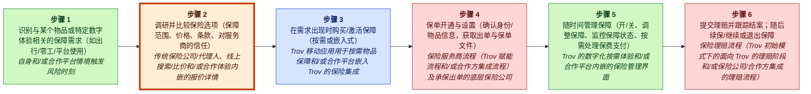
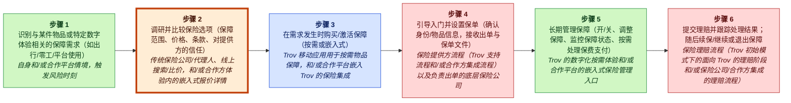
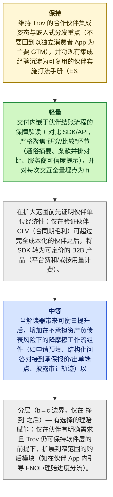

# Trov MGT470 解构备忘录

## TL;DR

> [!important] 最终判断
> **study_more**：Trov 应在进入/扩展合作伙伴时，保留其嵌入式保险（embedded-insurance）集成能力，同时以一个狭义解构的“Coverage Explainer + Comparator”SDK 作为切入点来修复研究/比较这一薄弱环节，然后仅在合作伙伴层面的单位经济（unit economics）被证明成立之后，再叠加更高责任的交易/理赔工具层（E6, E7, E8, E10, E11）。

## 关键图示


_图例：绿色 = 创造价值 · 红色 = 侵蚀价值 · 蓝色 = 捕获价值。_

_已高亮的薄弱环节：第 2 步，**研究并比较保险选项（保障范围、价格、条款、承保方可信度）**。_

## 楔子切入点

- **公司：** Trov
- **行业：** insurtech（insurance technology，保险科技）（E5）
- **阶段 / 地理：** unknown; unknown
- **网站 / 股票代码：** unknown; n/a
- **收入 / 定价：** 通过合作伙伴集成/嵌入式保险安排获得保险保费与收入（证据显示转向嵌入式保险合作伙伴关系）（E6, E7）；面向消费者保单的按需、单品级定价，以及面向嵌入式产品的合作伙伴谈判定价（E12, E13, E6）
- **主要用户：** 通过移动应用购买按需、单品级保险的终端消费者，以及使用嵌入保险的合作伙伴平台用户（E5, E12, E7）

**要解构的内容：** A2：研究并比较保险选项（保障范围、价格、条款、承保方可信度）

**为什么选择这个楔子：** 从客户视角来看：“我可以在我已经在使用的应用内理解我买的是什么，并选择合适的保障——无需在多个保险公司页面间搜索，也无需解读保单语言——并且我仍能在同一合作伙伴流程中完成购买”（E7, E8, E11）。

**为什么是现在：** Trov 已经转向面向数字平台的嵌入式保险（E6, E7, E9），而在该嵌入式漏斗中摩擦最高的步骤往往是帮助终端用户在决策当下理解并比较保障——这是 Trov 可以解构出来并在合作伙伴体验内交付的活动（E8, E10, E11）。

**最大风险：** 再耦合风险高：承保方/平台或大型既有巨头可以复制保障解释/比较 UX，并将其打包进它们自己的嵌入式流程中，从而压缩 Trov 捕获价值的能力，除非其建立可防御的数据/洞察以及深度合作伙伴集成的切换成本（E10, E11）。

## 置信度与未决问题

视角契合度：**解构（decoupling）**，置信度 **中等**，契合评分 **0.9**。

最高严重级别的批判性复审发现：

- 这些来源都未能证明在嵌入式保险中研究/比较是摩擦最高的步骤，也未能证明它是主导性痛点。E8 仅列出价值链阶段；E10–E11 仅从一般意义定义解构，但没有提供保险特定的漏斗摩擦证据。
- E8 提供的是通用阶段列表并提到 Trov 最初参与的位置；它并未论证低切换摩擦或“容易解构”。E10–E11 提供的是一般性的解构理论，但没有事实支持该活动在保险中属于低摩擦。
- 没有证据支持 Trov 能在法律/合同层面拥有合作伙伴界面中的“第一方遥测（first-party telemetry）”，也没有证据表明合作伙伴会允许。这个重大且缺乏依据的假设被伪装成了执行细节。

未决问题：

- 针对最具战略重要性的主张，用一手来源进行验证。
- 检查近期客户痛点是否反映了可持续的行为变化。

<details>
<summary>📚 附录：完整模块输出（点击展开）</summary>

### 视角契合度

主要视角：**解构（decoupling）**（置信度：中等，契合评分：0.9，模式：full_decoupling）

证据表明，Trov 通过在保险客户价值链中提供离散活动来对保险进行拆分，而不是沿用既有的捆绑式年度保单。Trov 最初通过移动优先产品，瞄准按需、单品级保险的购买、使用与管理以及理赔（E5, E8, E12, E13）。其后转向面向出行与零工平台的嵌入式保险，显示其持续采取融入合作伙伴的认知与购买阶段的策略，以替代或增强既有巨头的产品供给（E6, E7, E9）。Teixeira 的解构框架——以更优的数字体验瞄准薄弱环节活动——与 Trov 的举措直接对应（E11）。基于这些证据，主导模式是解构（对购买/管理功能的拆分）并由技术实现，同时清晰的商业模式创新（嵌入式保险）与技术替代（移动端/应用驱动的保单管理）是重要的次要视角（E5, E6, E7, E12, E13）。

### 案例视角

案例视角：**转型中（transitioning）**（置信度：中等）

核心问题：Trov 应如何对其从按需、单品级消费者保险向嵌入式保险合作伙伴关系的转型进行排序与执行——既保留原模型中有效的部分，又演进为可扩展的 B2B2C 集成型业务？

Trov 最初是一家典型的解构型颠覆者，通过将传统年度保险拆分为按需、单品级保障，重点聚焦购买与管理阶段（E5, E12, E13）。然而，证据表明公司后来将其商业模式转向面向出行、零工与数字平台的嵌入式保险——从以 B2C 为主转向由合作伙伴驱动、在其他生态系统内部进行集成的 B2B2C 路径（E6, E7, E9）。这种“已建立的初始模型”与“向不同获客路径与收入方式的明确转型”的组合，表明该公司处于转型阶段，而非纯粹的新进入者进攻或既有者防御（E6, E7）。

### 公司快照

- **公司：** Trov
- **行业：** insurtech（insurance technology，保险科技）（E5）
- **阶段 / 地理：** unknown; unknown
- **网站 / 股票代码：** unknown; n/a
- **收入 / 定价：** 通过合作伙伴集成/嵌入式保险安排获得保险保费与收入（证据显示转向嵌入式保险合作伙伴关系）（E6, E7）；面向消费者保单的按需、单品级定价，以及面向嵌入式产品的合作伙伴谈判定价（E12, E13, E6）
- **主要用户：** 通过移动应用购买按需、单品级保险的终端消费者，以及使用嵌入保险的合作伙伴平台用户（E5, E12, E7）

<details>
<summary>Raw GPT Researcher narrative (unparsed)</summary>

    # Teixeira-Style Digital Disruption Analysis of Trov ## Introduction This report presents a comprehensive analysis of Trov, an insurtech company, through the lens of Thales Teixeira’s digital disruption framework. The analysis systematically examines Trov’s position in the customer value chain, identifies decoupling opportunities, highlights weak links, explores monetization strategies, assesses the competitive landscape, investigates customer pain points, and reviews recent strategic moves. The report leverages Teixeira’s methodology as outlined in his book *Unlocking the Customer Value Chain* and related academic and industry sources to provide a detailed, objective, and actionable assessment. ## Company Overview: Trov Trov was founded in 2012 as a technology-driven insurance platform, initially focused on on-demand, item-level insurance for personal belongings.

</details>

### 客户价值链


_图例：绿色 = 创造价值 · 红色 = 侵蚀价值 · 蓝色 = 捕获价值。_

| Step | Activity | Current Provider | Evidence |
|---:|---|---|---|
| 1 | 识别与某个物品或特定数字体验（例如出行/零工/平台使用）相关的保障需求 | 自身和/或呈现风险时刻的合作伙伴平台情境 | E6, E9, E8 |
| 2 | 研究并比较保险选项（保障范围、价格、条款、承保方可信度） | 传统保险公司/代理人、在线搜索/比较，以及/或者合作伙伴体验内的嵌入式报价详情 | E8, E9 |
| 3 | 在需求时刻购买/激活保障（按需或嵌入式） | 用于按需单品保障的 Trov 移动应用和/或嵌入 Trov 保险集成的合作伙伴平台 | E5, E7, E12, E9 |
| 4 | 开通并设置保单（确认身份/物品详情，接收保单出单与文档） | 保险提供方工作流（Trov 支持的流程和/或合作伙伴集成流程）以及签发保单的底层承保方 | E8, E7 |
| 5 | 随时间管理保障（开/关、调整保障、监测保障、在适用时处理保费支付） | Trov 的数字化按需体验和/或合作伙伴平台的嵌入式保险管理界面 | E8, E12, E7 |
| 6 | 提交理赔并跟踪处理；随后续保/继续或退出保障 | 保险理赔流程（Trov 初始模型中瞄准的理赔阶段和/或承保方/合作伙伴集成的理赔工作流） | E8, E12 |

### 价值创造、侵蚀与捕获

| Activity | Type | Money | Time | Effort | Satisfaction | Reasoning |
|---|---|---:|---:|---:|---:|---|
| A1 | create | 1 | 2 | 2 | 3 | 识别对物品或体验绑定的保障需求属于价值创造，因为它揭示风险暴露并促使风险降低；Trov 进入嵌入式情境的举措提升了合作伙伴流程内的这类认知（E6, E9, E8）。 |
| A2 | create | 2 | 3 | 3 | 2 | 研究与比较帮助客户在保障与成本之间做判断，因此属于价值创造；如证据所述，嵌入式报价与传统比较渠道都承担该作用（E8, E9）。 |
| A3 | capture | 4 | 2 | 2 | 4 | 购买/激活步骤是承保方或嵌入式合作伙伴捕获付款并与客户订立合同的环节；Trov 最初的按需购买流程与嵌入式集成都专门瞄准该交易节点（E5, E7, E12, E9）。 |
| A4 | erode | 2 | 3 | 3 | 3 | 开通过程（身份/物品确认与出单）往往引入摩擦与潜在延迟，除非无缝否则会侵蚀客户价值；Trov 与合作伙伴流程意在简化，但它仍是一个独立的工作流步骤（E8, E7）。 |
| A5 | create | 3 | 2 | 2 | 3 | 持续管理（开/关保障、调整限额、支付）通过使保障与使用匹配并降低不必要成本来创造价值；Trov 的数字按需与嵌入式管理界面瞄准该阶段（E8, E12, E7）。 |
| A6 | erode | 2 | 4 | 4 | 2 | 提交理赔并等待处理通常带来高时间与高精力成本，并可能降低满意度；尽管 Trov 在其模型中瞄准了理赔，但理赔仍是影响续保决策的痛点（E8, E12）。 |

### 薄弱环节

研究并比较保险选项（保障范围、价格、条款、承保方可信度）得分 900.0：研究/比较是保险客户价值链中的一个独立步骤（E8），并且在结构上容易被解构，因为它可以先作为一个独立的数字层交付，而无需一开始就改变底层承保方/保单（集成依赖低）。这符合 Teixeira 的解构逻辑：通过更好地改进“薄弱环节活动”，让客户能够“通过执行一个薄弱环节活动”，并做到更便宜/更快/更容易（talks/unlocking-the-customer-value-chain-at-decoupling-co.md）（E10, E11）。这里的 AI/数字化杠杆非常高（个性化比较、用通俗语言解释条款、在合作伙伴流程内给出情境化建议），而切换摩擦较低，因为用户可以采用更好的决策层，同时将其余工作流保留给既有者/合作伙伴（E11）。证据未对该步骤的痛点进行量化；评分是基于 CVC 结构与 Teixeira 解构机制的方向性判断（E8, E10, E11）。

### 解构策略

推出一个嵌入式“Coverage Explainer + Comparator”SDK/API，让合作伙伴能够将其直接嵌入其应用的结账流程：用户回答几个问题，然后获得通俗语言的保障摘要，以及对可用嵌入式选项的并列比较，并由自动化/AI 提供情境化建议。这是一个聚焦的解构楔子，符合 Teixeira 所说“剥离客户价值链的一部分”（books/unlocking-the-customer-value-chain-chapter-1.md），同时改进单一薄弱环节活动（E10, E11）。


_图例：黄色 = 保留 · 绿色 = 轻度 · 蓝色 = 中度 · 红色 = 重度。_

1. 保留核心增长引擎：保持 Trov 的合作伙伴集成姿态与嵌入式分发焦点（不要回到以独立消费者应用为主要 GTM），并把既有的集成经验打包成可重复的合作伙伴实施手册（E6, E7, E9）。
2. 叠加（a）层——低风险“决策 UX”楔子：交付一个驻留在合作伙伴结账流程内的 Coverage Explainer + Comparator SDK/API，严格聚焦于研究/比较活动（通俗摘要、并列条款、承保方可信度提示），并将每一次交互都作为由 Trov 拥有的第一方产品遥测进行埋点记录（E8, E10, E11）。
3. 在扩展范围前先证明合作伙伴单位经济：仅在验证合作伙伴 CLV（合同生命周期内的毛利润）能够超过由销售 + 解决方案工程驱动的完全加载合作伙伴 CAC 之后，才将 SDK 转化为可定价的 B2B 产品（平台费和/或基于使用量的定价）（待验证假设；嵌入式模型背景见 E6, E7）。
4. 叠加（b）层——中等责任的中介化：当 explainer 显示出可衡量的提升后，增加能够降低摩擦但不承担资产负债表风险的工作流组件（例如预填申请、将结构化问答交接至承保方 quote/bind 端点、披露审计轨迹），以加深切换成本（E7, E10, E11）。
5. 叠加（b→c 边界，仅在赢得资格后）——选择性理赔赋能：仅在合作伙伴提出需求且 Trov 能保持为软件层而非承保方的情况下，扩展到狭义的购后模块（例如在合作伙伴应用内引导 FNOL/理赔状态路由）；不要假设承担全栈保险责任（Trov 的历史范围在其初始模型中包含理赔阶段暴露，但此处证据仅为方向性）（E8, E12）。

### 商业模式

所提议的解构瞄准保险客户价值链中的“研究/比较”步骤——帮助用户在合作伙伴应用结账时理解保障、比较选项并做出选择（E8）。这与 Teixeira 的“解构（decoupling）”/“剥离客户价值链的一部分”（books/unlocking-the-customer-value-chain-chapter-1.md）一致，即在不要求用户改变其余工作流的前提下，对某一薄弱活动提供更好的体验（E10, E11, E4）。在 Trov 的转型背景下，嵌入 Coverage Explainer + Comparator SDK 能在保险于合作伙伴生态系统内被提供的关键时刻提升客户理解，并降低决策摩擦（E6, E7, E9）。

### 竞争响应

既有者通过推出原生的、通俗语言的保障解释器与引导式问卷（在其自有网站/应用中，以及在其既有分销商/经纪路径中）把研究/比较步骤重新捆绑（“再耦合（recouple）”）回其自身数字购买流程，从而让客户在购买时不再需要第三方解释/比较工具。这是 Teixeira 描述的经典动作：在一家初创公司攻击客户价值链中的薄弱环节后，既有者会试图将该活动“再耦合”回原有捆绑（talks/unlocking-the-customer-value-chain-at-decoupling-co.md）（E3, E4, E8, E10, E11, E13）。

### 再耦合风险

```mermaid
quadrantChart
    title Incumbent Capability vs Incentive to Recouple
    x-axis Low capability --> High capability
    y-axis Low incentive --> High incentive
    quadrant-1 High threat (capable + motivated)
    quadrant-2 Motivated but blocked
    quadrant-3 Slow / unlikely
    quadrant-4 Capable but uninterested
    "Recoupling Risk": [0.50, 0.85]
    "recouple": [0.85, 0.85]
    "copy": [0.85, 0.85]
    "subsidize": [0.85, 0.50]
    "partner": [0.15, 0.50]
```

**脆弱性**：高 | 能力 中等，激励 高

被攻击的活动（客户研究与比较）明确属于传统保险公司的价值链（E8），并且与既有者在其捆绑式年度保单模型中已控制的购买/激活步骤高度相邻（E13）。由于 Teixeira 的解构逻辑是初创公司通过瞄准服务不佳的活动（“薄弱环节”）获胜（E10, E11），但既有者可以通过将该活动重新捆绑回核心体验（“再耦合”）来反制（talks/unlocking-the-customer-value-chain-at-decoupling-co.md）（E3, E4），因此战略风险在于保险公司可能仅需把简化的解释/比较功能折叠进其自身漏斗，就能中和功能层面的差异化。证据未描述既有者具体的数字/AI 执行强度，因此该评估基于其在价值链中的结构性位置，而非已被证明的能力（E8, E13）。

防御：以分发不对称进行防御：优先在合作伙伴生态系统内进行嵌入式投放，Trov 已在其中定位为集成提供方（E6, E7, E9），而不是在保险公司自有渠道中正面竞争。，让合作伙伴接受再耦合的成本更高：构建标准化 SDK 与分析层，使其能在众多合作伙伴情境中持续改进，从而相较于一次性由保险公司自建的工具，提高合作伙伴切换摩擦（E7, E11）。，降低单一既有者的杠杆：围绕跨保险公司的可选性来构建合作伙伴价值，使得某一承保方的再耦合不会消除合作伙伴对一致研究/比较 UX 的需求（待验证假设；未被直接证据支持）（E9, E11）。

### 批判性复审

**总体：2.6/5** — ⚠️ would disagree

最薄弱方面：unit_economics

| Discipline | Score | Rationale |
|---|---:|---|
| preserve_core_engine | 3/5 | 分析者正确指出 Trov 已转向嵌入式/合作伙伴集成（E6, E7, E9），并建议不要回到独立 B2C 应用，这在方向上与证据一致。然而，他们从未真正识别一个已被证明的“核心增长引擎”（例如有效的分发闭环、可重复的合作伙伴获取渠道，或由集成驱动的留存已被验证）；证据只说明 Trov 转向了，而不是该转向正在奏效或增长（E6, E7, E9）。 |
| layered_evolution | 4/5 | 该排序大体与 Teixeira 的教义一致：先从低风险软件楔子开始，再在后期增加中介化/理赔模块，并明确警告不要跳到承担风险/全栈保险（E10, E11）。薄弱之处在于，所提的（a）层楔子（Coverage Explainer/Comparator SDK）没有证据表明它对 Trov 而言就是正确的薄弱环节活动，因此“分层”结构良好但建立在未经证明的起点之上（E8, E10, E11）。 |
| unit_economics | 1/5 | 单位经济基本被一笔带过。分析者断言企业 CAC 会很高，并提出 CLV≥3×CAC 的门槛，但未提供销售周期长度、实施成本、利润率、定价权或附着率（attach-rate）影响的证据（E6, E7）。这被表述为假设，但建议仍依赖该假设，且未提出具体的验证指标（例如集成工时、转化提升阈值、流失/续约动态）。 |
| explicit_dont_do | 4/5 | 分析包含清晰的“不做清单”（不要回到宽泛 B2C、不要跳到全栈承保、不要构建通用比较市场），并将其与聚焦与风险担忧联系起来。主要问题在于证据：资产负债表/承保风险与“分散焦点”是合理的，但未被所提供证据中关于 Trov 当前约束或财务状况的内容所具体支持（E6, E7, E8）。 |
| moat_is_relationship | 2/5 | 分析者提到拥有遥测/数据并嵌入合作伙伴流程，但未能（基于证据）展示 Trov 在 B2B2C 情境下能够拥有终端客户关系，也未说明数据所有权如何在合同或技术上得到保障（E6, E7）。该建议有将“嵌入”与“拥有客户关系”混为一谈的风险，而在合作伙伴分发的保险中两者并不相同。 |

**引用问题：**
- _high_：这些来源都未建立研究/比较是嵌入式保险中摩擦最高的步骤，也未建立它是主导性痛点。E8 仅列出价值链阶段；E10–E11 只从一般意义定义解构，缺乏保险特定漏斗摩擦证据。（引用位置：最终论断 / Why now：“the highest-friction step in that embedded funnel is often helping end-users understand and compare coverage”；所引：E8, E10, E11）
- _high_：E8 提供的是通用阶段列表并提到 Trov 最初参与的位置；它并未证明低切换摩擦或“容易解构”。E10–E11 提供一般解构理论，但没有事实支持该活动在保险中属于低摩擦。（引用位置：上游产物 / Top weak link：“Research/compare structurally easy to decouple switching friction is low”；所引：E8, E10, E11）
- _high_：没有证据支持 Trov 能在法律/合同层面拥有合作伙伴界面中的“第一方遥测（first-party telemetry）”，也没有证据表明合作伙伴会允许。这是一个重大且缺乏依据的假设，却被伪装成执行细节。（引用位置：分阶段行动 / Layer (a)：“plain-language summaries, side-by-side terms instrument every interaction as first-party product telemetry owned by Trov”；所引：E8, E10, E11）
- _medium_：E6–E7 支持 Trov 转向嵌入式保险并具备集成技术；但它们不支持比较器/解释器 SDK 是最佳楔子产品。E8 未描述比较器机会；E10–E11 是通用框架定义。（引用位置：论断：“Coverage Explainer + Comparator SDK (E6, E7, E8, E10, E11)”；所引：E6, E7, E8, E10, E11）
- _medium_：E10–E11 并未讨论该特定市场中的再耦合动态、复制风险或切换成本；它们仅一般性描述解构。该风险是合理的，但在此没有证据支撑。（引用位置：最大风险：“carriers/platforms can copy coverage explanation/comparison UX unless it develops defensible data/insights and deep partner integration switching costs”；所引：E10, E11）
- _medium_：结论可能在战略上合理，但所提供证据并未提及 Trov 的资产负债表、监管姿态、资本约束或既往承保角色。分析者引入了一个通用的保险科技风险论点，但记录中没有证据。（引用位置：E6, E7, E8；对应 Do-not-do：“Do not jump to Layer (c) full-stack insurance (underwriting/risk-bearing) creates balance-sheet exposure not supported by the current evidence base”）
- _medium_：E6–E7 表明 Trov 转向嵌入式保险并支持合作伙伴集成；但它们并未提供任何关于销售周期时长、集成成本或利润结构的事实依据。这被表述为“很可能”，但仍驱动了经济性逻辑。（引用位置：单位经济主张：“sales cycles and integrations are likely expensive in embedded insurance (E6, E7)”；所引：E6, E7）
- _low_：E11 说解构者利用技术降低摩擦；但未提及 AI、个性化或可解释性能力，也未提及这些在受监管的保险披露中是否可行/被允许。AI 主张相对证据而言是推测性的。（引用位置：AI/digital leverage：“AI/digital leverage is very high here (personalized comparison, plain-language explanation)”；所引：E11）

**修订建议：**
- 将“Trov 已转向嵌入式”与“嵌入式是核心增长引擎”分开。增加有证据支持的、真正奏效的指标（合作伙伴续约/扩张、集成速度、可重复的承保方连接能力），或明确将引擎标注为未知，并把第一步设为证据收集冲刺（E6, E7, E9）。
- 用合作伙伴/用户证据重新验证薄弱环节。E8 仅提供通用 CVC 列表；你需要证明在嵌入式流程中，研究/比较相较于开通、披露、quote/bind 延迟或理赔处理，确实是最大痛点（E8）。
- 将解构楔子收紧到证据更直接表明 Trov 已擅长的内容：面向认知/购买阶段的合作伙伴集成（E7, E9）。如果提出 UX 比较器，需说明为何合作伙伴无法自行解决，以及 Trov 独有的专有输入是什么。
- 用一个最小可验证模型替代含糊的单位经济：为证明每合作伙伴平台费所需的转化提升或保费规模；每合作伙伴实施工时；支持负载；续约概率。如果没有证据支持具体数值，则将所有数字保留为变量（E6, E7）。
- 澄清 B2B2C 中的关系/护城河叙事：哪些数据由 Trov 拥有、哪些由平台合作伙伴拥有、哪些由承保方拥有，以及哪些合同钩子创造切换成本。除非作为明确、可谈判的要求，否则移除“由 Trov 拥有的第一方遥测”。
- 增加一个扎根于保险现实的再耦合分析：到底是谁会复制（承保方、MGA、嵌入式保险编排平台，或大型既有者），以及是什么阻止复制（承保方连接广度、合规工具、配置复杂度）。目前的再耦合叙事对 Teixeira 而言是通用的，但对该案例缺乏证据（E10, E11）。

**分歧 / 辩护说明：** 基于同样的证据，我不会把转型锚定在“Coverage Explainer + Comparator”楔子上，因为没有证据表明研究/比较是主导性痛点，也没有证据表明 Trov 在该处具备独特优势（E8, E10, E11）。一个与证据更一致的论点是：保留并产品化 Trov 的嵌入式集成能力，通过标准化合作伙伴/承保方的连接能力来覆盖认知→购买阶段（quote/bind 工作流工具、配置、披露/合规护栏），这些比 UI 解释更不容易被再耦合（E7, E9）。随后，在证明合作伙伴单位经济之后，再选择性扩展到购后模块（使用/管理或理赔路由），这是 Trov 历史上参与过的领域（E8, E12）。

### 来源

| Source | Title | URL / Path | Reliability | Evidence count |
|---|---|---|---|---:|
| S0 | CLI input | CLI input | medium | 1 |
| S1 | praxie.com / decouple-the-value-chain-to-drive-digital-disruption | [https://praxie.com/decouple-the-value-chain-to-drive-digital-disruption/](https://praxie.com/decouple-the-value-chain-to-drive-digital-disruption/) | medium | 1 |
| S10 | www.amazon.com / B07MWBS4WS | [https://www.amazon.com/Unlocking-Customer-Value-Chain-Decoupling/dp/B07MWBS4WS](https://www.amazon.com/Unlocking-Customer-Value-Chain-Decoupling/dp/B07MWBS4WS) | medium | 1 |
| S11 | www.youtube.com / watch | [https://www.youtube.com/watch?v=ea-XaLHfpS4](https://www.youtube.com/watch?v=ea-XaLHfpS4) | medium | 1 |
| S12 | www.hks.harvard.edu / unlocking-customer-value-chain-how-decoupling-drives-consumer | [https://www.hks.harvard.edu/centers/mrcbg/programs/growthpolicy/unlocking-customer-value-chain-how-decoupling-drives-consumer](https://www.hks.harvard.edu/centers/mrcbg/programs/growthpolicy/unlocking-customer-value-chain-how-decoupling-drives-consumer) | medium | 1 |
| S2 | www.youtube.com / watch | [https://www.youtube.com/watch?v=IwlJ8sl94fg](https://www.youtube.com/watch?v=IwlJ8sl94fg) | medium | 1 |
| S3 | www.amazon.com / 152476308X | [https://www.amazon.com/Unlocking-Customer-Value-Chain-Decoupling/dp/152476308X](https://www.amazon.com/Unlocking-Customer-Value-Chain-Decoupling/dp/152476308X) | medium | 1 |
| S4 | books.google.com / Unlocking_the_Customer_Value_Chain.html | [https://books.google.com/books/about/Unlocking_the_Customer_Value_Chain.html?id=xSdcDwAAQBAJ](https://books.google.com/books/about/Unlocking_the_Customer_Value_Chain.html?id=xSdcDwAAQBAJ) | medium | 1 |
| S5 | content.martechday.com / state-of-martech-2026.pdf | [https://content.martechday.com/state-of-martech-2026.pdf](https://content.martechday.com/state-of-martech-2026.pdf) | medium | 1 |
| S6 | som.yale.edu / SCOTT-MORTON_Digital_Platform_Regulation_pages.pdf | [https://som.yale.edu/sites/default/files/2025-05/SCOTT-MORTON_Digital_Platform_Regulation_pages.pdf](https://som.yale.edu/sites/default/files/2025-05/SCOTT-MORTON_Digital_Platform_Regulation_pages.pdf) | medium | 1 |
| S7 | www.samenacouncil.org / SAMENA_Trends_July_2018.pdf | [https://www.samenacouncil.org/samena_trends/files/SAMENA_Trends_July_2018.pdf](https://www.samenacouncil.org/samena_trends/files/SAMENA_Trends_July_2018.pdf) | medium | 1 |
| S8 | intuitionlabs.ai / chatgpt-atlas-openai-browser | [https://intuitionlabs.ai/articles/chatgpt-atlas-openai-browser](https://intuitionlabs.ai/articles/chatgpt-atlas-openai-browser) | medium | 1 |
| S9 | www.omniaretail.com / blog | [https://www.omniaretail.com/blog](https://www.omniaretail.com/blog) | medium | 1 |

### 证据库

| ID | Claim | Source | Locator | Confidence | Used By |
|---|---|---|---|---|---|
| E1 | 用户将 Trov 作为目标公司提供。 | S0 | CLI input | high | company_profile, lens_fit |
| E2 | # Teixeira-Style Digital Disruption Analysis of Trov ## Introduction This report presents a comprehensive analysis of Trov, an insurtech company, through the lens of Thales Teixeira’s digital disruption framework. | S1 | [article: https://praxie.com/decouple-the-value-chain-to-drive-digital-disruption/](https://praxie.com/decouple-the-value-chain-to-drive-digital-disruption/) | medium | company_profile |
| E3 | 该分析系统性地审视 Trov 在客户价值链中的位置，识别解构机会，突出薄弱环节，探索变现策略，评估竞争格局，调查客户痛点，并回顾近期战略动作。 | S2 | [article: https://www.youtube.com/watch?v=IwlJ8sl94fg](https://www.youtube.com/watch?v=IwlJ8sl94fg) | medium | company_profile, competitive_response |
| E4 | 本报告使用 Teixeira 在其著作 *Unlocking the Customer Value Chain* 中阐述的方法论，以及相关学术与行业来源，以提供详尽、客观且可执行的评估。 | S3 | [article: https://www.amazon.com/Unlocking-Customer-Value-Chain-Decoupling/dp/152476308X](https://www.amazon.com/Unlocking-Customer-Value-Chain-Decoupling/dp/152476308X) | medium | company_profile, business_model, competitive_response |
| E5 | ## Company Overview: Trov Trov was founded in 2012 as a technology-driven insurance platform, initially focused on on-demand, item-level insurance for personal belongings. | S4 | [article: https://books.google.com/books/about/Unlocking_the_Customer_Value_Chain.html?id=xSdcDwAAQBAJ](https://books.google.com/books/about/Unlocking_the_Customer_Value_Chain.html?id=xSdcDwAAQBAJ) | medium | company_profile, lens_fit, case_perspective, cvc, value_types, final_judgment, critic |
| E6 | 随着时间推移，Trov 演进其商业模式，转向为出行、零工经济与数字平台提供嵌入式保险解决方案。 | S5 | [deck: https://content.martechday.com/state-of-martech-2026.pdf](https://content.martechday.com/state-of-martech-2026.pdf) | medium | company_profile, lens_fit, case_perspective, cvc, value_types, weak_links, decoupling, business_model, competitive_response, final_judgment, critic |
| E7 | Trov 的技术使合作伙伴能够将保险产品直接集成到其数字体验中，覆盖 B2C 与 B2B2C 市场。 | S6 | [deck: https://som.yale.edu/sites/default/files/2025-05/SCOTT-MORTON_Digital_Platform_Regulation_pages.pdf](https://som.yale.edu/sites/default/files/2025-05/SCOTT-MORTON_Digital_Platform_Regulation_pages.pdf) | medium | company_profile, lens_fit, case_perspective, cvc, value_types, weak_links, decoupling, business_model, competitive_response, final_judgment, critic |
| E8 | ## Customer Value Chain Analysis ### Mapping the Insurance Customer Value Chain The traditional insurance customer value chain consists of the following stages: \| Stage \| Description \| \|----------------------\|------------------------------------------------------------------\| \| Awareness \| Customer becomes aware of insurance needs and options \| \| Research \| Customer compares policies, prices, and providers \| \| Purchase \| Customer buys a policy \| \| Onboarding \| Policy is issued, customer is onboarded \| \| Use & Management \| Customer manages policy, updates coverage, pays premiums \| \| Claims \| Customer files and manages claims \| \| Renewal/Exit \| Customer renews or exits policy \| ### Trov’s Position in the Value Chain Trov initially targeted the “Purchase,” “Use & Management,” and “Claims” stages by offering digital, on-demand insurance for individual items. | S7 | [deck: https://www.samenacouncil.org/samena_trends/files/SAMENA_Trends_July_2018.pdf](https://www.samenacouncil.org/samena_trends/files/SAMENA_Trends_July_2018.pdf) | medium | company_profile, lens_fit, cvc, value_types, weak_links, decoupling, business_model, competitive_response, final_judgment, critic |
| E9 | 其后转向嵌入式保险解决方案，使 Trov 能更深度地融入“认知（Awareness）”与“购买（Purchase）”阶段，尤其是在合作伙伴生态系统内（例如出行平台、零工应用）。 | S8 | [article: https://intuitionlabs.ai/articles/chatgpt-atlas-openai-browser](https://intuitionlabs.ai/articles/chatgpt-atlas-openai-browser) | medium | company_profile, lens_fit, case_perspective, cvc, value_types, weak_links, decoupling, business_model, competitive_response, final_judgment, critic |
| E10 | ## Decoupling Opportunities ### Teixeira’s Decoupling Framework Teixeira 将“解构（decoupling）”定义为数字颠覆者从客户价值链中剥离一个或多个活动的过程，通常瞄准既有者服务不佳的活动（[Teixeira, 2019](https://www.hbs.edu/faculty/Pages/item.aspx?num=55549)）。 | S9 | [article: https://www.omniaretail.com/blog](https://www.omniaretail.com/blog) | medium | weak_links, decoupling, business_model, competitive_response, final_judgment, critic |
| E11 | 解构者聚焦于在这些活动中交付更优价值，通常利用技术降低摩擦并改善客户体验。 | S10 | [article: https://www.amazon.com/Unlocking-Customer-Value-Chain-Decoupling/dp/B07MWBS4WS](https://www.amazon.com/Unlocking-Customer-Value-Chain-Decoupling/dp/B07MWBS4WS) | medium | lens_fit, weak_links, decoupling, business_model, competitive_response, final_judgment, critic |
| E12 | ### Trov’s Decoupling Strategy Trov 最初的解构发生在“购买（Purchase）”与“使用与管理（Use & Management）”阶段，使客户能够通过移动应用按需为单个物品投保。 | S11 | [article: https://www.youtube.com/watch?v=ea-XaLHfpS4](https://www.youtube.com/watch?v=ea-XaLHfpS4) | medium | company_profile, lens_fit, case_perspective, cvc, value_types, weak_links, decoupling, business_model, final_judgment, critic |
| E13 | 这将保险从传统的年度、捆绑保单模型中拆分出来，回应了消费者对缺乏灵活性的产品的挫败感。 | S12 | [article: https://www.hks.harvard.edu/centers/mrcbg/programs/growthpolicy/unlocking-customer-value-chain-how-decoupling-drives-consumer](https://www.hks.harvard.edu/centers/mrcbg/programs/growthpolicy/unlocking-customer-value-chain-how-decoupling-drives-consumer) | medium | company_profile, lens_fit, case_perspective, weak_links, business_model, competitive_response, final_judgment, critic |

### 最终建议

**study_more**：Trov 应在进入/扩展合作伙伴时保留其嵌入式保险集成能力，并以一个狭义解构的“Coverage Explainer + Comparator”SDK 修复研究/比较这一薄弱环节，然后仅在合作伙伴层面的单位经济被证明成立之后，再叠加更高责任的交易/理赔工具层（E6, E7, E8, E10, E11）。

证据：E5, E6, E7, E8, E9, E10, E11, E12, E13。

#### 不做清单（Do-Not-Do List）

- 不要跳到（c）层全栈保险（承保/承担风险或广泛担保）以“拥有整个价值链”；这会带来资产负债表暴露与运营复杂性，且当前证据库不支持该做法，并会在合作伙伴单位经济尚未被证明时增加下行风险（E6, E7, E8）。
- 不要以“重启广泛的 B2C 按需单品保险增长推进”作为主要策略；它与向嵌入式/B2B2C 集成的既定转向相冲突，并会从基于集成的模型上分散注意力（E6, E12）。
- 不要在第一天就过度构建一个覆盖所有保险品类的通用“市场型”比较产品；这会稀释解构楔子并增加再耦合风险，因为既有者可以匹配通用 UX——先在合作伙伴特定的嵌入式工作流中获胜，在那里集成与数据闭环能够形成切换成本（E10, E11）。
- 在证明差异化提升之前，不要主要采用按保单收取的商品化分成（take-rate）定价；如果 explainer/comparator 被复制，分成捕获将面临定价压力——应从可清晰归因的 B2B 价值（平台费/使用费）开始，并与可衡量的漏斗提升绑定（待验证假设；转向背景见 E6, E7）。

#### 下一步研究计划

- 量化薄弱环节痛点与 ROI：在合作伙伴嵌入式流程中，衡量因缺乏保障理解导致的流失，并估算由改进 Research/Compare UX 带来的转化提升（与 CVC 阶段映射相关）（E8）。
- 验证单位经济假设：企业/合作伙伴 CAC（销售周期时长、解决方案工程工时、持续支持）与合作伙伴 CLV（合同期限、毛利率、由附着率提升驱动的收入）之间的对比，用于嵌入式模型（E6, E7）。
- 竞争/再耦合扫描：识别承保方、嵌入式保险平台或大型既有者是否已提供原生的保障解释/比较模块，以及它们将其打包整合的速度（E10, E11）。
- 数据可防御性测试：确定 SDK 能捕获哪些专有交互数据（以及合作伙伴会允许哪些），这些数据如何随时间改进推荐/UX 并提高切换成本（E7, E11）。
- 与合作伙伴共同检查范围边界：确认合作伙伴希望 Trov 承担哪些“下一步”活动（例如披露、审计轨迹、理赔路由），以及它们坚持由承保方/TPA 保留哪些活动，以避免将范围误设为高责任的重运营（E7, E8）。

</details>